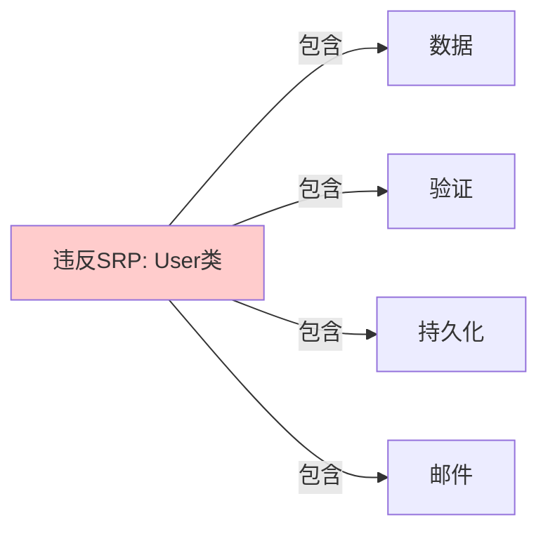
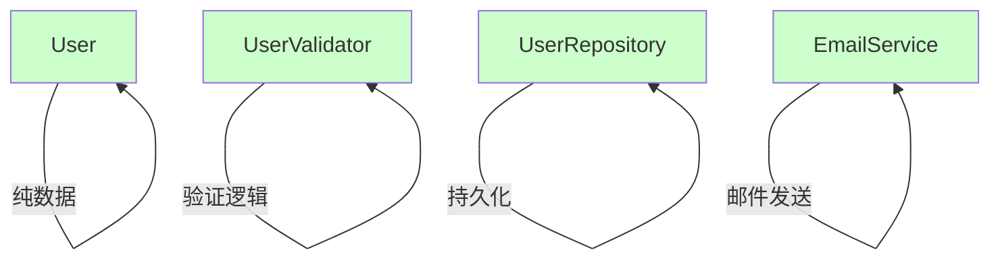

# 单一职责原则（Single Responsibility Principle, SRP）

## 一、这是什么？

想象一家餐厅的运作：

- **厨师**负责做菜
- **服务员**负责点单和上菜
- **收银员**负责结账

如果让一个人同时做这三件事会怎样？忙不过来、容易出错、而且任何一个环节出问题都要找同一个人。

**单一职责原则**就是这个道理：**一个类应该只有一个引起它变化的原因**。

换句话说：
- 一个类只做一件事
- 一个类只有一个职责
- 当需求变化时，一个类只因为一种原因而修改

## 二、为什么需要它？

### 问题场景

假设你写了一个 `User` 类，它负责：
1. 存储用户数据（姓名、邮箱、密码）
2. 验证用户数据（邮箱格式、密码强度）
3. 保存用户到数据库
4. 发送欢迎邮件

```java
class User {
    private String name;
    private String email;
    private String password;
    
    // 数据存储
    public User(String name, String email, String password) { ... }
    
    // 数据验证
    public boolean isValidEmail() { ... }
    public boolean isStrongPassword() { ... }
    
    // 数据持久化
    public void saveToDatabase() { ... }
    
    // 邮件发送
    public void sendWelcomeEmail() { ... }
}
```

### 这段代码的痛点

1. **难以维护**：验证规则变了、数据库换了、邮件服务换了，都要改这个类
2. **难以测试**：测试验证逻辑时，还得 mock 数据库和邮件服务
3. **难以复用**：想在别的地方用邮件发送功能？得把整个 User 类拖过去
4. **职责不清**：这个类到底是干什么的？数据模型？验证器？持久化层？
5. **容易冲突**：多个开发者同时修改这个类，Git 冲突频繁

## 三、核心思想

### 一个类，一个职责

单一职责原则的核心是：**把不同的职责分离到不同的类中**。



**重构后**：



每个类都有明确的单一职责：
- `User`：只负责数据存储（POJO/Entity）
- `UserValidator`：只负责验证逻辑
- `UserRepository`：只负责数据库操作
- `EmailService`：只负责邮件发送

### 变化的原因只有一个

遵循 SRP 后，每个类修改的理由只有一个：

| 类 | 修改原因 |
|---|---|
| `User` | 用户属性变化（增加字段） |
| `UserValidator` | 验证规则变化 |
| `UserRepository` | 数据库技术变化 |
| `EmailService` | 邮件服务变化 |

## 四、代码示例

查看 `demo/` 目录下的完整代码，这里做核心讲解。

### 重构前（违反 SRP）

`UserBad.java` 展示了一个违反 SRP 的类：

```java
class UserBad {
    // 职责1: 数据存储
    private String name;
    private String email;
    
    // 职责2: 数据验证
    public boolean validate() {
        return email.contains("@") && name.length() > 0;
    }
    
    // 职责3: 持久化
    public void save() {
        // 数据库操作
    }
    
    // 职责4: 业务逻辑
    public void sendWelcomeEmail() {
        // 发送邮件
    }
}
```

**问题**：这个类承担了 4 个职责，任何一个职责的变化都会影响整个类。

### 重构后（符合 SRP）

**1. User.java - 纯数据类**
```java
public class User {
    private final String name;
    private final String email;
    private final String password;
    
    // 只负责数据存储，不包含任何业务逻辑
}
```

**2. UserValidator.java - 验证逻辑**
```java
public class UserValidator {
    public ValidationResult validate(User user) {
        // 只负责验证，不关心数据从哪来，要到哪去
    }
}
```

**3. UserRepository.java - 持久化**
```java
public class UserRepository {
    public void save(User user) {
        // 只负责数据库操作
    }
}
```

**4. UserService.java - 协调各个职责**
```java
public class UserService {
    private final UserValidator validator;
    private final UserRepository repository;
    private final EmailService emailService;
    
    public void registerUser(User user) {
        // 协调各个单一职责的类
        validator.validate(user);
        repository.save(user);
        emailService.sendWelcome(user);
    }
}
```

### 关键设计点

1. **User** 是纯数据对象（POJO），不包含行为
2. **Validator** 只做验证，返回验证结果
3. **Repository** 只做持久化，不关心业务规则
4. **Service** 作为协调者，组合各个职责

这样每个类都很小、很专注、很容易测试。

## 五、如何判断职责是否单一？

### 方法1：描述这个类

用一句话描述这个类的职责，如果出现"和"、"或"、"以及"，很可能违反了 SRP。

❌ "这个类负责**用户数据管理和验证以及持久化**"  
✅ "这个类负责**用户数据验证**"

### 方法2：变化原因分析

问自己：这个类会因为哪些原因而修改？

如果有多个不相关的原因，就违反了 SRP：
- 业务规则变化
- 数据库技术变化
- 第三方服务变化
- 数据格式变化

每个类应该只因为一种类型的原因而变化。

### 方法3：看依赖数量

如果一个类依赖了太多其他类（数据库、网络、文件系统、外部服务），可能承担了太多职责。

```java
// 红色警报：这个类依赖太多东西了
class OrderProcessor {
    private Database db;
    private PaymentGateway payment;
    private EmailService email;
    private SmsService sms;
    private InventorySystem inventory;
    private ShippingService shipping;
    // ...
}
```

### 方法4：测试复杂度

如果测试一个类需要 mock 很多依赖，说明这个类职责太多。

## 六、使用场景与实践建议

### 适用场景

1. **业务逻辑类**：按照业务职责拆分（订单处理、支付处理、库存管理）
2. **工具类**：每个工具类只做一类事情（日期工具、字符串工具、加密工具）
3. **数据访问层**：每个 Repository 只负责一个实体的 CRUD
4. **服务层**：每个 Service 只负责一个业务领域

### 实践建议

1. **从小做起**：新类一开始就保持单一职责，比重构容易得多
2. **职责分层**：按层次划分职责（Controller、Service、Repository）
3. **高内聚低耦合**：相关的功能放在一起，不相关的分开
4. **命名清晰**：类名应该清楚地表达职责（Validator、Repository、Service）

### 重构时机

何时应该拆分类？

- ✅ 类超过 200-300 行
- ✅ 方法职责不相关（既有数据验证又有文件操作）
- ✅ 测试困难（需要 mock 很多依赖）
- ✅ 多人频繁修改同一个类导致冲突
- ✅ 某个功能需要在别处复用

## 七、常见误区

### 误区1：过度拆分

❌ **极端例子**：
```java
class UserNameHolder { String name; }
class UserEmailHolder { String email; }
class UserPasswordHolder { String password; }
```

这是矫枉过正。SRP 不是让你把每个字段拆成一个类。

✅ **合理做法**：
```java
class User {
    String name;
    String email;
    String password;
}
```

数据本身是一个职责，这些字段都是"用户数据"的一部分。

### 误区2：按方法数量判断

有人认为"一个类只能有一个方法"才叫单一职责。

❌ 错误理解：
```java
class UserValidator {
    boolean validate(User user); // 只能有一个方法？
}
```

✅ 正确理解：
```java
class UserValidator {
    boolean validate(User user);
    boolean isValidEmail(String email);      // 都是验证职责
    boolean isStrongPassword(String pwd);    // 都是验证职责
    ValidationResult validateFull(User user); // 都是验证职责
}
```

多个方法只要都服务于同一个职责，就没问题。

### 误区3：职责等于功能

职责是从**变化原因**的角度划分，不是从功能列表划分。

❌ 按功能划分：
```java
class UserManager {
    void createUser();
    void deleteUser();
    void validateUser();
    void saveUser();
    void emailUser();
}
```

✅ 按职责（变化原因）划分：
```java
class UserService { void create(); void delete(); }  // 业务逻辑
class UserValidator { boolean validate(); }          // 验证规则
class UserRepository { void save(); void delete(); } // 数据持久化
class UserNotifier { void sendEmail(); }             // 通知功能
```

### 误区4：SRP 导致类爆炸

有人担心："遵循 SRP 会导致类的数量爆炸，代码更难理解。"

**回应**：
- 多个小而专注的类，比一个大而全的类更容易理解
- 现代 IDE 的导航功能很强，类多不是问题
- 测试和维护的成本会大幅降低

**权衡**：在小项目或明确不会变化的代码中，可以适当放宽 SRP。但大部分业务代码应该严格遵循。

## 八、与其他原则的关系

- **开闭原则（OCP）**：SRP 是 OCP 的基础，职责单一的类更容易扩展
- **接口隔离原则（ISP）**：SRP 在类级别，ISP 在接口级别，思想相通
- **依赖倒置原则（DIP）**：SRP 帮助识别抽象边界，便于依赖倒置

## 九、总结

**一句话记住 SRP**：一个类只做一件事，只有一个修改的理由。

**核心价值**：
- ✅ 易于理解和维护
- ✅ 易于测试
- ✅ 易于复用
- ✅ 降低耦合
- ✅ 减少冲突

**实践口诀**：
> 职责单一好处多，  
> 变化原因只一个，  
> 测试维护都轻松，  
> 代码质量节节高。

---

**下一步**：运行 `demo/` 中的代码，对比重构前后的差异，然后完成 `test_01.md` 的自测题。
