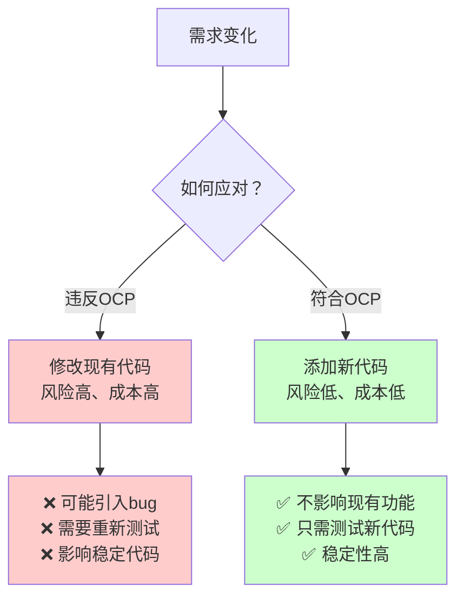
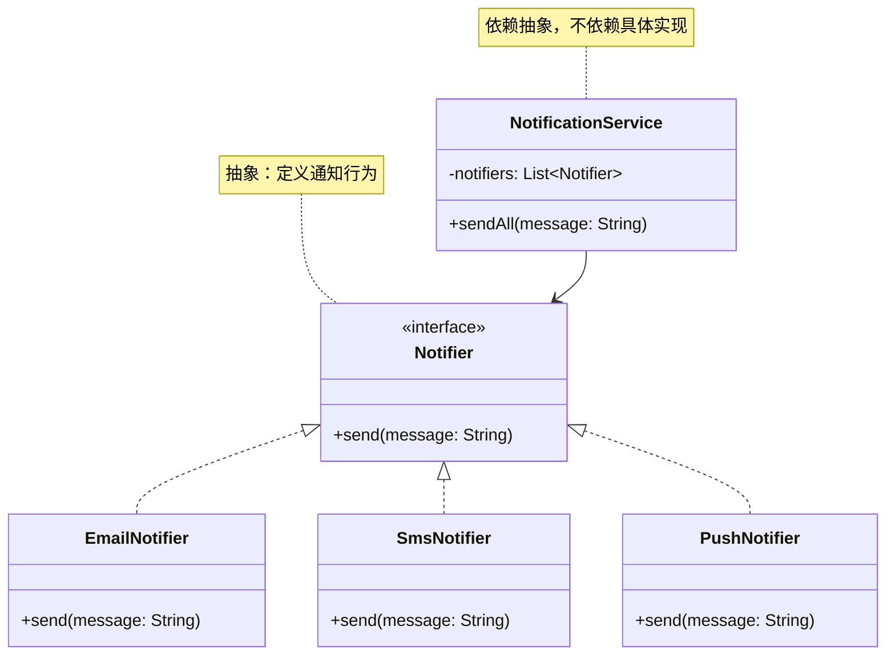

# 开闭原则（Open-Closed Principle, OCP）

## 一、这是什么？

想象一下你的浏览器：

- 你可以**安装新插件**来增加功能（广告拦截、翻译、截图等）
- 但你**不需要修改浏览器的核心代码**
- 浏览器通过"扩展接口"来支持新功能

**开闭原则**就是这个道理：**软件实体（类、模块、函数等）应该对扩展开放，对修改关闭**。

换句话说：
- **对扩展开放**：当需求变化时，可以通过添加新代码来扩展功能
- **对修改关闭**：在扩展功能时，不需要修改已有的、稳定的代码

## 二、为什么需要它？

### 问题场景

假设你写了一个通知系统，最开始只支持邮件通知：

```java
class NotificationService {
    public void send(String message, String type) {
        if (type.equals("email")) {
            System.out.println("发送邮件: " + message);
        }
    }
}
```

后来产品说要支持短信通知，你改成：

```java
class NotificationService {
    public void send(String message, String type) {
        if (type.equals("email")) {
            System.out.println("发送邮件: " + message);
        } else if (type.equals("sms")) {
            System.out.println("发送短信: " + message);
        }
    }
}
```

再后来要支持推送通知、微信通知、钉钉通知...

```java
class NotificationService {
    public void send(String message, String type) {
        if (type.equals("email")) {
            // 邮件逻辑
        } else if (type.equals("sms")) {
            // 短信逻辑
        } else if (type.equals("push")) {
            // 推送逻辑
        } else if (type.equals("wechat")) {
            // 微信逻辑
        } else if (type.equals("dingtalk")) {
            // 钉钉逻辑
        }
        // ... 还会继续增加
    }
}
```

### 这段代码的痛点

1. **每次新增功能都要修改原有代码**：违反了"对修改关闭"
2. **容易引入 bug**：修改已有代码可能影响现有功能
3. **测试成本高**：每次修改都要重新测试所有分支
4. **违反单一职责**：一个类承担了所有通知方式的实现
5. **难以扩展**：if-else 链越来越长，代码越来越臃肿
6. **无法在运行时扩展**：新增通知方式必须重新编译部署

## 三、核心思想

### 对扩展开放，对修改关闭



### 实现关键：抽象

开闭原则的实现依赖于**抽象**：

1. **定义抽象接口**：规定"做什么"，不规定"怎么做"
2. **依赖抽象而非具体**：客户端代码依赖接口，不依赖具体实现
3. **通过继承/实现扩展**：新功能通过创建新类来实现，不修改旧类



## 四、如何实现开闭原则

### 方法1：接口 + 实现类

```java
// 抽象：定义通知行为
interface Notifier {
    void send(String message);
}

// 具体实现1
class EmailNotifier implements Notifier {
    public void send(String message) {
        System.out.println("发送邮件: " + message);
    }
}

// 具体实现2
class SmsNotifier implements Notifier {
    public void send(String message) {
        System.out.println("发送短信: " + message);
    }
}

// 客户端代码：依赖抽象
class NotificationService {
    private List<Notifier> notifiers;
    
    public void sendAll(String message) {
        for (Notifier notifier : notifiers) {
            notifier.send(message);  // 多态调用
        }
    }
}
```

**扩展新功能**：只需添加新类，无需修改现有代码

```java
// 新增推送通知：不修改任何现有代码
class PushNotifier implements Notifier {
    public void send(String message) {
        System.out.println("发送推送: " + message);
    }
}
```

### 方法2：抽象类 + 模板方法

```java
// 抽象类：定义算法骨架
abstract class Notifier {
    // 模板方法：定义流程
    public final void send(String message) {
        if (validate(message)) {
            doSend(message);
            log(message);
        }
    }
    
    // 抽象方法：子类实现具体发送逻辑
    protected abstract void doSend(String message);
    
    // 钩子方法：子类可选覆盖
    protected boolean validate(String message) {
        return message != null && !message.isEmpty();
    }
    
    protected void log(String message) {
        System.out.println("已发送通知");
    }
}

// 具体实现
class EmailNotifier extends Notifier {
    protected void doSend(String message) {
        System.out.println("发送邮件: " + message);
    }
}
```

### 方法3：策略模式 + 依赖注入

```java
// 策略接口
interface NotificationStrategy {
    void send(String message);
}

// 上下文类
class NotificationContext {
    private NotificationStrategy strategy;
    
    // 依赖注入：运行时动态设置策略
    public void setStrategy(NotificationStrategy strategy) {
        this.strategy = strategy;
    }
    
    public void notify(String message) {
        strategy.send(message);
    }
}
```

## 五、代码示例

查看 `demo/` 目录下的完整代码，这里做核心讲解。

### 重构前（违反 OCP）

`BadExample.java` 使用 if-else 实现：

```java
class NotificationService {
    public void send(String message, String type) {
        if (type.equals("email")) {
            // 邮件逻辑
        } else if (type.equals("sms")) {
            // 短信逻辑
        } else if (type.equals("push")) {
            // 推送逻辑
        }
    }
}
```

**问题**：每次新增通知方式，都要修改 `send` 方法，增加新的 else-if 分支。

### 重构后（符合 OCP）

`GoodExample.java` 使用接口 + 多态：

**1. 定义抽象接口**
```java
interface Notifier {
    void send(String message);
    String getType();
}
```

**2. 具体实现类**
```java
class EmailNotifier implements Notifier {
    public void send(String message) { /* 邮件逻辑 */ }
    public String getType() { return "Email"; }
}

class SmsNotifier implements Notifier {
    public void send(String message) { /* 短信逻辑 */ }
    public String getType() { return "SMS"; }
}
```

**3. 服务类依赖抽象**
```java
class NotificationService {
    private List<Notifier> notifiers;
    
    public void sendToAll(String message) {
        for (Notifier notifier : notifiers) {
            notifier.send(message);  // 多态
        }
    }
}
```

**扩展新功能**：只需添加 `PushNotifier` 类，无需修改任何现有代码！

### 关键设计点

1. **Notifier 接口**是抽象，定义了"通知"这个行为
2. **具体 Notifier** 实现不同的通知方式
3. **NotificationService** 依赖抽象接口，不依赖具体实现
4. **扩展时**：添加新类，不修改旧类
5. **符合 OCP**：对扩展开放（可添加新 Notifier），对修改关闭（不改 Service）

## 六、开闭原则的实现策略

### 策略1：使用接口/抽象类

- 定义抽象接口规定行为
- 具体类实现接口
- 客户端依赖接口编程

**适用场景**：多种算法、多种实现方式

### 策略2：依赖注入（DI）

- 通过构造函数、setter 或容器注入依赖
- 运行时动态配置
- Spring 框架的核心思想

**适用场景**：需要运行时切换实现

### 策略3：策略模式

- 封装一系列算法
- 让它们可以相互替换
- 算法的变化不影响使用算法的客户

**适用场景**：多种计算方式、多种处理逻辑

### 策略4：观察者模式

- 定义对象间的一对多依赖
- 当一个对象状态改变时，所有依赖者都会得到通知
- 新增观察者不需要修改主题

**适用场景**：事件驱动、消息订阅

### 策略5：模板方法模式

- 在抽象类中定义算法骨架
- 将某些步骤延迟到子类实现
- 新增子类不需要修改父类

**适用场景**：流程固定、细节可变

## 七、使用场景与实践建议

### 典型使用场景

1. **插件系统**
   - IDE 插件（VSCode、IntelliJ IDEA）
   - 浏览器扩展
   - WordPress 插件

2. **支付系统**
   - 支持多种支付方式（支付宝、微信、银行卡）
   - 新增支付渠道不修改现有代码

3. **消息通知系统**
   - 邮件、短信、推送、微信、钉钉
   - 随时添加新通知渠道

4. **日志系统**
   - 控制台日志、文件日志、数据库日志、远程日志
   - 灵活组合多种日志输出

5. **数据导出**
   - Excel、CSV、JSON、XML、PDF
   - 支持多种导出格式

### 实践建议

**何时应用 OCP？**

- ✅ 需求变化频繁的模块（支付方式、通知渠道）
- ✅ 需要提供扩展点的框架/库
- ✅ 多种算法或策略的场景
- ✅ 需要在运行时动态切换实现

**何时可以放宽 OCP？**

- ⚠️ 需求非常稳定，几乎不会变化
- ⚠️ 项目规模很小，维护成本低
- ⚠️ 一次性代码（脚本、工具）

**设计技巧**

1. **识别变化点**：哪些地方将来可能变化？
2. **提取抽象**：为变化点定义接口
3. **依赖抽象**：让稳定代码依赖接口，不依赖具体实现
4. **延迟决策**：不要过早抽象，等需求明确后再重构

**OCP 的度**

- ❌ **不要过度抽象**：为了 OCP 而 OCP
- ❌ **不要预测未来**：只为已知的变化点抽象
- ✅ **重构优于预设计**：先写简单代码，有新需求时再重构
- ✅ **两次规则**：同样的变化出现第二次时，再抽象

## 八、常见误区

### 误区1：为所有代码都追求 OCP

❌ **错误做法**：
```java
// 过度抽象：为一个简单的字符串拼接创建接口
interface StringConcatenator {
    String concat(String a, String b);
}
```

✅ **合理做法**：
```java
// 简单的逻辑不需要抽象
String result = str1 + str2;
```

**原则**：只为**有可能变化**的地方抽象，不要为了 OCP 而 OCP。

### 误区2：试图预测所有未来变化

❌ **过度设计**：
```java
// 为"可能会有"的需求设计复杂的扩展体系
interface DataSource { }
interface DataProcessor { }
interface DataValidator { }
interface DataFormatter { }
// ... 10个接口，但只用了2个
```

✅ **渐进式设计**：
- 从简单实现开始
- 当需求真正出现时再重构
- YAGNI 原则（You Aren't Gonna Need It）

### 误区3：认为 OCP 意味着永远不修改代码

**澄清**：
- OCP 说的是**尽量不修改已有的、稳定的、经过测试的代码**
- 不是说绝对不能修改
- 如果抽象本身设计有问题，当然可以修改

**何时可以修改？**
- 接口设计有缺陷
- 架构需要重构
- bug 修复
- 性能优化

### 误区4：OCP 和性能优化冲突

有人认为：使用接口和多态会影响性能。

**实际情况**：
- 现代 JVM 的 JIT 编译器会优化虚方法调用
- 性能损失微乎其微（纳秒级别）
- 可维护性的提升远大于性能的微小损失
- 真正的性能瓶颈往往在 I/O、数据库、网络，而非多态调用

**原则**：不要过早优化。先保证设计清晰，真遇到性能问题再优化。

### 误区5：接口越多越好

❌ **接口爆炸**：
```java
interface Sendable { }
interface Loggable { }
interface Validatable { }
interface Formattable { }
// 一个类实现10个接口
```

✅ **合理抽象**：
- 接口应该有明确的职责
- 不要为每个方法都定义接口
- 遵循接口隔离原则（ISP）

## 九、与其他原则的关系

### OCP vs SRP

| 对比维度 | 单一职责原则（SRP） | 开闭原则（OCP） |
|---------|------------------|----------------|
| **关注点** | 职责划分 | 扩展性 |
| **目标** | 一个类只做一件事 | 扩展时不修改现有代码 |
| **实现** | 拆分类 | 抽象 + 多态 |
| **关系** | SRP 是 OCP 的基础 | OCP 依赖于 SRP |

**联系**：
- SRP 让每个类职责单一，更容易抽象
- 职责清晰后，更容易识别变化点
- OCP 通过抽象来应对变化

### OCP vs LSP（里氏替换原则）

- **OCP** 强调通过抽象来扩展
- **LSP** 强调子类要能正确替换父类
- LSP 是实现 OCP 的前提（子类不能破坏父类的契约）

### OCP vs DIP（依赖倒置原则）

- **OCP** 强调对扩展开放、对修改关闭
- **DIP** 强调依赖抽象、不依赖具体
- DIP 是实现 OCP 的手段

**关系链**：DIP（依赖抽象）→ OCP（通过扩展而非修改）→ 高扩展性

## 十、总结

**一句话记住 OCP**：对扩展开放，对修改关闭——通过添加新代码来应对变化，而不是修改已有代码。

**核心价值**：
- ✅ 提高可维护性（减少修改现有代码）
- ✅ 提高可扩展性（方便添加新功能）
- ✅ 降低风险（不影响已测试的代码）
- ✅ 提高稳定性（核心代码更稳定）

**实现关键**：
1. **抽象是核心**：通过接口/抽象类定义契约
2. **依赖抽象**：客户端代码依赖接口而非实现
3. **识别变化点**：为可能变化的地方设计扩展点
4. **多态实现扩展**：通过继承/实现来扩展功能

**实践口诀**：
> 变化来临莫慌张，  
> 抽象接口来帮忙，  
> 新增类来做扩展，  
> 旧代码中不用慌。

---

**下一步**：
1. 运行 `demo/` 中的代码，体会 if-else 和多态的区别
2. 完成 `test_01.md` 的自测题
3. 思考：你的项目中哪些地方违反了 OCP？如何重构？
