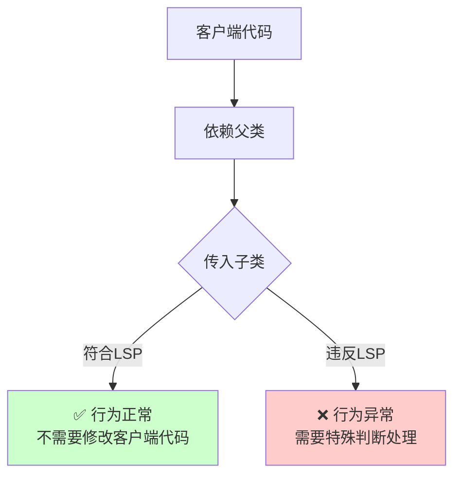
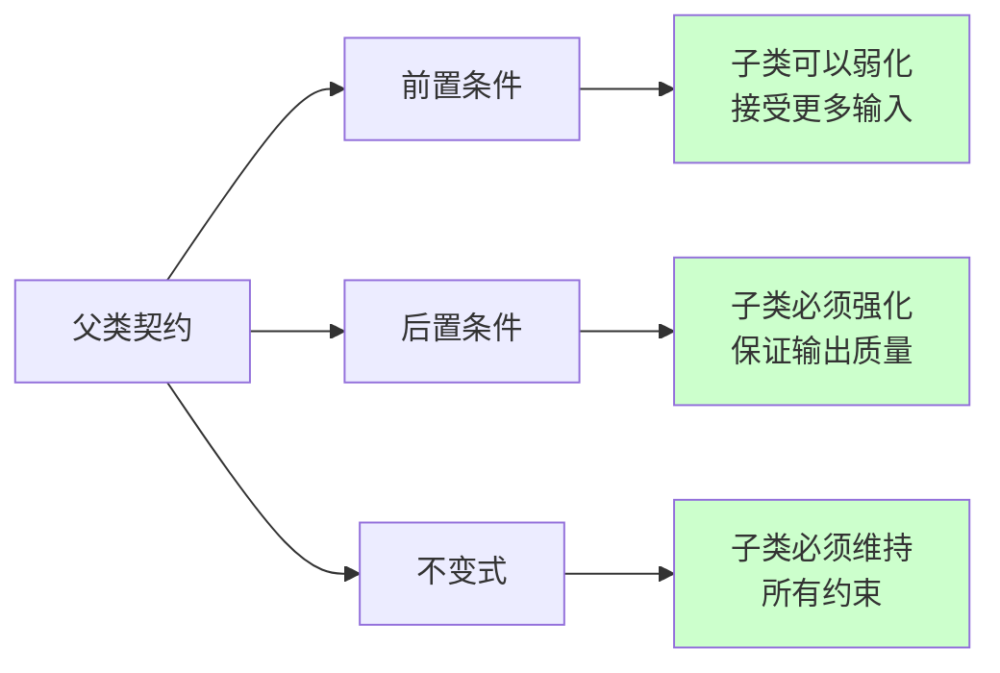
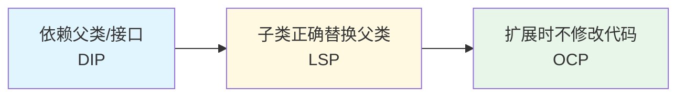

# 里氏替换原则（Liskov Substitution Principle, LSP）

## 一、这是什么？

想象一下电影拍摄中的**替身演员**：

- 主角有危险动作时，用替身代替
- 替身必须能**完美模仿**主角的动作和风格
- 观众看不出是替身，电影剧情不受影响
- 如果替身演得不像，观众会出戏，剧情会崩溃

**里氏替换原则**就是这个道理：**子类对象必须能够替换其父类对象，且程序行为不变**。

换句话说：
- 使用父类的地方，换成子类也应该正常工作
- 子类不能破坏父类的"契约"（承诺的行为）
- 子类可以扩展功能，但不能改变父类的基本行为

**由来**：1987 年，Barbara Liskov 提出了这个原则，因此以她的名字命名。

## 二、为什么需要它？

### 问题场景

假设你有一个矩形类：

```java
class Rectangle {
    protected int width;
    protected int height;
    
    public void setWidth(int width) {
        this.width = width;
    }
    
    public void setHeight(int height) {
        this.height = height;
    }
    
    public int getArea() {
        return width * height;
    }
}
```

从数学角度看，"正方形是特殊的矩形"，所以你创建了一个子类：

```java
class Square extends Rectangle {
    @Override
    public void setWidth(int width) {
        this.width = width;
        this.height = width;  // 强制宽高相等
    }
    
    @Override
    public void setHeight(int height) {
        this.width = height;  // 强制宽高相等
        this.height = height;
    }
}
```

现在有一个使用 Rectangle 的方法：

```java
void resizeRectangle(Rectangle rect) {
    rect.setWidth(5);
    rect.setHeight(4);
    assert rect.getArea() == 20;  // 期望面积是 20
}
```

**问题来了**：

```java
Rectangle rect = new Rectangle();
resizeRectangle(rect);  // ✓ 通过：面积 = 5 × 4 = 20

Rectangle square = new Square();
resizeRectangle(square);  // ✗ 失败：面积 = 4 × 4 = 16
```

### 这段代码的痛点

1. **行为不一致**：Square 不能替换 Rectangle，违反了 LSP
2. **破坏契约**：Rectangle 承诺"宽高可以独立设置"，Square 破坏了这个契约
3. **隐藏的 bug**：代码中使用 Rectangle 的地方，传入 Square 会导致意外行为
4. **多态失效**：虽然 Square 继承了 Rectangle，但无法正确替换
5. **违反预期**：数学上"正方形是矩形"，但 OOP 中这个继承关系是错误的

## 三、核心思想

### 子类必须能够替换父类



**核心含义**：
- 任何使用父类的地方，都可以透明地使用子类
- 客户端代码不需要知道具体是父类还是子类
- 子类不能破坏父类的行为契约

### 契约（Contract）的概念

**契约**是父类对外承诺的行为规范：

1. **前置条件**（Precondition）：方法执行前必须满足的条件
   - 子类可以**弱化**前置条件（接受更多输入）
   - 子类**不能强化**前置条件（拒绝父类接受的输入）

2. **后置条件**（Postcondition）：方法执行后必须保证的结果
   - 子类必须**满足或强化**后置条件（保证至少和父类一样的输出）
   - 子类**不能弱化**后置条件（输出比父类更弱）

3. **不变式**（Invariant）：对象状态必须始终满足的约束
   - 子类必须维持父类的所有不变式



## 四、LSP 的核心要求

### 要求1：子类不能强化前置条件

**父类**：接受任意整数
```java
class Parent {
    void process(int value) {
        // 接受任意整数
    }
}
```

**错误的子类**：只接受正整数
```java
class Child extends Parent {
    @Override
    void process(int value) {
        if (value <= 0) {
            throw new IllegalArgumentException("必须是正整数");  // ❌ 强化了前置条件
        }
        // 处理逻辑
    }
}
```

**问题**：客户端传入 0 或负数，父类能处理，子类却抛异常。

### 要求2：子类不能弱化后置条件

**父类**：保证返回非负数
```java
class Parent {
    int calculate() {
        // 保证返回 >= 0
        return Math.abs(someValue);
    }
}
```

**错误的子类**：可能返回负数
```java
class Child extends Parent {
    @Override
    int calculate() {
        return someValue;  // ❌ 可能返回负数，弱化了后置条件
    }
}
```

**问题**：客户端期望非负数，子类却可能返回负数。

### 要求3：子类必须维持不变式

**父类**：维持 balance >= 0
```java
class Account {
    protected double balance;
    
    public void withdraw(double amount) {
        if (balance >= amount) {
            balance -= amount;
        }
        // 不变式：balance 始终 >= 0
    }
}
```

**错误的子类**：允许透支
```java
class OverdraftAccount extends Account {
    @Override
    public void withdraw(double amount) {
        balance -= amount;  // ❌ 可能导致 balance < 0，破坏不变式
    }
}
```

### 要求4：子类不能抛出父类未声明的异常

**父类**：不抛异常
```java
class Parent {
    void process() {
        // 不抛异常
    }
}
```

**错误的子类**：抛出新异常
```java
class Child extends Parent {
    @Override
    void process() throws IOException {  // ❌ 父类未声明 IOException
        // 处理逻辑
    }
}
```

**问题**：客户端使用父类时不会捕获异常，子类抛异常会导致程序崩溃。

## 五、代码示例

查看 `demo/` 目录下的完整代码，这里做核心讲解。

### 违反 LSP 的经典案例：正方形-矩形问题

`BadExample.java` 展示了错误的继承关系：

```java
class Rectangle {
    protected int width;
    protected int height;
    
    public void setWidth(int width) { this.width = width; }
    public void setHeight(int height) { this.height = height; }
    public int getArea() { return width * height; }
}

class Square extends Rectangle {
    @Override
    public void setWidth(int width) {
        this.width = width;
        this.height = width;  // 强制相等
    }
    
    @Override
    public void setHeight(int height) {
        this.width = height;  // 强制相等
        this.height = height;
    }
}
```

**为什么违反 LSP？**

1. **破坏契约**：Rectangle 承诺"宽高可独立设置"，Square 破坏了这个承诺
2. **行为不一致**：`setWidth()` 同时改变了 height，客户端无法预期
3. **不可替换**：使用 Rectangle 的代码，传入 Square 会出错

**测试**：
```java
void testResize(Rectangle rect) {
    rect.setWidth(5);
    rect.setHeight(4);
    assert rect.getArea() == 20;  // 期望 20
}

testResize(new Rectangle());  // ✓ 通过
testResize(new Square());     // ✗ 失败：得到 16
```

### 符合 LSP 的重构方案

`GoodExample.java` 展示了正确的设计：

**方案1：取消继承关系**
```java
interface Shape {
    int getArea();
}

class Rectangle implements Shape {
    private int width;
    private int height;
    
    public void setWidth(int width) { this.width = width; }
    public void setHeight(int height) { this.height = height; }
    public int getArea() { return width * height; }
}

class Square implements Shape {
    private int side;
    
    public void setSide(int side) { this.side = side; }
    public int getArea() { return side * side; }
}
```

**方案2：使用组合代替继承**
```java
// 1. 定义形状接口（只读操作，没有修改行为）
interface Shape {
   int getArea();
   int getPerimeter();
}

// 2. 矩形类（纯数据类）
class Rectangle implements Shape {
   private int width;
   private int height;

   public Rectangle(int width, int height) {
      this.width = width;
      this.height = height;
   }

   @Override
   public int getArea() { return width * height; }

   @Override
   public int getPerimeter() { return 2 * (width + height); }

   // 提供独立的修改方法（不是接口的一部分）
   public void setWidth(int width) { this.width = width; }
   public void setHeight(int height) { this.height = height; }
}

// 3. 正方形类（独立实现，不依赖矩形）
class Square implements Shape {
   private int side;

   public Square(int side) {
      this.side = side;
   }

   @Override
   public int getArea() { return side * side; }

   @Override
   public int getPerimeter() { return 4 * side; }

   public void setSide(int side) { this.side = side; }
}

// 4. 如果需要"既能当矩形用，又能当正方形用"的灵活对象
//    用组合来实现"形状容器"
class ShapeContainer {
   private Shape shape;  // 组合：持有一个形状

   public ShapeContainer(Shape shape) {
      this.shape = shape;
   }

   public void displayArea() {
      System.out.println("面积: " + shape.getArea());
   }

   // 动态替换形状（灵活！）
   public void setShape(Shape shape) {
      this.shape = shape;
   }
}
```

**方案3：不可变设计**
```java
abstract class Shape {
    abstract int getArea();
}

class Rectangle extends Shape {
    private final int width;
    private final int height;
    
    public Rectangle(int width, int height) {
        this.width = width;
        this.height = height;
    }
    
    public int getArea() { return width * height; }
}

class Square extends Shape {
    private final int side;
    
    public Square(int side) {
        this.side = side;
    }
    
    public int getArea() { return side * side; }
}
```

### 关键设计点

1. **正方形不应继承矩形**：虽然数学上"正方形是矩形"，但 OOP 中这个继承关系破坏了行为一致性
2. **契约优先**：设计继承关系时，先考虑行为契约，而非"is-a"关系
3. **不可变对象更安全**：如果对象不可变，就不会有状态不一致的问题
4. **接口隔离**：通过接口定义共同行为，而非通过继承

## 六、如何判断是否违反 LSP

### 判断方法1：替换测试

```java
void someMethod(Parent parent) {
    // 使用 parent 的方法
}

// 测试：传入子类是否正常工作？
someMethod(new Parent());  // 原始行为
someMethod(new Child());   // 子类行为

// 如果子类导致异常或结果不符合预期，就违反了 LSP
```

### 判断方法2：契约检查

问自己：
- 子类的前置条件是否比父类更严格？（不能更严格）
- 子类的后置条件是否比父类更弱？（不能更弱）
- 子类是否维持了父类的所有不变式？（必须维持）
- 子类是否抛出了父类未声明的异常？（不能抛出）

### 判断方法3：行为一致性检查

客户端代码是否需要：
- 检查具体是哪个子类？（`if (obj instanceof Child)`）
- 针对不同子类有不同处理逻辑？
- 捕获子类特有的异常？

如果需要，说明子类不能透明替换父类，违反了 LSP。

### 判断方法4：is-a vs behaves-like-a

- **is-a**：概念上的"是一个"关系（正方形是矩形）
- **behaves-like-a**：行为上的"表现得像"关系

**LSP 关注的是行为，而非概念**：
- ❌ 正方形概念上是矩形，但行为不一致
- ✅ 子类必须在行为上完全替代父类

## 七、违反 LSP 的典型场景

### 场景1：正方形-矩形问题（已讲）

数学上的"is-a"关系，在 OOP 中可能不成立。

### 场景2：鸟类继承体系

**错误设计**：
```java
class Bird {
    void fly() {
        System.out.println("飞行中...");
    }
}

class Penguin extends Bird {
    @Override
    void fly() {
        throw new UnsupportedOperationException("企鹅不会飞");  // ❌ 违反 LSP
    }
}
```

**问题**：客户端调用 `bird.fly()` 期望所有鸟都能飞，企鹅却抛异常。

**正确设计**：
```java
interface Bird {
    void eat();
}

interface FlyableBird extends Bird {
    void fly();
}

class Sparrow implements FlyableBird {
    public void eat() { /* ... */ }
    public void fly() { /* ... */ }
}

class Penguin implements Bird {
    public void eat() { /* ... */ }
    // 不实现 fly()
}
```

### 场景3：覆盖方法强化前置条件

**错误设计**：
```java
class FileProcessor {
    void process(File file) {
        // 接受任意文件
    }
}

class ImageProcessor extends FileProcessor {
    @Override
    void process(File file) {
        if (!file.getName().endsWith(".jpg")) {
            throw new IllegalArgumentException("只支持 JPG 文件");  // ❌ 强化前置条件
        }
        // 处理图片
    }
}
```

**问题**：父类接受所有文件，子类只接受 JPG，违反了 LSP。

### 场景4：覆盖方法弱化后置条件

**错误设计**：
```java
class DataValidator {
    boolean validate(String data) {
        // 保证：返回 true 则数据一定有效
        return data != null && data.length() > 0;
    }
}

class LenientValidator extends DataValidator {
    @Override
    boolean validate(String data) {
        // ❌ 即使数据无效也可能返回 true
        return true;  // 弱化了后置条件
    }
}
```

### 场景5：返回值类型改变

**错误设计**：
```java
class Calculator {
    Number calculate() {
        return 42;  // 返回 Number
    }
}

class IntegerCalculator extends Calculator {
    @Override
    Integer calculate() {  // 返回 Integer（协变返回类型，Java 允许）
        return 42;
    }
}
```

这个例子实际上**不违反 LSP**，因为：
- Java 支持协变返回类型（covariant return type）
- Integer 是 Number 的子类，满足后置条件

但如果返回不相关的类型就违反了：
```java
class StringCalculator extends Calculator {
    @Override
    String calculate() {  // ❌ 编译错误：String 不是 Number 的子类
        return "42";
    }
}
```

## 八、使用场景与实践建议

### 何时应用 LSP？

1. **设计继承关系时**
   - 先考虑行为契约，再考虑继承
   - 确保子类能真正替换父类

2. **使用多态时**
   - 客户端代码依赖父类接口
   - 各种子类应该可以透明替换

3. **重构代码时**
   - 发现需要 `instanceof` 判断时，检查是否违反了 LSP
   - 发现子类行为与父类不一致时，重新设计继承关系

### 实践建议

**优先使用组合而非继承**
```java
// 不好：继承可能违反 LSP
class Stack extends ArrayList { }

// 更好：组合
class Stack {
    private List<Object> elements = new ArrayList<>();
    
    public void push(Object item) {
        elements.add(item);
    }
    
    public Object pop() {
        return elements.remove(elements.size() - 1);
    }
}
```

**接口隔离**
- 定义多个小接口，而非一个大接口
- 子类只实现它能履行契约的接口

**不可变对象**
- 不可变对象不会有状态不一致问题
- 更容易满足 LSP

**明确契约**
- 在文档/注释中明确前置条件、后置条件、不变式
- 使用断言（assert）验证契约

## 九、常见误区

### 误区1：is-a 关系就应该用继承

❌ **错误理解**：
"正方形是矩形，所以 Square 应该继承 Rectangle"

✅ **正确理解**：
- 概念上的 is-a 不等于行为上的 behaves-like-a
- 继承要看行为契约，而非概念关系
- 正方形的行为不符合矩形的契约（宽高独立设置）

### 误区2：子类可以随意覆盖父类方法

❌ **错误做法**：
```java
class Parent {
    void doSomething() {
        // 原有逻辑
    }
}

class Child extends Parent {
    @Override
    void doSomething() {
        // 完全不同的逻辑，不调用 super.doSomething()
    }
}
```

✅ **正确做法**：
- 覆盖方法应该增强或扩展父类行为，而非完全替换
- 如果需要完全不同的行为，考虑不用继承

### 误区3：LSP 只关心方法签名

**LSP 不仅关心签名，更关心行为**：
- 方法签名相同，但行为不一致，仍然违反 LSP
- 例如：正方形的 `setWidth()` 签名和矩形一样，但行为不同

### 误区4：子类抛出子异常没问题

❌ **错误认识**：
```java
class Parent {
    void process() throws Exception { }
}

class Child extends Parent {
    @Override
    void process() throws IOException {  // IOException 是 Exception 的子类
        // 逻辑
    }
}
```

这个例子**实际上没问题**，因为：
- 客户端代码已经捕获了 Exception
- IOException 是 Exception 的子类，在捕获范围内

**真正的问题**是抛出父类未声明的异常：
```java
class Parent {
    void process() {  // 不抛异常
    }
}

class Child extends Parent {
    @Override
    void process() throws IOException {  // ❌ 父类未声明任何异常
    }
}
```

### 误区5：LSP 意味着不能修改任何行为

❌ **过度理解**：
"子类不能修改父类的任何行为"

✅ **正确理解**：
- 子类可以**扩展**功能（增加新方法）
- 子类可以**优化**实现（更高效的算法）
- 子类可以**强化**后置条件（返回更精确的结果）
- 子类可以**弱化**前置条件（接受更多输入）

**关键**：不能破坏父类的行为契约。

## 十、与其他原则的关系

### LSP vs OCP

**关系**：LSP 是实现 OCP 的基础



**解释**：
- **OCP** 要求通过扩展（子类）来应对变化
- 如果子类不能正确替换父类（违反 LSP），扩展就会失败
- 因此，LSP 保证了 OCP 的有效性

**示例**：
```java
// OCP：通过扩展添加新功能
interface Shape {
    double getArea();
}

class Circle implements Shape {
    public double getArea() { /* ... */ }
}

// LSP：子类必须正确实现契约
class Ellipse implements Shape {
    public double getArea() { 
        // ✓ 正确实现面积计算
        return Math.PI * a * b;
    }
}

// 客户端代码：依赖抽象
void printArea(Shape shape) {
    System.out.println(shape.getArea());  // 任何 Shape 都能正确工作
}
```

### LSP vs SRP

**区别**：
- **SRP**：关注职责划分（一个类只做一件事）
- **LSP**：关注继承关系（子类能否替换父类）

**联系**：
- 职责单一的类更容易定义清晰的契约
- 契约清晰的类更容易被正确继承

### LSP vs ISP（接口隔离原则）

**联系**：
- ISP 要求接口尽量小，职责单一
- 小接口更容易被完整实现，不容易违反 LSP
- 大接口可能导致子类实现部分方法时破坏契约

**示例**：
```java
// 大接口：容易违反 LSP
interface Bird {
    void eat();
    void fly();  // 企鹅无法实现
}

// 小接口：符合 LSP
interface Bird {
    void eat();
}

interface FlyableBird extends Bird {
    void fly();
}
```

## 十一、总结

**一句话记住 LSP**：子类对象必须能够替换父类对象，且程序行为不变。

**核心价值**：
- ✅ 保证多态的正确性
- ✅ 让继承体系更健壮
- ✅ 支持开闭原则的实现
- ✅ 提高代码的可预测性

**实践要点**：
1. **契约优先**：设计继承时先考虑行为契约
2. **行为一致性**：子类行为必须与父类一致
3. **替换测试**：用子类替换父类，验证是否正常工作
4. **组合优于继承**：遇到难以满足 LSP 的场景，考虑用组合

**判断违反 LSP 的信号**：
- 需要用 `instanceof` 判断具体类型
- 子类抛出父类未声明的异常
- 子类覆盖方法后行为完全不同
- 使用父类的代码，传入子类会出错

**实践口诀**：
> 父类契约要牢记，  
> 子类替换无问题，  
> 行为一致是关键，  
> 多态才能真给力。

---

**下一步**：
1. 运行 `demo/` 中的代码，体会正方形-矩形问题
2. 完成 `test_01.md` 的自测题（重点做鸟类继承体系的设计）
3. 思考：你的项目中是否有违反 LSP 的继承关系？
