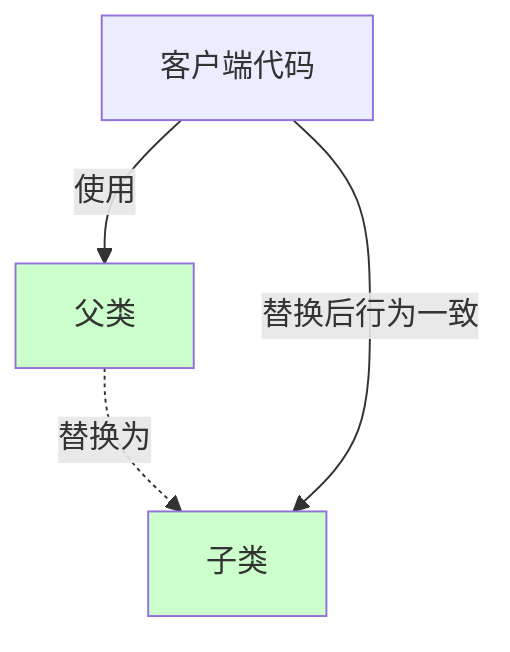
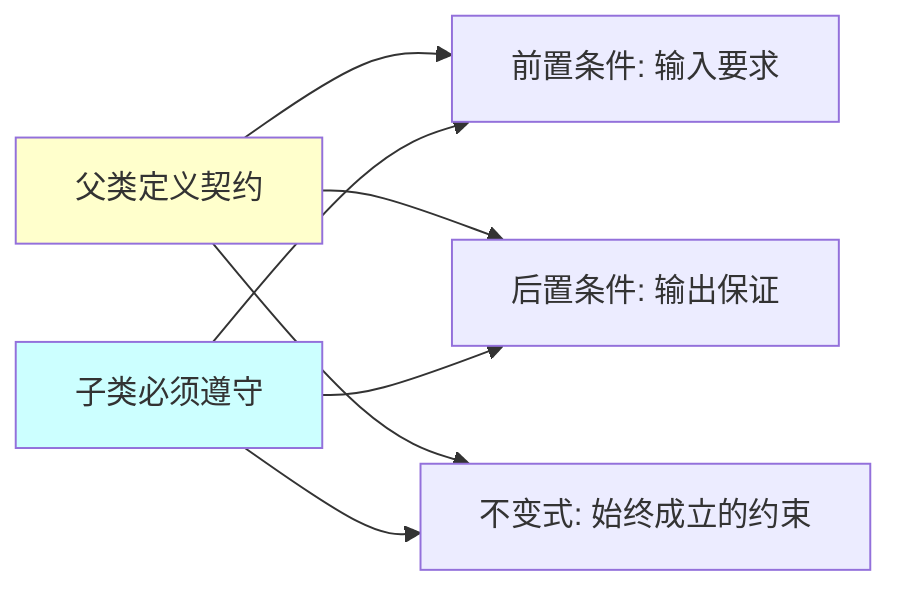

# 里氏替换原则（Liskov Substitution Principle, LSP）

## 一、这是什么？

想象一下你在使用电池：

- 你的**遥控器**需要2节5号电池
- 你可以用**普通碱性电池**
- 也可以用**充电电池**
- 甚至可以用**高性能锂电池**

无论用哪种电池，遥控器都能正常工作。这些不同类型的电池可以**互相替换**，而不会破坏遥控器的功能。

**里氏替换原则**就是这个道理：**子类对象必须能够替换父类对象出现的任何地方，而不影响程序的正确性**。

换句话说：
- 子类应该扩展父类的功能，而不是改变父类的行为
- 使用父类的地方，替换成子类后，程序应该表现一致
- 子类不应该违反父类定义的契约（约定）

## 二、为什么需要它？

### 问题场景

假设你设计了一个 `Rectangle`（矩形）类：

```java
class Rectangle {
    protected int width;
    protected int height;
    
    public void setWidth(int width) {
        this.width = width;
    }
    
    public void setHeight(int height) {
        this.height = height;
    }
    
    public int getArea() {
        return width * height;
    }
}
```

从数学角度看，**正方形是特殊的矩形**（四条边相等），所以你让 `Square` 继承 `Rectangle`：

```java
class Square extends Rectangle {
    @Override
    public void setWidth(int width) {
        this.width = width;
        this.height = width;  // 保持正方形特性：宽高相等
    }
    
    @Override
    public void setHeight(int height) {
        this.width = height;  // 保持正方形特性：宽高相等
        this.height = height;
    }
}
```

### 这段代码的痛点

看起来很合理，但实际使用时会出问题：

```java
void resizeRectangle(Rectangle rect) {
    rect.setWidth(5);
    rect.setHeight(4);
    
    // 期望面积是 5 * 4 = 20
    assert rect.getArea() == 20;  // ❌ 如果传入Square，面积是16，断言失败！
}

Rectangle rect = new Rectangle();
resizeRectangle(rect);  // ✅ 通过，面积是20

Square square = new Square();
resizeRectangle(square);  // ❌ 失败，面积是16（4*4）
```

**问题**：`Square` 不能替换 `Rectangle`，因为它改变了父类的行为约定。

使用者期望：
- 设置宽度不会影响高度
- 设置高度不会影响宽度

但 `Square` 违反了这个约定，导致程序出错。

## 三、核心思想

### 子类是父类的替代品

里氏替换原则的核心是：**子类必须能够完全替换父类，而不改变程序的正确性**。



**遵循 LSP 的要求**：

1. **前置条件不能加强**：子类的输入要求不能比父类更严格
2. **后置条件不能削弱**：子类的输出保证不能比父类更弱
3. **不变式必须保持**：父类的不变性约束在子类中依然成立
4. **不能抛出父类未声明的异常**
5. **历史约束必须保留**：不能改变父类已有的行为

### 契约式设计（Design by Contract）

LSP 的本质是**契约式设计**：



**契约三要素**：

1. **前置条件（Precondition）**：调用方法前必须满足的条件
   - 例如：参数不能为null、必须大于0
   - 子类可以**放宽**前置条件（接受更多输入）
   
2. **后置条件（Postcondition）**：方法执行后必须保证的结果
   - 例如：返回值不为null、列表已排序
   - 子类可以**加强**后置条件（提供更多保证）

3. **不变式（Invariant）**：对象生命周期内始终成立的约束
   - 例如：账户余额不能为负、列表元素唯一
   - 子类必须**保持**不变式

## 四、代码示例

查看 `demo/` 目录下的完整代码，这里做核心讲解。

### 重构前（违反 LSP）

`BadExample.java` 展示了 Rectangle-Square 问题：

**父类**：
```java
class Rectangle {
    protected int width;
    protected int height;
    
    public void setWidth(int width) {
        this.width = width;
    }
    
    public void setHeight(int height) {
        this.height = height;
    }
    
    public int getArea() {
        return width * height;
    }
}
```

**父类的契约**：
- 前置条件：宽高可以独立设置
- 后置条件：getArea() 返回 width * height
- 不变式：setWidth 不影响 height，setHeight 不影响 width

**子类**：
```java
class Square extends Rectangle {
    @Override
    public void setWidth(int width) {
        this.width = width;
        this.height = width;  // ❌ 违反了不变式
    }
    
    @Override
    public void setHeight(int height) {
        this.width = height;  // ❌ 违反了不变式
        this.height = height;
    }
}
```

**问题**：`Square` 改变了父类的行为约定，导致不能替换。

### 重构后（符合 LSP）

`GoodExample.java` 使用正确的继承层次：

**方案1：使用组合代替继承**

```java
// 定义形状接口
interface Shape {
    int getArea();
    String getDescription();
}

// 矩形实现
class Rectangle implements Shape {
    private final int width;
    private final int height;
    
    public Rectangle(int width, int height) {
        this.width = width;
        this.height = height;
    }
    
    @Override
    public int getArea() {
        return width * height;
    }
    
    @Override
    public String getDescription() {
        return "矩形: " + width + "x" + height;
    }
}

// 正方形实现
class Square implements Shape {
    private final int side;
    
    public Square(int side) {
        this.side = side;
    }
    
    @Override
    public int getArea() {
        return side * side;
    }
    
    @Override
    public String getDescription() {
        return "正方形: " + side + "x" + side;
    }
}
```

**方案2：只读的形状层次**

```java
// 不可变的矩形基类
abstract class Shape {
    public abstract int getArea();
}

class Rectangle extends Shape {
    protected final int width;
    protected final int height;
    
    public Rectangle(int width, int height) {
        this.width = width;
        this.height = height;
    }
    
    public int getWidth() { return width; }
    public int getHeight() { return height; }
    
    @Override
    public int getArea() {
        return width * height;
    }
}

class Square extends Rectangle {
    public Square(int side) {
        super(side, side);  // ✅ 不改变行为，只是特化构造方式
    }
}
```

**关键差异**：
- ❌ 违反 LSP：子类改变了父类的可变行为（setWidth/setHeight）
- ✅ 符合 LSP：使用不可变对象，或者平行的继承层次

### 关键设计点

1. **正确识别"is-a"关系**：数学上的"is-a"不等于OOP中的"is-a"
2. **使用不可变对象**：减少状态变化导致的契约违反
3. **优先组合**：当继承会违反LSP时，使用组合
4. **接口隔离**：使用接口定义共同行为，而非强制继承

## 五、如何遵循里氏替换原则？

### 检查清单

在设计继承关系时，检查以下几点：

✅ **前置条件检查**
```java
// ❌ 子类加强了前置条件（更严格）
class Parent {
    void process(String input) {
        // 接受任何字符串
    }
}

class Child extends Parent {
    @Override
    void process(String input) {
        if (input == null || input.isEmpty()) {
            throw new IllegalArgumentException();  // ❌ 比父类更严格
        }
    }
}

// ✅ 子类放宽或保持前置条件
class GoodChild extends Parent {
    @Override
    void process(String input) {
        if (input == null) input = "";  // ✅ 处理null，不抛异常
        // 处理逻辑
    }
}
```

✅ **后置条件检查**
```java
// ❌ 子类削弱了后置条件
class Parent {
    // 保证返回非null列表
    List<String> getData() {
        return new ArrayList<>();
    }
}

class Child extends Parent {
    @Override
    List<String> getData() {
        return null;  // ❌ 违反了"非null"的保证
    }
}

// ✅ 子类加强或保持后置条件
class GoodChild extends Parent {
    @Override
    List<String> getData() {
        return Collections.unmodifiableList(new ArrayList<>());  // ✅ 更强的保证
    }
}
```

✅ **不变式检查**
```java
// ❌ 子类违反了不变式
class BankAccount {
    protected double balance;
    
    // 不变式：余额不能为负
    public void withdraw(double amount) {
        if (balance >= amount) {
            balance -= amount;
        }
    }
}

class OverdraftAccount extends BankAccount {
    @Override
    public void withdraw(double amount) {
        balance -= amount;  // ❌ 允许余额为负，违反不变式
    }
}

// ✅ 子类保持不变式
class SafeOverdraftAccount extends BankAccount {
    private double overdraftLimit;
    
    @Override
    public void withdraw(double amount) {
        if (balance - amount >= -overdraftLimit) {  // ✅ 保持"余额有下限"的不变式
            balance -= amount;
        }
    }
}
```

### 设计技巧

**技巧1：使用抽象测试**

编写测试验证子类可替换性：

```java
abstract class ShapeTest {
    protected abstract Shape createShape();
    
    @Test
    public void testAreaIsNonNegative() {
        Shape shape = createShape();
        assertTrue(shape.getArea() >= 0);  // 所有子类都应该通过
    }
}

class RectangleTest extends ShapeTest {
    @Override
    protected Shape createShape() {
        return new Rectangle(5, 4);
    }
}

class SquareTest extends ShapeTest {
    @Override
    protected Shape createShape() {
        return new Square(5);
    }
}
```

**技巧2：提取共同接口**

当继承关系不合适时，提取接口：

```java
// 不用继承，用接口
interface Flyable {
    void fly();
}

class Bird implements Flyable {
    public void fly() { /* 飞行逻辑 */ }
}

class Airplane implements Flyable {
    public void fly() { /* 飞行逻辑 */ }
}

class Penguin {
    // 企鹅不实现Flyable，因为它不会飞
    public void swim() { /* 游泳逻辑 */ }
}
```

**技巧3：使用组合代替继承**

```java
// 用组合而非继承
class Rectangle {
    private Dimension dimension;
    
    public Rectangle(int width, int height) {
        this.dimension = new Dimension(width, height);
    }
}

class Square {
    private Dimension dimension;
    
    public Square(int side) {
        this.dimension = new Dimension(side, side);
    }
}
```

## 六、使用场景与实践建议

### 典型使用场景

1. **多态集合**
   ```java
   List<Shape> shapes = Arrays.asList(
       new Rectangle(5, 4),
       new Circle(3),
       new Triangle(3, 4, 5)
   );
   
   // 所有子类都能正确替换
   for (Shape shape : shapes) {
       System.out.println(shape.getArea());
   }
   ```

2. **策略模式**
   ```java
   interface PaymentStrategy {
       void pay(double amount);
   }
   
   class CreditCardPayment implements PaymentStrategy { }
   class PayPalPayment implements PaymentStrategy { }
   class AlipayPayment implements PaymentStrategy { }
   
   // 所有策略可以互换
   void checkout(PaymentStrategy strategy, double amount) {
       strategy.pay(amount);
   }
   ```

3. **模板方法模式**
   ```java
   abstract class DataProcessor {
       public final void process() {
           load();
           validate();
           transform();
           save();
       }
       
       protected abstract void load();
       protected abstract void validate();
       protected abstract void transform();
       protected abstract void save();
   }
   
   // 子类遵循模板，保证可替换性
   class CsvDataProcessor extends DataProcessor { }
   class JsonDataProcessor extends DataProcessor { }
   ```

### 实践建议

**何时使用继承？**

- ✅ 真正的"is-a"关系（行为上的，不只是概念上的）
- ✅ 子类扩展父类功能，不改变原有行为
- ✅ 子类能通过所有父类的测试用例
- ✅ 遵循LSP的所有约束

**何时避免继承？**

- ⚠️ 只是为了代码复用（用组合）
- ⚠️ 子类需要禁用父类的某些功能
- ⚠️ 子类需要改变父类的核心行为
- ⚠️ "is-a"关系只在概念上成立，行为上不一致

**设计原则**：

1. **契约先行**：先定义清楚父类的契约，再设计子类
2. **不变式优先**：尽量使用不可变对象，减少状态变化
3. **测试验证**：用测试验证子类的可替换性
4. **组合优于继承**：当不确定时，选择组合

## 七、常见误区

### 误区1：概念上的"is-a"等于代码上的"is-a"

❌ **错误理解**：
```java
// 数学上：正方形是矩形
class Square extends Rectangle { }

// 生物学上：企鹅是鸟
class Penguin extends Bird {
    public void fly() {
        throw new UnsupportedOperationException("企鹅不会飞");
    }
}
```

✅ **正确理解**：
- OOP的"is-a"是**行为上的替代关系**，不是分类学关系
- 如果子类不能完全替换父类，就不应该继承

```java
// 正确设计
interface Flyable { void fly(); }
interface Swimmable { void swim(); }

class Sparrow implements Flyable { }
class Penguin implements Swimmable { }  // 企鹅不继承Flyable
```

### 误区2：子类可以通过抛异常来"禁用"父类方法

❌ **错误做法**：
```java
class ReadOnlyList extends ArrayList {
    @Override
    public boolean add(Object o) {
        throw new UnsupportedOperationException();  // ❌ 违反LSP
    }
}
```

**问题**：使用者期望所有 `ArrayList` 都可以添加元素，但 `ReadOnlyList` 打破了这个契约。

✅ **正确做法**：
```java
// 使用只读接口
interface ReadOnlyList<E> {
    E get(int index);
    int size();
}

// 或使用工具类
List<String> readOnly = Collections.unmodifiableList(list);
```

### 误区3：子类必须实现父类的所有方法

**澄清**：这是接口的要求，不是LSP的要求。

LSP 关注的是：
- ✅ 实现的方法是否遵守契约
- ❌ 不是方法的数量

```java
abstract class Animal {
    abstract void eat();
    abstract void sleep();
}

class Dog extends Animal {
    void eat() { /* 必须实现 */ }
    void sleep() { /* 必须实现 */ }
    void bark() { /* 子类可以有额外方法 */ }
}
```

### 误区4：LSP 限制了子类的扩展

❌ **错误理解**：LSP 要求子类和父类行为完全一致，不能扩展

✅ **正确理解**：
- LSP 允许子类**扩展**功能
- LSP 禁止子类**改变**已有的行为

```java
class Parent {
    public int calculate(int x) {
        return x * 2;
    }
}

class Child extends Parent {
    @Override
    public int calculate(int x) {
        return x * 2;  // ✅ 保持父类行为
    }
    
    public int calculateSquare(int x) {  // ✅ 扩展新功能
        return x * x;
    }
}
```

## 八、与其他原则的关系

### LSP vs 开闭原则（OCP）

| 对比维度 | 里氏替换原则（LSP） | 开闭原则（OCP） |
|---------|------------------|----------------|
| **关注点** | 继承的正确性 | 扩展性 |
| **目标** | 子类可以替换父类 | 通过扩展而非修改来应对变化 |
| **实现** | 契约式设计 | 抽象 + 多态 |
| **关系** | LSP 是 OCP 的基础 | OCP 依赖于 LSP |

**联系**：
- OCP 通过多态实现扩展，而多态依赖于可替换的子类
- 如果子类不能替换父类（违反LSP），多态就会失效
- LSP 保证了 OCP 中"对扩展开放"的可靠性

### LSP vs 依赖倒置原则（DIP）

- **LSP** 保证继承层次的正确性
- **DIP** 强调依赖抽象而非具体
- DIP 依赖LSP：依赖抽象时，具体实现必须可替换

### LSP vs 接口隔离原则（ISP）

- **LSP** 关注继承关系中的替代性
- **ISP** 关注接口的设计（不要强迫实现不需要的方法）
- 当子类不能实现父类的所有方法时，既违反LSP也违反ISP

## 九、总结

**一句话记住 LSP**：子类必须能够替换父类，而不改变程序的正确性。

**核心价值**：
- ✅ 保证多态的可靠性
- ✅ 提高代码的可预测性
- ✅ 降低继承带来的风险
- ✅ 支持开闭原则的实现

**实现关键**：
1. **契约式设计**：明确定义父类的前置条件、后置条件、不变式
2. **前置条件不强化**：子类的输入要求不能更严格
3. **后置条件不弱化**：子类的输出保证不能更弱
4. **不变式必须保持**：父类的约束在子类中依然成立

**实践口诀**：
> 父类的契约要牢记，  
> 子类替换无障碍，  
> 行为一致才继承，  
> 概念相似不算数。

---

**下一步**：
1. 运行 `demo/` 中的代码，体会违反LSP和遵循LSP的区别
2. 完成 `test_01.md` 的自测题
3. 思考：你的项目中哪些继承关系违反了LSP？如何重构？
