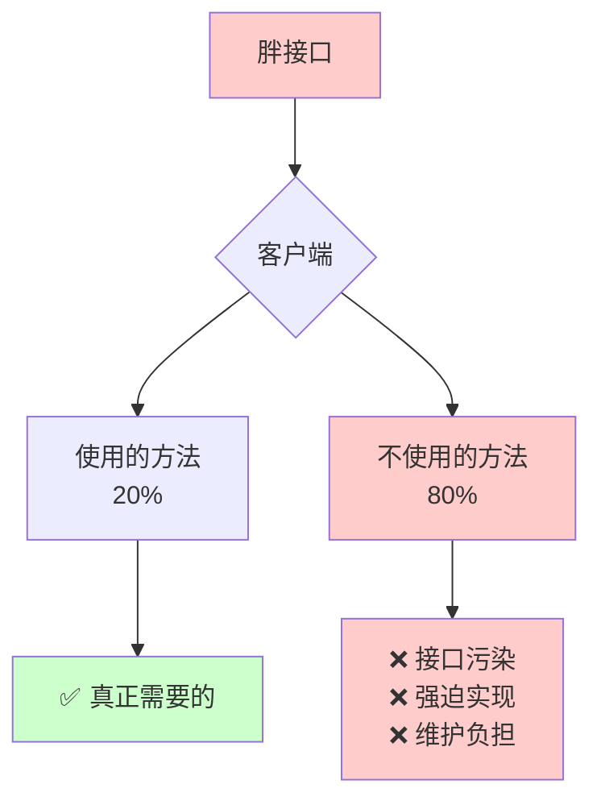
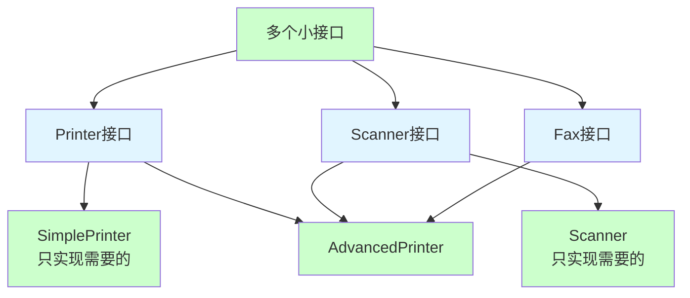

# 接口隔离原则（Interface Segregation Principle, ISP）

## 一、这是什么？

想象一下你家的**遥控器**：

- **电视遥控器**：只有控制电视需要的按钮（开关、音量、频道）
- **空调遥控器**：只有控制空调需要的按钮（温度、模式、风速）
- 如果有一个**万能遥控器**，上面有 100 个按钮，但你只用其中 10 个
- 其他 90 个按钮对你来说是**干扰**，增加了使用复杂度

**接口隔离原则**就是这个道理：**客户端不应该被迫依赖它不使用的接口**。

换句话说：
- 接口应该小而专注，只包含客户端需要的方法
- 不要创建"胖接口"（Fat Interface），强迫客户端实现不需要的方法
- 多个专用接口优于一个通用接口

## 二、为什么需要它？

### 问题场景

假设你在开发一个打印机管理系统，创建了一个"万能打印机接口"：

```java
interface MultiFunctionDevice {
    void print(Document doc);      // 打印
    void scan(Document doc);       // 扫描
    void fax(Document doc);        // 传真
    void staple(Document doc);     // 装订
    void email(Document doc);      // 发送邮件
}
```

现在有三种设备：

**1. 高端多功能一体机**
```java
class AdvancedPrinter implements MultiFunctionDevice {
    public void print(Document doc) { /* 实现打印 */ }
    public void scan(Document doc) { /* 实现扫描 */ }
    public void fax(Document doc) { /* 实现传真 */ }
    public void staple(Document doc) { /* 实现装订 */ }
    public void email(Document doc) { /* 实现邮件 */ }
}
```

**2. 简单打印机（只能打印）**
```java
class SimplePrinter implements MultiFunctionDevice {
    public void print(Document doc) { /* 实现打印 */ }
    
    // ❌ 被迫实现不需要的方法
    public void scan(Document doc) {
        throw new UnsupportedOperationException("不支持扫描");
    }
    
    public void fax(Document doc) {
        throw new UnsupportedOperationException("不支持传真");
    }
    
    public void staple(Document doc) {
        throw new UnsupportedOperationException("不支持装订");
    }
    
    public void email(Document doc) {
        throw new UnsupportedOperationException("不支持邮件");
    }
}
```

**3. 扫描仪（只能扫描）**
```java
class Scanner implements MultiFunctionDevice {
    public void scan(Document doc) { /* 实现扫描 */ }
    
    // ❌ 被迫实现不需要的方法
    public void print(Document doc) {
        throw new UnsupportedOperationException("不支持打印");
    }
    
    public void fax(Document doc) {
        throw new UnsupportedOperationException("不支持传真");
    }
    
    public void staple(Document doc) {
        throw new UnsupportedOperationException("不支持装订");
    }
    
    public void email(Document doc) {
        throw new UnsupportedOperationException("不支持邮件");
    }
}
```

### 这段代码的痛点

1. **接口污染**：SimplePrinter 和 Scanner 被迫实现不需要的方法
2. **抛出异常**：客户端无法通过接口知道哪些方法可用，运行时才发现
3. **违反 LSP**：同样实现了接口，但行为不一致（有些方法抛异常）
4. **维护困难**：接口增加新方法，所有实现类都要修改
5. **理解成本高**：客户端看到接口有 5 个方法，实际只能用 1-2 个
6. **测试复杂**：需要测试大量"抛异常"的方法

## 三、核心思想

### 客户端不应该依赖它不使用的接口



**改进后**：



### 接口隔离的好处

1. **降低耦合**：客户端只依赖需要的方法
2. **提高灵活性**：可以自由组合接口
3. **符合 LSP**：不会有"抛异常"的方法
4. **易于维护**：修改一个接口不影响其他接口的客户端
5. **易于理解**：接口小而专注，职责清晰

## 四、ISP 的核心要求

### 要求1：接口应该小而专注

**❌ 胖接口**（违反 ISP）：
```java
interface Worker {
    void work();
    void eat();
    void sleep();
    void code();
    void test();
    void deploy();
    void meeting();
}
```

**✅ 小接口**（符合 ISP）：
```java
interface Workable {
    void work();
}

interface Eatable {
    void eat();
}

interface Sleepable {
    void sleep();
}

// 根据需要组合接口
class Developer implements Workable, Eatable, Sleepable {
    public void work() { /* 工作 */ }
    public void eat() { /* 吃饭 */ }
    public void sleep() { /* 睡觉 */ }
}
```

### 要求2：按客户端需求设计接口

**按提供者角度设计**（容易违反 ISP）：
```java
// 我能提供所有功能，都放在一个接口里
interface Database {
    void connect();
    void disconnect();
    void query();
    void insert();
    void update();
    void delete();
    void backup();
    void restore();
    void optimize();
    void monitor();
}
```

**按客户端角度设计**（符合 ISP）：
```java
// 读操作客户端只需要查询
interface Readable {
    void query();
}

// 写操作客户端需要增删改
interface Writable {
    void insert();
    void update();
    void delete();
}

// 管理员客户端需要运维功能
interface Manageable {
    void backup();
    void restore();
    void optimize();
    void monitor();
}
```

### 要求3：避免接口污染

**接口污染**的表现：
- 接口包含客户端不需要的方法
- 实现类被迫实现不需要的方法
- 方法实现为空或抛出 `UnsupportedOperationException`

**示例**：
```java
// ❌ 接口污染
class Bird {
    void fly() { }
    void swim() { }
}

class Penguin extends Bird {
    void fly() {
        throw new UnsupportedOperationException();  // 企鹅不会飞
    }
    
    void swim() { /* 正常实现 */ }
}

// ✅ 接口隔离
interface Flyable {
    void fly();
}

interface Swimmable {
    void swim();
}

class Sparrow implements Flyable {
    public void fly() { /* 实现 */ }
}

class Penguin implements Swimmable {
    public void swim() { /* 实现 */ }
}
```

## 五、代码示例

查看 `demo/` 目录下的完整代码，这里做核心讲解。

### 违反 ISP 的示例

`BadExample.java` 展示了胖接口的问题：

```java
// 胖接口：包含所有功能
interface MultiFunctionDevice {
    void print(Document doc);
    void scan(Document doc);
    void fax(Document doc);
}

// 简单打印机：被迫实现不需要的方法
class SimplePrinter implements MultiFunctionDevice {
    public void print(Document doc) { /* 实现 */ }
    
    public void scan(Document doc) {
        throw new UnsupportedOperationException();  // ❌
    }
    
    public void fax(Document doc) {
        throw new UnsupportedOperationException();  // ❌
    }
}
```

**问题**：
- SimplePrinter 依赖了不需要的 scan 和 fax 方法
- 客户端无法从接口判断哪些方法可用
- 运行时才发现方法不支持

### 符合 ISP 的重构

`GoodExample.java` 展示了接口隔离：

**1. 拆分接口**
```java
interface Printer {
    void print(Document doc);
}

interface Scanner {
    void scan(Document doc);
}

interface Fax {
    void fax(Document doc);
}
```

**2. 按需实现**
```java
// 简单打印机：只实现需要的接口
class SimplePrinter implements Printer {
    public void print(Document doc) { /* 实现 */ }
}

// 多功能一体机：组合多个接口
class AdvancedPrinter implements Printer, Scanner, Fax {
    public void print(Document doc) { /* 实现 */ }
    public void scan(Document doc) { /* 实现 */ }
    public void fax(Document doc) { /* 实现 */ }
}
```

**3. 客户端使用**
```java
// 只需要打印功能
class PrinterClient {
    private Printer printer;  // 依赖小接口
    
    void printDocument(Document doc) {
        printer.print(doc);
    }
}

// 需要扫描功能
class ScannerClient {
    private Scanner scanner;  // 依赖小接口
    
    void scanDocument(Document doc) {
        scanner.scan(doc);
    }
}
```

### 关键设计点

1. **接口拆分**：按功能拆分成小接口
2. **按需实现**：设备只实现支持的功能
3. **客户端隔离**：客户端只依赖需要的接口
4. **灵活组合**：多功能设备实现多个接口
5. **类型安全**：编译期就能发现不支持的操作

## 六、如何判断是否违反 ISP

### 判断方法1：空实现或抛异常

如果实现类中有以下代码，说明违反了 ISP：

```java
public void someMethod() {
    // 什么都不做（空实现）
}

public void anotherMethod() {
    throw new UnsupportedOperationException();  // 抛异常
}
```

### 判断方法2：接口使用率

统计客户端使用接口的比例：
- 如果只使用 20%-30% 的方法，接口可能太胖
- 如果使用 80% 以上的方法，接口粒度合适

### 判断方法3：接口变化影响

接口增加新方法时：
- 如果大部分实现类都要修改，可能违反了 ISP
- 如果只有少数实现类需要，说明接口设计合理

### 判断方法4：客户端需求

问自己：
- 客户端真的需要所有这些方法吗？
- 能否按客户端需求拆分接口？
- 不同客户端是否需要不同的接口？

## 七、违反 ISP 的典型场景

### 场景1：胖接口问题（已讲）

一个接口包含太多方法，客户端只用其中一部分。

### 场景2：角色接口混合

**错误设计**：
```java
// 混合了读者和作者的接口
interface DocumentService {
    // 读者需要
    Document read(String id);
    List<Document> search(String keyword);
    
    // 作者需要
    void create(Document doc);
    void update(Document doc);
    void delete(String id);
    
    // 管理员需要
    void archive(String id);
    void restore(String id);
}
```

**问题**：只读客户端也看到了写操作，容易误用。

**正确设计**：
```java
// 按角色拆分接口
interface DocumentReader {
    Document read(String id);
    List<Document> search(String keyword);
}

interface DocumentWriter {
    void create(Document doc);
    void update(Document doc);
    void delete(String id);
}

interface DocumentAdmin {
    void archive(String id);
    void restore(String id);
}
```

### 场景3：通用接口强加特定需求

**错误设计**：
```java
// 所有实体都要实现的接口
interface Entity {
    Long getId();
    void setId(Long id);
    Date getCreatedAt();
    Date getUpdatedAt();
    String getCreatedBy();
    String getUpdatedBy();
    int getVersion();  // 乐观锁版本号
}
```

**问题**：
- 不是所有实体都需要审计字段（createdBy, updatedBy）
- 不是所有实体都需要乐观锁（version）

**正确设计**：
```java
// 基础接口
interface Identifiable {
    Long getId();
    void setId(Long id);
}

// 审计接口（可选）
interface Auditable {
    Date getCreatedAt();
    Date getUpdatedAt();
    String getCreatedBy();
    String getUpdatedBy();
}

// 版本控制接口（可选）
interface Versionable {
    int getVersion();
}

// 按需组合
class User implements Identifiable, Auditable {
    // ...
}

class SimpleEntity implements Identifiable {
    // 不需要审计信息
}
```

### 场景4：框架接口膨胀

**错误设计**：
```java
// Spring 早期的一些接口
interface ApplicationContextAware {
    void setApplicationContext(ApplicationContext context);
}

interface BeanNameAware {
    void setBeanName(String name);
}

interface InitializingBean {
    void afterPropertiesSet();
}

interface DisposableBean {
    void destroy();
}

// 如果一个类需要所有这些，就要实现 4 个接口
// 但大部分类只需要其中 1-2 个
```

**改进**：Spring 后来引入了注解（@PostConstruct, @PreDestroy），减少了接口依赖。

## 八、接口粒度的把握

### 粒度过细的问题

**过度拆分**：
```java
interface Nameable {
    String getName();
}

interface Ageable {
    int getAge();
}

interface Emailable {
    String getEmail();
}

// ❌ 每个属性都是一个接口，太细了
class User implements Nameable, Ageable, Emailable {
    // ...
}
```

**问题**：
- 接口爆炸，难以管理
- 组合接口时代码冗长
- 过度设计

### 粒度过粗的问题

**接口太大**：
```java
interface UserService {
    // 用户管理（20个方法）
    void createUser();
    void updateUser();
    // ...
    
    // 权限管理（15个方法）
    void assignRole();
    void revokeRole();
    // ...
    
    // 日志管理（10个方法）
    void logAction();
    void queryLogs();
    // ...
}
```

**问题**：
- 接口太大，职责不清
- 客户端依赖过多方法
- 难以维护和测试

### 合理的粒度

**按功能内聚拆分**：
```java
// 用户基本操作
interface UserManagement {
    void createUser(User user);
    void updateUser(User user);
    void deleteUser(String id);
    User getUser(String id);
}

// 权限管理
interface RoleManagement {
    void assignRole(String userId, String role);
    void revokeRole(String userId, String role);
    Set<String> getUserRoles(String userId);
}

// 审计日志
interface AuditLog {
    void log(String action, String userId);
    List<LogEntry> queryLogs(String userId);
}
```

**原则**：
- 接口内的方法应该高度相关（高内聚）
- 接口大小适中（3-7 个方法）
- 按业务功能或职责拆分

## 九、使用场景与实践建议

### 典型使用场景

1. **多角色系统**
   - 管理员、普通用户、访客
   - 每个角色需要不同的接口

2. **插件系统**
   - 不同插件实现不同的能力接口
   - 核心系统只依赖需要的接口

3. **设备驱动**
   - 不同设备支持不同功能
   - 按功能定义接口

4. **权限控制**
   - 只读接口 vs 读写接口
   - 按权限级别拆分接口

5. **分层架构**
   - Service 层、Repository 层
   - 每层提供专门的接口

### 实践建议

**1. 从客户端角度设计接口**

不要问"我能提供什么"，而要问"客户端需要什么"。

```java
// ❌ 提供者视角
interface Database {
    // 我能做的所有事
}

// ✅ 客户端视角
interface QueryService {
    // 查询客户端需要的
}

interface WriteService {
    // 写入客户端需要的
}
```

**2. 优先使用组合而非继承**

```java
// ✅ 通过实现多个接口来组合功能
class AdvancedPrinter implements Printer, Scanner, Fax {
    // ...
}
```

**3. 接口演进策略**

当需要扩展接口时：
- 不要直接修改现有接口（违反 OCP）
- 创建新的接口继承旧接口
- 或者创建独立的新接口

```java
// 旧接口
interface Printer {
    void print(Document doc);
}

// 需要扩展：添加彩色打印
// 方案1：继承扩展
interface ColorPrinter extends Printer {
    void printColor(Document doc);
}

// 方案2：独立接口
interface ColorPrintable {
    void printColor(Document doc);
}
```

**4. 使用适配器模式**

当必须实现胖接口时，使用适配器提供默认实现：

```java
// 胖接口
interface LegacyInterface {
    void method1();
    void method2();
    void method3();
    // ... 20个方法
}

// 适配器：提供空实现
abstract class LegacyAdapter implements LegacyInterface {
    public void method1() {}
    public void method2() {}
    public void method3() {}
    // ... 默认空实现
}

// 客户端：只覆盖需要的方法
class MyImpl extends LegacyAdapter {
    @Override
    public void method1() {
        // 只实现需要的
    }
}
```

## 十、常见误区

### 误区1：接口越小越好

❌ **过度拆分**：
```java
interface Printable {
    void print();
}

interface Scannable {
    void scan();
}

interface Colorable {
    void setColor();
}

interface Resolutionable {
    void setResolution();
}

// 接口太多，难以管理
```

✅ **合理粒度**：
```java
interface Printer {
    void print(Document doc);
    void setColor(Color color);
    void setResolution(int dpi);
}
```

### 误区2：ISP 和 SRP 是一回事

**区别**：
- **SRP**：一个类只做一件事（类级别）
- **ISP**：客户端不依赖不需要的接口（接口级别）

**联系**：
- SRP 关注类的职责
- ISP 关注接口的职责
- 两者都强调"单一"，但层次不同

### 误区3：所有接口都要拆分

并非所有接口都需要拆分，关键看：
- 客户端是否都使用所有方法
- 接口是否有明确的单一职责
- 维护成本是否合理

### 误区4：接口隔离导致接口爆炸

**应对策略**：
- 按功能内聚分组
- 使用包（package）组织接口
- 合理命名，体现层次关系
- 文档说明接口间的关系

### 误区5：为了 ISP 而过度设计

**原则**：
- 从实际需求出发，不要预设计
- 重构优于预设计
- 两次原则：同样的需求出现第二次时再抽象

## 十一、与其他原则的关系

### ISP vs SRP

| 维度 | 单一职责原则（SRP） | 接口隔离原则（ISP） |
|-----|------------------|------------------|
| **层次** | 类级别 | 接口级别 |
| **关注点** | 类的职责 | 客户端的依赖 |
| **目标** | 高内聚，低耦合 | 减少不必要的依赖 |
| **判断** | 看变化原因 | 看客户端使用情况 |

**联系**：
- SRP 帮助识别职责边界
- ISP 帮助按职责设计接口
- 两者相辅相成

### ISP vs LSP

**联系**：
- ISP 有助于避免违反 LSP
- 接口隔离后，实现类不会被迫实现不需要的方法
- 不会出现"抛异常"的方法

**示例**：
```java
// 违反 ISP → 容易违反 LSP
interface Bird {
    void fly();
    void swim();
}

class Penguin implements Bird {
    void fly() {
        throw new UnsupportedOperationException();  // 违反 LSP
    }
    void swim() { /* 正常实现 */ }
}

// 符合 ISP → 自然符合 LSP
interface Flyable {
    void fly();
}

interface Swimmable {
    void swim();
}

class Penguin implements Swimmable {
    public void swim() { /* 正常实现 */ }
}
```

### ISP vs OCP

**联系**：
- ISP 支持 OCP：接口隔离后，扩展更容易
- 添加新功能只需实现新接口
- 不影响现有客户端

### ISP vs DIP

**联系**：
- DIP 强调依赖抽象
- ISP 强调抽象应该小而专注
- 两者结合：依赖小而专注的抽象

## 十二、总结

**一句话记住 ISP**：客户端不应该被迫依赖它不使用的接口。

**核心价值**：
- ✅ 降低耦合：客户端只依赖需要的方法
- ✅ 提高灵活性：可以自由组合接口
- ✅ 易于维护：接口变化影响范围小
- ✅ 符合 LSP：不会有"抛异常"的方法
- ✅ 易于理解：接口小而专注

**实现关键**：
1. **按客户端需求设计接口**：不是"我能提供什么"，而是"客户端需要什么"
2. **接口应该小而专注**：3-7 个相关方法
3. **避免胖接口**：不要把所有方法都放在一个接口里
4. **灵活组合**：通过实现多个接口来组合功能

**判断信号**：
- 实现类有空实现或抛异常的方法
- 客户端只使用接口的一小部分方法
- 接口变化影响大量不相关的客户端

**实践口诀**：
> 接口不要贪大全，  
> 客户需要啥就给啥，  
> 胖接口拆成小块，  
> 组合使用更灵活。

---

**下一步**：
1. 运行 `demo/` 中的代码，体会胖接口的问题
2. 完成 `test_01.md` 的自测题
3. 思考：你的项目中是否有"胖接口"需要拆分？
