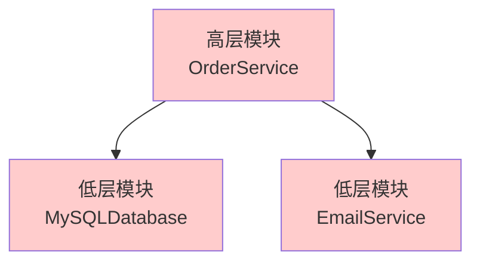
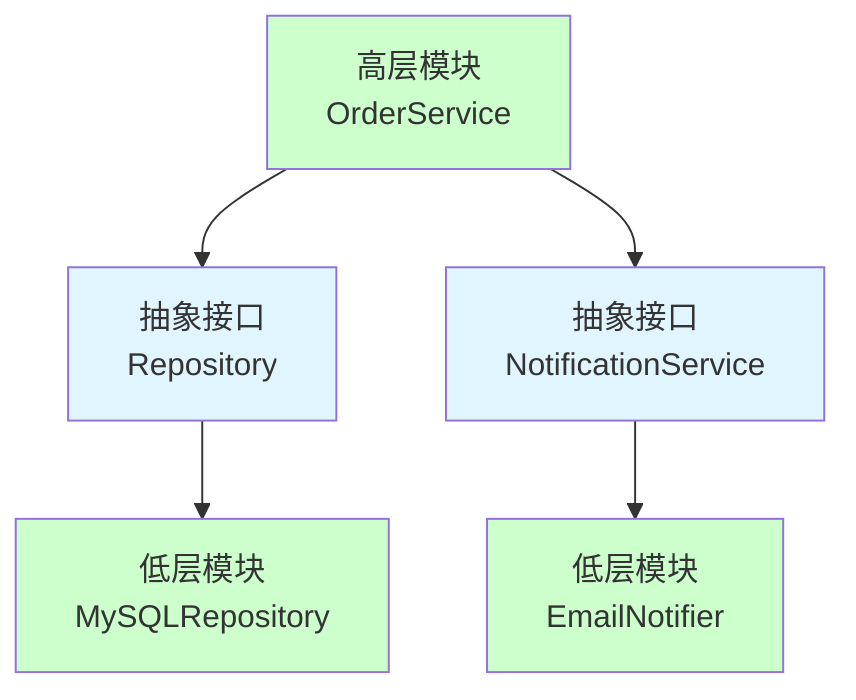
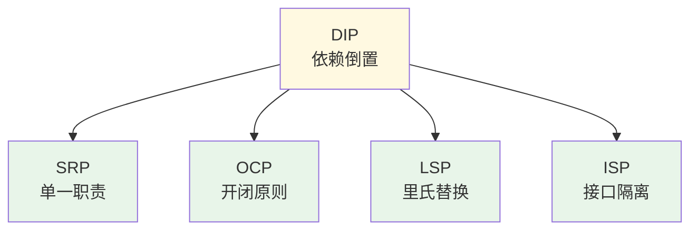

# 依赖倒置原则（Dependency Inversion Principle, DIP）

## 一、这是什么？

想象一下家里的**电器和插座**：

- 你买了新电视、新冰箱、新空调
- 它们都使用**标准插座**（220V交流电接口）
- 不需要为每个电器重新布线
- 插座是"抽象"，电器依赖这个抽象，而不是依赖具体的电线布局

**依赖倒置原则**就是这个道理：**高层模块不应该依赖低层模块，两者都应该依赖抽象**。

换句话说：
- **传统依赖**：高层 → 低层（业务逻辑依赖具体实现）
- **依赖倒置**：高层 → 抽象 ← 低层（都依赖接口）
- 抽象不应该依赖细节，细节应该依赖抽象

## 二、为什么需要它？

### 问题场景

假设你在开发一个订单处理系统：

```java
// 低层模块：MySQL数据库
class MySQLDatabase {
    public void save(Order order) {
        System.out.println("保存订单到 MySQL: " + order);
    }
}

// 低层模块：邮件服务
class EmailService {
    public void send(String message) {
        System.out.println("发送邮件: " + message);
    }
}

// 高层模块：订单服务（直接依赖具体实现）
class OrderService {
    private MySQLDatabase database;
    private EmailService emailService;
    
    public OrderService() {
        this.database = new MySQLDatabase();  // ❌ 硬编码依赖
        this.emailService = new EmailService();  // ❌ 硬编码依赖
    }
    
    public void processOrder(Order order) {
        database.save(order);
        emailService.send("订单已创建");
    }
}
```

### 这段代码的痛点

1. **高层依赖低层**：OrderService 直接依赖 MySQLDatabase 和 EmailService
2. **紧耦合**：无法更换数据库（MySQL → PostgreSQL）或通知方式（Email → SMS）
3. **难以测试**：无法在测试中替换为 Mock 对象
4. **违反 OCP**：每次更换实现都要修改 OrderService
5. **扩展困难**：增加新的存储方式需要修改业务逻辑

## 三、核心思想

### 依赖方向的倒置

**传统依赖（违反 DIP）**：


**依赖倒置（符合 DIP）**：


### 核心含义

1. **高层模块不依赖低层模块**
   - 高层：业务逻辑、用例
   - 低层：具体实现（数据库、网络、文件系统）
   - 两者都依赖抽象（接口）

2. **抽象不依赖细节**
   - 接口定义不包含实现细节
   - 具体类实现接口

3. **依赖方向倒置**
   - 传统：高层 → 低层
   - DIP：高层 → 抽象 ← 低层

## 四、DIP 的核心要求

### 要求1：高层模块不应该依赖低层模块

**❌ 违反 DIP**：
```java
class OrderService {
    private MySQLDatabase database;  // 依赖具体实现
    
    public OrderService() {
        this.database = new MySQLDatabase();  // 硬编码
    }
}
```

**✅ 符合 DIP**：
```java
interface Repository {
    void save(Order order);
}

class OrderService {
    private Repository repository;  // 依赖抽象
    
    public OrderService(Repository repository) {  // 依赖注入
        this.repository = repository;
    }
}
```

### 要求2：抽象不应该依赖细节

**❌ 抽象泄露实现细节**：
```java
interface Database {
    void saveToMySQL(Order order);  // ❌ 包含实现细节
    ResultSet executeSQLQuery(String sql);  // ❌ SQL 特定
}
```

**✅ 抽象不包含细节**：
```java
interface Repository {
    void save(Order order);  // ✓ 通用方法
    Order findById(String id);  // ✓ 不暴露实现
}
```

### 要求3：细节应该依赖抽象

**实现类依赖接口**：
```java
// 抽象
interface Repository {
    void save(Order order);
}

// 细节依赖抽象
class MySQLRepository implements Repository {
    public void save(Order order) {
        // MySQL 具体实现
    }
}

class MongoRepository implements Repository {
    public void save(Order order) {
        // MongoDB 具体实现
    }
}
```

## 五、依赖注入（Dependency Injection）

依赖倒置原则的实现通常通过**依赖注入（DI）**来完成。

### 方式1：构造函数注入（推荐）

```java
class OrderService {
    private Repository repository;
    private NotificationService notifier;
    
    // 通过构造函数注入依赖
    public OrderService(Repository repository, NotificationService notifier) {
        this.repository = repository;
        this.notifier = notifier;
    }
}

// 使用
Repository repo = new MySQLRepository();
NotificationService notifier = new EmailNotifier();
OrderService service = new OrderService(repo, notifier);
```

**优点**：
- 依赖明确，强制提供
- 对象创建后状态完整
- 便于测试

### 方式2：Setter 注入

```java
class OrderService {
    private Repository repository;
    
    // 通过 setter 注入
    public void setRepository(Repository repository) {
        this.repository = repository;
    }
}
```

**优点**：
- 可以在运行时改变依赖
- 可选依赖

**缺点**：
- 对象可能处于不完整状态
- 依赖不明确

### 方式3：接口注入（少用）

```java
interface RepositoryAware {
    void injectRepository(Repository repository);
}

class OrderService implements RepositoryAware {
    private Repository repository;
    
    public void injectRepository(Repository repository) {
        this.repository = repository;
    }
}
```

## 六、代码示例

查看 `demo/` 目录下的完整代码，这里做核心讲解。

### 违反 DIP 的示例

`BadExample.java`：高层直接依赖低层

```java
// 高层直接依赖具体实现
class OrderService {
    private MySQLDatabase database;
    private EmailService emailService;
    
    public OrderService() {
        this.database = new MySQLDatabase();  // ❌ 硬编码
        this.emailService = new EmailService();  // ❌ 硬编码
    }
}
```

**问题**：
- 无法更换实现
- 无法测试（Mock）
- 紧耦合

### 符合 DIP 的重构

`GoodExample.java`：通过抽象解耦

```java
// 1. 定义抽象接口
interface Repository {
    void save(Order order);
}

interface NotificationService {
    void notify(String message);
}

// 2. 具体实现
class MySQLRepository implements Repository {
    public void save(Order order) { /* 实现 */ }
}

class EmailNotifier implements NotificationService {
    public void notify(String message) { /* 实现 */ }
}

// 3. 高层依赖抽象
class OrderService {
    private Repository repository;
    private NotificationService notifier;
    
    public OrderService(Repository repository, NotificationService notifier) {
        this.repository = repository;  // 依赖注入
        this.notifier = notifier;
    }
}
```

**优势**：
- 易于更换实现
- 易于测试
- 低耦合

## 七、如何判断是否违反 DIP

### 判断方法1：检查 import 语句

```java
// ❌ 违反 DIP
import com.example.mysql.MySQLDatabase;  // 导入具体实现
import com.example.email.EmailService;

class OrderService {
    private MySQLDatabase db;  // 依赖具体类
}
```

```java
// ✅ 符合 DIP
import com.example.repository.Repository;  // 导入接口
import com.example.notification.NotificationService;

class OrderService {
    private Repository repo;  // 依赖抽象
}
```

### 判断方法2：检查 new 关键字

高层模块中出现 `new` 具体类，通常违反了 DIP：

```java
// ❌ 在业务逻辑中 new 具体类
class OrderService {
    public void process() {
        MySQLDatabase db = new MySQLDatabase();  // 违反 DIP
        db.save(order);
    }
}
```

### 判断方法3：依赖方向

画出依赖关系图：
- 箭头从高层指向低层 → 违反 DIP
- 箭头都指向抽象 → 符合 DIP

## 八、使用场景

### 典型场景

1. **分层架构**
   - Controller → Service → Repository
   - 每层依赖接口，不依赖具体实现

2. **可测试性**
   - 单元测试时用 Mock 对象替换真实实现

3. **插件系统**
   - 核心依赖插件接口
   - 插件实现接口

4. **多实现切换**
   - 开发环境用内存数据库
   - 生产环境用 MySQL

## 九、常见误区

### 误区1：所有类都要有接口

❌ **过度抽象**：
```java
interface UserDTO { }  // 纯数据类不需要接口
interface StringUtil { }  // 工具类不需要接口
```

✅ **合理抽象**：
- 只为需要多实现的组件定义接口
- 数据类（DTO、Entity）不需要接口
- 简单工具类不需要接口

### 误区2：DIP 就是使用接口

DIP 不仅仅是使用接口，更重要的是**依赖方向的倒置**：
- 抽象由高层定义，低层实现
- 不是低层定义接口，高层使用

### 误区3：DIP 和 IoC 是一回事

**区别**：
- **DIP**：设计原则（依赖抽象）
- **IoC**：设计模式（控制反转）
- **DI**：实现技术（依赖注入）

**关系**：DIP 是原则，IoC 是模式，DI 是实现。

## 十、DIP 与 SOLID 的关系

### DIP 是 SOLID 的基石



**DIP 如何支持其他原则**：

1. **DIP → SRP**：依赖抽象后，更容易拆分职责
2. **DIP → OCP**：通过抽象扩展，不修改高层代码
3. **DIP → LSP**：依赖抽象，子类自然可替换
4. **DIP → ISP**：定义小接口，客户端按需依赖

### SOLID 原则总结

| 原则 | 核心 | 目标 |
|-----|------|------|
| **SRP** | 一个类只做一件事 | 高内聚 |
| **OCP** | 对扩展开放，对修改关闭 | 可扩展 |
| **LSP** | 子类必须能替换父类 | 多态正确 |
| **ISP** | 客户端不依赖不需要的接口 | 接口隔离 |
| **DIP** | 依赖抽象，不依赖具体 | 低耦合 |

**协作关系**：
```
DIP（依赖抽象）
    ↓
SRP（职责单一）+ ISP（接口隔离）
    ↓
LSP（正确替换）
    ↓
OCP（可扩展）
```

## 十一、总结

**一句话记住 DIP**：高层模块不依赖低层模块，两者都依赖抽象。

**核心价值**：
- ✅ 降低耦合：高层和低层解耦
- ✅ 提高灵活性：易于更换实现
- ✅ 易于测试：可以注入 Mock 对象
- ✅ 支持扩展：新增实现不影响高层

**实现关键**：
1. **定义抽象接口**：由高层需求驱动
2. **依赖注入**：通过构造函数、setter 等注入
3. **面向接口编程**：高层只知道接口，不知道实现
4. **具体类实现接口**：低层依赖高层定义的抽象

**判断信号**：
- 高层模块导入了低层的具体类
- 业务逻辑中出现 `new` 具体实现
- 无法轻易更换实现或编写单元测试

**实践口诀**：
> 高层低层不直连，  
> 都靠抽象来牵线，  
> 依赖注入解耦合，  
> 灵活测试都方便。

---

**🎉 恭喜！你已经学完了 SOLID 五大原则！**

1. ✅ Single Responsibility（单一职责）
2. ✅ Open-Closed（开闭原则）
3. ✅ Liskov Substitution（里氏替换）
4. ✅ Interface Segregation（接口隔离）
5. ✅ Dependency Inversion（依赖倒置）

**下一步**：运行 demo 代码，完成自测题，总结 SOLID 原则的关系！
