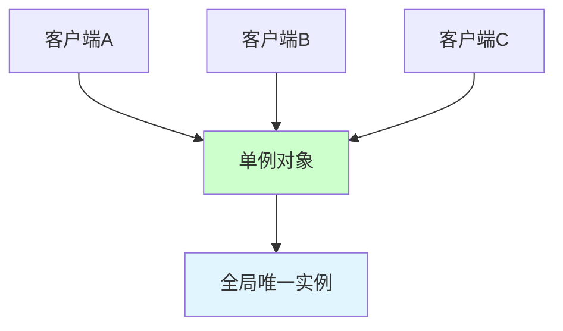

# 单例模式（Singleton Pattern）

## 一、这是什么？

想象一下**国家总统**：

- 一个国家同一时间只能有一个总统
- 所有政府部门都与这同一位总统打交道
- 不能同时出现两个总统（会导致混乱）
- 需要一种机制确保总统的唯一性

**单例模式**就是这个道理：**确保一个类只有一个实例，并提供全局访问点**。

换句话说：
- 类自己负责保存它的唯一实例
- 这个类提供访问该实例的方法
- 外部无法直接创建新实例
- 任何时候获取的都是同一个实例

## 二、为什么需要它？

### 问题场景

假设你在开发一个应用，需要一个全局的配置管理器：

```java
// 没有单例控制
class ConfigManager {
    private Properties config;
    
    public ConfigManager() {
        // 从文件加载配置（耗时操作）
        config = loadConfig();
    }
    
    public String get(String key) {
        return config.getProperty(key);
    }
}

// 使用时
class ServiceA {
    private ConfigManager config = new ConfigManager();  // 创建实例1
}

class ServiceB {
    private ConfigManager config = new ConfigManager();  // 创建实例2
}

class ServiceC {
    private ConfigManager config = new ConfigManager();  // 创建实例3
}
```

### 这段代码的痛点

1. **资源浪费**：每次创建ConfigManager都要重新加载配置文件
2. **内存浪费**：存在多个相同的配置对象
3. **状态不一致**：如果配置动态更新，多个实例之间状态不同步
4. **性能问题**：重复加载配置文件，影响性能
5. **难以管理**：无法保证使用的是同一个配置对象

## 三、核心思想

### 确保唯一实例



**单例模式的三个要点**：

1. **私有构造函数**：防止外部直接 `new` 创建对象
2. **私有静态实例**：类内部保存唯一实例
3. **公共静态访问方法**：提供全局访问点

**基本结构**：
```java
public class Singleton {
    // 2. 私有静态实例
    private static Singleton instance;
    
    // 1. 私有构造函数
    private Singleton() {
        // 防止外部实例化
    }
    
    // 3. 公共静态访问方法
    public static Singleton getInstance() {
        if (instance == null) {
            instance = new Singleton();
        }
        return instance;
    }
}
```

## 四、单例模式的实现方式

### 方式1：饿汉式（线程安全）

```java
public class Singleton {
    // 类加载时就创建实例
    private static final Singleton INSTANCE = new Singleton();
    
    private Singleton() {
    }
    
    public static Singleton getInstance() {
        return INSTANCE;
    }
}
```

**优点**：
- ✅ 线程安全（类加载机制保证）
- ✅ 实现简单
- ✅ 没有性能问题

**缺点**：
- ❌ 类加载时就创建，可能造成资源浪费（即使不使用）
- ❌ 无法延迟加载

**适用场景**：
- 单例对象占用资源较少
- 程序启动后一定会使用

### 方式2：懒汉式（线程不安全）

```java
public class Singleton {
    private static Singleton instance;
    
    private Singleton() {
    }
    
    public static Singleton getInstance() {
        if (instance == null) {  // ❌ 多线程下不安全
            instance = new Singleton();
        }
        return instance;
    }
}
```

**优点**：
- ✅ 延迟加载，节省资源

**缺点**：
- ❌ 线程不安全：多线程下可能创建多个实例

**线程安全问题演示**：
```java
// 线程A和线程B同时执行
Thread A: if (instance == null)  // true
Thread B: if (instance == null)  // true
Thread A: instance = new Singleton()  // 创建实例1
Thread B: instance = new Singleton()  // 创建实例2（覆盖实例1）
```

**结论**：⚠️ 不推荐使用（除非单线程环境）

### 方式3：懒汉式（同步方法，线程安全但性能差）

```java
public class Singleton {
    private static Singleton instance;
    
    private Singleton() {
    }
    
    // 加synchronized锁
    public static synchronized Singleton getInstance() {
        if (instance == null) {
            instance = new Singleton();
        }
        return instance;
    }
}
```

**优点**：
- ✅ 线程安全
- ✅ 延迟加载

**缺点**：
- ❌ 性能差：每次调用getInstance()都要同步，即使实例已创建

**结论**：⚠️ 不推荐使用（性能开销大）

### 方式4：双重检查锁定（DCL，Double-Checked Locking）

```java
public class Singleton {
    // volatile 关键字很重要！
    private static volatile Singleton instance;
    
    private Singleton() {
    }
    
    public static Singleton getInstance() {
        if (instance == null) {  // 第一次检查（无锁）
            synchronized (Singleton.class) {  // 加锁
                if (instance == null) {  // 第二次检查（有锁）
                    instance = new Singleton();
                }
            }
        }
        return instance;
    }
}
```

**为什么需要两次检查？**

1. **第一次检查（无锁）**：避免不必要的同步，提高性能
2. **第二次检查（有锁）**：防止多线程同时创建实例

**为什么需要 volatile？**

`instance = new Singleton()` 不是原子操作，分为三步：
1. 分配内存空间
2. 初始化对象
3. 将instance指向内存空间

JVM可能重排序为 1→3→2，导致其他线程获取到未初始化完成的对象。
`volatile` 禁止指令重排序。

**优点**：
- ✅ 线程安全
- ✅ 延迟加载
- ✅ 性能好（只在创建时同步）

**缺点**：
- ❌ 实现复杂
- ❌ 需要理解volatile和指令重排序

**结论**：✅ 可以使用，但不是最佳方案

### 方式5：静态内部类（推荐）

```java
public class Singleton {
    private Singleton() {
    }
    
    // 静态内部类
    private static class SingletonHolder {
        private static final Singleton INSTANCE = new Singleton();
    }
    
    public static Singleton getInstance() {
        return SingletonHolder.INSTANCE;
    }
}
```

**原理**：
- 外部类加载时，静态内部类不会被加载
- 只有调用 `getInstance()` 时，才加载内部类并创建实例
- 类加载机制保证线程安全

**优点**：
- ✅ 线程安全（类加载机制保证）
- ✅ 延迟加载
- ✅ 实现简单，无需同步
- ✅ 性能好

**缺点**：
- 无明显缺点

**结论**：✅✅✅ **强烈推荐**（最优雅的实现）

### 方式6：枚举单例（最安全）

```java
public enum Singleton {
    INSTANCE;
    
    public void doSomething() {
        System.out.println("执行操作");
    }
}

// 使用
Singleton.INSTANCE.doSomething();
```

**优点**：
- ✅ 线程安全
- ✅ 防止反射攻击
- ✅ 防止序列化创建新实例
- ✅ 代码最简洁

**缺点**：
- ❌ 不够灵活（无法继承）
- ❌ 非延迟加载

**结论**：✅✅ **推荐**（Effective Java作者推荐，最安全）

## 五、实现方式对比总结

| 实现方式 | 线程安全 | 延迟加载 | 性能 | 推荐度 | 适用场景 |
|---------|---------|---------|------|--------|---------|
| 饿汉式 | ✅ | ❌ | 高 | ⭐⭐⭐ | 一定会使用的单例 |
| 懒汉式（不同步） | ❌ | ✅ | 高 | ❌ | 单线程 |
| 懒汉式（同步方法） | ✅ | ✅ | 低 | ❌ | 不推荐 |
| 双重检查锁定 | ✅ | ✅ | 高 | ⭐⭐⭐⭐ | 需要延迟加载 |
| 静态内部类 | ✅ | ✅ | 高 | ⭐⭐⭐⭐⭐ | **通用推荐** |
| 枚举 | ✅ | ❌ | 高 | ⭐⭐⭐⭐⭐ | 最安全 |

**推荐选择**：
1. **首选**：静态内部类（优雅、高效）
2. **备选**：枚举（最安全，防反射和序列化攻击）
3. **备选**：饿汉式（简单直接，不需要延迟加载时）

## 六、线程安全问题详解

### 为什么懒汉式线程不安全？

```java
public static Singleton getInstance() {
    if (instance == null) {  // ← 问题点
        instance = new Singleton();
    }
    return instance;
}
```

**多线程场景**：
```
时间线  线程A                    线程B
t1      检查 instance == null (true)
t2                              检查 instance == null (true)
t3      创建实例1
t4                              创建实例2（覆盖实例1）
t5      返回实例2                返回实例2
```

**结果**：创建了两个实例（虽然最后只有一个被引用）

### 为什么DCL需要volatile？

```java
instance = new Singleton();
```

**JVM执行步骤**：
1. 分配内存
2. 初始化对象
3. instance指向内存

**指令重排序**可能导致：
1. 分配内存
2. instance指向内存（此时对象未初始化！）
3. 初始化对象

**问题场景**：
```
线程A: instance指向内存（但未初始化）
线程B: 检查instance != null，直接返回
线程B: 使用未初始化的对象 → 出错！
```

**volatile的作用**：
- 禁止指令重排序
- 保证可见性

## 七、反射和序列化攻击

### 反射攻击

即使构造函数私有，反射仍然可以创建实例：

```java
// 反射攻击
Constructor<Singleton> constructor = Singleton.class.getDeclaredConstructor();
constructor.setAccessible(true);  // 暴力访问私有构造函数
Singleton instance1 = constructor.newInstance();
Singleton instance2 = constructor.newInstance();

// instance1 != instance2  破坏了单例！
```

**防御方法**：在构造函数中检查
```java
private Singleton() {
    if (instance != null) {
        throw new RuntimeException("请使用getInstance()方法获取实例");
    }
}
```

### 序列化攻击

如果单例类实现了 `Serializable`，反序列化会创建新实例：

```java
Singleton instance1 = Singleton.getInstance();

// 序列化
ObjectOutputStream oos = new ObjectOutputStream(new FileOutputStream("singleton.ser"));
oos.writeObject(instance1);

// 反序列化
ObjectInputStream ois = new ObjectInputStream(new FileInputStream("singleton.ser"));
Singleton instance2 = (Singleton) ois.readObject();

// instance1 != instance2  破坏了单例！
```

**防御方法**：添加 `readResolve()` 方法
```java
public class Singleton implements Serializable {
    // ... 单例实现
    
    // 反序列化时返回唯一实例
    private Object readResolve() {
        return getInstance();
    }
}
```

**枚举单例的优势**：
- 天然防止反射攻击（JVM层面保证）
- 天然防止序列化攻击（枚举序列化机制特殊）

## 八、代码示例

查看 `demo/` 目录下的完整代码。

示例包含：
1. 5种单例实现
2. 线程安全测试
3. 反射攻击演示
4. 最佳实践推荐

## 九、使用场景

### 典型应用场景

1. **配置管理器**
   ```java
   ConfigManager config = ConfigManager.getInstance();
   String dbUrl = config.get("db.url");
   ```

2. **日志管理器**
   ```java
   Logger logger = Logger.getInstance();
   logger.log("Application started");
   ```

3. **线程池**
   ```java
   ThreadPoolManager pool = ThreadPoolManager.getInstance();
   pool.execute(task);
   ```

4. **数据库连接池**
   ```java
   ConnectionPool pool = ConnectionPool.getInstance();
   Connection conn = pool.getConnection();
   ```

5. **缓存管理器**
   ```java
   CacheManager cache = CacheManager.getInstance();
   cache.put("key", "value");
   ```

6. **应用上下文**（Spring ApplicationContext）

### 何时使用单例

✅ **适合使用单例的场景**：
- 需要频繁创建和销毁的对象
- 创建对象耗时或耗资源
- 需要全局唯一的访问点
- 对象无状态或状态只读

❌ **不适合使用单例的场景**：
- 对象有可变状态且被多线程访问（需要同步）
- 需要多个实例
- 对象需要继承

## 十、优缺点分析

### 优点

1. **节省内存**：只有一个实例
2. **避免重复创建**：减少系统开销
3. **全局访问点**：统一访问方式
4. **控制实例数量**：严格控制为1个

### 缺点

1. **违反单一职责**：类既负责自己的逻辑，又负责控制实例数量
2. **难以测试**：全局状态难以Mock
3. **隐藏依赖**：直接调用getInstance()，依赖关系不明显
4. **可能成为瓶颈**：高并发下全局唯一实例可能成为瓶颈
5. **生命周期难以管理**：全局实例何时销毁？

### 如何缓解缺点

1. **使用依赖注入**代替直接调用getInstance()
   ```java
   // 不好
   class Service {
       public void doSomething() {
           Config config = ConfigManager.getInstance();
       }
   }
   
   // 更好
   class Service {
       private ConfigManager config;
       
       public Service(ConfigManager config) {  // 依赖注入
           this.config = config;
       }
   }
   ```

2. **考虑使用Spring的单例作用域**代替手写单例

3. **谨慎使用**：不是所有"看起来只需要一个实例"的类都要用单例

## 十一、常见误区

### 误区1：单例一定是全局变量

单例 ≠ 全局变量
- 单例有封装性，控制访问方式
- 全局变量暴露所有细节

### 误区2：单例一定线程安全

单例模式只保证实例唯一，不保证线程安全！
- 实例创建过程需要线程安全
- 实例的方法仍需考虑线程安全

### 误区3：双重检查锁定不需要volatile

**错误**！没有volatile会因指令重排序导致问题。

### 误区4：所有只需要一个实例的类都用单例

不一定！考虑：
- 是否真的需要全局访问点？
- 是否可以用依赖注入代替？
- 是否会影响测试？

### 误区5：单例模式很简单

看似简单，实则复杂：
- 线程安全问题
- 反射攻击
- 序列化问题
- 类加载时机

## 十二、总结

**一句话记住单例模式**：确保一个类只有一个实例，并提供全局访问点。

**核心价值**：
- ✅ 控制实例数量
- ✅ 节省系统资源
- ✅ 提供全局访问
- ✅ 避免重复创建

**实现要点**：
1. **私有构造函数**：防止外部创建
2. **私有静态实例**：保存唯一实例
3. **公共静态方法**：提供访问点
4. **线程安全**：正确处理多线程

**推荐实现**：
1. **首选**：静态内部类（优雅、高效、延迟加载）
2. **备选**：枚举（最安全，防攻击）
3. **备选**：饿汉式（简单，不需要延迟加载时）

**实践口诀**：
> 单例模式保唯一，  
> 私有构造是关键，  
> 静态内部类最优雅，  
> 枚举方式最安全。

---

**下一步**：
1. 运行 `demo/` 中的代码，对比不同实现
2. 完成 `test_01.md` 的自测题
3. 思考：你的项目中哪些类适合用单例？
