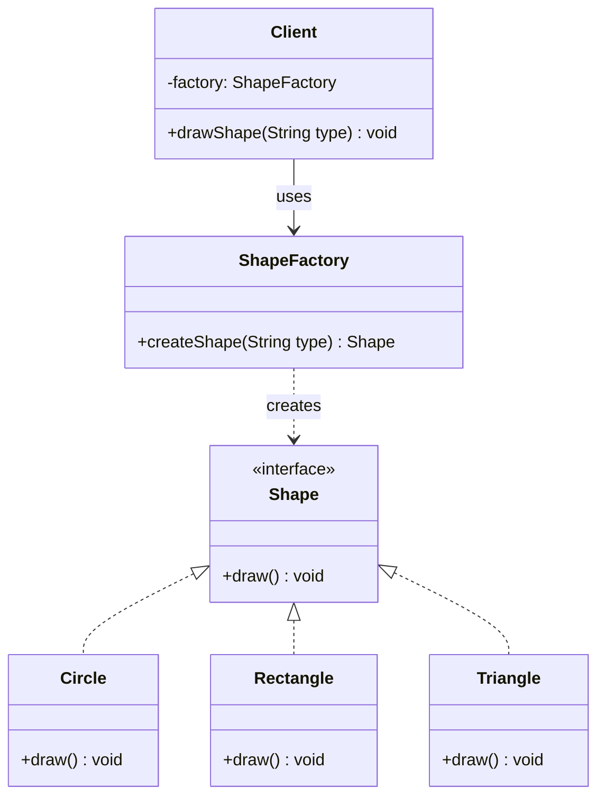
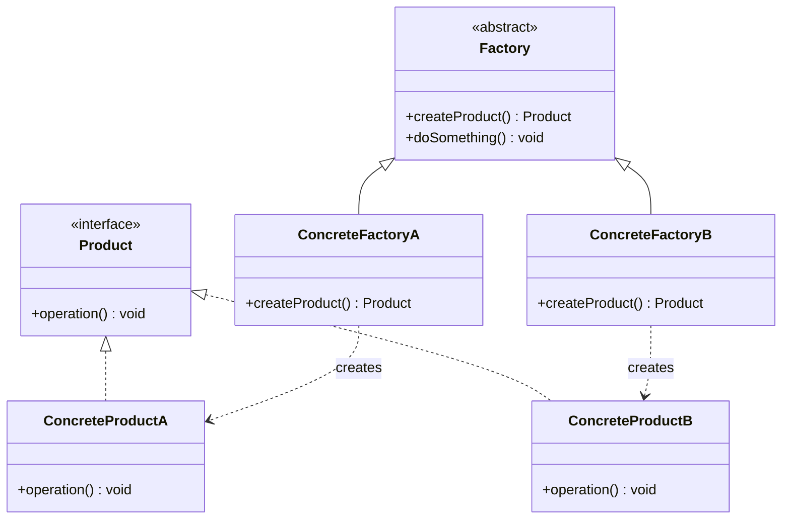
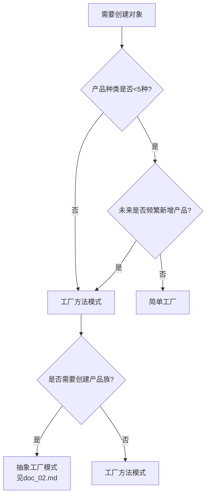

# 工厂模式（一）：简单工厂 + 工厂方法模式

> 创建型模式的核心：将对象的创建与使用分离

---

## 一、什么是工厂模式？

### 生活中的例子：餐厅点餐

想象你去一家餐厅吃饭：

- **顾客（客户端）**：你只需要对服务员说"我要一份宫保鸡丁"
- **服务员（工厂）**：负责将订单传递给厨房
- **厨房（具体创建逻辑）**：厨师知道如何制作宫保鸡丁
- **菜品（产品）**：最终端上来的宫保鸡丁

**关键点**：
- 你不需要知道厨房在哪里
- 你不需要知道宫保鸡丁怎么做
- 你不需要准备食材和厨具
- 你只需要**告诉服务员你要什么**

这就是工厂模式的核心思想：**将对象的创建逻辑封装起来，客户端不需要知道对象是如何创建的**。

---

## 二、为什么需要工厂模式？

### 问题场景：没有工厂的代码

假设我们有一个图形绘制系统，需要创建不同的图形：

```java
// 客户端代码
public class Client {
    public void drawShape(String type) {
        Shape shape = null;
        
        if ("circle".equals(type)) {
            shape = new Circle();
        } else if ("rectangle".equals(type)) {
            shape = new Rectangle();
        } else if ("triangle".equals(type)) {
            shape = new Triangle();
        }
        
        if (shape != null) {
            shape.draw();
        }
    }
}
```

### 痛点分析

**问题1：代码重复**
- 如果有10个地方需要创建图形，就要写10次这样的 `if-else`
- 每个地方的创建逻辑都一样，违反了DRY原则

**问题2：违反开闭原则**
- 新增一种图形（比如五角星），需要修改所有创建图形的地方
- 对扩展不开放，对修改不封闭

**问题3：客户端耦合度高**
- 客户端需要知道所有具体的图形类（Circle、Rectangle、Triangle）
- 客户端承担了"创建逻辑"的职责，违反单一职责原则

**问题4：难以维护**
- 创建逻辑散落在代码各处
- 修改创建逻辑需要改动多处代码

### 解决方案：工厂模式

工厂模式将"对象创建"的职责从客户端剥离出来，交给专门的工厂类负责。

---

## 三、简单工厂（Simple Factory）

### 定义

简单工厂模式：**由一个工厂类根据传入的参数，决定创建哪种产品类的实例**。

> **注意**：简单工厂不是GoF 23种设计模式之一，但它是工厂方法模式的基础。

### UML 类图



### 核心思想

1. **产品接口**：定义所有产品的公共接口（Shape）
2. **具体产品**：实现产品接口的具体类（Circle、Rectangle、Triangle）
3. **工厂类**：负责创建所有产品的静态方法
4. **客户端**：只依赖工厂和产品接口，不依赖具体产品

### 代码示例

```java
// 1. 产品接口
interface Shape {
    void draw();
}

// 2. 具体产品
class Circle implements Shape {
    @Override
    public void draw() {
        System.out.println("绘制圆形");
    }
}

class Rectangle implements Shape {
    @Override
    public void draw() {
        System.out.println("绘制矩形");
    }
}

// 3. 简单工厂
class ShapeFactory {
    public static Shape createShape(String type) {
        switch (type) {
            case "circle":
                return new Circle();
            case "rectangle":
                return new Rectangle();
            case "triangle":
                return new Triangle();
            default:
                throw new IllegalArgumentException("不支持的图形类型: " + type);
        }
    }
}

// 4. 客户端
class Client {
    public void drawShape(String type) {
        Shape shape = ShapeFactory.createShape(type);
        shape.draw();
    }
}
```

### 优点

✅ **封装创建逻辑**：客户端不需要知道对象如何创建  
✅ **代码复用**：创建逻辑集中在一个地方，避免重复  
✅ **降低耦合**：客户端只依赖接口，不依赖具体类  
✅ **易于理解**：实现简单，适合简单场景

### 缺点

❌ **违反开闭原则**：新增产品需要修改工厂类  
❌ **工厂类职责过重**：所有产品的创建逻辑都在一个类里  
❌ **扩展性差**：产品种类多时，工厂类会变得庞大

### 适用场景

1. **产品种类较少**（5种以内）
2. **产品创建逻辑简单**（只需要 `new` 操作）
3. **客户端不关心产品的创建过程**
4. **需要快速实现**，不考虑长期扩展

**典型案例**：
- 日志级别工厂（DEBUG、INFO、WARN、ERROR）
- 数据库连接工厂（MySQL、PostgreSQL）

---

## 四、工厂方法模式（Factory Method）

### 从简单工厂的问题说起

简单工厂的核心问题：**新增产品需要修改工厂类**。

比如新增一个"五角星"图形：
```java
// 需要修改工厂类
class ShapeFactory {
    public static Shape createShape(String type) {
        switch (type) {
            case "circle":
                return new Circle();
            case "rectangle":
                return new Rectangle();
            case "star":  // ← 新增这一行
                return new Star();
            // ...
        }
    }
}
```

这违反了**开闭原则**（对扩展开放，对修改封闭）。

### 定义

工厂方法模式：**定义一个用于创建对象的接口，让子类决定实例化哪一个类**。

### UML 类图



### 核心思想

1. **抽象工厂**：定义创建产品的接口
2. **具体工厂**：每个产品有自己的工厂类
3. **抽象产品**：定义产品的公共接口
4. **具体产品**：实现产品接口

**关键变化**：
- 简单工厂：一个工厂创建所有产品
- 工厂方法：一个工厂只创建一种产品

### 代码示例

```java
// 1. 抽象产品
interface Payment {
    void pay(double amount);
}

// 2. 具体产品
class AlipayPayment implements Payment {
    @Override
    public void pay(double amount) {
        System.out.println("使用支付宝支付: " + amount + "元");
    }
}

class WechatPayment implements Payment {
    @Override
    public void pay(double amount) {
        System.out.println("使用微信支付: " + amount + "元");
    }
}

// 3. 抽象工厂
abstract class PaymentFactory {
    // 工厂方法
    public abstract Payment createPayment();
    
    // 模板方法（可选）
    public void processPayment(double amount) {
        Payment payment = createPayment();
        payment.pay(amount);
    }
}

// 4. 具体工厂
class AlipayFactory extends PaymentFactory {
    @Override
    public Payment createPayment() {
        return new AlipayPayment();
    }
}

class WechatFactory extends PaymentFactory {
    @Override
    public Payment createPayment() {
        return new WechatPayment();
    }
}

// 5. 客户端
class Client {
    public static void main(String[] args) {
        // 使用支付宝支付
        PaymentFactory factory1 = new AlipayFactory();
        factory1.processPayment(100.0);
        
        // 使用微信支付
        PaymentFactory factory2 = new WechatFactory();
        factory2.processPayment(200.0);
    }
}
```

### 新增产品的扩展性

新增"银行卡支付"，**无需修改现有代码**：

```java
// 1. 新增产品
class BankCardPayment implements Payment {
    @Override
    public void pay(double amount) {
        System.out.println("使用银行卡支付: " + amount + "元");
    }
}

// 2. 新增工厂
class BankCardFactory extends PaymentFactory {
    @Override
    public Payment createPayment() {
        return new BankCardPayment();
    }
}

// 3. 客户端使用（无需修改其他代码）
PaymentFactory factory3 = new BankCardFactory();
factory3.processPayment(300.0);
```

### 优点

✅ **符合开闭原则**：新增产品无需修改现有代码  
✅ **单一职责**：每个工厂只负责创建一种产品  
✅ **符合依赖倒置原则**：依赖抽象工厂，不依赖具体工厂  
✅ **扩展性好**：新增产品只需新增工厂类

### 缺点

❌ **类的数量增加**：每个产品需要一个工厂类  
❌ **增加复杂度**：简单场景下显得过度设计  
❌ **客户端需要知道具体工厂**：需要选择使用哪个工厂

### 适用场景

1. **需要频繁扩展产品**
2. **产品创建逻辑复杂**（不只是 `new`，还有初始化逻辑）
3. **产品有统一的创建流程**（可以在抽象工厂中定义模板方法）
4. **希望符合开闭原则**

**典型案例**：
- 日志框架（Log4j、Logback、JUL）
- JDBC 驱动（每个数据库有自己的 Driver）
- Spring 的 FactoryBean

---

## 五、简单工厂 vs 工厂方法

### 对比表格

| 对比维度 | 简单工厂 | 工厂方法 |
|---------|---------|---------|
| **结构** | 一个工厂类 | 抽象工厂 + 多个具体工厂 |
| **创建逻辑** | 工厂类中用 `if-else` 或 `switch` | 每个具体工厂只创建一种产品 |
| **开闭原则** | ❌ 新增产品需要修改工厂 | ✅ 新增产品只需新增工厂类 |
| **复杂度** | 简单 | 较复杂（类数量多） |
| **扩展性** | 差 | 好 |
| **适用场景** | 产品种类少、不常变化 | 产品种类多、需要频繁扩展 |

### 如何选择？



**决策建议**：
1. **快速原型、简单项目** → 简单工厂
2. **企业级应用、需要扩展** → 工厂方法
3. **需要创建相关产品组合** → 抽象工厂（下一篇）

---

## 六、注意事项与常见误区

### 误区1：工厂模式 = 反射创建对象

❌ **错误理解**：
```java
// 这不是工厂模式的核心
class ShapeFactory {
    public static Shape createShape(String className) {
        return (Shape) Class.forName(className).newInstance();
    }
}
```

✅ **正确理解**：
- 工厂模式的核心是**封装创建逻辑**，不是反射
- 反射只是一种实现手段，不是必须的
- 简单场景用 `switch` 就够了

### 误区2：过度使用工厂

不是所有对象创建都需要工厂。

**不需要工厂的场景**：
- 简单对象（如 `new ArrayList()`）
- 只创建一次的对象
- 创建逻辑极其简单

**需要工厂的场景**：
- 创建逻辑复杂（需要初始化配置）
- 需要根据条件选择具体类
- 需要频繁扩展产品种类

### 误区3：工厂方法 = 静态工厂方法

```java
// 这不是工厂方法模式，这是静态工厂方法
class User {
    public static User createAdmin() {
        return new User("admin");
    }
}
```

区别：
- **静态工厂方法**：类的静态方法，用于创建本类实例（如 `Integer.valueOf()`）
- **工厂方法模式**：独立的工厂类，符合开闭原则

### 误区4：工厂模式与依赖注入

```java
// 工厂模式
PaymentFactory factory = new AlipayFactory();
Payment payment = factory.createPayment();

// 依赖注入（Spring）
@Autowired
private Payment payment;  // Spring容器自动注入
```

**关系**：
- 工厂模式：手动选择和创建对象
- 依赖注入：容器自动管理对象的创建和注入
- Spring 的 BeanFactory 本身就是工厂模式的应用

---

## 七、实战应用

### 1. JDBC 中的工厂方法

```java
// DriverManager 是工厂，每个数据库驱动是具体工厂
Connection conn = DriverManager.getConnection(url, user, password);
```

### 2. 日志框架

```java
// SLF4J 使用工厂方法模式
Logger logger = LoggerFactory.getLogger(MyClass.class);
```

### 3. Spring 的 FactoryBean

```java
public interface FactoryBean<T> {
    T getObject() throws Exception;  // 工厂方法
    Class<?> getObjectType();
    boolean isSingleton();
}
```

---

## 八、小结

### 核心要点

1. **简单工厂**：
   - 一个工厂创建所有产品
   - 实现简单，但违反开闭原则
   - 适合产品种类少、不常变化的场景

2. **工厂方法**：
   - 每个产品有自己的工厂
   - 符合开闭原则，扩展性好
   - 适合需要频繁扩展的场景

3. **本质**：
   - 将对象创建与使用分离
   - 客户端依赖抽象，不依赖具体类
   - 符合依赖倒置原则

### 记忆口诀

> **简单工厂一对多，**  
> **工厂方法一对一，**  
> **开闭原则选后者，**  
> **简单场景选前者。**

---

## 九、下一步

完成本篇学习后，继续学习：
- **doc_02.md**：抽象工厂模式（创建产品族）
- **demo/**：运行完整代码示例
- **test_01.md**：完成自测题
- **note_template.md**：填写学习笔记

**思考题**：
1. 你的项目中有哪些地方适合用工厂模式？
2. 简单工厂和工厂方法，你会选择哪个？为什么？
3. Spring 的 BeanFactory 是简单工厂还是工厂方法？

---

**下一篇预告**：抽象工厂模式 —— 当你需要创建一系列相关对象时...
