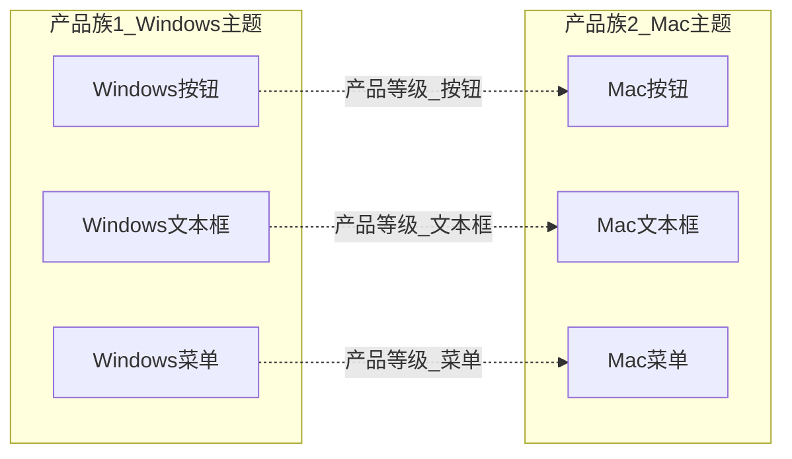
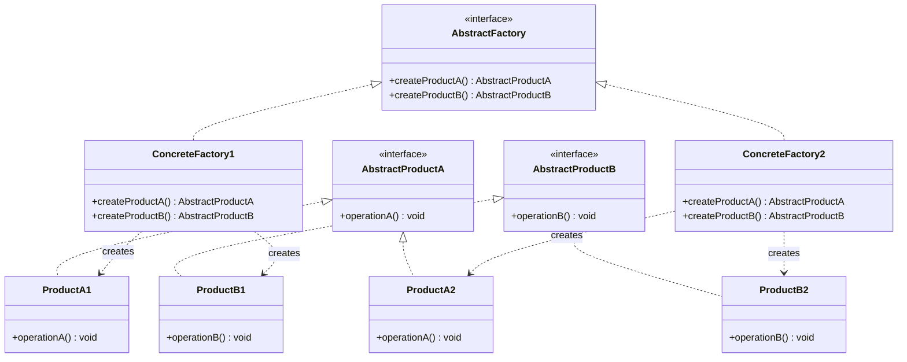
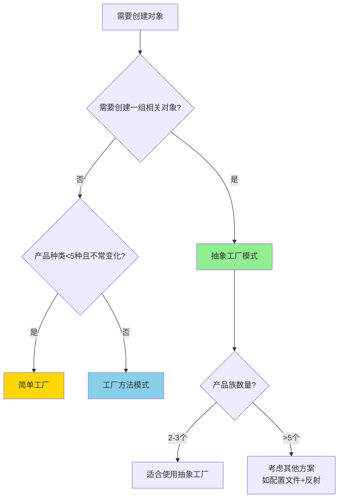
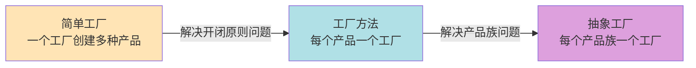

# 工厂模式（二）：抽象工厂模式

> 当你需要创建一系列相关的对象时...

---

## 一、什么是抽象工厂？

### 生活中的例子：跨平台UI主题

想象你在开发一个跨平台应用，需要支持 Windows 和 Mac 两种风格：

**Windows 风格**：
- 按钮：方形、灰色边框
- 文本框：白色背景、黑色边框
- 菜单：传统下拉菜单

**Mac 风格**：
- 按钮：圆角、蓝色阴影
- 文本框：浅灰色背景、无边框
- 菜单：扁平化菜单栏

**关键点**：
- 同一套主题的组件**必须配套**（不能Windows按钮+Mac文本框）
- 切换主题时，**所有组件一起切换**
- 客户端代码不关心具体是什么风格，只关心"按钮"、"文本框"

这就是抽象工厂模式的典型场景：**创建一系列相关或相互依赖的对象，而无需指定它们的具体类**。

---

## 二、为什么需要抽象工厂？

### 工厂方法的局限性

回顾工厂方法模式：
- 一个工厂只创建一种产品
- 如果需要创建多个相关产品，需要多个工厂

**场景**：数据库访问层需要创建 Connection 和 Statement

```java
// 使用工厂方法模式
ConnectionFactory connFactory = new MySQLConnectionFactory();
Connection conn = connFactory.createConnection();

StatementFactory stmtFactory = new MySQLStatementFactory();
Statement stmt = stmtFactory.createStatement();

// 问题：可能误用
ConnectionFactory connFactory = new MySQLConnectionFactory();
StatementFactory stmtFactory = new PostgreSQLStatementFactory();  // ❌ 不匹配！
```

**痛点**：
- 需要保证产品之间的**兼容性**（MySQL的Connection必须配MySQL的Statement）
- 客户端需要管理多个工厂
- 容易出错（混用不同数据库的组件）

### 解决方案：抽象工厂

一个工厂创建**一整套相关的产品**，保证产品之间的兼容性。

```java
// 使用抽象工厂模式
DatabaseFactory factory = new MySQLFactory();
Connection conn = factory.createConnection();     // MySQL连接
Statement stmt = factory.createStatement();       // MySQL语句（自动匹配）
```

---

## 三、抽象工厂模式详解

### 定义

抽象工厂模式：**提供一个创建一系列相关或相互依赖对象的接口，而无需指定它们具体的类**。

### 核心概念

**产品族（Product Family）**：
- 同一个工厂创建的一组产品
- 例如：Windows主题的所有组件（按钮、文本框、菜单）

**产品等级（Product Hierarchy）**：
- 不同工厂创建的同类产品
- 例如：所有主题的"按钮"（Windows按钮、Mac按钮）



### UML 类图



### 代码示例：跨数据库访问层

```java
// ========== 抽象产品 ==========

// 产品A：数据库连接
interface Connection {
    void connect();
    void close();
}

// 产品B：SQL语句执行器
interface Statement {
    void execute(String sql);
}

// ========== 具体产品：MySQL ==========

class MySQLConnection implements Connection {
    @Override
    public void connect() {
        System.out.println("[MySQL] 建立连接");
    }
    
    @Override
    public void close() {
        System.out.println("[MySQL] 关闭连接");
    }
}

class MySQLStatement implements Statement {
    @Override
    public void execute(String sql) {
        System.out.println("[MySQL] 执行SQL: " + sql);
    }
}

// ========== 具体产品：PostgreSQL ==========

class PostgreSQLConnection implements Connection {
    @Override
    public void connect() {
        System.out.println("[PostgreSQL] 建立连接");
    }
    
    @Override
    public void close() {
        System.out.println("[PostgreSQL] 关闭连接");
    }
}

class PostgreSQLStatement implements Statement {
    @Override
    public void execute(String sql) {
        System.out.println("[PostgreSQL] 执行SQL: " + sql);
    }
}

// ========== 抽象工厂 ==========

interface DatabaseFactory {
    Connection createConnection();
    Statement createStatement();
}

// ========== 具体工厂 ==========

class MySQLFactory implements DatabaseFactory {
    @Override
    public Connection createConnection() {
        return new MySQLConnection();
    }
    
    @Override
    public Statement createStatement() {
        return new MySQLStatement();
    }
}

class PostgreSQLFactory implements DatabaseFactory {
    @Override
    public Connection createConnection() {
        return new PostgreSQLConnection();
    }
    
    @Override
    public Statement createStatement() {
        return new PostgreSQLStatement();
    }
}

// ========== 客户端 ==========

class DataAccessLayer {
    private DatabaseFactory factory;
    
    public DataAccessLayer(DatabaseFactory factory) {
        this.factory = factory;
    }
    
    public void executeQuery(String sql) {
        // 创建一整套匹配的组件
        Connection conn = factory.createConnection();
        Statement stmt = factory.createStatement();
        
        conn.connect();
        stmt.execute(sql);
        conn.close();
    }
}

// 使用
public class Client {
    public static void main(String[] args) {
        // 使用MySQL
        DatabaseFactory mysqlFactory = new MySQLFactory();
        DataAccessLayer dal1 = new DataAccessLayer(mysqlFactory);
        dal1.executeQuery("SELECT * FROM users");
        
        System.out.println("\n切换到PostgreSQL：\n");
        
        // 切换到PostgreSQL（只需更换工厂）
        DatabaseFactory pgFactory = new PostgreSQLFactory();
        DataAccessLayer dal2 = new DataAccessLayer(pgFactory);
        dal2.executeQuery("SELECT * FROM users");
    }
}
```

**输出**：
```
[MySQL] 建立连接
[MySQL] 执行SQL: SELECT * FROM users
[MySQL] 关闭连接

切换到PostgreSQL：

[PostgreSQL] 建立连接
[PostgreSQL] 执行SQL: SELECT * FROM users
[PostgreSQL] 关闭连接
```

### 关键点

1. **产品族一致性**：同一个工厂创建的 Connection 和 Statement 一定是匹配的
2. **易于切换**：更换数据库只需更换工厂，客户端代码不变
3. **封装变化**：数据库实现细节对客户端透明

---

## 四、优点与缺点

### 优点

✅ **产品族一致性**：保证创建的对象是相互匹配的  
✅ **隔离具体类**：客户端不依赖具体产品类  
✅ **易于切换产品族**：更换整套产品只需更换工厂  
✅ **符合开闭原则**：新增产品族只需新增工厂（对产品族的扩展开放）

### 缺点

❌ **难以扩展产品等级**：新增产品类型需要修改所有工厂  
❌ **类数量激增**：每个产品族需要一套完整的产品类  
❌ **理解复杂**：概念抽象，不易理解

### 扩展性分析

**容易扩展的**：新增产品族
```java
// 新增Oracle数据库支持（容易）
class OracleFactory implements DatabaseFactory {
    public Connection createConnection() { return new OracleConnection(); }
    public Statement createStatement() { return new OracleStatement(); }
}
```

**难以扩展的**：新增产品类型
```java
// 新增Transaction产品（困难，需要修改所有工厂）
interface DatabaseFactory {
    Connection createConnection();
    Statement createStatement();
    Transaction createTransaction();  // ← 所有具体工厂都要实现
}
```

---

## 五、三种工厂模式对比

### 对比表格

| 对比维度 | 简单工厂 | 工厂方法 | 抽象工厂 |
|---------|---------|---------|---------|
| **结构** | 一个工厂类 | 抽象工厂 + 多个具体工厂 | 抽象工厂 + 多个具体工厂 |
| **创建对象** | 一个工厂创建多种产品 | 一个工厂创建一种产品 | 一个工厂创建一套产品 |
| **产品数量** | 多种产品 | 一种产品 | 一套相关产品 |
| **开闭原则** | ❌ 新增产品需修改工厂 | ✅ 新增产品只需新增工厂 | ✅ 新增产品族只需新增工厂<br/>❌ 新增产品类型需修改所有工厂 |
| **复杂度** | 低 | 中 | 高 |
| **类数量** | 少 | 中 | 多 |
| **适用场景** | 产品种类少 | 产品种类多 | 需要创建产品族 |

### 对比示例

```java
// 简单工厂：一个工厂创建多种产品
ShapeFactory.createShape("circle");
ShapeFactory.createShape("rectangle");

// 工厂方法：一个工厂创建一种产品
PaymentFactory factory = new AlipayFactory();
Payment payment = factory.createPayment();

// 抽象工厂：一个工厂创建一套产品
DatabaseFactory factory = new MySQLFactory();
Connection conn = factory.createConnection();
Statement stmt = factory.createStatement();
```

### 选择决策树



**决策要点**：
1. **产品是否成组出现** → 抽象工厂
2. **产品族数量** → 太多则考虑配置化方案
3. **扩展频率** → 扩展产品等级频繁则不适合抽象工厂

---

## 六、实战应用

### 1. Java AWT/Swing 的跨平台UI

```java
// 抽象工厂
interface GUIFactory {
    Button createButton();
    TextField createTextField();
}

// Windows工厂
class WindowsFactory implements GUIFactory {
    public Button createButton() { return new WindowsButton(); }
    public TextField createTextField() { return new WindowsTextField(); }
}

// Mac工厂
class MacFactory implements GUIFactory {
    public Button createButton() { return new MacButton(); }
    public TextField createTextField() { return new MacTextField(); }
}
```

### 2. Spring 的多数据源切换

```java
@Configuration
public class DataSourceConfig {
    @Bean
    public DataSource dataSource() {
        // 根据配置选择工厂
        if ("mysql".equals(dbType)) {
            return new MySQLDataSourceFactory().createDataSource();
        } else {
            return new PostgreSQLDataSourceFactory().createDataSource();
        }
    }
}
```

### 3. 游戏开发：不同难度的敌人组合

```java
interface EnemyFactory {
    Soldier createSoldier();
    Tank createTank();
    Aircraft createAircraft();
}

// 简单难度：敌人弱
class EasyEnemyFactory implements EnemyFactory { /*...*/ }

// 困难难度：敌人强
class HardEnemyFactory implements EnemyFactory { /*...*/ }
```

---

## 七、注意事项与最佳实践

### 1. 何时使用抽象工厂？

**适合的场景**：
- ✅ 系统需要独立于产品的创建、组合和表示
- ✅ 系统需要支持多个产品族，且一次只使用其中一个
- ✅ 产品族中的产品必须一起使用（强约束）
- ✅ 产品族相对稳定（不会频繁新增产品类型）

**不适合的场景**：
- ❌ 产品之间没有关联关系
- ❌ 产品类型经常变化
- ❌ 只有一个产品族

### 2. 与配置文件结合

避免硬编码选择工厂：

```java
// 配置文件: config.properties
database.type=mysql

// 代码
public class FactoryProducer {
    public static DatabaseFactory getFactory() {
        String type = Config.get("database.type");
        switch (type) {
            case "mysql":
                return new MySQLFactory();
            case "postgresql":
                return new PostgreSQLFactory();
            default:
                throw new IllegalArgumentException("Unknown database type");
        }
    }
}
```

### 3. 简化版抽象工厂

如果产品族只有2-3个产品，可以简化：

```java
// 简化版：工厂类直接创建对象，不定义抽象产品接口
class MySQLFactory {
    public MySQLConnection createConnection() { /*...*/ }
    public MySQLStatement createStatement() { /*...*/ }
}
```

**权衡**：
- 优点：减少接口数量，降低复杂度
- 缺点：失去了抽象，客户端依赖具体类

### 4. 避免过度设计

```java
// ❌ 过度设计：只有一种产品族
interface AnimalFactory {
    Dog createDog();
    Cat createCat();
}

class PetFactory implements AnimalFactory {
    // 只有这一个实现...
}

// ✅ 简单设计：直接创建
Dog dog = new Dog();
Cat cat = new Cat();
```

---

## 八、三种工厂模式的演进

### 演进路径



### 本质对比

| 模式 | 本质 | 核心关注点 |
|-----|------|----------|
| **简单工厂** | 封装创建逻辑 | 减少客户端 `new` 操作 |
| **工厂方法** | 延迟到子类决定 | 符合开闭原则 |
| **抽象工厂** | 产品族一致性 | 保证相关产品配套使用 |

---

## 九、小结

### 核心要点

1. **抽象工厂**：
   - 一个工厂创建一套相关产品
   - 保证产品族的一致性
   - 适合需要创建多个相关对象的场景

2. **产品族 vs 产品等级**：
   - 产品族：同一工厂创建的所有产品（横向）
   - 产品等级：不同工厂创建的同类产品（纵向）

3. **扩展性**：
   - 易于扩展产品族（新增工厂）
   - 难以扩展产品等级（需修改所有工厂）

4. **与其他模式的关系**：
   - 简单工厂：一对多
   - 工厂方法：一对一
   - 抽象工厂：一对多（但这个"多"是一套相关产品）

### 记忆口诀

> **简单工厂一生多，**  
> **工厂方法一生一，**  
> **抽象工厂一生族，**  
> **产品配套不分离。**

### 实践建议

1. **优先考虑简单方案**：不是所有场景都需要抽象工厂
2. **识别产品族**：如果对象需要配套使用，考虑抽象工厂
3. **评估扩展方向**：如果主要扩展产品类型，不适合抽象工厂
4. **结合配置文件**：避免硬编码工厂选择逻辑

---

## 十、扩展阅读

### 相关模式

- **建造者模式**：分步骤构建复杂对象（下一个学习目标）
- **原型模式**：通过复制创建对象
- **单例模式**：控制对象数量为1

### 进阶思考

1. 抽象工厂如何与依赖注入（DI）结合？
2. 如何用反射实现动态工厂？
3. 抽象工厂在微服务架构中的应用？

---

## 十一、总结对比：三种工厂模式

| 场景 | 推荐模式 | 理由 |
|-----|---------|------|
| 图形绘制系统（圆形、矩形、三角形） | 简单工厂 | 产品种类少，不常变化 |
| 支付系统（支付宝、微信、银行卡） | 工厂方法 | 需要频繁扩展支付方式 |
| 跨数据库访问（Connection + Statement） | 抽象工厂 | 需要创建配套的产品组合 |
| 跨平台UI（Button + TextField + Menu） | 抽象工厂 | 需要保证组件风格一致 |
| 日志框架（不同日志级别） | 简单工厂 | 日志级别固定 |
| 消息队列（不同消息类型的生产者+消费者） | 抽象工厂 | 生产者和消费者需要配套 |

---

**恭喜！** 你已经完成了工厂模式的学习。

**下一步**：
1. 运行 `demo/` 中的完整代码
2. 完成 `test_01.md` 自测题
3. 填写 `note_template.md` 学习笔记
4. 继续学习**建造者模式**
