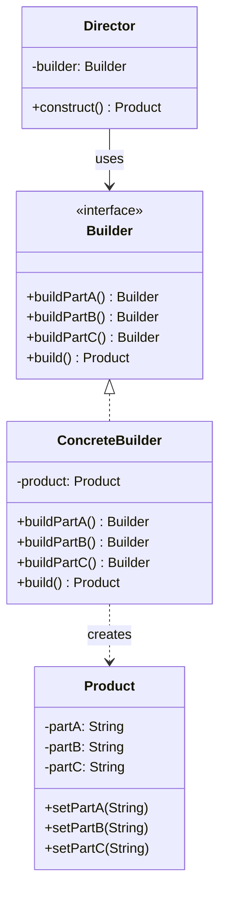
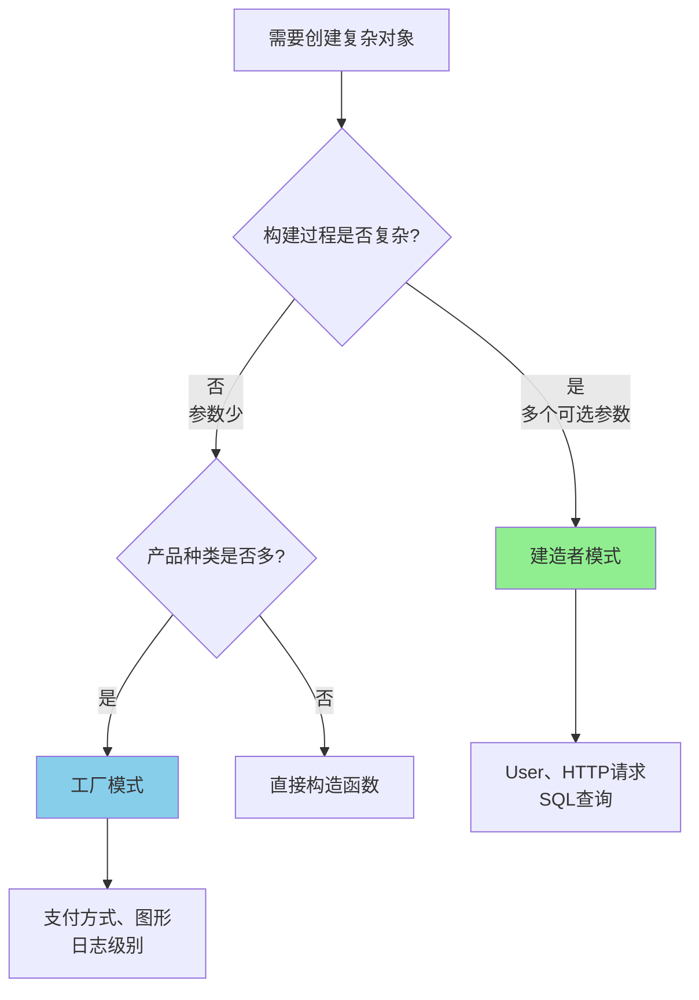

# 建造者模式（Builder Pattern）

> 创建型模式：分步骤构建复杂对象

---

## 一、什么是建造者模式？

### 生活中的例子：定制电脑

想象你去电脑城配电脑：

**传统购买方式**（工厂模式）：
- 店员：我们有办公电脑、游戏电脑、设计师电脑
- 你：给我一台游戏电脑
- 店员：好的，这是配置好的游戏电脑（整机）

**定制购买方式**（建造者模式）：
- 你：我要自己配置
- 店员：请选择CPU
- 你：Intel i9
- 店员：请选择内存
- 你：32GB
- 店员：请选择硬盘
- 你：1TB SSD
- 店员：请选择显卡
- 你：RTX 4090
- ...最后组装成一台电脑

**关键区别**：
- 工厂模式：一次性获得整个对象
- 建造者模式：**逐步构建**对象，每一步都可以定制

---

## 二、为什么需要建造者模式？

### 问题场景1：构造函数参数过多

假设我们有一个User类：

```java
public class User {
    private String username;        // 必填
    private String password;        // 必填
    private String email;           // 可选
    private String phone;           // 可选
    private int age;                // 可选
    private String address;         // 可选
    private boolean newsletter;     // 可选
    
    // 构造函数1：只有必填参数
    public User(String username, String password) {
        this.username = username;
        this.password = password;
    }
    
    // 构造函数2：包含email
    public User(String username, String password, String email) {
        this.username = username;
        this.password = password;
        this.email = email;
    }
    
    // 构造函数3：包含email和phone
    public User(String username, String password, String email, String phone) {
        this.username = username;
        this.password = password;
        this.email = email;
        this.phone = phone;
    }
    
    // 构造函数4：所有参数
    public User(String username, String password, String email, 
                String phone, int age, String address, boolean newsletter) {
        this.username = username;
        this.password = password;
        this.email = email;
        this.phone = phone;
        this.age = age;
        this.address = address;
        this.newsletter = newsletter;
    }
}
```

### 痛点分析

**问题1：Telescoping Constructor（重叠构造器）**
- 需要编写多个重载构造函数
- 随着参数增加，构造函数数量呈指数级增长
- 代码冗余，难以维护

**问题2：参数顺序混乱**
```java
// 哪个是email？哪个是phone？
User user = new User("alice", "pass123", "alice@example.com", "13800138000");
```

**问题3：可读性差**
```java
// 这些null和false是什么意思？
User user = new User("alice", "pass123", null, null, 0, null, false);
```

**问题4：无法保证对象一致性**
```java
User user = new User("alice", "pass123");
user.setEmail("alice@example.com");  // 对象处于半初始化状态
user.setAge(25);                     // 可能忘记设置某些字段
```

---

### 问题场景2：JavaBeans模式的问题

```java
// JavaBeans模式：使用setter
User user = new User();
user.setUsername("alice");
user.setPassword("pass123");
user.setEmail("alice@example.com");
user.setAge(25);
```

**问题**：
- 对象在多次调用setter期间处于**不一致状态**
- 无法创建**不可变对象**（Immutable Object）
- 线程不安全

---

### 解决方案：建造者模式

```java
// 使用建造者模式
User user = new User.Builder("alice", "pass123")
    .email("alice@example.com")
    .phone("13800138000")
    .age(25)
    .address("Beijing")
    .newsletter(true)
    .build();
```

**优点**：
- ✅ 参数清晰，可读性强
- ✅ 支持可选参数
- ✅ 链式调用，流畅API
- ✅ 创建不可变对象
- ✅ 参数验证集中在build()方法

---

## 三、建造者模式的核心思想

### 定义

建造者模式：**将一个复杂对象的构建与它的表示分离，使得同样的构建过程可以创建不同的表示**。

### 核心概念

1. **分步骤构建**：不是一次性创建对象，而是逐步添加属性
2. **构建与表示分离**：构建逻辑（Builder）独立于产品类（Product）
3. **流式API**：支持链式调用，代码更优雅

### UML类图



### 四个角色

1. **Product（产品）**：被构建的复杂对象
2. **Builder（抽象建造者）**：定义构建步骤的接口
3. **ConcreteBuilder（具体建造者）**：实现构建步骤，返回产品
4. **Director（导演）**：封装构建流程（可选）

---

## 四、建造者模式的四种形式

### 形式1：经典建造者（GoF）

```java
// 产品
class Computer {
    private String cpu;
    private String memory;
    private String storage;
    // getters...
}

// 抽象建造者
interface ComputerBuilder {
    ComputerBuilder buildCPU(String cpu);
    ComputerBuilder buildMemory(String memory);
    ComputerBuilder buildStorage(String storage);
    Computer build();
}

// 具体建造者
class GamingComputerBuilder implements ComputerBuilder {
    private Computer computer = new Computer();
    
    public ComputerBuilder buildCPU(String cpu) {
        computer.setCpu(cpu);
        return this;
    }
    // ...其他方法
}

// 导演类（可选）
class Director {
    public Computer constructGamingPC(ComputerBuilder builder) {
        return builder
            .buildCPU("Intel i9")
            .buildMemory("32GB")
            .buildStorage("1TB SSD")
            .build();
    }
}
```

**特点**：
- 完整的GoF模式结构
- 有Director类封装构建流程
- 适合复杂的构建逻辑

---

### 形式2：链式建造者（最常用）

```java
public class User {
    // 所有字段都是final（不可变）
    private final String username;
    private final String password;
    private final String email;
    private final String phone;
    
    // 私有构造函数
    private User(Builder builder) {
        this.username = builder.username;
        this.password = builder.password;
        this.email = builder.email;
        this.phone = builder.phone;
    }
    
    // 静态内部类Builder
    public static class Builder {
        // 必填参数
        private final String username;
        private final String password;
        
        // 可选参数（有默认值）
        private String email = "";
        private String phone = "";
        
        // 构造函数只包含必填参数
        public Builder(String username, String password) {
            this.username = username;
            this.password = password;
        }
        
        // 链式调用（返回this）
        public Builder email(String email) {
            this.email = email;
            return this;
        }
        
        public Builder phone(String phone) {
            this.phone = phone;
            return this;
        }
        
        // 构建最终对象
        public User build() {
            // 参数验证
            if (username == null || username.isEmpty()) {
                throw new IllegalArgumentException("username不能为空");
            }
            return new User(this);
        }
    }
}

// 使用
User user = new User.Builder("alice", "pass123")
    .email("alice@example.com")
    .phone("13800138000")
    .build();
```

**特点**：
- 最常用的形式
- 静态内部类（避免包级别污染）
- 链式调用（方法返回this）
- 支持不可变对象（final字段）
- Effective Java推荐

---

### 形式3：简化建造者（无Director）

```java
// StringBuilder就是这种形式
StringBuilder sb = new StringBuilder();
sb.append("Hello")
  .append(" ")
  .append("World")
  .append("!");
String result = sb.toString();
```

**特点**：
- 没有Director类
- 客户端直接调用Builder
- 适合构建步骤简单的场景

---

### 形式4：Lombok的@Builder

```java
import lombok.Builder;

@Builder
public class User {
    private String username;
    private String password;
    private String email;
    private String phone;
}

// Lombok自动生成Builder
User user = User.builder()
    .username("alice")
    .password("pass123")
    .email("alice@example.com")
    .build();
```

**特点**：
- 零代码实现建造者
- 编译时生成Builder类
- 适合简单场景

---

## 五、代码示例讲解

详见 `demo/` 目录：

1. **BasicBuilderDemo.java** - 经典建造者模式
   - 场景：组装电脑（办公电脑、游戏电脑）
   - 演示Builder接口、ConcreteBuilder、Director

2. **ChainBuilderDemo.java** - 链式建造者
   - 场景：SQL查询构建器
   - 演示链式调用、可选参数

3. **DirectorBuilderDemo.java** - 带Director的建造者
   - 场景：快餐套餐构建器
   - 演示Director如何封装构建流程

---

## 六、建造者 vs 工厂

### 对比表格

| 对比维度 | 工厂模式 | 建造者模式 |
|---------|---------|-----------|
| **目的** | 创建对象 | 组装对象 |
| **关注点** | **创建哪个对象** | **如何创建对象** |
| **过程** | 一次性创建 | 分步骤构建 |
| **复杂度** | 创建逻辑简单 | 构建过程复杂 |
| **产品** | 同类型的不同对象 | 同一对象的不同配置 |
| **使用场景** | 产品种类多 | 产品配置选项多 |
| **典型例子** | 创建不同支付方式 | 构建复杂SQL查询 |

### 形象比喻

- **工厂模式**：去餐厅点菜
  - "给我一份宫保鸡丁" → 厨房做好端上来
  - 关注：点哪道菜

- **建造者模式**：去赛百味定制三明治
  - 选面包 → 选肉 → 选蔬菜 → 选酱料 → 组装
  - 关注：如何配置

### 何时选择？



**选择建造者**：
- ✅ 对象有多个可选参数
- ✅ 需要创建不可变对象
- ✅ 构建过程需要多个步骤
- ✅ 参数之间有约束关系

**选择工厂**：
- ✅ 需要创建不同类型的对象
- ✅ 创建逻辑简单
- ✅ 对象种类会扩展

---

## 七、使用场景

### 场景1：复杂对象构建

**适用条件**：
- 对象有4个以上参数
- 大部分参数是可选的
- 参数之间可能有依赖关系

**典型案例**：
- User对象（用户名、密码、邮箱、手机、地址...）
- HTTP请求（URL、method、headers、body、timeout...）
- 数据库连接配置（host、port、username、password、pool size...）

---

### 场景2：不可变对象（Immutable Object）

```java
public final class ImmutableUser {
    private final String username;
    private final String email;
    
    private ImmutableUser(Builder builder) {
        this.username = builder.username;
        this.email = builder.email;
    }
    
    // 没有setter方法
    public String getUsername() { return username; }
    public String getEmail() { return email; }
    
    public static class Builder {
        private String username;
        private String email;
        
        public Builder username(String username) {
            this.username = username;
            return this;
        }
        
        public Builder email(String email) {
            this.email = email;
            return this;
        }
        
        public ImmutableUser build() {
            return new ImmutableUser(this);
        }
    }
}
```

**优点**：
- 线程安全
- 可作为Map的key
- 可以缓存和共享

---

### 场景3：流式API设计

```java
// SQL查询构建器
String sql = new SqlBuilder()
    .select("id", "name", "age")
    .from("users")
    .where("age > 18")
    .orderBy("name ASC")
    .limit(10)
    .build();

// HTTP请求构建器
Request request = new Request.Builder()
    .url("https://api.example.com/users")
    .header("Authorization", "Bearer token")
    .post(body)
    .build();
```

---

## 八、注意事项与常见误区

### 误区1：所有对象都用建造者

❌ **过度使用**：
```java
// 只有2个参数，不需要建造者
Point point = new Point.Builder()
    .x(10)
    .y(20)
    .build();

// 直接构造函数更简单
Point point = new Point(10, 20);
```

✅ **何时使用建造者**：
- 参数 ≥ 4个
- 多个可选参数
- 需要不可变对象

---

### 误区2：建造者 = 工厂

```java
// 这不是建造者，这是工厂
class UserBuilder {
    public static User createAdmin() {
        return new User("admin", "admin123");
    }
    
    public static User createGuest() {
        return new User("guest", "guest123");
    }
}
```

**区别**：
- 建造者：**逐步配置**一个对象
- 工厂：**一次性创建**一个对象

---

### 误区3：忽略参数验证

```java
// ❌ 错误：不验证参数
public User build() {
    return new User(this);
}

// ✅ 正确：在build()中验证
public User build() {
    if (username == null || username.isEmpty()) {
        throw new IllegalArgumentException("username不能为空");
    }
    if (password == null || password.length() < 6) {
        throw new IllegalArgumentException("密码至少6位");
    }
    if (email != null && !email.contains("@")) {
        throw new IllegalArgumentException("邮箱格式不正确");
    }
    return new User(this);
}
```

---

### 误区4：Builder不返回this

```java
// ❌ 错误：不支持链式调用
public void email(String email) {
    this.email = email;
}

// ✅ 正确：返回this支持链式
public Builder email(String email) {
    this.email = email;
    return this;
}
```

---

## 九、实战应用

### 1. StringBuilder / StringBuffer

```java
// StringBuilder就是建造者模式
StringBuilder sb = new StringBuilder();
sb.append("SELECT * FROM users ")
  .append("WHERE age > 18 ")
  .append("ORDER BY name");
String sql = sb.toString();
```

---

### 2. Lombok的@Builder

```java
@Builder
@ToString
public class Product {
    private String id;
    private String name;
    private double price;
    private String category;
}

// 自动生成Builder
Product product = Product.builder()
    .id("P001")
    .name("iPhone")
    .price(9999.0)
    .category("Electronics")
    .build();
```

---

### 3. Spring的UriComponentsBuilder

```java
URI uri = UriComponentsBuilder
    .fromHttpUrl("https://api.example.com")
    .path("/users")
    .queryParam("page", 1)
    .queryParam("size", 10)
    .build()
    .toUri();
```

---

### 4. OkHttp的Request.Builder

```java
Request request = new Request.Builder()
    .url("https://api.example.com/users")
    .addHeader("Authorization", "Bearer token")
    .post(requestBody)
    .build();
```

---

## 十、小结

### 核心要点

1. **建造者模式**：
   - 分步骤构建复杂对象
   - 构建过程与表示分离
   - 支持链式调用

2. **解决的问题**：
   - Telescoping Constructor（重叠构造器）
   - 可选参数处理
   - 创建不可变对象

3. **四种形式**：
   - 经典建造者（有Director）
   - 链式建造者（最常用）
   - 简化建造者（如StringBuilder）
   - Lombok的@Builder（零代码）

4. **与工厂的区别**：
   - 工厂：创建哪个对象（关注类型）
   - 建造者：如何构建对象（关注配置）

### 记忆口诀

> **参数多且可选多，**  
> **建造者来帮助我，**  
> **逐步构建链式调，**  
> **不可变对象更安全。**

### 使用原则

**适合建造者**：
- 参数 ≥ 4个
- 多个可选参数
- 需要不可变对象
- 流式API设计

**不适合建造者**：
- 参数少（≤ 3个）
- 所有参数都是必填
- 对象很简单

---

## 十一、扩展阅读

### 相关模式

- **工厂模式**：创建对象（关注类型选择）
- **原型模式**：通过复制创建对象
- **抽象工厂**：创建产品族

### 进阶思考

1. 建造者模式如何与泛型结合？
2. 如何用建造者模式实现深拷贝？
3. 建造者模式在领域驱动设计（DDD）中的应用？

---

**下一步**：
1. 运行 `demo/` 中的完整代码
2. 完成 `test_01.md` 自测题
3. 填写 `note_template.md` 学习笔记
4. 继续学习**原型模式**
