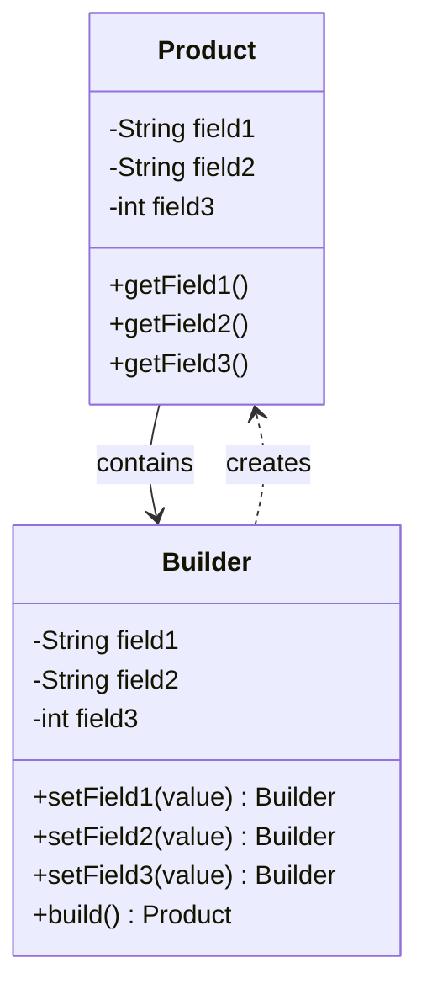

# 建造者模式（Builder Pattern）

## 一、这是什么？

想象你去餐厅点一份定制套餐：

- 主食：米饭 or 面条？
- 配菜：鸡肉 or 牛肉 or 豆腐？
- 辣度：不辣 / 微辣 / 中辣 / 特辣？
- 饮料：可乐 / 果汁 / 不要？
- 甜品：要 or 不要？
- 备注：去香菜、少盐...

如果服务员让你一口气说完所有选项，你可能会说："米饭、鸡肉、微辣、可乐、不要甜品、去香菜少盐"——顺序一乱就容易出错。

更好的方式是：服务员拿着订单本，一项一项问你，你只需要回答每个问题，最后确认下单。

**建造者模式**就是这个道理：**将复杂对象的构造过程分步进行，通过链式调用逐步设置各个属性，最后一次性构建出对象**。

## 二、为什么需要它？

### 问题场景

假设你要创建一个 `HttpRequest` 对象：

```java
public class HttpRequest {
    private String method;      // 请求方法
    private String url;         // 请求地址
    private Map<String, String> headers;  // 请求头
    private String body;        // 请求体
    private int timeout;        // 超时时间
    private boolean followRedirects;  // 是否跟随重定向
    private boolean keepAlive;  // 是否保持连接
    private String charset;     // 字符编码
    
    // 构造函数要传8个参数？
    public HttpRequest(String method, String url, 
                      Map<String, String> headers, String body,
                      int timeout, boolean followRedirects, 
                      boolean keepAlive, String charset) {
        // ...
    }
}
```

**问题1：构造函数参数过多（Telescoping Constructor Problem）**

```java
// 记不住参数顺序，容易传错
HttpRequest request = new HttpRequest(
    "POST", 
    "https://api.example.com", 
    headers, 
    body, 
    3000,    // timeout
    true,    // followRedirects - 这是什么？
    false,   // keepAlive - 这又是什么？
    "UTF-8"
);
```

**问题2：可选参数怎么办？**

如果有些参数是可选的，你可能需要写多个重载构造函数：

```java
public HttpRequest(String method, String url) { ... }
public HttpRequest(String method, String url, Map<String, String> headers) { ... }
public HttpRequest(String method, String url, Map<String, String> headers, String body) { ... }
// 组合爆炸！
```

**问题3：参数校验和默认值**

有些参数有依赖关系，或者需要设置默认值：

```java
// 如果 method 是 GET，body 应该为空
// 如果没指定 timeout，默认 5000ms
// 如果没指定 charset，默认 UTF-8
```

在构造函数里做这些逻辑会很乱。

**问题4：创建不可变对象**

如果你想创建一个不可变对象（没有 setter 方法），构造函数参数会更加臃肿。

### 建造者模式如何解决？

```java
HttpRequest request = new HttpRequest.Builder()
    .method("POST")
    .url("https://api.example.com")
    .header("Content-Type", "application/json")
    .body("{\"name\":\"Alice\"}")
    .timeout(3000)
    .followRedirects(true)
    .build();
```

**优点**：
- 可读性强：每个参数都有明确的名称
- 灵活性高：可选参数想设置就设置，不设置就用默认值
- 易于维护：新增参数不影响已有代码
- 支持不可变对象：所有属性在 `build()` 时一次性设置

## 三、核心思想

### 关键原则

1. **分离构造过程和表示**：Builder 负责构造，Product 负责表示
2. **链式调用**：每个设置方法返回 Builder 自身，支持连续调用
3. **延迟构建**：所有参数设置完成后，调用 `build()` 才真正创建对象
4. **参数校验**：在 `build()` 方法中统一校验参数的有效性

### 核心结构



### 实现方式

**经典方式：静态内部类 Builder**

```java
public class Product {
    // 1. Product 的字段设为 final（不可变）
    private final String field1;
    private final String field2;
    
    // 2. 私有构造函数，只能通过 Builder 创建
    private Product(Builder builder) {
        this.field1 = builder.field1;
        this.field2 = builder.field2;
    }
    
    // 3. 静态内部类 Builder
    public static class Builder {
        private String field1;
        private String field2;
        
        // 4. 链式调用方法
        public Builder field1(String value) {
            this.field1 = value;
            return this;
        }
        
        public Builder field2(String value) {
            this.field2 = value;
            return this;
        }
        
        // 5. build() 方法创建 Product
        public Product build() {
            // 参数校验
            if (field1 == null) {
                throw new IllegalStateException("field1 不能为空");
            }
            return new Product(this);
        }
    }
    
    // getter 方法
    public String getField1() { return field1; }
    public String getField2() { return field2; }
}
```

## 四、代码示例

查看 `demo/` 目录下的完整代码：

### BadExample.java - 不使用 Builder 的问题

演示了使用多参数构造函数的痛点：
- 构造函数参数过多，顺序难记
- 重载构造函数组合爆炸
- 可读性差，维护困难

### GoodExample.java - 使用 Builder 模式

演示了标准的 Builder 模式实现：
- `HttpRequest` 类：不可变对象，字段都是 final
- `HttpRequest.Builder` 内部类：负责构建过程
- 链式调用：`.method().url().body().build()`
- 参数校验：在 `build()` 方法中统一校验
- 默认值：未设置的参数使用合理的默认值

**核心设计**：

1. **Product（HttpRequest）**：
   - 私有构造函数，接收 Builder 参数
   - 所有字段设为 final（不可变）
   - 只提供 getter，不提供 setter

2. **Builder（静态内部类）**：
   - 每个字段对应一个设置方法
   - 设置方法返回 `this`，支持链式调用
   - `build()` 方法：校验参数 + 创建对象

3. **使用方式**：
   ```java
   HttpRequest request = new HttpRequest.Builder()
       .method("POST")
       .url("https://api.example.com")
       .addHeader("Content-Type", "application/json")
       .body("{\"name\":\"Alice\"}")
       .timeout(3000)
       .build();
   ```

### LombokExample.java - 使用 Lombok 简化

演示了使用 `@Builder` 注解自动生成 Builder：
- Lombok 会自动生成 Builder 内部类
- 支持 `@Builder.Default` 设置默认值
- 代码量大幅减少

**运行示例**：

```bash
cd docs/02-design-patterns/03-builder-pattern/demo
javac *.java
java GoodExample
```

预期输出：
```
=== 示例1：构建完整的 HTTP 请求 ===
POST https://api.example.com/users
Headers: {Content-Type=application/json, Authorization=Bearer token123}
Body: {"name":"Alice","age":25}
Timeout: 3000ms

=== 示例2：构建简单的 GET 请求（只设置必需参数）===
GET https://api.example.com/users/123
Headers: {}
Body: null
Timeout: 5000ms
```

## 五、使用场景

### 适合使用 Builder 的场景

1. **构造参数多于 4-5 个**
   - 特别是有多个可选参数时
   - 例如：配置类、HTTP 请求、数据库连接

2. **创建步骤有固定顺序或复杂逻辑**
   - 例如：构建 SQL 查询、生成报表、创建复杂的 UI 组件

3. **需要创建不可变对象**
   - 多线程环境下的共享对象
   - 配置对象（一旦创建就不应该修改）

4. **对象创建过程需要多步参数校验**
   - 参数之间有依赖关系
   - 例如：表单验证、业务规则校验

### 实际应用举例

- **Java 标准库**：
  - `StringBuilder` / `StringBuffer`
  - `Stream.Builder`
  - `HttpClient.Builder`（JDK 11+）

- **流行框架**：
  - Lombok 的 `@Builder` 注解
  - OkHttp 的 `Request.Builder`
  - Retrofit 的 `Retrofit.Builder`
  - Spring 的 `UriComponentsBuilder`

- **常见业务场景**：
  - 构建复杂的查询条件（搜索表单）
  - 构建 API 请求对象
  - 构建邮件/短信消息对象
  - 构建配置文件对象

## 六、注意事项与常见误区

### ⚠️ 误区1：滥用 Builder

**不是所有类都需要 Builder！**

```java
// ❌ 不需要 Builder：参数少且简单
public class Point {
    private final int x;
    private final int y;
    
    // 直接用构造函数就好
    public Point(int x, int y) {
        this.x = x;
        this.y = y;
    }
}
```

**何时不需要 Builder**：
- 参数少于 4 个
- 参数都是必需的（没有可选参数）
- 参数没有复杂的依赖关系

### ⚠️ 误区2：Builder vs 工厂模式傻傻分不清

| 特性 | Builder 模式 | 工厂模式 |
|------|-------------|---------|
| 目的 | **如何**构造复杂对象 | **创建什么**对象 |
| 关注点 | 对象构造过程的细节 | 对象创建的类型选择 |
| 使用场景 | 一个类，参数复杂 | 多个类，根据条件选择 |
| 调用方式 | 链式调用，逐步设置参数 | 一次性传参，返回对象 |

```java
// Builder：关注"如何构造"
HttpRequest request = new HttpRequest.Builder()
    .method("POST")
    .url("https://api.com")
    .build();

// 工厂：关注"创建什么"
Payment payment = PaymentFactory.create("alipay");
```

### ⚠️ 误区3：忘记参数校验

Builder 的 `build()` 方法应该校验参数：

```java
public Product build() {
    // ✅ 校验必需参数
    if (url == null || url.isEmpty()) {
        throw new IllegalStateException("url 不能为空");
    }
    
    // ✅ 校验参数逻辑
    if (timeout < 0) {
        throw new IllegalArgumentException("timeout 不能为负数");
    }
    
    // ✅ 校验参数依赖关系
    if ("GET".equals(method) && body != null) {
        throw new IllegalStateException("GET 请求不能有 body");
    }
    
    return new Product(this);
}
```

### ⚠️ 误区4：Builder 的线程安全问题

Builder 本身**不是线程安全的**！

```java
// ❌ 不要在多线程环境下共享 Builder 实例
HttpRequest.Builder builder = new HttpRequest.Builder();

// 线程1
new Thread(() -> builder.method("GET").build()).start();

// 线程2
new Thread(() -> builder.method("POST").build()).start();
// 结果不可预测！
```

**正确做法**：每个线程创建自己的 Builder 实例。

但是，**Builder 构建出的 Product 可以是不可变的，因此是线程安全的**：

```java
// ✅ Product 是不可变对象，可以在多线程中安全共享
HttpRequest request = new HttpRequest.Builder()
    .method("GET")
    .url("https://api.com")
    .build();

// 多个线程安全地共享这个 request
```

## 七、扩展阅读

### 相关模式

- **工厂模式**：决定创建哪个类的实例（关注"创建什么"）
- **原型模式**：通过克隆创建对象（关注"如何复制"）
- **流式接口**：Builder 模式常用的 API 设计风格

### 进阶话题

- **Director 类**：经典 GOF 设计模式中的 Builder 还包含一个 Director 类，负责定义构建的步骤顺序。现代 Java 开发中很少使用。
- **Lombok @Builder**：简化 Builder 模式的实现，但要注意其局限性（如自定义校验逻辑不方便）
- **构造器模式 vs JavaBeans 模式**：为什么 Builder 优于传统的 setter 模式

### 推荐资源

- 《Effective Java》第 2 条：遇到多个构造器参数时要考虑使用构建器
- 《设计模式：可复用面向对象软件的基础》（GOF）
