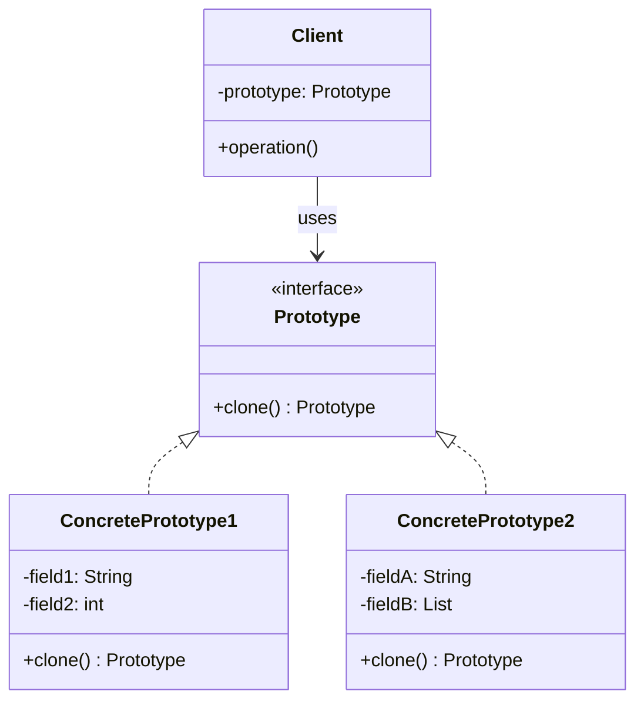
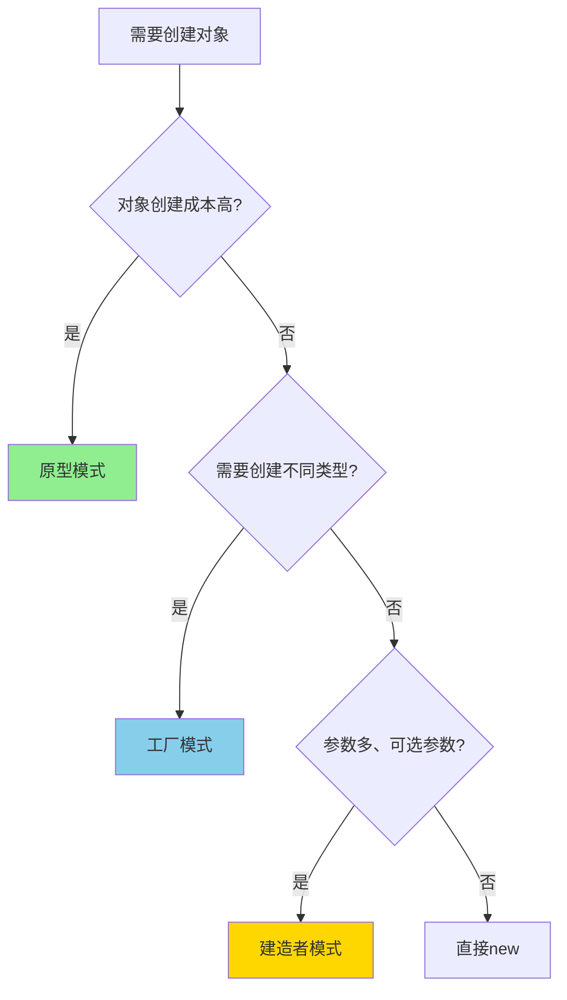

# 原型模式（Prototype Pattern）

> 创建型模式：通过复制现有对象创建新对象

---

## 一、什么是原型模式？

### 生活中的例子：复印文件

想象你需要制作100份相同的宣传单：

**方式1：从头制作**（new创建）
- 打开Word，设置格式
- 输入文字，插入图片
- 调整布局，设置颜色
- 重复100次... 😫

**方式2：复印**（原型模式）
- 制作一份精美的宣传单
- 直接复印99份 ✅
- 快速、省力

**关键区别**：
- 从头制作：每次都要重复所有步骤
- 复印：基于现有对象快速创建副本

这就是原型模式的核心思想：**通过复制（克隆）现有对象来创建新对象，而不是通过new关键字**。

---

## 二、为什么需要原型模式？

### 问题场景1：对象创建成本高

假设有一个复杂的配置对象：

```java
public class DatabaseConfig {
    private String host;
    private int port;
    private List<String> tables;
    private Map<String, String> properties;
    
    public DatabaseConfig() {
        // 从配置文件读取（耗时）
        loadFromConfigFile();
        
        // 从数据库查询表结构（耗时）
        loadTablesFromDatabase();
        
        // 加载大量配置（耗时）
        loadProperties();
    }
}

// 每次创建都要经历耗时的初始化
DatabaseConfig config1 = new DatabaseConfig();  // 耗时1秒
DatabaseConfig config2 = new DatabaseConfig();  // 又耗时1秒
DatabaseConfig config3 = new DatabaseConfig();  // 又耗时1秒
```

**问题**：
- 每次创建都要读取配置文件
- 每次创建都要查询数据库
- 创建100个对象需要100秒！

**使用原型模式**：
```java
// 创建一个原型对象（耗时1秒）
DatabaseConfig prototype = new DatabaseConfig();

// 通过克隆快速创建（几乎不耗时）
DatabaseConfig config1 = prototype.clone();  // 0.001秒
DatabaseConfig config2 = prototype.clone();  // 0.001秒
DatabaseConfig config3 = prototype.clone();  // 0.001秒
```

---

### 问题场景2：需要创建大量相似对象

```java
// 游戏中需要创建100个相似的怪物
for (int i = 0; i < 100; i++) {
    Monster monster = new Monster();
    monster.setType("Goblin");
    monster.setHealth(100);
    monster.setAttack(20);
    monster.setDefense(10);
    monster.setSkills(Arrays.asList("普通攻击", "暴击"));
    // 每次都要设置相同的属性...
}
```

**使用原型模式**：
```java
// 创建一个哥布林原型
Monster goblinPrototype = new Monster();
goblinPrototype.setType("Goblin");
goblinPrototype.setHealth(100);
goblinPrototype.setAttack(20);
goblinPrototype.setDefense(10);
goblinPrototype.setSkills(Arrays.asList("普通攻击", "暴击"));

// 快速克隆100个
for (int i = 0; i < 100; i++) {
    Monster monster = goblinPrototype.clone();
    // 只需微调个别属性
    monster.setPosition(randomPosition());
}
```

---

## 三、原型模式的核心思想

### 定义

原型模式：**用原型实例指定创建对象的种类，并通过复制这些原型创建新的对象**。

### 核心概念

1. **克隆（Clone）**：复制现有对象，而不是new创建
2. **原型（Prototype）**：作为复制模板的对象
3. **浅拷贝 vs 深拷贝**：复制的深度不同

### UML类图



### Java中的实现

Java提供了`Cloneable`接口和`clone()`方法：

```java
public class MyClass implements Cloneable {
    private String name;
    
    @Override
    public MyClass clone() {
        try {
            return (MyClass) super.clone();
        } catch (CloneNotSupportedException e) {
            throw new AssertionError();
        }
    }
}
```

---

## 四、浅拷贝 vs 深拷贝

### 浅拷贝（Shallow Copy）

**定义**：只复制对象本身和基本类型字段，引用类型字段仍然指向原对象的引用。

```java
class Student implements Cloneable {
    private String name;
    private List<String> courses;  // 引用类型
    
    @Override
    public Student clone() {
        try {
            return (Student) super.clone();  // 浅拷贝
        } catch (CloneNotSupportedException e) {
            throw new AssertionError();
        }
    }
}

// 使用
Student original = new Student("Alice", Arrays.asList("Math", "English"));
Student copy = original.clone();

// 修改副本的courses
copy.getCourses().add("Science");

// 问题：原对象也被修改了！
System.out.println(original.getCourses());  // [Math, English, Science]
```

**图示**：

```
原对象                   副本对象
┌─────────┐            ┌─────────┐
│ name    │            │ name    │
│ "Alice" │            │ "Alice" │
├─────────┤            ├─────────┤
│ courses │───┐    ┌───│ courses │
└─────────┘   │    │   └─────────┘
              ↓    ↓
          ┌──────────────┐
          │ List对象      │
          │ [Math, ...]  │
          └──────────────┘
          （共享同一个List）
```

---

### 深拷贝（Deep Copy）

**定义**：复制对象本身和所有引用类型字段，创建完全独立的副本。

```java
class Student implements Cloneable {
    private String name;
    private List<String> courses;
    
    @Override
    public Student clone() {
        try {
            Student cloned = (Student) super.clone();
            // 深拷贝：复制List
            cloned.courses = new ArrayList<>(this.courses);
            return cloned;
        } catch (CloneNotSupportedException e) {
            throw new AssertionError();
        }
    }
}

// 使用
Student original = new Student("Alice", Arrays.asList("Math", "English"));
Student copy = original.clone();

// 修改副本的courses
copy.getCourses().add("Science");

// 原对象不受影响 ✅
System.out.println(original.getCourses());  // [Math, English]
System.out.println(copy.getCourses());      // [Math, English, Science]
```

**图示**：

```
原对象                   副本对象
┌─────────┐            ┌─────────┐
│ name    │            │ name    │
│ "Alice" │            │ "Alice" │
├─────────┤            ├─────────┤
│ courses │───┐        │ courses │───┐
└─────────┘   │        └─────────┘   │
              ↓                      ↓
      ┌──────────────┐      ┌──────────────┐
      │ List对象1     │      │ List对象2     │
      │ [Math, ...]  │      │ [Math, ...]  │
      └──────────────┘      └──────────────┘
      （两个独立的List）
```

---

### 对比表格

| 对比维度 | 浅拷贝 | 深拷贝 |
|---------|--------|--------|
| **基本类型字段** | 复制值 | 复制值 |
| **引用类型字段** | 复制引用（共享） | 复制对象（独立） |
| **独立性** | 不完全独立 | 完全独立 |
| **性能** | 快 | 慢（需要递归复制） |
| **实现难度** | 简单 | 复杂 |
| **使用场景** | 引用字段不会修改 | 引用字段会修改 |

---

## 五、Java中的克隆

### 1. Cloneable接口

```java
public interface Cloneable {
    // 标记接口，无方法
}
```

**作用**：
- 标记类支持克隆
- 如果不实现Cloneable，调用clone()会抛出`CloneNotSupportedException`

---

### 2. 浅拷贝实现

```java
public class Person implements Cloneable {
    private String name;
    private int age;
    private Address address;  // 引用类型
    
    @Override
    public Person clone() {
        try {
            // super.clone()执行浅拷贝
            return (Person) super.clone();
        } catch (CloneNotSupportedException e) {
            throw new AssertionError();
        }
    }
}
```

**问题**：`address`字段被共享！

---

### 3. 深拷贝实现

#### 方式1：手动复制所有字段

```java
public class Person implements Cloneable {
    private String name;
    private int age;
    private Address address;
    
    @Override
    public Person clone() {
        try {
            Person cloned = (Person) super.clone();
            // 手动深拷贝引用字段
            if (this.address != null) {
                cloned.address = this.address.clone();
            }
            return cloned;
        } catch (CloneNotSupportedException e) {
            throw new AssertionError();
        }
    }
}
```

**优点**：性能好，可控  
**缺点**：引用层次深时代码复杂

---

#### 方式2：序列化反序列化

```java
import java.io.*;

public class Person implements Serializable {
    private String name;
    private int age;
    private Address address;
    
    public Person deepClone() {
        try {
            // 序列化
            ByteArrayOutputStream bos = new ByteArrayOutputStream();
            ObjectOutputStream oos = new ObjectOutputStream(bos);
            oos.writeObject(this);
            
            // 反序列化
            ByteArrayInputStream bis = new ByteArrayInputStream(bos.toByteArray());
            ObjectInputStream ois = new ObjectInputStream(bis);
            return (Person) ois.readObject();
        } catch (Exception e) {
            throw new RuntimeException(e);
        }
    }
}
```

**优点**：自动深拷贝所有字段  
**缺点**：性能差，所有类必须实现Serializable

---

#### 方式3：拷贝构造函数

```java
public class Person {
    private String name;
    private int age;
    private Address address;
    
    // 拷贝构造函数
    public Person(Person other) {
        this.name = other.name;
        this.age = other.age;
        // 深拷贝address
        this.address = new Address(other.address);
    }
}

// 使用
Person original = new Person("Alice", 25, address);
Person copy = new Person(original);
```

**优点**：清晰、可控  
**缺点**：需要手动编写

---

## 六、原型注册表（Prototype Registry）

### 概念

原型注册表：**管理多个原型对象的容器，客户端通过key获取克隆对象**。

### 实现

```java
public class PrototypeRegistry {
    private Map<String, Prototype> prototypes = new HashMap<>();
    
    // 注册原型
    public void register(String key, Prototype prototype) {
        prototypes.put(key, prototype);
    }
    
    // 获取克隆对象
    public Prototype getPrototype(String key) {
        Prototype prototype = prototypes.get(key);
        if (prototype == null) {
            throw new IllegalArgumentException("原型不存在: " + key);
        }
        return prototype.clone();
    }
}

// 使用
PrototypeRegistry registry = new PrototypeRegistry();
registry.register("warrior", new Warrior());
registry.register("mage", new Mage());

// 获取克隆对象
Character warrior1 = (Character) registry.getPrototype("warrior");
Character warrior2 = (Character) registry.getPrototype("warrior");
```

---

## 七、代码示例讲解

详见 `demo/` 目录：

1. **ShallowCopyDemo.java** - 浅拷贝问题演示
   - 场景：学生选课系统
   - 演示：浅拷贝导致的数据共享问题

2. **DeepCopyDemo.java** - 深拷贝的三种实现
   - 场景：文档编辑器
   - 演示：手动复制、序列化、拷贝构造函数

3. **PrototypeRegistryDemo.java** - 原型注册表
   - 场景：游戏角色系统
   - 演示：管理多个原型，快速克隆

---

## 八、使用场景

### 场景1：对象创建成本高

**适用条件**：
- 对象初始化需要大量资源（数据库查询、文件读取）
- 创建过程复杂（多步骤初始化）

**典型案例**：
- 数据库配置对象
- 复杂的业务对象
- 大型数据结构

---

### 场景2：需要创建大量相似对象

**适用条件**：
- 需要创建多个相似对象
- 只有少数属性不同

**典型案例**：
- 游戏中的NPC、怪物
- 批量生成报表
- 测试数据生成

---

### 场景3：避免子类爆炸

**问题**：如果用工厂模式，每种配置需要一个子类

```java
// 工厂模式：需要大量子类
class LowConfigComputer extends Computer { }
class MediumConfigComputer extends Computer { }
class HighConfigComputer extends Computer { }
class GamingComputer extends Computer { }
// ... 100种配置 = 100个子类
```

**原型模式**：只需几个原型对象

```java
// 原型模式：几个原型即可
Computer lowConfig = new Computer("Low");
Computer mediumConfig = new Computer("Medium");
Computer highConfig = new Computer("High");

// 克隆并微调
Computer custom = lowConfig.clone();
custom.setMemory(16);  // 只修改内存
```

---

## 九、原型模式 vs 其他创建型模式

### vs 工厂模式

| 对比 | 原型模式 | 工厂模式 |
|-----|---------|---------|
| **创建方式** | 复制现有对象 | new创建新对象 |
| **关注点** | 如何复制 | 创建哪个类型 |
| **适用场景** | 对象创建成本高 | 类型选择 |
| **性能** | 快（复制） | 慢（初始化） |

**形象比喻**：
- 工厂模式：定制蛋糕（从头制作）
- 原型模式：复印文件（快速复制）

---

### vs 建造者模式

| 对比 | 原型模式 | 建造者模式 |
|-----|---------|-----------|
| **创建方式** | 克隆 | 逐步构建 |
| **关注点** | 复制效率 | 构建过程 |
| **适用场景** | 创建成本高 | 参数多、可选参数 |

---

### 选择决策



---

## 十、注意事项与常见误区

### 误区1：clone()总是深拷贝

❌ **错误理解**：
```java
Person copy = original.clone();  // 一定是深拷贝？
```

✅ **正确理解**：
- `Object.clone()`默认是**浅拷贝**
- 深拷贝需要手动实现

---

### 误区2：忽略浅拷贝的风险

```java
// ❌ 危险：浅拷贝共享引用
List<String> list1 = new ArrayList<>(Arrays.asList("A", "B"));
List<String> list2 = list1;  // 不是克隆，是引用
list2.add("C");
// list1也变成了[A, B, C]

// ✅ 正确：深拷贝
List<String> list2 = new ArrayList<>(list1);
```

---

### 误区3：过度使用序列化深拷贝

```java
// ❌ 性能问题：序列化很慢
Person copy = person.deepCloneBySerialize();
```

**序列化深拷贝的缺点**：
- 性能差（比手动复制慢10-100倍）
- 所有类必须实现Serializable
- 无法处理transient字段

**建议**：
- 简单对象：手动复制
- 复杂对象：拷贝构造函数
- 性能要求高：避免序列化

---

### 误区4：clone()与构造函数

```java
// clone()不调用构造函数
Person copy = original.clone();  // 不会调用Person()

// new会调用构造函数
Person person = new Person();  // 调用Person()
```

**影响**：
- 构造函数中的初始化逻辑不会执行
- 需要在clone()中手动处理

---

## 十一、实战应用

### 1. Object.clone()

Java所有对象的父类`Object`提供了clone()方法：

```java
protected native Object clone() throws CloneNotSupportedException;
```

---

### 2. Spring的Bean作用域

```java
@Component
@Scope("prototype")  // 原型作用域
public class MyBean {
    // 每次getBean()返回新实例
}

// 使用
MyBean bean1 = context.getBean(MyBean.class);
MyBean bean2 = context.getBean(MyBean.class);
// bean1 != bean2 (不同实例)
```

**对比**：
- **singleton**：单例，共享一个实例
- **prototype**：原型，每次创建新实例

---

### 3. 缓存优化

```java
// 缓存原型对象
Map<String, ComplexObject> cache = new HashMap<>();

public ComplexObject getObject(String key) {
    ComplexObject prototype = cache.get(key);
    if (prototype == null) {
        // 首次创建（耗时）
        prototype = createComplexObject(key);
        cache.put(key, prototype);
    }
    // 克隆返回（快速）
    return prototype.clone();
}
```

---

## 十二、小结

### 核心要点

1. **原型模式**：
   - 通过复制现有对象创建新对象
   - 避免重复的初始化逻辑
   - 适合对象创建成本高的场景

2. **浅拷贝 vs 深拷贝**：
   - 浅拷贝：引用类型字段共享
   - 深拷贝：完全独立的副本
   - 根据需求选择

3. **实现方式**：
   - Cloneable接口 + clone()方法
   - 手动复制（推荐）
   - 序列化（性能差）
   - 拷贝构造函数（清晰）

4. **原型注册表**：
   - 管理多个原型对象
   - 通过key获取克隆对象

### 记忆口诀

> **创建成本高又高，**  
> **原型克隆效率好，**  
> **浅拷贝要小心，**  
> **深拷贝更可靠。**

### 使用原则

**适合原型模式**：
- ✅ 对象创建成本高
- ✅ 需要大量相似对象
- ✅ 避免子类爆炸

**不适合原型模式**：
- ❌ 对象创建成本低
- ❌ 对象差异大
- ❌ 克隆逻辑复杂

---

## 十三、扩展阅读

### 相关模式

- **工厂模式**：通过new创建对象
- **建造者模式**：逐步构建复杂对象
- **单例模式**：控制实例数量为1

### 进阶思考

1. 原型模式在多线程环境下的安全性？
2. 如何实现循环引用对象的深拷贝？
3. 原型模式与享元模式的结合？

---

**下一步**：
1. 运行 `demo/` 中的完整代码
2. 完成 `test_01.md` 自测题
3. 填写 `note_template.md` 学习笔记
4. **恭喜完成所有创建型模式！** 接下来学习**结构型模式**
