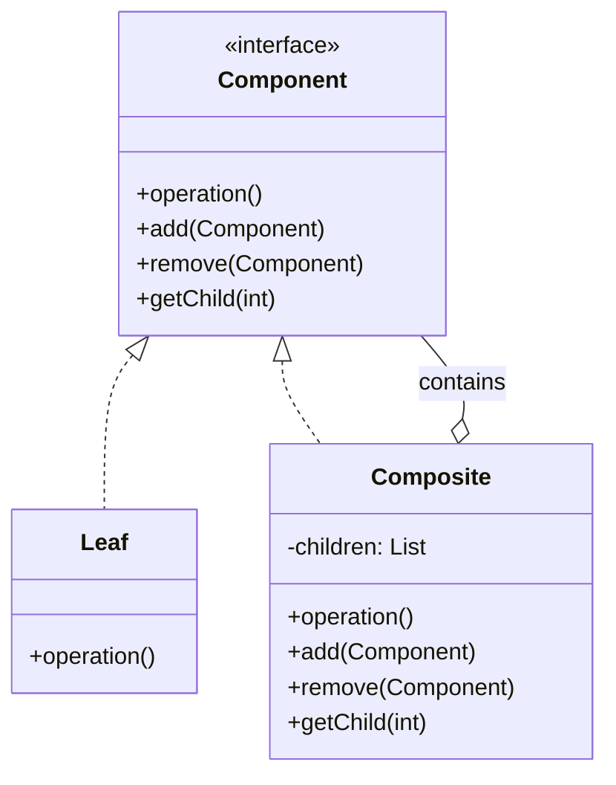

# 组合模式（Composite Pattern）

> 将对象组合成树形结构以表示"部分-整体"的层次结构，使客户端对单个对象和组合对象的使用具有一致性。

---

## 一、什么是组合模式？

### 生活类比1：文件夹与文件

想象你的电脑文件系统：

```
📁 我的文档/
  ├── 📄 简历.docx
  ├── 📁 照片/
  │   ├── 📄 旅行.jpg
  │   └── 📄 生活.jpg
  └── 📁 工作/
      ├── 📄 报告.pdf
      └── 📁 项目A/
          └── 📄 需求文档.docx
```

**关键观察**：
- **文件夹**可以包含**文件**或**子文件夹**
- 无论是文件还是文件夹，都可以被"显示"、"删除"、"移动"
- 客户端不需要关心操作的是文件还是文件夹

这就是组合模式的核心思想！

---

### 生活类比2：公司组织架构

```
👔 公司
  ├── 👨‍💼 CEO
  ├── 🏢 技术部
  │   ├── 👨‍💻 工程师A
  │   ├── 👩‍💻 工程师B
  │   └── 🏢 前端组
  │       ├── 👨‍💻 前端工程师1
  │       └── 👩‍💻 前端工程师2
  └── 🏢 市场部
      ├── 👨‍💼 市场专员A
      └── 👩‍💼 市场专员B
```

**关键特征**：
- **部门**可以包含**员工**或**子部门**
- 部门和员工都有"打印信息"、"计算薪资"等操作
- 树形层次结构

---

## 二、为什么需要组合模式？

### 痛点场景

假设我们要实现文件系统，不使用组合模式：

```java
// ❌ 不好的设计
class File {
    void display() { /* ... */ }
}

class Folder {
    List<File> files;
    List<Folder> subFolders;  // 两个集合！
    
    void display() {
        // 需要分别处理文件和文件夹
        for (File f : files) {
            f.display();
        }
        for (Folder folder : subFolders) {
            folder.display();
        }
    }
}
```

**问题**：
1. ❌ **客户端需要区分文件和文件夹**（两种类型）
2. ❌ **代码重复**（display逻辑需要分别处理）
3. ❌ **扩展困难**（新增"快捷方式"类型需要修改很多地方）
4. ❌ **不统一**（File和Folder没有共同接口）

---

### 组合模式的解决方案

```java
// ✅ 好的设计
interface FileSystemNode {
    void display();  // 统一接口
}

class File implements FileSystemNode {
    void display() { /* ... */ }
}

class Folder implements FileSystemNode {
    List<FileSystemNode> children;  // 统一集合！
    
    void display() {
        for (FileSystemNode node : children) {
            node.display();  // 统一处理
        }
    }
}
```

**优势**：
1. ✅ **统一接口**（FileSystemNode）
2. ✅ **客户端无需区分**叶子节点（File）和容器节点（Folder）
3. ✅ **递归组合**（Folder可以包含Folder）
4. ✅ **易于扩展**（新增类型只需实现接口）

---

## 三、核心思想

### UML类图



### 三个角色

#### 1. Component（抽象构件）
- 定义统一接口
- 声明公共操作（operation）
- 可以包含add/remove/getChild（透明模式）

#### 2. Leaf（叶子节点）
- 实现Component接口
- 没有子节点
- 具体实现operation

#### 3. Composite（容器节点）
- 实现Component接口
- 包含子节点（children集合）
- 实现add/remove/getChild
- operation通常会递归调用子节点的operation

---

### 核心机制

```java
// 递归组合的核心
class Composite implements Component {
    private List<Component> children = new ArrayList<>();
    
    public void operation() {
        // 1. 容器自己的操作
        System.out.println("容器节点操作");
        
        // 2. 递归调用子节点
        for (Component child : children) {
            child.operation();  // 关键：统一调用
        }
    }
}
```

**关键点**：
- 客户端只看到`Component`接口
- 叶子节点直接执行操作
- 容器节点递归调用子节点
- **树形结构**的自然表达

---

## 四、代码示例

请查看 `demo/` 目录下的完整代码：

### 示例1：文件系统（FileSystemDemo.java）

**设计**：
```
Component: FileSystemNode
  ├── Leaf: File（文件）
  └── Composite: Folder（文件夹）
```

**核心代码**：
```java
// 统一接口
interface FileSystemNode {
    void display(String indent);
}

// 叶子：文件
class File implements FileSystemNode {
    private String name;
    
    public void display(String indent) {
        System.out.println(indent + "📄 " + name);
    }
}

// 容器：文件夹
class Folder implements FileSystemNode {
    private String name;
    private List<FileSystemNode> children = new ArrayList<>();
    
    public void add(FileSystemNode node) {
        children.add(node);
    }
    
    public void display(String indent) {
        System.out.println(indent + "📁 " + name + "/");
        for (FileSystemNode child : children) {
            child.display(indent + "  ");  // 递归
        }
    }
}
```

**使用**：
```java
// 构建树形结构
Folder root = new Folder("我的文档");
root.add(new File("简历.docx"));

Folder photos = new Folder("照片");
photos.add(new File("旅行.jpg"));
root.add(photos);

// 统一显示
root.display("");  // 客户端无需区分文件和文件夹
```

---

### 示例2：公司组织架构（CompanyStructureDemo.java）

**设计**：
```
Component: OrganizationComponent
  ├── Leaf: Employee（员工）
  └── Composite: Department（部门）
```

**特点**：
- 计算总薪资（递归求和）
- 打印组织架构（递归显示）

---

## 五、使用场景

### ✅ 适合使用组合模式的场景

1. **树形结构**
   - 文件系统
   - GUI组件树（Swing: Container和Component）
   - XML/JSON文档结构
   - 菜单系统

2. **部分-整体关系**
   - 公司组织架构
   - 商品分类（类目树）
   - 地区层级（国家→省→市→区）

3. **希望统一处理单个对象和组合对象**
   - 客户端不想区分叶子和容器
   - 需要递归处理树形结构

---

### ❌ 不适合的场景

1. **只有单层结构**（没有递归）
2. **对象之间没有"包含"关系**
3. **叶子节点和容器节点差异很大**（无法统一接口）

---

## 六、透明模式 vs 安全模式

组合模式有两种实现方式：

### 方式1：透明模式（Transparent）

```java
interface Component {
    void operation();
    void add(Component c);      // 所有节点都有
    void remove(Component c);
    Component getChild(int i);
}

class Leaf implements Component {
    public void operation() { /* ... */ }
    
    // ❌ 叶子节点没有子节点，但必须实现
    public void add(Component c) {
        throw new UnsupportedOperationException();
    }
    public void remove(Component c) {
        throw new UnsupportedOperationException();
    }
    public Component getChild(int i) {
        throw new UnsupportedOperationException();
    }
}
```

**优点**：
- ✅ **透明性**：客户端可以统一对待所有节点

**缺点**：
- ❌ **不安全**：叶子节点调用add会运行时异常

---

### 方式2：安全模式（Safe）

```java
interface Component {
    void operation();  // 只有公共操作
}

class Leaf implements Component {
    public void operation() { /* ... */ }
    // 没有add/remove
}

class Composite implements Component {
    public void operation() { /* ... */ }
    public void add(Component c) { /* ... */ }      // 只有容器有
    public void remove(Component c) { /* ... */ }
    public Component getChild(int i) { /* ... */ }
}
```

**优点**：
- ✅ **类型安全**：编译时就知道叶子节点没有add

**缺点**：
- ❌ **失去透明性**：客户端需要区分叶子和容器

---

### 如何选择？

| 需求 | 推荐方式 |
|-----|---------|
| 客户端需要统一处理所有节点 | 透明模式 |
| 强调类型安全，避免运行时错误 | 安全模式 |
| 树形结构简单，不常调用add/remove | 安全模式 |
| 树形结构复杂，需要动态构建 | 透明模式 |

**Java的选择**：
- **AWT/Swing**：使用透明模式（Component接口包含add）
- **本示例**：使用安全模式（更符合Java实践）

---

## 七、组合模式 vs 装饰器模式

两者都使用"包含"关系，但目的不同：

| 对比 | 组合模式 | 装饰器模式 |
|-----|---------|-----------|
| **目的** | 表示部分-整体层次结构 | 动态增强对象功能 |
| **结构** | 树形结构（一对多） | 链式结构（一对一） |
| **关系** | "包含"（容器包含多个子节点） | "装饰"（装饰器包装一个对象） |
| **操作** | 递归处理所有子节点 | 增强单个对象 |
| **例子** | 文件夹包含文件 | 咖啡加奶加糖 |

**形象类比**：
- **组合**：一个文件夹可以包含多个文件和子文件夹（树形）
- **装饰器**：一杯咖啡只能被一个装饰器包装，然后被另一个装饰器包装（链式）

---

## 八、注意事项与常见误区

### 1. 避免循环引用

```java
// ❌ 错误示例
Folder a = new Folder("A");
Folder b = new Folder("B");
a.add(b);
b.add(a);  // 循环！
```

**解决方案**：
- 在add方法中检测循环
- 使用有向无环图（DAG）
- 设计时避免这种情况

---

### 2. 性能考虑

递归遍历大树可能影响性能：

```java
// 对于深度很大的树
root.display("");  // 递归深度过大

// 优化：使用迭代 + 栈
void displayIterative() {
    Stack<Node> stack = new Stack<>();
    stack.push(root);
    
    while (!stack.isEmpty()) {
        Node node = stack.pop();
        // 处理节点
    }
}
```

---

### 3. 不要滥用

**误区**：所有包含关系都用组合模式

**正确做法**：
- 只有"部分-整体"且需要**统一接口**时才用
- 简单的包含关系直接用List即可

---

## 九、真实应用案例

### 1. Java AWT/Swing

```java
// Component是抽象构件
java.awt.Component
  ├── Button (叶子)
  ├── Label (叶子)
  └── Container (容器)
      ├── Panel
      ├── Frame
      └── JPanel

// 统一的paint方法
Container container = new JPanel();
container.add(new JButton("按钮"));
container.add(new JLabel("标签"));
container.paint(g);  // 递归绘制所有子组件
```

---

### 2. 文件系统

所有操作系统的文件系统都是组合模式：
- 文件夹（Composite）
- 文件（Leaf）
- 统一接口：创建、删除、移动、重命名

---

### 3. XML/JSON解析

```json
{
  "name": "root",
  "children": [
    {"name": "leaf1"},
    {
      "name": "node2",
      "children": [
        {"name": "leaf2"}
      ]
    }
  ]
}
```

解析时用组合模式表示：
- JsonObject（容器）
- JsonValue（叶子）

---

## 十、总结

### 组合模式的本质

> **将对象组合成树形结构，统一处理单个对象和组合对象。**

### 核心要点

1. **部分-整体层次结构**（树形）
2. **统一接口**（Component）
3. **递归组合**（容器可以包含容器）
4. **客户端透明**（无需区分叶子和容器）

### 记忆口诀

> **树形结构要统一，**  
> **组合模式来帮你，**  
> **部分整体一个样，**  
> **文件夹中有乾坤。**

---

### 何时使用组合模式？

✅ **使用组合模式**：
- 需要表示"部分-整体"的层次结构
- 希望客户端统一处理单个对象和组合对象
- 对象之间有明显的递归包含关系

❌ **不使用组合模式**：
- 只有单层结构（没有递归）
- 叶子节点和容器节点差异很大
- 简单的包含关系（直接用List即可）

---

**学习建议**：
1. 运行 `demo/` 中的代码示例
2. 对比文件系统和公司架构两个场景
3. 理解"统一接口"的价值
4. 完成自测题
5. 填写笔记模板

**下一步**：继续学习**享元模式**（Flyweight Pattern）
