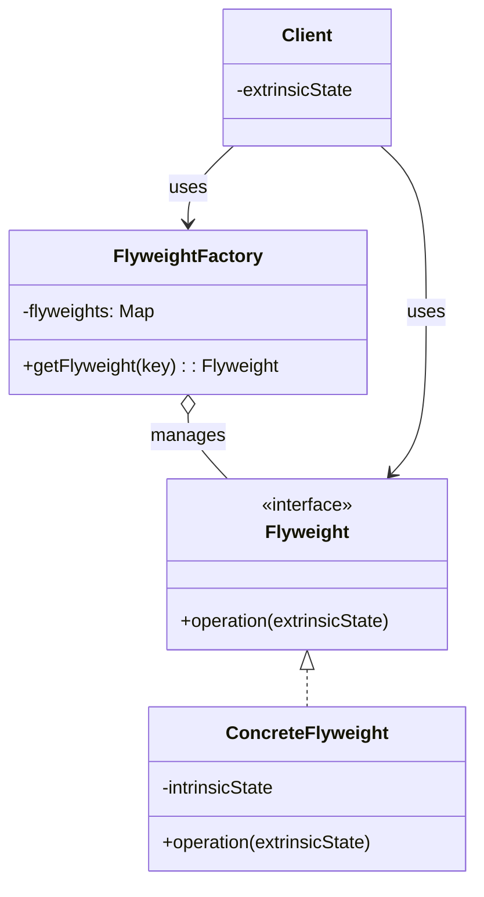

# 享元模式（Flyweight Pattern）

> 运用共享技术有效地支持大量细粒度对象的复用，减少内存占用。

---

## 一、什么是享元模式？

### 生活类比1：围棋棋子

想象一盘围棋：

```
  A B C D E F G H
1 ○ ● ○ · · · · ·
2 ● ○ ● · · · · ·
3 ○ ● ○ · · · · ·
4 · · · · · · · ·
```

**关键观察**：
- 棋盘上可能有100颗棋子
- 但实际上只有**黑色**和**白色**两种
- 每颗棋子的**颜色**是相同的，只有**位置**不同

**如果每颗棋子都创建新对象**：
```java
// ❌ 不好的设计
ChessPiece piece1 = new ChessPiece("黑色", 1, 1);
ChessPiece piece2 = new ChessPiece("黑色", 2, 2);
ChessPiece piece3 = new ChessPiece("黑色", 3, 3);
// 100颗棋子 = 100个对象
```

**使用享元模式**：
```java
// ✅ 好的设计
ChessPiece blackPiece = factory.getChessPiece("黑色");  // 共享
blackPiece.place(1, 1);
blackPiece.place(2, 2);
blackPiece.place(3, 3);
// 100颗棋子 = 2个对象（黑+白）
```

---

### 生活类比2：字符串池

```java
String s1 = "hello";
String s2 = "hello";
String s3 = "hello";

System.out.println(s1 == s2);  // true（共享同一个对象）
```

Java的String Pool就是享元模式！

---

### "享元"是什么意思？

**享元** = **共享元素**

- **享**：共享
- **元**：元素、对象
- **目的**：通过共享减少对象数量

---

## 二、为什么需要享元模式？

### 痛点场景

假设我们要开发一个文本编辑器，需要显示100万个字符：

```java
// ❌ 不使用享元模式
class Character {
    private char value;      // 字符内容
    private String font;     // 字体
    private int size;        // 大小
    private String color;    // 颜色
}

// 100万个字符 = 100万个对象
// 假设每个对象占100字节
// 总内存 = 100万 × 100字节 = 95MB
```

**问题**：
1. ❌ **内存爆炸**：大量对象占用大量内存
2. ❌ **创建开销**：频繁创建对象影响性能
3. ❌ **GC压力**：垃圾回收压力大

---

### 享元模式的解决方案

**观察**：100万个字符中，**字体、大小、颜色**的组合可能只有几十种！

```java
// ✅ 使用享元模式
class CharacterStyle {      // 享元对象（共享）
    private String font;
    private int size;
    private String color;
}

class Character {
    private char value;              // 外部状态（每个字符不同）
    private CharacterStyle style;    // 内部状态（共享）
}

// 100万个字符 = 100万个Character对象 + 50个CharacterStyle对象
// 内存占用大幅减少
```

**优势**：
1. ✅ **内存优化**：共享对象减少内存占用
2. ✅ **性能提升**：减少对象创建开销
3. ✅ **GC友好**：减少GC压力

---

## 三、核心思想

### 内部状态 vs 外部状态

享元模式的核心是**区分内部状态和外部状态**：

| 状态类型 | 内部状态（Intrinsic State） | 外部状态（Extrinsic State） |
|---------|---------------------------|---------------------------|
| **定义** | 存储在享元对象内部，可共享 | 由客户端维护，不可共享 |
| **特征** | 不会随环境改变 | 随环境改变 |
| **例子** | 围棋：颜色 | 围棋：位置 |
| **例子** | 文本：字体样式 | 文本：字符内容、位置 |

---

### UML类图



---

### 三个角色

#### 1. Flyweight（抽象享元）
```java
interface ChessPiece {
    void place(int x, int y);  // 外部状态作为参数传入
}
```

#### 2. ConcreteFlyweight（具体享元）
```java
class ConcreteChessPiece implements ChessPiece {
    private String color;  // 内部状态（共享）
    
    public ConcreteChessPiece(String color) {
        this.color = color;
    }
    
    public void place(int x, int y) {  // 外部状态
        System.out.println(color + "棋子放在(" + x + "," + y + ")");
    }
}
```

#### 3. FlyweightFactory（享元工厂）
```java
class ChessPieceFactory {
    private Map<String, ChessPiece> pieces = new HashMap<>();
    
    public ChessPiece getChessPiece(String color) {
        if (!pieces.containsKey(color)) {
            pieces.put(color, new ConcreteChessPiece(color));
            System.out.println("创建" + color + "棋子");
        }
        return pieces.get(color);  // 返回共享对象
    }
}
```

---

## 四、代码示例

请查看 `demo/` 目录下的完整代码：

### 示例1：围棋棋子（ChessPieceDemo.java）

**设计**：
```
内部状态：颜色（黑、白）
外部状态：位置（x, y）
```

**核心代码**：
```java
// 享元工厂
ChessPieceFactory factory = new ChessPieceFactory();

// 获取共享对象
ChessPiece black = factory.getChessPiece("黑色");
ChessPiece white = factory.getChessPiece("白色");

// 使用共享对象（传入外部状态）
black.place(1, 1);
black.place(2, 2);  // 同一个对象
white.place(1, 2);
```

**效果**：
- 100颗棋子只需要2个对象
- 内存占用从100个对象降到2个对象

---

### 示例2：文本编辑器（TextEditorDemo.java）

**设计**：
```
内部状态：字体、大小、颜色（样式）
外部状态：字符内容、位置
```

**效果**：
- 1000个字符可能只有10种样式
- 内存占用大幅减少

---

## 五、内部状态 vs 外部状态

### 如何区分？

**判断标准**：

| 问题 | 内部状态 | 外部状态 |
|-----|---------|---------|
| 是否可以共享？ | ✅ 可以 | ❌ 不可以 |
| 是否随环境变化？ | ❌ 不变 | ✅ 会变 |
| 存储在哪里？ | 享元对象内部 | 客户端 |

---

### 示例分析

**场景1：围棋**
```
内部状态：颜色（黑/白）
  - 不变：黑棋永远是黑色
  - 可共享：所有黑棋共享同一个对象

外部状态：位置（x, y）
  - 会变：每颗棋子位置不同
  - 不可共享：每次落子位置不同
```

**场景2：游戏中的树木**
```
内部状态：树木模型、纹理
  - 不变：所有橡树使用同一个3D模型
  - 可共享：共享模型数据

外部状态：位置、大小、旋转角度
  - 会变：每棵树的位置和大小不同
  - 不可共享：每棵树独立的坐标
```

---

### 设计原则

**核心原则**：
> **将可变部分和不可变部分分离，共享不可变部分。**

**步骤**：
1. 识别对象的所有属性
2. 区分哪些属性是不变的（内部状态）
3. 区分哪些属性是可变的（外部状态）
4. 将内部状态提取为享元对象
5. 外部状态作为方法参数传入

---

## 六、使用场景

### ✅ 适合使用享元模式的场景

1. **大量相似对象**
   - 需要创建大量对象
   - 对象的大部分状态可以外部化

2. **内存敏感**
   - 内存有限
   - 需要优化内存占用

3. **对象创建开销大**
   - 对象创建消耗资源
   - 需要提高性能

**典型场景**：
- 文本编辑器（字符样式）
- 游戏开发（树木、子弹、粒子效果）
- 围棋/象棋程序（棋子）
- 图形绘制（图形对象）

---

### ❌ 不适合的场景

1. **对象状态完全不同**
   - 无法提取共享部分
   
2. **对象数量少**
   - 没有优化必要

3. **外部状态管理复杂**
   - 外部状态太多，管理困难

---

## 七、享元模式 vs 单例模式 vs 对象池

三者都涉及对象复用，但目的不同：

| 对比 | 单例模式 | 享元模式 | 对象池 |
|-----|---------|---------|--------|
| **实例数量** | 1个 | 多个（按内部状态区分） | 多个 |
| **目的** | 确保全局唯一 | 减少内存占用 | 减少创建销毁开销 |
| **共享方式** | 全局共享 | 按内部状态共享 | 循环使用 |
| **状态** | 全局状态 | 内部状态+外部状态 | 重置状态 |
| **例子** | 配置管理器 | 字符串池 | 数据库连接池 |

---

### 单例模式

```java
// 一个类只有一个实例
ConfigManager config = ConfigManager.getInstance();
```

---

### 享元模式

```java
// 一个类可以有多个共享实例（按内部状态区分）
ChessPiece black = factory.getChessPiece("黑色");
ChessPiece white = factory.getChessPiece("白色");
// 黑色棋子共享，白色棋子共享
```

---

### 对象池

```java
// 从池中获取对象，使用完归还
Connection conn = pool.getConnection();
// ... 使用
pool.returnConnection(conn);  // 归还到池中
```

**关键区别**：
- **单例**：强调**唯一性**
- **享元**：强调**共享性**（减少内存）
- **对象池**：强调**重用性**（减少创建开销）

---

## 八、注意事项与常见误区

### 1. 线程安全

享元工厂需要考虑线程安全：

```java
// ✅ 线程安全的享元工厂
class ChessPieceFactory {
    private final Map<String, ChessPiece> pieces = new ConcurrentHashMap<>();
    
    public ChessPiece getChessPiece(String color) {
        return pieces.computeIfAbsent(color, ConcreteChessPiece::new);
    }
}
```

---

### 2. 外部状态管理

外部状态由客户端维护，需要注意：

```java
// ❌ 错误：将外部状态存储在享元对象内部
class ChessPiece {
    private String color;  // 内部状态
    private int x, y;      // ❌ 外部状态不应该在这里
}

// ✅ 正确：外部状态作为参数传入
class ChessPiece {
    private String color;  // 内部状态
    
    public void place(int x, int y) {  // 外部状态
        // ...
    }
}
```

---

### 3. 不要过度使用

**误区**：所有对象都用享元模式

**正确做法**：
- 只在有大量相似对象时使用
- 权衡复杂度和收益

---

### 4. 享元对象应该是不可变的

```java
// ✅ 好的设计：享元对象不可变
class CharacterStyle {
    private final String font;
    private final int size;
    private final String color;
    
    // 只有构造函数，没有setter
}
```

---

## 九、真实应用案例

### 1. Java String Pool

```java
String s1 = "hello";
String s2 = "hello";
String s3 = new String("hello");

System.out.println(s1 == s2);       // true（共享）
System.out.println(s1 == s3);       // false（不共享）
System.out.println(s1 == s3.intern());  // true（强制共享）
```

**工作原理**：
- 字符串字面量自动放入String Pool
- 相同内容的字符串共享同一个对象
- `intern()`方法强制加入池中

---

### 2. Integer缓存（-128 ~ 127）

```java
Integer a = 100;
Integer b = 100;
Integer c = 200;
Integer d = 200;

System.out.println(a == b);  // true（缓存范围内，共享）
System.out.println(c == d);  // false（超出缓存范围）
```

**源码**：
```java
public static Integer valueOf(int i) {
    if (i >= IntegerCache.low && i <= IntegerCache.high)
        return IntegerCache.cache[i + (-IntegerCache.low)];  // 共享
    return new Integer(i);  // 不共享
}
```

---

### 3. 数据库连接池

虽然主要是对象池，但也有享元思想：

```java
// 连接配置（内部状态）是共享的
ConnectionPool pool = new ConnectionPool(url, username, password);

// 连接（外部状态）从池中获取
Connection conn1 = pool.getConnection();
Connection conn2 = pool.getConnection();
```

---

### 4. 游戏开发

**场景：森林渲染**

```java
// 内部状态：树木模型（共享）
class TreeModel {
    private Mesh mesh;
    private Texture texture;
}

// 外部状态：位置、大小
class Tree {
    private TreeModel model;  // 共享
    private Vector3 position;
    private float scale;
}

// 10000棵树，只需要5种模型
```

---

## 十、总结

### 享元模式的本质

> **运用共享技术有效支持大量细粒度对象的复用。**

### 核心要点

1. **内部状态 vs 外部状态**（核心概念）
2. **享元工厂**（管理共享对象池）
3. **减少内存占用**（主要目的）
4. **共享不可变部分**（设计原则）

### 记忆口诀

> **大量对象内存爆，**  
> **享元模式来减少，**  
> **内部共享外部传，**  
> **棋子字符都适用。**

---

### 何时使用享元模式？

✅ **使用享元模式**：
- 需要创建大量相似对象
- 对象的大部分状态可以外部化
- 内存敏感，需要优化

❌ **不使用享元模式**：
- 对象数量少
- 对象状态完全不同
- 外部状态管理复杂

---

**学习建议**：
1. 运行 `demo/` 中的代码示例
2. 理解内部状态 vs 外部状态的区分
3. 对比享元模式、单例模式、对象池
4. 分析String Pool的享元实现
5. 完成自测题
6. 填写笔记模板

**恭喜！** 完成享元模式后，你就掌握了全部7种结构型模式！🎉
