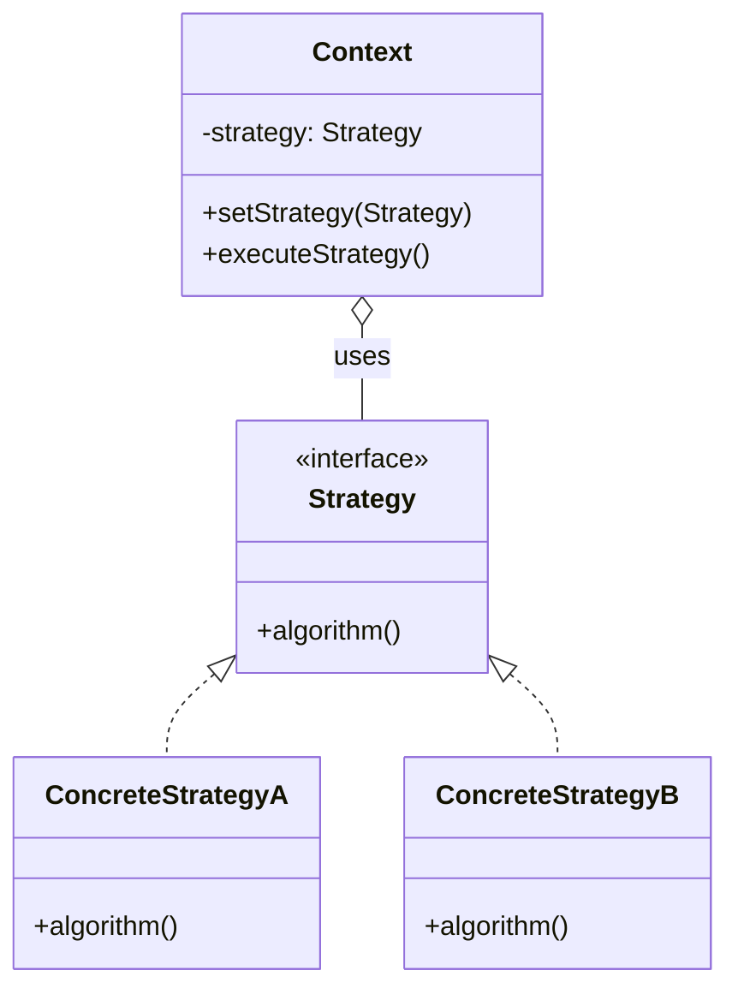

# 策略模式（Strategy Pattern）

> 定义一系列算法，把它们封装起来，并使它们可以相互替换。策略模式让算法独立于使用它的客户端而变化。

---

## 一、什么是策略模式？

### 生活类比1：支付方式

想象你在超市结账：

```
收银员："您好，一共158元，请问怎么支付？"

你可以选择：
- 💰 现金支付
- 📱 支付宝
- 💳 微信支付
- 💳 信用卡
```

**关键观察**：
- 无论哪种支付方式，**结账的流程是一样的**
- 只是**具体的支付算法不同**
- 你可以**随时切换**支付方式

这就是策略模式！

---

### 生活类比2：出行方式

```
从家到公司，你有多种选择：

🚗 开车：快速但堵车
🚇 地铁：稳定但拥挤
🚴 骑车：环保但费力
🚶 步行：健康但慢
```

**特点**：
- 目标相同（到达公司）
- 算法不同（交通工具）
- 可以根据情况选择（天气、时间、心情）

---

## 二、为什么需要策略模式？

### 痛点场景：电商折扣系统

假设我们要实现一个折扣计算系统：

```java
// ❌ 不使用策略模式
class DiscountCalculator {
    public double calculateDiscount(String userType, double amount) {
        if (userType.equals("普通会员")) {
            return amount * 0.95;  // 95折
        } else if (userType.equals("VIP会员")) {
            return amount * 0.85;  // 85折
        } else if (userType.equals("超级VIP")) {
            return amount * 0.75;  // 75折
        } else if (userType.equals("新用户")) {
            return amount * 0.90;  // 9折
        } else {
            return amount;  // 无折扣
        }
    }
}
```

**问题**：
1. ❌ **大量if-else**：难以维护
2. ❌ **违反开闭原则**：新增折扣类型需要修改代码
3. ❌ **难以测试**：每个分支都要单独测试
4. ❌ **职责不清**：一个方法包含所有算法
5. ❌ **无法复用**：折扣逻辑无法独立使用

---

### 策略模式的解决方案

```java
// ✅ 使用策略模式
// 1. 定义策略接口
interface DiscountStrategy {
    double calculate(double amount);
}

// 2. 具体策略
class NormalMemberDiscount implements DiscountStrategy {
    public double calculate(double amount) {
        return amount * 0.95;
    }
}

class VIPMemberDiscount implements DiscountStrategy {
    public double calculate(double amount) {
        return amount * 0.85;
    }
}

// 3. 上下文
class ShoppingCart {
    private DiscountStrategy strategy;
    
    public void setStrategy(DiscountStrategy strategy) {
        this.strategy = strategy;
    }
    
    public double checkout(double amount) {
        return strategy.calculate(amount);
    }
}

// 4. 使用（运行时切换策略）
ShoppingCart cart = new ShoppingCart();
cart.setStrategy(new VIPMemberDiscount());
double price = cart.checkout(100);  // 85元
```

**优势**：
1. ✅ **消除if-else**：每个策略独立
2. ✅ **符合开闭原则**：新增策略只需添加类
3. ✅ **易于测试**：每个策略独立测试
4. ✅ **职责清晰**：每个策略只负责一种算法
5. ✅ **可复用**：策略可以在不同场景使用

---

## 三、核心思想

### UML类图



### 三个角色

#### 1. Strategy（抽象策略）
```java
interface PaymentStrategy {
    void pay(double amount);
}
```

定义所有支持的算法的公共接口。

---

#### 2. ConcreteStrategy（具体策略）
```java
class AlipayPayment implements PaymentStrategy {
    public void pay(double amount) {
        System.out.println("使用支付宝支付: " + amount + "元");
    }
}

class WeChatPayment implements PaymentStrategy {
    public void pay(double amount) {
        System.out.println("使用微信支付: " + amount + "元");
    }
}
```

实现具体的算法或行为。

---

#### 3. Context（上下文）
```java
class PaymentContext {
    private PaymentStrategy strategy;
    
    public PaymentContext(PaymentStrategy strategy) {
        this.strategy = strategy;
    }
    
    public void setStrategy(PaymentStrategy strategy) {
        this.strategy = strategy;
    }
    
    public void executePayment(double amount) {
        strategy.pay(amount);
    }
}
```

维护一个Strategy引用，在运行时切换策略。

---

### 核心机制

```java
// 策略模式的精髓：运行时切换算法
PaymentContext context = new PaymentContext(new AlipayPayment());
context.executePayment(100);  // 使用支付宝

// 切换策略
context.setStrategy(new WeChatPayment());
context.executePayment(200);  // 使用微信
```

**关键点**：
- 客户端持有策略引用
- 策略可以在运行时切换
- 算法独立于客户端

---

## 四、代码示例

请查看 `demo/` 目录下的完整代码：

### 示例1：支付策略（PaymentStrategyDemo.java）

**设计**：
```
Strategy: PaymentStrategy
  ├── ConcreteStrategy: AlipayPayment（支付宝）
  ├── ConcreteStrategy: WeChatPayment（微信）
  └── ConcreteStrategy: CreditCardPayment（信用卡）

Context: PaymentContext
```

**核心代码**：
```java
// 抽象策略
interface PaymentStrategy {
    boolean pay(double amount);
    String getPaymentType();
}

// 具体策略：支付宝
class AlipayPayment implements PaymentStrategy {
    private String account;
    
    public boolean pay(double amount) {
        System.out.println("使用支付宝(" + account + ")支付: ¥" + amount);
        return true;
    }
}

// 上下文
class PaymentContext {
    private PaymentStrategy strategy;
    
    public void executePayment(double amount) {
        if (strategy.pay(amount)) {
            System.out.println("支付成功！");
        }
    }
}
```

**使用**：
```java
// 选择支付方式
PaymentContext context = new PaymentContext();
context.setStrategy(new AlipayPayment("user@example.com"));
context.executePayment(158.00);

// 切换支付方式
context.setStrategy(new WeChatPayment());
context.executePayment(88.00);
```

---

### 示例2：排序策略（SortStrategyDemo.java）

**设计**：
```
Strategy: SortStrategy
  ├── ConcreteStrategy: BubbleSort（冒泡排序）
  ├── ConcreteStrategy: QuickSort（快速排序）
  └── ConcreteStrategy: MergeSort（归并排序）

Context: SortContext
```

**特点**：
- 根据数据量选择合适的排序算法
- 运行时切换算法
- 算法性能对比

---

## 五、策略模式 vs 其他模式

### 策略模式 vs 简单工厂

| 对比 | 策略模式 | 简单工厂 |
|-----|---------|---------|
| **关注点** | 算法行为 | 对象创建 |
| **目的** | 算法可替换 | 封装创建逻辑 |
| **运行时** | 可切换策略 | 返回固定对象 |
| **职责** | 执行算法 | 创建实例 |

**示例对比**：
```java
// 策略模式（关注行为）
context.setStrategy(new AlipayPayment());
context.pay();  // 执行支付算法

// 简单工厂（关注创建）
PaymentStrategy strategy = PaymentFactory.create("alipay");
// 工厂只负责创建，不关心如何使用
```

**可以结合使用**：
```java
// 策略工厂
class StrategyFactory {
    public static DiscountStrategy createStrategy(String type) {
        switch (type) {
            case "VIP": return new VIPDiscount();
            case "新用户": return new NewUserDiscount();
            default: return new NoDiscount();
        }
    }
}

// 使用
DiscountStrategy strategy = StrategyFactory.createStrategy("VIP");
context.setStrategy(strategy);
```

---

### 策略模式 vs 状态模式

| 对比 | 策略模式 | 状态模式 |
|-----|---------|---------|
| **切换方式** | 客户端主动选择 | 状态自动切换 |
| **目的** | 算法可替换 | 状态改变行为 |
| **关注点** | 算法族 | 状态转换 |
| **独立性** | 策略相互独立 | 状态相互关联 |

**策略模式**：
```java
// 客户端主动选择策略
context.setStrategy(new AlipayPayment());  // 我选择支付宝
context.setStrategy(new WeChatPayment());  // 我选择微信
```

**状态模式**：
```java
// 状态根据条件自动切换
order.process();  // 订单状态：待支付 → 已支付 → 已发货
```

---

## 六、使用场景

### ✅ 适合使用策略模式的场景

1. **多种算法可以互换**
   - 排序算法（冒泡、快速、归并）
   - 压缩算法（ZIP、RAR、7z）
   - 加密算法（MD5、SHA256、AES）

2. **避免大量条件语句**
   - 消除if-else
   - 消除switch-case

3. **需要在运行时选择算法**
   - 根据用户类型选择折扣策略
   - 根据数据量选择排序算法
   - 根据网络状况选择视频清晰度

**典型场景**：
- 支付系统（多种支付方式）
- 电商折扣系统（会员折扣、满减、优惠券）
- 文件导出（Excel、PDF、CSV）
- 路径规划（最短路径、最快路径、最省钱路径）

---

### ❌ 不适合的场景

1. **只有一种算法**
   - 没有替换的必要

2. **算法很少变化**
   - 过度设计

3. **客户端不需要了解算法**
   - 策略模式要求客户端知道所有策略

---

## 七、消除if-else的利器

### 场景：订单状态处理

**重构前（大量if-else）**：
```java
class OrderService {
    public void processOrder(Order order) {
        String status = order.getStatus();
        
        if (status.equals("待支付")) {
            // 处理待支付订单
            System.out.println("请尽快支付");
        } else if (status.equals("已支付")) {
            // 处理已支付订单
            System.out.println("准备发货");
        } else if (status.equals("已发货")) {
            // 处理已发货订单
            System.out.println("运输中");
        } else if (status.equals("已完成")) {
            // 处理已完成订单
            System.out.println("交易完成");
        } else if (status.equals("已取消")) {
            // 处理已取消订单
            System.out.println("订单已取消");
        }
    }
}
```

---

**重构后（策略模式）**：
```java
// 1. 策略接口
interface OrderProcessStrategy {
    void process(Order order);
}

// 2. 具体策略
class PendingPaymentStrategy implements OrderProcessStrategy {
    public void process(Order order) {
        System.out.println("请尽快支付");
    }
}

class PaidStrategy implements OrderProcessStrategy {
    public void process(Order order) {
        System.out.println("准备发货");
    }
}

// 3. 策略工厂（消除if-else）
class OrderStrategyFactory {
    private static final Map<String, OrderProcessStrategy> strategies = new HashMap<>();
    
    static {
        strategies.put("待支付", new PendingPaymentStrategy());
        strategies.put("已支付", new PaidStrategy());
        strategies.put("已发货", new ShippedStrategy());
        strategies.put("已完成", new CompletedStrategy());
        strategies.put("已取消", new CancelledStrategy());
    }
    
    public static OrderProcessStrategy getStrategy(String status) {
        return strategies.getOrDefault(status, new DefaultStrategy());
    }
}

// 4. 使用（无if-else）
class OrderService {
    public void processOrder(Order order) {
        OrderProcessStrategy strategy = OrderStrategyFactory.getStrategy(order.getStatus());
        strategy.process(order);
    }
}
```

**优势**：
- ✅ 无if-else
- ✅ 易于扩展
- ✅ 职责清晰
- ✅ 易于测试

---

## 八、注意事项与常见误区

### 1. 客户端需要了解所有策略

**问题**：客户端需要知道所有策略类

```java
// 客户端需要知道有哪些策略
if (userType.equals("VIP")) {
    context.setStrategy(new VIPDiscount());
} else if (userType.equals("普通")) {
    context.setStrategy(new NormalDiscount());
}
```

**解决方案**：结合工厂模式

```java
// 使用工厂隐藏策略创建细节
DiscountStrategy strategy = StrategyFactory.create(userType);
context.setStrategy(strategy);
```

---

### 2. 策略数量过多

**问题**：如果有100种策略，会产生100个类

**解决方案**：
- 使用配置文件或数据库存储策略参数
- 使用Lambda表达式（Java 8+）

```java
// 使用Lambda简化简单策略
DiscountStrategy vipDiscount = (amount) -> amount * 0.85;
DiscountStrategy normalDiscount = (amount) -> amount * 0.95;
```

---

### 3. 策略模式 vs 枚举

**简单场景可以用枚举**：
```java
enum DiscountType {
    VIP(0.85),
    NORMAL(0.95),
    NEW_USER(0.90);
    
    private double rate;
    
    DiscountType(double rate) {
        this.rate = rate;
    }
    
    public double calculate(double amount) {
        return amount * rate;
    }
}

// 使用
double price = DiscountType.VIP.calculate(100);
```

**复杂场景用策略模式**：
- 算法逻辑复杂
- 需要依赖其他服务
- 需要维护状态

---

## 九、真实应用案例

### 1. Java Comparator

```java
// Comparator就是策略模式
List<String> names = Arrays.asList("Alice", "Bob", "Charlie");

// 策略1：按字母顺序
Collections.sort(names, new Comparator<String>() {
    public int compare(String a, String b) {
        return a.compareTo(b);
    }
});

// 策略2：按长度排序
Collections.sort(names, new Comparator<String>() {
    public int compare(String a, String b) {
        return Integer.compare(a.length(), b.length());
    }
});

// Java 8：使用Lambda
Collections.sort(names, (a, b) -> a.length() - b.length());
```

---

### 2. Spring的Resource加载策略

```java
// Spring的资源加载使用策略模式
Resource resource1 = new ClassPathResource("config.xml");
Resource resource2 = new FileSystemResource("D:/config.xml");
Resource resource3 = new UrlResource("http://example.com/config.xml");

// 统一的接口
InputStream is = resource.getInputStream();
```

---

### 3. 电商优惠券系统

```java
// 满减券
class FullReductionCoupon implements CouponStrategy {
    public double calculate(double amount) {
        return amount >= 100 ? amount - 20 : amount;
    }
}

// 折扣券
class DiscountCoupon implements CouponStrategy {
    public double calculate(double amount) {
        return amount * 0.9;
    }
}

// 组合使用
double finalPrice = amount;
for (CouponStrategy coupon : coupons) {
    finalPrice = coupon.calculate(finalPrice);
}
```

---

## 十、总结

### 策略模式的本质

> **定义算法族，分别封装，让它们可以相互替换。**

### 核心要点

1. **消除if-else**（主要价值）
2. **算法独立封装**（单一职责）
3. **运行时切换**（灵活性）
4. **符合开闭原则**（易扩展）

### 记忆口诀

> **算法多个要切换，**  
> **策略模式来帮忙，**  
> **封装算法成对象，**  
> **运行时刻任你选。**

---

### 何时使用策略模式？

✅ **使用策略模式**：
- 有多个算法可以互换
- 需要消除大量if-else
- 算法需要在运行时选择

❌ **不使用策略模式**：
- 只有一种算法
- 算法很少变化
- 过度设计

---

**学习建议**：
1. 运行 `demo/` 中的代码示例
2. 理解策略模式消除if-else的方法
3. 对比策略模式、简单工厂、状态模式
4. 分析Java Comparator的策略实现
5. 完成自测题
6. 填写笔记模板

**下一步**：继续学习**观察者模式**（Observer Pattern）
