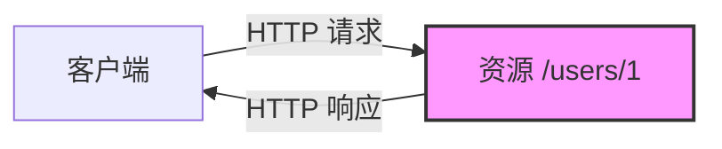
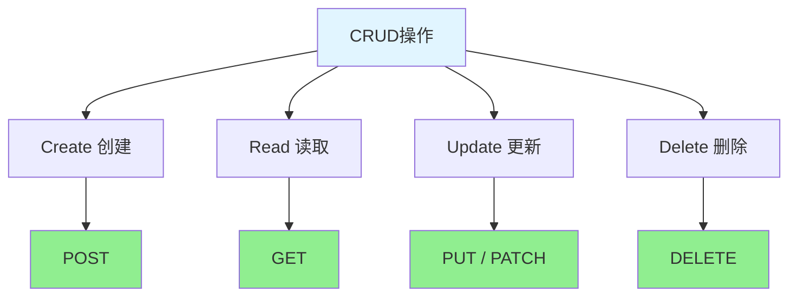
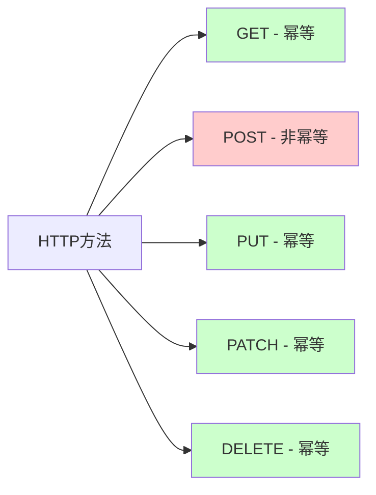
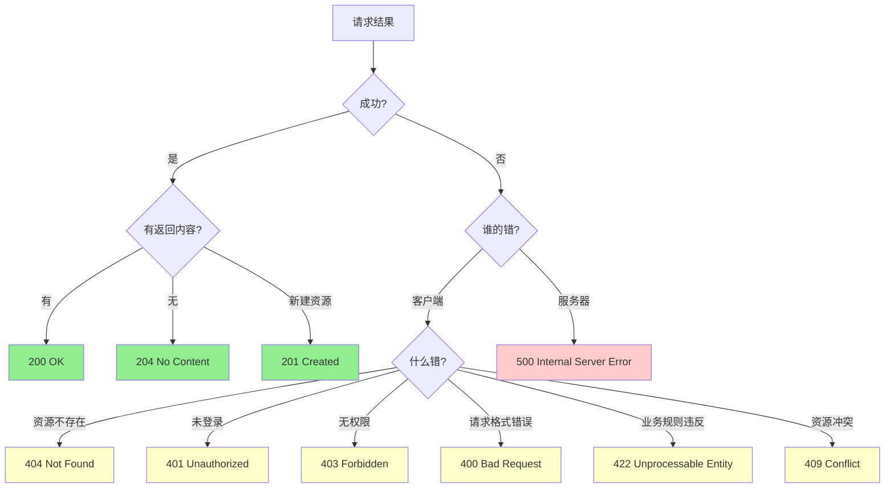

# RESTful API 基础

## 一、这是什么？

想象你去图书馆借书：

- 你想**查看**某本书的信息 → 告诉管理员书名，管理员给你看书的详情
- 你想**借走**一本书 → 告诉管理员书名，管理员帮你办理借阅
- 你想**归还**一本书 → 把书交给管理员，管理员帮你办理归还
- 你想**预约**一本书 → 告诉管理员书名，管理员帮你登记预约

在这个过程中：
- **书**是资源（Resource）
- **查看、借走、归还、预约**是操作（Operation）
- 管理员提供的服务是**统一的、有规范的**

RESTful API 就是这样的思想：**把数据看作资源，通过统一的方式（HTTP方法）对资源进行操作**。

**REST = Representational State Transfer**（表述性状态转移）
- 核心思想：用URL定位资源，用HTTP方法描述操作
- 目标：让API设计清晰、统一、易于理解

## 二、为什么需要RESTful API？

### 痛点1：接口命名混乱

没有规范时，不同开发者可能这样设计接口：

```
❌ 获取用户信息：
/getUserInfo?id=1
/queryUser?id=1
/fetchUserData?id=1
/getUser?id=1

❌ 创建用户：
/createUser
/addUser
/insertUser
/newUser
```

同样的功能，命名千奇百怪，新人接手时需要猜测每个接口的作用。

### 痛点2：职责不清

```
❌ 一个接口干多件事：
/handleUser?action=create
/handleUser?action=update
/handleUser?action=delete

❌ 方法语义混乱：
POST /getUser        # GET操作却用POST？
GET /deleteUser?id=1 # DELETE操作却用GET？
```

这样的设计导致：
- 前端开发者不知道该用什么HTTP方法
- 缓存机制失效（GET请求应该可以缓存，但现在不敢缓存）
- 日志分析困难（无法通过HTTP方法统计操作类型）

### RESTful如何解决？

RESTful提供了一套**统一的规范**：

```
✅ 获取用户：GET /users/1
✅ 创建用户：POST /users
✅ 更新用户：PUT /users/1
✅ 删除用户：DELETE /users/1
```

优势：
- **命名统一**：资源用名词（users），操作用HTTP方法
- **职责清晰**：一看URL和方法就知道做什么
- **易于缓存**：GET请求可以放心缓存
- **易于理解**：符合Web标准，前后端都熟悉

## 三、核心原则

### 原则1：资源（Resource）思维

一切皆资源。资源是REST的核心概念。

```
资源示例：
- 用户（User）
- 订单（Order）
- 商品（Product）
- 评论（Comment）
```

**关键点**：
- 用名词表示资源，不用动词
- 资源是具体的"东西"，不是"动作"



### 原则2：HTTP方法的语义化

HTTP方法本身就有明确的语义，RESTful充分利用这一点。

| HTTP方法 | 语义 | 示例 |
|---------|-----|------|
| **GET** | 获取资源 | `GET /users/1` - 获取ID为1的用户 |
| **POST** | 创建资源 | `POST /users` - 创建新用户 |
| **PUT** | 完整更新资源 | `PUT /users/1` - 完整更新用户1 |
| **PATCH** | 部分更新资源 | `PATCH /users/1` - 部分更新用户1 |
| **DELETE** | 删除资源 | `DELETE /users/1` - 删除用户1 |



### 原则3：无状态（Stateless）

每个请求都是独立的，服务器不保存客户端的状态。

```
❌ 有状态（不RESTful）：
1. POST /login → 服务器记住"用户已登录"
2. GET /profile → 服务器检查"是否登录"，返回信息

✅ 无状态（RESTful）：
1. POST /login → 返回token
2. GET /profile (Header: Authorization: Bearer token) → 服务器根据token判断身份
```

**好处**：
- 服务器可以水平扩展（任何服务器都能处理任何请求）
- 请求之间互不干扰
- 易于缓存和负载均衡

### 原则4：统一接口（Uniform Interface）

所有资源的操作方式都遵循同样的模式。

```
用户资源：
GET    /users        - 列表
GET    /users/1      - 详情
POST   /users        - 创建
PUT    /users/1      - 更新
DELETE /users/1      - 删除

订单资源：
GET    /orders       - 列表
GET    /orders/1     - 详情
POST   /orders       - 创建
PUT    /orders/1     - 更新
DELETE /orders/1     - 删除
```

学会一个资源的操作方式，其他资源都一样。

## 四、资源命名规范

### 规则1：使用名词，不用动词

```
❌ 错误示范（用动词）：
/getUsers
/createUser
/deleteUser

✅ 正确示范（用名词）：
GET    /users
POST   /users
DELETE /users/1
```

**记住**：动词已经包含在HTTP方法中了，URL只需要指明资源。

### 规则2：使用复数形式

```
✅ 推荐（复数）：
/users
/orders
/products

❌ 不推荐（单数）：
/user
/order
/product
```

**为什么用复数？**
- 符合直觉：`/users` 表示"用户集合"
- 统一性更好：
  - `GET /users` - 获取用户列表
  - `GET /users/1` - 获取单个用户
  - 都用 `/users` 作为基础路径

**例外情况**：单例资源可以用单数
```
GET /profile        # 当前用户的个人资料（单例）
GET /config         # 系统配置（单例）
```

### 规则3：路径层级表示资源关系

```
✅ 嵌套资源：
GET /users/1/orders           # 用户1的所有订单
GET /users/1/orders/100       # 用户1的订单100
POST /users/1/orders          # 为用户1创建订单

✅ 独立资源（如果不强调归属关系）：
GET /orders?userId=1          # 查询用户1的订单
GET /orders/100               # 获取订单100（不管是谁的）
```

**选择建议**：
- 如果资源**强依赖**父资源，用嵌套：`/users/1/orders`
- 如果资源**可独立访问**，用平级：`/orders?userId=1`

**避免过深嵌套**：
```
❌ 太深了：
/users/1/orders/100/items/5/reviews/3

✅ 简化：
/order-items/5/reviews/3
或
/reviews/3
```

### 规则4：用中划线分隔多词资源

```
✅ 推荐：
/user-profiles
/order-items
/payment-methods

❌ 不推荐：
/userProfiles     # 驼峰式
/user_profiles    # 下划线
/UserProfiles     # 大写
```

**原因**：URL应该小写，用中划线分隔最易读。

### 规则5：避免文件扩展名

```
❌ 不要这样：
/users/1.json
/users/1.xml

✅ 用HTTP Header指定格式：
GET /users/1
Accept: application/json
```

## 五、HTTP方法详解

### GET - 获取资源

**特性**：
- **安全**：不会修改服务器状态
- **幂等**：多次请求结果相同

```
示例：
GET /users          # 获取用户列表
GET /users/1        # 获取单个用户
GET /users/1/orders # 获取用户1的订单列表
```

**注意事项**：
- 不要用GET做删除/修改操作（搜索引擎爬虫会触发）
- 查询参数放在URL中：`/users?status=active&role=admin`

### POST - 创建资源

**特性**：
- **非幂等**：多次请求会创建多个资源

```
示例：
POST /users
Content-Type: application/json

{
  "name": "张三",
  "email": "zhangsan@example.com"
}
```

**响应**：
```
HTTP/1.1 201 Created
Location: /users/123

{
  "id": 123,
  "name": "张三",
  "email": "zhangsan@example.com",
  "createdAt": "2026-07-16T10:30:00Z"
}
```

**关键点**：
- 返回 `201 Created` 状态码
- 在 `Location` Header中返回新资源的URL
- 响应体包含创建后的完整资源

### PUT - 完整更新资源

**特性**：
- **幂等**：多次请求结果相同

```
示例：
PUT /users/1
Content-Type: application/json

{
  "name": "李四",
  "email": "lisi@example.com",
  "phone": "13800138000"
}
```

**含义**：
- **替换**整个资源
- 必须提供所有字段（或者后端会把缺失字段设为null/默认值）

```
原资源：
{
  "id": 1,
  "name": "张三",
  "email": "zhangsan@example.com",
  "phone": "13900139000"
}

PUT后：
{
  "id": 1,
  "name": "李四",
  "email": "lisi@example.com",
  "phone": "13800138000"
}
```

### PATCH - 部分更新资源

**特性**：
- **幂等**：多次请求结果相同
- 只更新提供的字段

```
示例：
PATCH /users/1
Content-Type: application/json

{
  "phone": "13800138000"
}
```

```
原资源：
{
  "id": 1,
  "name": "张三",
  "email": "zhangsan@example.com",
  "phone": "13900139000"
}

PATCH后：
{
  "id": 1,
  "name": "张三",              # 未变
  "email": "zhangsan@example.com",  # 未变
  "phone": "13800138000"       # 已更新
}
```

### DELETE - 删除资源

**特性**：
- **幂等**：多次删除同一资源，结果相同（资源都不存在了）

```
示例：
DELETE /users/1
```

**响应**：
```
HTTP/1.1 204 No Content
```

**或者**：
```
HTTP/1.1 200 OK

{
  "message": "用户已删除",
  "deletedId": 1
}
```

**关键点**：
- `204 No Content`：成功删除，无响应体
- `200 OK`：成功删除，响应体包含删除信息
- 再次DELETE已删除的资源，应返回 `404 Not Found`

### 幂等性对比



**幂等性的重要性**：
- **网络重试**：如果请求超时，客户端可以安全地重试幂等请求
- **防止重复提交**：表单重复提交时，幂等操作不会造成数据错误

## 六、HTTP状态码最佳实践

HTTP状态码是服务器告诉客户端"结果如何"的标准方式。

### 2xx - 成功

| 状态码 | 含义 | 使用场景 |
|-------|------|---------|
| **200 OK** | 请求成功 | GET、PUT、PATCH成功 |
| **201 Created** | 资源已创建 | POST创建成功 |
| **204 No Content** | 成功但无返回内容 | DELETE成功、PUT成功但不返回资源 |

```
示例：
GET /users/1        → 200 OK
POST /users         → 201 Created
DELETE /users/1     → 204 No Content
```

### 4xx - 客户端错误

| 状态码 | 含义 | 使用场景 |
|-------|------|---------|
| **400 Bad Request** | 请求格式错误 | JSON格式错误、缺少必需字段 |
| **401 Unauthorized** | 未认证 | 没有提供token、token过期 |
| **403 Forbidden** | 无权限 | 已认证但权限不足 |
| **404 Not Found** | 资源不存在 | 请求的用户ID不存在 |
| **409 Conflict** | 资源冲突 | 邮箱已被注册、订单状态冲突 |
| **422 Unprocessable Entity** | 语义错误 | 年龄为负数、邮箱格式错误 |

```
示例：
GET /users/999      → 404 Not Found (用户不存在)
POST /users         → 400 Bad Request (缺少email字段)
DELETE /users/1     → 403 Forbidden (无权删除其他用户)
POST /users         → 409 Conflict (邮箱已被注册)
```

**400 vs 422 的区别**：
- **400**：请求本身有问题（JSON格式错误、缺少字段）
- **422**：请求格式正确，但内容不符合业务规则（邮箱格式错误、年龄超出范围）

### 5xx - 服务器错误

| 状态码 | 含义 | 使用场景 |
|-------|------|---------|
| **500 Internal Server Error** | 服务器内部错误 | 代码bug、未处理的异常 |
| **502 Bad Gateway** | 网关错误 | 后端服务挂了 |
| **503 Service Unavailable** | 服务不可用 | 正在维护、过载 |

```
示例：
GET /users/1        → 500 Internal Server Error (数据库连接失败)
GET /users/1        → 503 Service Unavailable (系统维护中)
```

### 决策树：选择正确的状态码



## 七、完整示例：用户管理API

综合运用上述原则，设计一个用户管理API：

```
# 用户列表
GET /users
→ 200 OK
→ [{"id": 1, "name": "张三"}, {"id": 2, "name": "李四"}]

# 获取单个用户
GET /users/1
→ 200 OK
→ {"id": 1, "name": "张三", "email": "zhangsan@example.com"}

# 用户不存在
GET /users/999
→ 404 Not Found
→ {"error": "User not found"}

# 创建用户
POST /users
Body: {"name": "王五", "email": "wangwu@example.com"}
→ 201 Created
→ Location: /users/3
→ {"id": 3, "name": "王五", "email": "wangwu@example.com"}

# 邮箱已存在
POST /users
Body: {"name": "赵六", "email": "zhangsan@example.com"}
→ 409 Conflict
→ {"error": "Email already exists"}

# 完整更新用户
PUT /users/1
Body: {"name": "张三丰", "email": "zhangsanfeng@example.com"}
→ 200 OK
→ {"id": 1, "name": "张三丰", "email": "zhangsanfeng@example.com"}

# 部分更新用户
PATCH /users/1
Body: {"email": "newemail@example.com"}
→ 200 OK
→ {"id": 1, "name": "张三丰", "email": "newemail@example.com"}

# 删除用户
DELETE /users/1
→ 204 No Content

# 再次删除（已不存在）
DELETE /users/1
→ 404 Not Found
```

## 八、使用场景

RESTful API适合以下场景：

1. **Web应用的后端API**
   - 前后端分离的项目
   - 移动App的后端服务

2. **公开的第三方API**
   - 易于理解，开发者上手快
   - 符合Web标准，工具链成熟

3. **资源型操作为主的系统**
   - 电商系统（商品、订单、用户）
   - CMS系统（文章、分类、标签）
   - 社交系统（用户、帖子、评论）

4. **需要缓存优化的场景**
   - GET请求可以被CDN、浏览器缓存
   - 提升性能

5. **团队协作项目**
   - 统一的设计规范，减少沟通成本
   - 新人易于理解

## 九、注意事项与常见误区

### 误区1：过度RESTful

```
❌ 不必要的资源化：
POST /users/1/logout     # 登出

✅ 有时候动词更清晰：
POST /logout
或
DELETE /sessions/current
```

**建议**：如果某个操作很难用资源表示，用动词也可以，不要为了RESTful而RESTful。

### 误区2：所有操作都用POST

```
❌ 全用POST：
POST /getUserInfo
POST /deleteUser

✅ 用正确的HTTP方法：
GET /users/1
DELETE /users/1
```

**危害**：
- 无法利用HTTP缓存
- 语义不清晰
- 违反幂等性原则（重试不安全）

### 误区3：状态码乱用

```
❌ 所有错误都返回200：
GET /users/999
→ 200 OK
→ {"success": false, "error": "用户不存在"}

✅ 用正确的状态码：
GET /users/999
→ 404 Not Found
→ {"error": "用户不存在"}
```

**为什么重要**：
- HTTP客户端、中间件依赖状态码做决策
- 监控系统通过状态码统计错误率

### 误区4：忽略幂等性

```
❌ 非幂等的DELETE：
DELETE /users/1 → 200 OK
DELETE /users/1 → 500 Error (用户已不存在，抛异常)

✅ 幂等的DELETE：
DELETE /users/1 → 204 No Content
DELETE /users/1 → 404 Not Found (资源不存在是预期的)
```

### 注意事项：安全性

RESTful API暴露了资源结构，需要注意：

1. **认证鉴权**：每个请求都要验证权限
2. **防止遍历攻击**：`/users/1`, `/users/2`, `/users/3`... 不要泄露敏感信息
3. **速率限制**：防止恶意爬取
4. **HTTPS**：保护传输过程

（详见后续"API安全"主题）

## 十、小结

**RESTful API的核心**：
1. 用名词表示资源（users, orders）
2. 用HTTP方法表示操作（GET, POST, PUT, PATCH, DELETE）
3. 用HTTP状态码表示结果（200, 201, 404, 500）
4. 保持无状态
5. 接口设计统一

**记住这个对比**：

| | 传统API | RESTful API |
|---|---------|-------------|
| **获取用户** | `/getUserInfo?id=1` | `GET /users/1` |
| **创建用户** | `/createUser` | `POST /users` |
| **更新用户** | `/updateUser?id=1` | `PUT /users/1` |
| **删除用户** | `/deleteUser?id=1` | `DELETE /users/1` |

**下一步**：继续学习 `doc_02.md`，了解API版本管理、分页、过滤、排序等进阶话题。

---

💡 **提示**：现在去 `demo/` 目录运行代码示例，实际感受RESTful API的设计！
