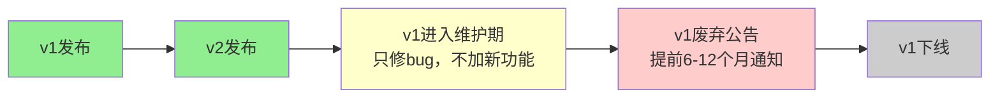
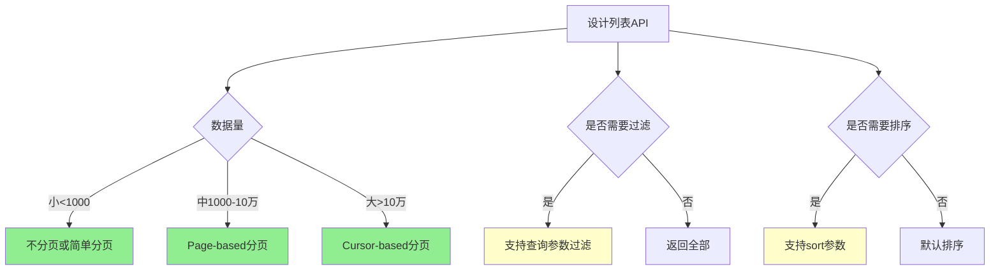

# RESTful API 进阶

> 阅读本文档前，请先完成 `doc_01.md` 的学习。

本文档涵盖RESTful API设计的进阶话题：版本管理、分页过滤排序、HATEOAS等。

---

## 一、API版本管理

### 为什么需要版本管理？

想象你正在维护一个API：

```
当前版本：
GET /users/1
→ {"id": 1, "name": "张三"}

现在需求变了，要加年龄字段：
GET /users/1
→ {"id": 1, "name": "张三", "age": 25}  ✅ 兼容的改动（加字段）

但如果要改字段名呢？
GET /users/1
→ {"id": 1, "fullName": "张三"}  ❌ 不兼容！老客户端会报错
```

**问题**：
- 老版本客户端（移动App）无法立即更新
- 强制所有客户端同时升级不现实
- 需要让新老版本API并存一段时间

**解决方案**：API版本管理

### 方案1：URL路径版本（推荐）

把版本号放在URL路径中：

```
v1版本：
GET /v1/users/1
→ {"id": 1, "name": "张三"}

v2版本：
GET /v2/users/1
→ {"id": 1, "fullName": "张三", "age": 25}
```

**优点**：
- 清晰直观，一眼看出版本
- 易于测试（浏览器、curl直接访问）
- 易于路由（不同版本可以转发到不同服务器）
- 易于缓存（CDN可以针对不同版本缓存）

**缺点**：
- URL变了，不够"RESTful"（资源标识符应该永久）
- 版本号污染了URL

**适用场景**：大多数场景，尤其是公开API

### 方案2：Header版本

把版本号放在HTTP Header中：

```
请求：
GET /users/1
Accept: application/vnd.myapi.v1+json

响应：
HTTP/1.1 200 OK
Content-Type: application/vnd.myapi.v1+json

{"id": 1, "name": "张三"}
```

或使用自定义Header：

```
GET /users/1
API-Version: 1
```

**优点**：
- URL保持不变，更"RESTful"
- 资源标识符永久稳定

**缺点**：
- 不够直观（测试时需要设置Header）
- 缓存配置复杂（CDN需要考虑Header）
- 浏览器直接访问不方便

**适用场景**：内部API、对RESTful纯粹性要求高的场景

### 方案3：查询参数版本（不推荐）

```
GET /users/1?version=1
```

**缺点**：
- 查询参数容易被忽略
- 与业务查询参数混淆
- 缓存问题（查询参数通常不被缓存）

**建议**：不推荐使用

### 版本策略最佳实践

#### 1. 何时升级版本？

```
✅ 需要升级主版本（v1 → v2）：
- 删除字段
- 重命名字段
- 改变字段类型（string → int）
- 改变行为语义

✅ 不需要升级版本（向后兼容）：
- 新增字段
- 新增可选参数
- 新增端点
- 修复bug
```

#### 2. 版本号规则

```
推荐：只用主版本号
/v1/users
/v2/users
/v3/users

不推荐：语义化版本
/v1.2.3/users  ❌ 太细了，客户端升级成本高
```

**原因**：API版本不是软件版本，不需要那么细的粒度。

#### 3. 版本生命周期



**建议**：
- 同时维护2-3个版本
- 废弃前至少提前6个月通知
- 在响应Header中提示版本状态：
  ```
  Deprecation: true
  Sunset: Sat, 31 Dec 2026 23:59:59 GMT
  Link: <https://api.example.com/docs/migration>; rel="deprecation"
  ```

#### 4. 完整示例

```
项目时间线：

2025-01-01：v1上线
2025-06-01：v2上线（v1继续可用）
2025-12-01：v1标记为废弃（Deprecated）
2026-06-01：v1下线，只保留v2

客户端迁移窗口：1年（从v2上线到v1下线）
```

## 二、分页、过滤、排序

### 分页（Pagination）

当资源列表很大时（如10万个用户），不能一次性返回所有数据。

#### 方案1：基于页码（Page-based）

```
请求：
GET /users?page=2&size=20

响应：
{
  "data": [
    {"id": 21, "name": "用户21"},
    {"id": 22, "name": "用户22"},
    ...
  ],
  "pagination": {
    "page": 2,
    "size": 20,
    "totalPages": 50,
    "totalCount": 1000
  }
}
```

**优点**：
- 直观易懂（第几页）
- 可以跳转到任意页

**缺点**：
- 数据变化时会重复/遗漏（用户翻到第2页时，第1页新增了数据）
- 深度分页性能差（数据库 `OFFSET 10000` 很慢）

**适用场景**：
- 数据更新不频繁
- 用户需要跳页功能
- 数据量不是特别大（< 1万条）

#### 方案2：基于偏移量（Offset-based）

```
请求：
GET /users?offset=40&limit=20

响应：
{
  "data": [...],
  "pagination": {
    "offset": 40,
    "limit": 20,
    "totalCount": 1000
  }
}
```

**与Page-based的区别**：
- `offset` 更灵活（可以不是page_size的倍数）
- 本质相同，只是参数不同

#### 方案3：基于游标（Cursor-based，推荐）

```
第一次请求：
GET /users?limit=20

响应：
{
  "data": [
    {"id": 1, "name": "用户1", "createdAt": "2026-01-01T00:00:00Z"},
    ...
    {"id": 20, "name": "用户20", "createdAt": "2026-01-20T00:00:00Z"}
  ],
  "pagination": {
    "nextCursor": "eyJpZCI6MjAsImNyZWF0ZWRBdCI6IjIwMjYtMDEtMjBUMDA6MDA6MDBaIn0=",
    "hasMore": true
  }
}

下一页请求：
GET /users?cursor=eyJpZCI6MjAsImNyZWF0ZWRBdCI6IjIwMjYtMDEtMjBUMDA6MDA6MDBaIn0=&limit=20

响应：
{
  "data": [
    {"id": 21, "name": "用户21"},
    ...
  ],
  "pagination": {
    "nextCursor": "...",
    "hasMore": true
  }
}
```

**游标（Cursor）是什么？**
- 编码后的书签，指向"上次读到哪里了"
- 通常包含：最后一条记录的ID + 排序字段值
- 示例：`{"id": 20, "createdAt": "2026-01-20"}` → Base64编码

**优点**：
- 数据一致性好（不会重复/遗漏）
- 性能好（基于索引 `WHERE id > 20`，不用OFFSET）
- 适合实时数据流（如社交媒体Feed）

**缺点**：
- 无法跳页（只能顺序翻页）
- 实现稍复杂

**适用场景**：
- 数据频繁更新（社交媒体、消息列表）
- 数据量大（百万级以上）
- 只需要"下一页"功能（不需要跳页）

#### 分页方案对比

| 方案 | 优点 | 缺点 | 适用场景 |
|-----|------|------|---------|
| **Page-based** | 直观、可跳页 | 深度分页慢、数据可能重复 | 后台管理系统 |
| **Cursor-based** | 性能好、一致性强 | 无法跳页 | 社交媒体Feed、消息列表 |

### 过滤（Filtering）

允许客户端筛选资源。

```
基本过滤：
GET /users?status=active
GET /users?role=admin

多条件过滤：
GET /users?status=active&role=admin&city=beijing

范围过滤：
GET /orders?minAmount=100&maxAmount=1000
GET /users?createdAfter=2026-01-01&createdBefore=2026-12-31

模糊搜索：
GET /users?search=zhang
GET /products?name=手机
```

**命名建议**：
- 精确匹配：直接用字段名 `?status=active`
- 范围查询：用前缀 `?minPrice=100&maxPrice=500`
- 模糊搜索：用 `search` 或 `q` 参数

**复杂过滤（可选）**：

如果需要支持复杂查询（AND、OR、IN），可以用特殊语法：

```
方案1：LHS Brackets
GET /users?status[in]=active,pending&age[gte]=18

方案2：RHS Colon
GET /users?status:in=active,pending&age:gte=18

方案3：简化版
GET /users?status=active,pending  # 逗号分隔 = IN
```

**建议**：
- 简单场景：直接用字段名
- 复杂场景：引入成熟方案（如GraphQL）

### 排序（Sorting）

```
单字段排序：
GET /users?sort=createdAt           # 默认升序
GET /users?sort=-createdAt          # 降序（-前缀）

多字段排序：
GET /users?sort=status,-createdAt   # 先按status升序，再按createdAt降序

明确指定方向：
GET /users?sort=createdAt:desc
GET /users?sort=status:asc,createdAt:desc
```

**建议**：
- 用 `-` 前缀表示降序（简洁）
- 或用 `:asc`/`:desc` 后缀（明确）
- 选择一种风格并保持一致

### 完整示例：组合使用

```
请求：
GET /orders?status=completed&minAmount=100&sort=-createdAt&page=1&size=20

含义：
- 查询已完成的订单（status=completed）
- 金额 >= 100（minAmount=100）
- 按创建时间降序排列（sort=-createdAt）
- 分页：第1页，每页20条

响应：
{
  "data": [
    {
      "id": 501,
      "status": "completed",
      "amount": 500,
      "createdAt": "2026-07-15T12:00:00Z"
    },
    ...
  ],
  "pagination": {
    "page": 1,
    "size": 20,
    "totalPages": 5,
    "totalCount": 95
  }
}
```

### 设计建议



## 三、HATEOAS（超媒体控制）

### 什么是HATEOAS？

**HATEOAS = Hypermedia As The Engine Of Application State**

核心思想：**API响应中包含可执行的下一步操作链接，客户端通过这些链接导航，而不是硬编码URL**。

### 用类比理解

**不用HATEOAS（传统方式）**：

就像给你一张地图，你需要记住：
- 去图书馆的路线
- 去食堂的路线
- 去宿舍的路线

每次去新地方都要查地图。

**使用HATEOAS**：

就像GPS导航，每到一个地方，它会告诉你"下一步可以去哪里"：
- 当前在图书馆 → 可以去"借书"或"还书"
- 当前在食堂 → 可以去"点餐"或"结账"

你不需要记住所有路线，只需要跟着指引走。

### 不使用HATEOAS的API

```
GET /orders/123

响应：
{
  "id": 123,
  "status": "pending",
  "amount": 500
}

客户端硬编码：
- 如果status=pending，可以取消订单：DELETE /orders/123
- 如果status=pending，可以支付订单：POST /orders/123/payment
```

**问题**：
- 客户端需要知道所有URL规则
- API变更时，客户端需要同步更新
- 业务规则分散在客户端（哪些状态可以执行哪些操作）

### 使用HATEOAS的API

```
GET /orders/123

响应：
{
  "id": 123,
  "status": "pending",
  "amount": 500,
  "_links": {
    "self": {
      "href": "/orders/123"
    },
    "cancel": {
      "href": "/orders/123",
      "method": "DELETE"
    },
    "pay": {
      "href": "/orders/123/payment",
      "method": "POST"
    }
  }
}

客户端逻辑：
- 如果响应中有 "cancel" 链接，显示"取消订单"按钮
- 如果响应中有 "pay" 链接，显示"支付"按钮
```

**当订单已支付时**：

```
GET /orders/123

响应：
{
  "id": 123,
  "status": "paid",
  "amount": 500,
  "_links": {
    "self": {
      "href": "/orders/123"
    },
    "refund": {
      "href": "/orders/123/refund",
      "method": "POST"
    }
  }
}

客户端逻辑：
- 没有 "cancel" 链接，不显示"取消订单"按钮
- 有 "refund" 链接，显示"退款"按钮
```

### 好处

1. **解耦**：客户端不需要硬编码URL规则
2. **业务规则集中**：服务端控制哪些操作可用
3. **易于变更**：URL改了，客户端不用改（只要rel名称不变）
4. **自描述**：API响应本身告诉你能做什么

### HATEOAS格式标准

#### 方案1：自定义格式（简单）

```json
{
  "id": 123,
  "status": "pending",
  "_links": {
    "self": {"href": "/orders/123"},
    "cancel": {"href": "/orders/123", "method": "DELETE"},
    "pay": {"href": "/orders/123/payment", "method": "POST"}
  }
}
```

#### 方案2：HAL（Hypertext Application Language）

```json
{
  "id": 123,
  "status": "pending",
  "_links": {
    "self": {"href": "/orders/123"},
    "cancel": {"href": "/orders/123"},
    "pay": {"href": "/orders/123/payment"}
  }
}
```

HAL标准：https://stateless.group/hal_specification.html

#### 方案3：JSON:API

```json
{
  "data": {
    "type": "orders",
    "id": "123",
    "attributes": {
      "status": "pending"
    },
    "links": {
      "self": "/orders/123",
      "cancel": "/orders/123",
      "pay": "/orders/123/payment"
    }
  }
}
```

JSON:API标准：https://jsonapi.org/

### 实际应用的权衡

**HATEOAS的理想很美好，但现实是**：

✅ **适合使用HATEOAS的场景**：
- 公开API（第三方开发者不了解你的业务规则）
- 复杂的业务状态机（订单、工单有多个状态和转换）
- API版本迁移（通过链接平滑过渡）

❌ **不适合使用HATEOAS的场景**：
- 内部API（前后端同一团队，直接沟通更高效）
- 简单CRUD（增加复杂度，收益不大）
- 性能敏感场景（响应体变大）

**大多数项目的选择**：
- 不完全实现HATEOAS
- 在关键场景（如状态流转）提供链接
- 其他地方保持简单

### 简化版HATEOAS（推荐）

不必完全遵循标准，可以只提供"可执行操作"：

```json
{
  "id": 123,
  "status": "pending",
  "amount": 500,
  "availableActions": ["cancel", "pay"]
}

客户端逻辑：
if (order.availableActions.includes('cancel')) {
  // 显示取消按钮
}
```

**优点**：
- 简单易懂
- 业务规则仍然在服务端
- 不增加太多复杂度

## 四、响应格式设计

### 成功响应

#### 方案1：直接返回数据（简洁）

```json
GET /users/1
{
  "id": 1,
  "name": "张三"
}

GET /users
[
  {"id": 1, "name": "张三"},
  {"id": 2, "name": "李四"}
]
```

**适用**：简单API

#### 方案2：统一包装（推荐）

```json
GET /users/1
{
  "code": 0,
  "message": "success",
  "data": {
    "id": 1,
    "name": "张三"
  }
}

GET /users
{
  "code": 0,
  "message": "success",
  "data": [
    {"id": 1, "name": "张三"},
    {"id": 2, "name": "李四"}
  ],
  "pagination": {
    "page": 1,
    "size": 20,
    "totalCount": 100
  }
}
```

**优点**：
- 统一的错误码（code）
- 统一的消息字段（message）
- 易于前端统一处理

### 错误响应

```json
{
  "code": 40001,
  "message": "邮箱格式错误",
  "details": {
    "field": "email",
    "value": "invalid-email",
    "constraint": "必须是有效的邮箱地址"
  },
  "requestId": "abc-123-def",
  "timestamp": "2026-07-16T10:30:00Z"
}
```

**关键字段**：
- `code`：业务错误码（与HTTP状态码区分）
- `message`：用户可读的错误信息
- `details`：详细错误信息（可选，调试用）
- `requestId`：请求追踪ID（排查问题用）

### 字段命名规范

```
推荐：驼峰式（camelCase）
{
  "userId": 1,
  "firstName": "San",
  "createdAt": "2026-07-16T10:30:00Z"
}

不推荐：蛇形（snake_case）
{
  "user_id": 1,
  "first_name": "San"
}

不推荐：帕斯卡（PascalCase）
{
  "UserId": 1,
  "FirstName": "San"
}
```

**原因**：JSON标准推荐驼峰式，JavaScript原生支持。

**例外**：如果你的团队/语言习惯snake_case（如Python），保持一致即可。

## 五、常见误区总结

### 误区1：过度版本化

```
❌ 每个小改动都升级版本：
v1.0.1, v1.0.2, v1.1.0, v1.2.0, v2.0.0 ...

✅ 只有破坏性变更才升级：
v1, v2, v3
```

### 误区2：分页参数不统一

```
❌ 不同接口用不同参数：
GET /users?page=1&pageSize=20
GET /orders?pageNum=1&limit=20

✅ 全站统一：
GET /users?page=1&size=20
GET /orders?page=1&size=20
```

### 误区3：过度使用HATEOAS

```
❌ 简单CRUD也加HATEOAS：
GET /users/1
{
  "id": 1,
  "name": "张三",
  "_links": {
    "self": {"href": "/users/1"},
    "update": {"href": "/users/1"},
    "delete": {"href": "/users/1"}
  }
}

✅ 只在有业务价值的地方用：
GET /orders/123  # 订单状态复杂，需要HATEOAS
GET /users/1     # 简单CRUD，不需要
```

## 六、小结

**本文档核心内容**：

1. **版本管理**：
   - URL版本（推荐）：`/v1/users`
   - 只在破坏性变更时升级版本
   - 同时维护2-3个版本

2. **分页**：
   - Page-based：适合后台管理
   - Cursor-based：适合大数据、实时流

3. **过滤与排序**：
   - 过滤：`?status=active&role=admin`
   - 排序：`?sort=-createdAt`

4. **HATEOAS**：
   - 理想：响应包含可执行操作链接
   - 现实：大多数项目简化使用

5. **响应格式**：
   - 统一包装：`{code, message, data}`
   - 驼峰式命名

---

**下一步**：完成 `test_01.md` 自测题，检验学习成果！

💡 **提示**：这些进阶内容在实际项目中非常重要，建议结合 `demo/` 中的代码加深理解。
