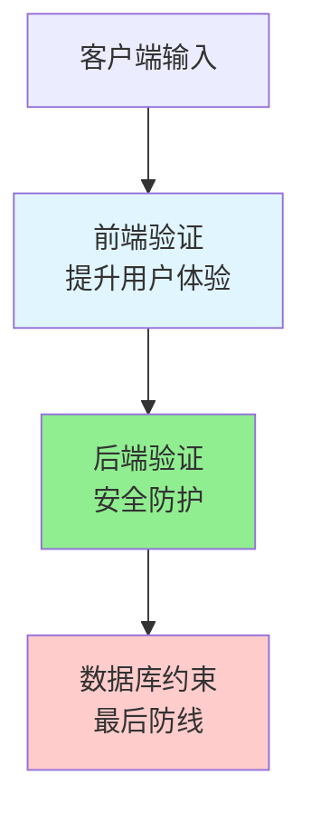
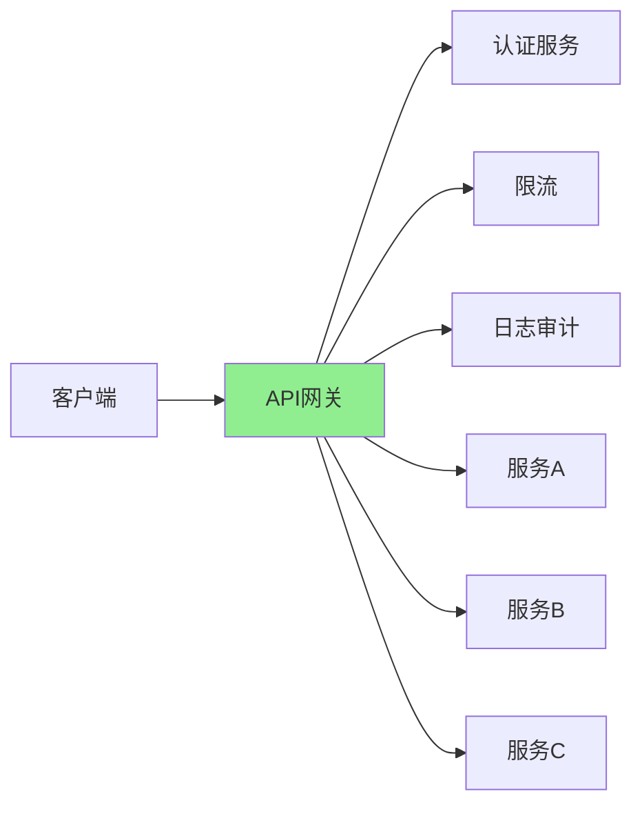

# API 安全 - 安全最佳实践

> 阅读本文档前，请先完成 `doc_01.md` 和 `doc_02.md` 的学习。

本文档讲解API安全的最佳实践和综合防护方案。

---

## 一、限流与防刷详解

限流是保护API的重要手段，防止资源耗尽和恶意攻击。

### 为什么需要限流？

**场景1：恶意攻击**
```
攻击者发起DDoS攻击：
每秒发送10000次请求
→ 服务器CPU 100%
→ 数据库连接耗尽
→ 正常用户无法访问
```

**场景2：爬虫滥用**
```
爬虫抓取数据：
短时间内请求所有商品信息
→ 带宽耗尽
→ 数据库压力过大
```

**场景3：业务保护**
```
防止薅羊毛：
短信验证码接口被刷
→ 短信费用暴增
```

### 限流算法对比

#### 算法1：固定窗口（简单但有缺陷）

**原理**：
```
时间窗口：1分钟
限制：100次请求

00:00-01:00  计数器 = 0
收到请求    计数器 + 1
如果计数器 > 100  拒绝
01:00        计数器重置为0
```

**实现**：
```java
public class FixedWindowRateLimiter {
    private int maxRequests = 100;
    private long windowSize = 60_000;  // 60秒
    
    private int counter = 0;
    private long windowStart = System.currentTimeMillis();
    
    public synchronized boolean allowRequest() {
        long now = System.currentTimeMillis();
        
        // 检查是否需要重置窗口
        if (now - windowStart >= windowSize) {
            counter = 0;
            windowStart = now;
        }
        
        // 检查是否超过限制
        if (counter >= maxRequests) {
            return false;
        }
        
        counter++;
        return true;
    }
}
```

**缺点：临界点问题**
```
00:59:00  发送100次请求（允许）
01:00:00  窗口重置
01:00:01  发送100次请求（允许）

→ 2秒内发送了200次请求！
```

#### 算法2：滑动窗口（推荐）

**原理**：
```
窗口大小：60秒
限制：100次请求

记录每次请求的时间戳
检查最近60秒内的请求数量
```

**实现**：
```java
public class SlidingWindowRateLimiter {
    private int maxRequests = 100;
    private long windowSize = 60_000;  // 60秒
    
    // 用户ID -> 请求时间戳队列
    private Map<String, Queue<Long>> requestLog = new ConcurrentHashMap<>();
    
    public boolean allowRequest(String userId) {
        long now = System.currentTimeMillis();
        long windowStart = now - windowSize;
        
        Queue<Long> timestamps = requestLog.computeIfAbsent(
            userId, 
            k -> new LinkedList<>()
        );
        
        // 移除窗口外的请求记录
        while (!timestamps.isEmpty() && timestamps.peek() < windowStart) {
            timestamps.poll();
        }
        
        // 检查是否超过限制
        if (timestamps.size() >= maxRequests) {
            return false;
        }
        
        // 记录本次请求
        timestamps.offer(now);
        return true;
    }
}
```

**优点**：
- 平滑限流，无临界点问题
- 准确统计任意时间窗口内的请求数

**缺点**：
- 内存占用较高（需要存储每次请求时间戳）

#### 算法3：令牌桶（弹性限流）

**原理**：
```
桶容量：100个令牌
生成速率：每秒10个令牌

1. 桶以固定速率产生令牌
2. 请求到来时，尝试从桶中取1个令牌
3. 如果有令牌，允许请求；否则拒绝

特点：允许短时间突发流量（桶满时可以一次性消费所有令牌）
```

**实现**：
```java
public class TokenBucketRateLimiter {
    private int capacity = 100;        // 桶容量
    private int tokensPerSecond = 10;  // 每秒产生令牌数
    
    private int tokens = 100;          // 当前令牌数
    private long lastRefillTime = System.currentTimeMillis();
    
    public synchronized boolean allowRequest() {
        refillTokens();
        
        if (tokens > 0) {
            tokens--;
            return true;
        }
        
        return false;
    }
    
    private void refillTokens() {
        long now = System.currentTimeMillis();
        long elapsedTime = now - lastRefillTime;
        
        // 计算应该生成的令牌数
        int newTokens = (int) (elapsedTime / 1000.0 * tokensPerSecond);
        
        if (newTokens > 0) {
            tokens = Math.min(capacity, tokens + newTokens);
            lastRefillTime = now;
        }
    }
}
```

**优点**：
- 允许突发流量
- 平滑限流

**使用场景**：
- 需要允许短时突发的场景（如秒杀）

#### 算法4：漏桶（平滑流量）

**原理**：
```
桶容量：100
流出速率：每秒10次

1. 请求进入桶
2. 桶以固定速率处理请求
3. 桶满时，新请求溢出（拒绝）

特点：强制平滑流量，无论请求多快，都以固定速率处理
```

**令牌桶 vs 漏桶**：
```
令牌桶：允许突发
- 桶满时，可以一次性发送100个请求

漏桶：强制平滑
- 无论桶里有多少请求，都以固定速率（每秒10个）处理
```

### 限流策略

#### 策略1：基于IP限流
```java
@GetMapping("/api/users")
public List<User> getUsers(HttpServletRequest request) {
    String clientIp = getClientIp(request);
    
    if (!rateLimiter.allowRequest(clientIp)) {
        throw new TooManyRequestsException("请求过于频繁");
    }
    
    return userService.getAllUsers();
}

private String getClientIp(HttpServletRequest request) {
    // 考虑代理和负载均衡
    String ip = request.getHeader("X-Forwarded-For");
    if (ip == null || ip.isEmpty()) {
        ip = request.getRemoteAddr();
    }
    return ip;
}
```

**适用场景**：公开API、未登录用户

**问题**：同一IP下的多个用户会共享限制（如公司、学校）

#### 策略2：基于用户限流（推荐）
```java
@GetMapping("/api/users")
public List<User> getUsers(@AuthenticationPrincipal User currentUser) {
    if (!rateLimiter.allowRequest(currentUser.getId())) {
        throw new TooManyRequestsException("请求过于频繁");
    }
    
    return userService.getAllUsers();
}
```

**适用场景**：需要登录的API

**优点**：精确控制每个用户的请求频率

#### 策略3：基于API端点限流
```java
// 不同端点不同限制
Map<String, Integer> limits = Map.of(
    "/api/users", 100,           // 普通接口：100次/分钟
    "/api/search", 30,            // 搜索接口：30次/分钟
    "/api/sms/send", 5            // 短信接口：5次/分钟
);
```

#### 策略4：分级限流
```java
// 不同用户等级不同限制
public int getRateLimit(User user) {
    if (user.isVip()) {
        return 1000;  // VIP：1000次/分钟
    } else if (user.isPaid()) {
        return 500;   // 付费用户：500次/分钟
    } else {
        return 100;   // 普通用户：100次/分钟
    }
}
```

### 限流响应

**HTTP响应**：
```
HTTP/1.1 429 Too Many Requests
Content-Type: application/json
Retry-After: 60
X-RateLimit-Limit: 100        # 限制总数
X-RateLimit-Remaining: 0      # 剩余次数
X-RateLimit-Reset: 1626239082 # 重置时间（时间戳）

{
  "code": 42900,
  "message": "请求过于频繁，请60秒后重试",
  "retryAfter": 60
}
```

**前端处理**：
```javascript
// 自动重试（带退避）
async function apiCall() {
  try {
    const response = await fetch('/api/users');
    
    if (response.status === 429) {
      const retryAfter = response.headers.get('Retry-After');
      console.log(`请求限流，${retryAfter}秒后重试`);
      
      await sleep(retryAfter * 1000);
      return apiCall();  // 重试
    }
    
    return response.json();
  } catch (error) {
    console.error('请求失败', error);
  }
}
```

## 二、输入验证

### 验证原则

**白名单 vs 黑名单**：
```
❌ 黑名单（不推荐）：
禁止：<script>, DROP, SELECT, ...
问题：攻击手段千变万化，无法穷举

✅ 白名单（推荐）：
只允许：字母、数字、下划线
其他全部拒绝
```

### 验证层级



**重要**：永远不要只做前端验证，前端可以被绕过！

### 验证实现

#### 方法1：正则表达式
```java
public class InputValidator {
    // 用户名：3-20位，字母、数字、下划线
    private static final Pattern USERNAME_PATTERN = 
        Pattern.compile("^[a-zA-Z0-9_]{3,20}$");
    
    // 邮箱
    private static final Pattern EMAIL_PATTERN = 
        Pattern.compile("^[a-zA-Z0-9._%+-]+@[a-zA-Z0-9.-]+\\.[a-zA-Z]{2,}$");
    
    // 手机号（中国）
    private static final Pattern PHONE_PATTERN = 
        Pattern.compile("^1[3-9]\\d{9}$");
    
    public void validateUsername(String username) {
        if (username == null || !USERNAME_PATTERN.matcher(username).matches()) {
            throw new ValidationException("用户名格式不正确");
        }
    }
    
    public void validateEmail(String email) {
        if (email == null || !EMAIL_PATTERN.matcher(email).matches()) {
            throw new ValidationException("邮箱格式不正确");
        }
    }
}
```

#### 方法2：Bean Validation（推荐）
```java
public class UserDTO {
    @NotBlank(message = "用户名不能为空")
    @Size(min = 3, max = 20, message = "用户名长度为3-20位")
    @Pattern(regexp = "^[a-zA-Z0-9_]+$", message = "用户名只能包含字母、数字、下划线")
    private String username;
    
    @NotBlank(message = "邮箱不能为空")
    @Email(message = "邮箱格式不正确")
    private String email;
    
    @NotNull(message = "年龄不能为空")
    @Min(value = 1, message = "年龄最小为1")
    @Max(value = 150, message = "年龄最大为150")
    private Integer age;
}

// Controller
@PostMapping("/users")
public User createUser(@Valid @RequestBody UserDTO userDTO) {
    // @Valid 触发验证，验证失败抛出MethodArgumentNotValidException
    return userService.create(userDTO);
}

// 全局异常处理
@ExceptionHandler(MethodArgumentNotValidException.class)
public ResponseEntity<?> handleValidationException(MethodArgumentNotValidException e) {
    List<String> errors = e.getBindingResult()
        .getFieldErrors()
        .stream()
        .map(FieldError::getDefaultMessage)
        .collect(Collectors.toList());
    
    return ResponseEntity
        .status(422)
        .body(Map.of("code", 42200, "message", "输入验证失败", "errors", errors));
}
```

### 字段长度限制

```java
// 数据库字段长度
@Column(length = 50)
private String username;

@Column(length = 100)
private String email;

@Column(length = 1000)
private String bio;  // 个人简介

// 防止：
// 1. 数据库溢出
// 2. DoS攻击（发送超大内容）
```

### 文件上传验证

```java
@PostMapping("/upload")
public String uploadFile(@RequestParam("file") MultipartFile file) {
    // 1. 检查文件大小
    if (file.getSize() > 10 * 1024 * 1024) {  // 10MB
        throw new ValidationException("文件大小不能超过10MB");
    }
    
    // 2. 检查文件类型（白名单）
    String contentType = file.getContentType();
    List<String> allowedTypes = Arrays.asList("image/jpeg", "image/png", "image/gif");
    if (!allowedTypes.contains(contentType)) {
        throw new ValidationException("只允许上传图片文件");
    }
    
    // 3. 检查文件扩展名
    String filename = file.getOriginalFilename();
    String extension = filename.substring(filename.lastIndexOf(".") + 1).toLowerCase();
    if (!Arrays.asList("jpg", "jpeg", "png", "gif").contains(extension)) {
        throw new ValidationException("不支持的文件类型");
    }
    
    // 4. 重命名文件（避免路径穿越攻击）
    String safeFilename = UUID.randomUUID().toString() + "." + extension;
    
    // 5. 扫描病毒（可选）
    // virusScanner.scan(file);
    
    // 保存文件
    file.transferTo(new File("/upload/" + safeFilename));
    
    return safeFilename;
}
```

## 三、错误处理

### 不要泄露敏感信息

```
❌ 暴露过多信息：
{
  "error": "SQLException: Table 'users' doesn't exist at line 42 in UserService.java",
  "stackTrace": "..."
}

攻击者获取：
- 数据库表名（users）
- 代码结构（UserService.java）
- 可能的SQL注入点

✅ 模糊错误信息：
{
  "code": 50000,
  "message": "服务器内部错误",
  "requestId": "abc-123-def"
}

详细错误只记录在服务器日志中
```

### 统一错误格式

```java
// 错误响应格式
public class ErrorResponse {
    private Integer code;          // 业务错误码
    private String message;        // 用户可读的错误信息
    private String requestId;      // 请求追踪ID
    private Long timestamp;        // 时间戳
    private Map<String, String> details;  // 详细信息（可选）
}

// 全局异常处理
@RestControllerAdvice
public class GlobalExceptionHandler {
    
    @ExceptionHandler(ResourceNotFoundException.class)
    public ResponseEntity<ErrorResponse> handleNotFound(
        ResourceNotFoundException e,
        HttpServletRequest request
    ) {
        ErrorResponse error = ErrorResponse.builder()
            .code(40400)
            .message(e.getMessage())
            .requestId(request.getAttribute("requestId"))
            .timestamp(System.currentTimeMillis())
            .build();
        
        return ResponseEntity.status(404).body(error);
    }
    
    @ExceptionHandler(Exception.class)
    public ResponseEntity<ErrorResponse> handleGenericException(
        Exception e,
        HttpServletRequest request
    ) {
        // 记录详细日志
        log.error("Unexpected error: requestId={}", 
            request.getAttribute("requestId"), e);
        
        // 返回模糊错误
        ErrorResponse error = ErrorResponse.builder()
            .code(50000)
            .message("服务器内部错误")
            .requestId(request.getAttribute("requestId"))
            .timestamp(System.currentTimeMillis())
            .build();
        
        return ResponseEntity.status(500).body(error);
    }
}
```

### 日志记录

```java
// ✅ 记录完整的上下文信息
log.error(
    "用户登录失败: username={}, ip={}, userAgent={}, requestId={}",
    username,
    clientIp,
    userAgent,
    requestId,
    exception  // 异常堆栈
);

// ❌ 不要记录敏感信息
log.error("用户登录失败: username={}, password={}", username, password);  // 密码！
```

## 四、安全Headers

通过HTTP响应头增强安全性。

```java
@Configuration
public class SecurityHeadersConfig implements WebMvcConfigurer {
    
    @Override
    public void addInterceptors(InterceptorRegistry registry) {
        registry.addInterceptor(new SecurityHeadersInterceptor());
    }
}

public class SecurityHeadersInterceptor implements HandlerInterceptor {
    
    @Override
    public void postHandle(
        HttpServletRequest request,
        HttpServletResponse response,
        Object handler,
        ModelAndView modelAndView
    ) {
        // 1. 防止MIME类型嗅探
        response.setHeader("X-Content-Type-Options", "nosniff");
        
        // 2. 防止点击劫持
        response.setHeader("X-Frame-Options", "DENY");
        
        // 3. XSS防护
        response.setHeader("X-XSS-Protection", "1; mode=block");
        
        // 4. 强制HTTPS
        response.setHeader(
            "Strict-Transport-Security",
            "max-age=31536000; includeSubDomains"
        );
        
        // 5. Content Security Policy
        response.setHeader(
            "Content-Security-Policy",
            "default-src 'self'; script-src 'self' https://trusted.com; style-src 'self' 'unsafe-inline'"
        );
        
        // 6. Referrer Policy
        response.setHeader("Referrer-Policy", "strict-origin-when-cross-origin");
    }
}
```

**各Header说明**：

| Header | 作用 | 示例值 |
|--------|------|--------|
| **X-Content-Type-Options** | 防止MIME嗅探 | `nosniff` |
| **X-Frame-Options** | 防止点击劫持（iframe） | `DENY` 或 `SAMEORIGIN` |
| **X-XSS-Protection** | 启用浏览器XSS过滤器 | `1; mode=block` |
| **Strict-Transport-Security** | 强制使用HTTPS | `max-age=31536000` |
| **Content-Security-Policy** | 控制资源加载来源 | `default-src 'self'` |
| **Referrer-Policy** | 控制Referer信息 | `no-referrer` |

## 五、API网关与安全

在微服务架构中，API网关是统一的安全防护点。



**API网关的职责**：

1. **统一认证**
   - 验证JWT
   - 对下游服务透传用户信息

2. **统一鉴权**
   - 检查用户角色和权限
   - 路由级别的访问控制

3. **统一限流**
   - 全局限流
   - 按用户、IP、API限流

4. **安全防护**
   - IP黑白名单
   - 防止SQL注入、XSS（WAF）

5. **日志审计**
   - 记录所有请求
   - 敏感操作审计

6. **熔断降级**
   - 服务不可用时返回降级响应
   - 保护后端服务

**实现示例（伪代码）**：
```java
@Component
public class ApiGatewayFilter {
    
    public Response handleRequest(Request request) {
        // 1. IP黑名单检查
        if (isBlacklisted(request.getIp())) {
            return Response.forbidden("IP已被封禁");
        }
        
        // 2. 限流
        if (!rateLimiter.allowRequest(request.getIp())) {
            return Response.tooManyRequests("请求过于频繁");
        }
        
        // 3. 认证
        String token = request.getHeader("Authorization");
        User user = authService.validateToken(token);
        if (user == null) {
            return Response.unauthorized("未登录");
        }
        
        // 4. 鉴权
        if (!authService.hasPermission(user, request.getPath())) {
            return Response.forbidden("无权限");
        }
        
        // 5. 记录日志
        auditLog.record(user, request);
        
        // 6. 转发到后端服务
        request.setHeader("X-User-Id", user.getId());
        return backendService.forward(request);
    }
}
```

## 六、安全开发生命周期

### 开发阶段

**安全编码规范**：
```
✓ 使用参数化查询
✓ 输出HTML转义
✓ 密码bcrypt哈希
✓ 使用HTTPS
✓ 设置合理的过期时间
✓ 不信任客户端输入
✓ 最小权限原则
```

**代码审查检查项**：
```
□ 是否有SQL注入风险？
□ 是否有XSS风险？
□ 是否验证了资源归属？
□ 是否有敏感信息泄露？
□ 错误信息是否过于详细？
□ 是否有限流保护？
```

### 测试阶段

**安全测试工具**：
```
- OWASP ZAP：自动化安全扫描
- Burp Suite：渗透测试
- SQLMap：SQL注入测试
- Postman：API测试
```

**测试场景**：
```
□ SQL注入测试：username=' OR '1'='1
□ XSS测试：<script>alert('xss')</script>
□ CSRF测试：跨站请求
□ 暴力破解测试：大量登录尝试
□ 越权测试：访问其他用户资源
□ 限流测试：短时间大量请求
```

### 运维阶段

**监控指标**：
```
- 失败登录次数（暴力破解检测）
- 429响应数量（限流触发）
- 401/403响应数量（认证/鉴权失败）
- 异常流量（DDoS检测）
```

**告警规则**：
```
- 5分钟内失败登录超过10次 → 告警
- 单IP请求量突增10倍 → 告警
- 敏感操作（删除用户、修改权限）→ 实时告警
```

**应急响应**：
```
1. 发现攻击：监控告警
2. 止损：封禁IP、禁用账户
3. 分析：查看日志，确定攻击手段
4. 修复：修补漏洞
5. 总结：完善安全措施
```

## 七、安全检查清单

在发布API前，逐项检查：

### 认证与鉴权
```
□ 所有API都要求认证（除了公开端点）
□ Token设置了过期时间
□ 使用HTTPS传输Token
□ 检查了资源归属（防止IDOR）
□ 检查了功能权限（角色/权限）
```

### 输入验证
```
□ 所有输入都经过验证
□ 使用白名单验证
□ 文件上传有大小和类型限制
□ 字段长度有限制
```

### 注入防护
```
□ 使用参数化查询（防SQL注入）
□ HTML输出经过转义（防XSS）
□ 不直接拼接Shell命令
```

### 数据安全
```
□ 密码使用bcrypt哈希
□ 敏感信息不返回给客户端
□ 日志中敏感信息已脱敏
□ 使用HTTPS加密传输
```

### 限流与防护
```
□ 敏感接口有限流保护
□ 登录接口有失败次数限制
□ 短信/邮件接口有限流
□ 设置了合理的超时时间
```

### 错误处理
```
□ 错误信息不泄露敏感信息
□ 使用统一的错误格式
□ 详细日志记录在服务器
```

### 其他
```
□ 设置了安全Headers
□ CORS配置正确（不是*）
□ 实现了CSRF防护（如果用Cookie）
□ 有监控和告警机制
```

## 八、小结

**API安全的核心原则**：

1. **纵深防御**：多层防护，不依赖单一措施
2. **最小权限**：只给必要的权限，不多给
3. **默认拒绝**：不明确允许的就拒绝
4. **输入验证**：不信任任何客户端输入
5. **安全编码**：从开发阶段就考虑安全
6. **持续监控**：运行时持续监控异常行为

**安全不是一次性的工作，而是持续的过程**：
```
开发 → 测试 → 部署 → 监控 → 应急响应 → 改进 → 循环
```

**记住**：
- 认证解决"你是谁"
- 鉴权解决"你能做什么"
- 限流解决"你能做多少"
- 输入验证解决"你传的是否合法"
- 错误处理解决"出错时不泄密"

---

**下一步**：完成 `test_01.md` 自测题，检验API安全知识掌握程度！

💡 **提示**：API安全是系统工程，需要从设计、开发、测试、运维全流程考虑。本文档提供的是框架，实际应用需要根据具体场景调整。
