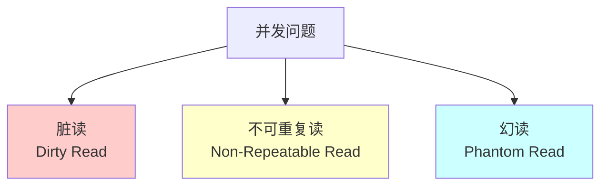
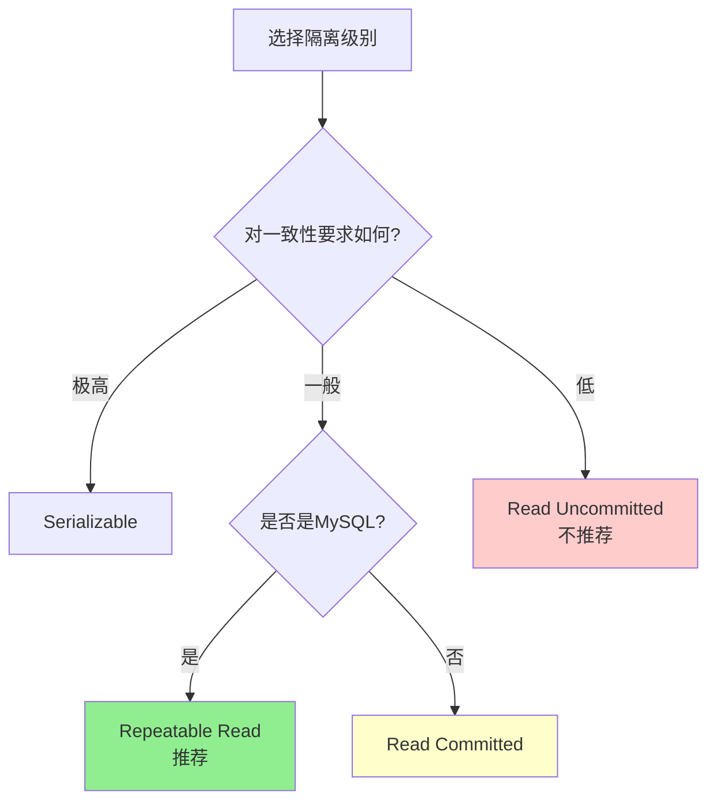

# 事务隔离级别

## 一、什么是事务？

### 银行转账的例子

想象你给朋友转账1000元：

```
步骤1：从你的账户扣除1000元
步骤2：向朋友的账户增加1000元
```

**问题**：如果步骤1成功，但步骤2失败（比如系统崩溃），会发生什么？
- 你的账户少了1000元
- 朋友的账户没有增加
- 钱凭空消失了！

**解决方案**：把这两步操作放在一个**事务**中，要么全部成功，要么全部失败。

### 事务的定义

**事务（Transaction）**：一组数据库操作，作为一个整体执行。

```sql
BEGIN TRANSACTION;  -- 开始事务

UPDATE accounts SET balance = balance - 1000 WHERE user_id = 1;  -- 扣钱
UPDATE accounts SET balance = balance + 1000 WHERE user_id = 2;  -- 加钱

COMMIT;  -- 提交事务（成功）
-- 或
ROLLBACK;  -- 回滚事务（失败，撤销所有操作）
```

### ACID特性

事务必须满足ACID特性：

| 特性 | 英文 | 含义 | 例子 |
|-----|------|------|------|
| **原子性** | Atomicity | 要么全做，要么全不做 | 转账的两步要么都成功，要么都失败 |
| **一致性** | Consistency | 事务前后数据保持一致 | 转账前后，总金额不变 |
| **隔离性** | Isolation | 多个事务互不干扰 | 两个人同时转账不会互相影响 |
| **持久性** | Durability | 提交后永久保存 | 提交后即使系统崩溃，数据也不会丢失 |

**本文档重点讲解：隔离性（Isolation）**

## 二、为什么需要隔离级别？

### 并发问题的场景

想象一个电影票订票系统：

```
初始状态：座位A1有1个空位

时间线：
00:00  用户张三查询 → 座位A1可用
00:01  用户李四查询 → 座位A1可用
00:02  张三购买座位A1
00:03  李四购买座位A1  ← 问题：1个座位卖给了2个人！
```

这就是**并发问题**。如果没有适当的隔离机制，多个事务同时操作数据会出现问题。

### 三种并发问题



#### 问题1：脏读（Dirty Read）

**定义**：读到了其他事务**未提交**的数据。

```
时间线：
T1: BEGIN
T1: UPDATE accounts SET balance = 500 WHERE id = 1;  -- 余额改为500
T2: BEGIN
T2: SELECT balance FROM accounts WHERE id = 1;       -- 读到500（脏读！）
T1: ROLLBACK;  -- T1回滚，余额恢复为1000
T2: COMMIT;    -- T2以为余额是500，实际是1000
```

**危害**：基于错误数据做决策。

#### 问题2：不可重复读（Non-Repeatable Read）

**定义**：同一事务中，两次读取同一数据，结果不同。

```
时间线：
T1: BEGIN
T1: SELECT balance FROM accounts WHERE id = 1;  -- 读到1000
T2: BEGIN
T2: UPDATE accounts SET balance = 500 WHERE id = 1;
T2: COMMIT;  -- T2提交
T1: SELECT balance FROM accounts WHERE id = 1;  -- 读到500（不一致！）
T1: COMMIT;
```

**危害**：事务内的两次查询结果不同，逻辑混乱。

#### 问题3：幻读（Phantom Read）

**定义**：同一事务中，两次查询，记录数量不同。

```
时间线：
T1: BEGIN
T1: SELECT COUNT(*) FROM orders WHERE user_id = 1;  -- 查到5条订单
T2: BEGIN
T2: INSERT INTO orders (user_id) VALUES (1);  -- 插入1条新订单
T2: COMMIT;
T1: SELECT COUNT(*) FROM orders WHERE user_id = 1;  -- 查到6条订单（幻读！）
T1: COMMIT;
```

**危害**：统计数据不准确。

### 问题对比

| 问题 | 读取的数据 | 数据变化原因 | 影响范围 |
|-----|----------|------------|---------|
| **脏读** | 未提交的数据 | 其他事务修改但未提交 | 单条记录 |
| **不可重复读** | 已提交的数据 | 其他事务修改并提交 | 单条记录 |
| **幻读** | 已提交的数据 | 其他事务插入/删除并提交 | 多条记录 |

**记忆方法**：
- **脏读**：读到"脏"数据（未提交的）
- **不可重复读**：两次读不一样（UPDATE）
- **幻读**：突然出现新记录，像"幻觉"（INSERT/DELETE）

## 三、四种隔离级别

数据库提供了四种隔离级别，来解决上述并发问题。

### 级别1：读未提交（Read Uncommitted）

**特点**：最低的隔离级别，事务可以读取其他事务**未提交**的数据。

```sql
SET TRANSACTION ISOLATION LEVEL READ UNCOMMITTED;
```

**解决的问题**：无（所有并发问题都存在）

**存在的问题**：
- ❌ 脏读
- ❌ 不可重复读
- ❌ 幻读

**使用场景**：几乎不用（太不安全）

### 级别2：读已提交（Read Committed）

**特点**：只能读取其他事务**已提交**的数据。

```sql
SET TRANSACTION ISOLATION LEVEL READ COMMITTED;
```

**解决的问题**：
- ✅ 脏读（不会读到未提交的数据）

**存在的问题**：
- ❌ 不可重复读
- ❌ 幻读

**使用场景**：Oracle、PostgreSQL的默认级别

### 级别3：可重复读（Repeatable Read）⭐

**特点**：同一事务中，多次读取同一数据，结果相同。

```sql
SET TRANSACTION ISOLATION LEVEL REPEATABLE READ;
```

**解决的问题**：
- ✅ 脏读
- ✅ 不可重复读

**存在的问题**：
- ⚠️ 幻读（理论上存在，但MySQL InnoDB通过MVCC基本解决了）

**使用场景**：MySQL InnoDB的默认级别

### 级别4：串行化（Serializable）

**特点**：最高的隔离级别，事务串行执行，完全隔离。

```sql
SET TRANSACTION ISOLATION LEVEL SERIALIZABLE;
```

**解决的问题**：
- ✅ 脏读
- ✅ 不可重复读
- ✅ 幻读

**存在的问题**：
- ❌ 性能最差（事务排队执行，并发度为0）

**使用场景**：极少使用（除非对一致性要求极高）

### 隔离级别对比表

| 隔离级别 | 脏读 | 不可重复读 | 幻读 | 性能 | 推荐度 |
|---------|-----|----------|-----|------|-------|
| **Read Uncommitted** | ❌ 可能 | ❌ 可能 | ❌ 可能 | ⭐⭐⭐⭐⭐ | ❌ 不推荐 |
| **Read Committed** | ✅ 避免 | ❌ 可能 | ❌ 可能 | ⭐⭐⭐⭐ | ⭐⭐⭐ |
| **Repeatable Read** | ✅ 避免 | ✅ 避免 | ⚠️ 可能 | ⭐⭐⭐ | ⭐⭐⭐⭐⭐ |
| **Serializable** | ✅ 避免 | ✅ 避免 | ✅ 避免 | ⭐ | ⭐⭐ |

**权衡**：
- 隔离级别越高，一致性越好，但性能越差
- 隔离级别越低，性能越好，但可能出现并发问题

## 四、MySQL的默认隔离级别

### InnoDB的Repeatable Read

MySQL InnoDB存储引擎默认使用**Repeatable Read（可重复读）**。

**查看当前隔离级别**：
```sql
SELECT @@transaction_isolation;
-- 或
SHOW VARIABLES LIKE 'transaction_isolation';
```

**设置会话级别的隔离级别**：
```sql
SET SESSION TRANSACTION ISOLATION LEVEL READ COMMITTED;
```

**设置全局隔离级别**：
```sql
SET GLOBAL TRANSACTION ISOLATION LEVEL READ COMMITTED;
```

### MVCC（多版本并发控制）

MySQL InnoDB通过**MVCC**机制，在Repeatable Read级别下也基本解决了幻读问题。

**MVCC原理（简化）**：

```
每条记录有两个隐藏字段：
- trx_id：最后修改该记录的事务ID
- roll_pointer：指向undo log（历史版本）

事务读取数据时：
1. 根据事务开始时的快照，读取对应版本的数据
2. 如果该版本被其他事务修改，通过undo log回溯到事务开始时的版本
3. 保证了可重复读
```

**示例**：
```
初始数据：balance = 1000 (trx_id=100)

T1: BEGIN (trx_id=101)
T1: SELECT balance;  -- 读到1000

T2: BEGIN (trx_id=102)
T2: UPDATE balance = 500;  -- 新版本：balance=500 (trx_id=102)
T2: COMMIT;

T1: SELECT balance;  -- 仍然读到1000（读取trx_id=100的版本）
T1: COMMIT;

新事务：
T3: BEGIN (trx_id=103)
T3: SELECT balance;  -- 读到500（最新版本）
```

**MVCC的好处**：
- 读不阻塞写，写不阻塞读
- 提高并发性能
- 在Repeatable Read级别下基本解决幻读

## 五、如何选择隔离级别

### 选择原则



### 实际场景案例

#### 场景1：电商订单系统

**需求**：
- 用户下单时，需要检查库存
- 扣减库存后，创建订单
- 要求库存不能超卖

**选择**：**Repeatable Read**

**理由**：
- 需要避免不可重复读（检查库存时和扣减库存时，数据不能变）
- MySQL的Repeatable Read性能好，且通过MVCC解决了幻读

**实现**：
```sql
SET TRANSACTION ISOLATION LEVEL REPEATABLE READ;

BEGIN;

-- 1. 检查库存（加锁）
SELECT stock FROM products WHERE id = 1 FOR UPDATE;

-- 2. 扣减库存
UPDATE products SET stock = stock - 1 WHERE id = 1;

-- 3. 创建订单
INSERT INTO orders (product_id, user_id) VALUES (1, 123);

COMMIT;
```

**关键点**：使用`FOR UPDATE`锁定记录，防止并发扣减。

#### 场景2：统计报表系统

**需求**：
- 生成销售报表
- 对实时性要求不高
- 只读操作

**选择**：**Read Committed**

**理由**：
- 不需要可重复读（报表数据允许有微小差异）
- 性能更好
- 只读操作，不会有数据冲突

#### 场景3：金融转账系统

**需求**：
- 账户余额转账
- 绝对不能出错
- 对性能要求可以放宽

**选择**：**Serializable**

**理由**：
- 金融数据，一致性要求极高
- 可以牺牲性能换取安全

**实现**：
```sql
SET TRANSACTION ISOLATION LEVEL SERIALIZABLE;

BEGIN;

-- 转账操作
UPDATE accounts SET balance = balance - 1000 WHERE id = 1;
UPDATE accounts SET balance = balance + 1000 WHERE id = 2;

COMMIT;
```

#### 场景4：日志记录系统

**需求**：
- 只插入日志，不读取
- 对一致性要求低
- 对性能要求高

**选择**：**Read Uncommitted**（极少情况）

**理由**：
- 只写入，不读取，没有并发读问题
- 性能最好

**注意**：实际中几乎不用Read Uncommitted，这里仅作示例。

### 选择建议

**大多数情况**：
- **MySQL**：使用默认的**Repeatable Read**
- **PostgreSQL/Oracle**：使用默认的**Read Committed**

**特殊情况**：
- 金融、支付等对一致性要求极高：**Serializable**
- 日志、监控等对一致性要求低：**Read Committed**或更低

**不要做的**：
- ❌ 不要为了性能盲目降低隔离级别
- ❌ 不要所有表都用Serializable（性能会崩溃）
- ❌ 不要在事务中混用不同隔离级别

## 六、实践建议

### 1. 使用数据库默认级别

```sql
-- 大多数情况，使用默认级别就够了
-- MySQL InnoDB: Repeatable Read
-- PostgreSQL: Read Committed
```

### 2. 特定场景调整

```sql
-- 只在特定事务中调整
SET TRANSACTION ISOLATION LEVEL READ COMMITTED;
BEGIN;
-- 执行操作
COMMIT;
```

### 3. 配合锁使用

```sql
-- 关键操作加锁，确保原子性
BEGIN;
SELECT * FROM products WHERE id = 1 FOR UPDATE;  -- 悲观锁
UPDATE products SET stock = stock - 1 WHERE id = 1;
COMMIT;
```

### 4. 监控死锁

```sql
-- 查看死锁信息
SHOW ENGINE INNODB STATUS;

-- 查看当前事务
SELECT * FROM information_schema.innodb_trx;
```

### 5. 设置超时时间

```sql
-- 避免长时间持锁
SET innodb_lock_wait_timeout = 50;  -- 50秒超时
```

## 七、小结

**核心要点**：

1. **事务的ACID特性**：原子性、一致性、隔离性、持久性

2. **三种并发问题**：
   - 脏读：读到未提交的数据
   - 不可重复读：两次读结果不同（UPDATE）
   - 幻读：记录数量变化（INSERT/DELETE）

3. **四种隔离级别**：
   - Read Uncommitted：性能最好，最不安全
   - Read Committed：避免脏读
   - Repeatable Read：避免脏读 + 不可重复读（MySQL默认）
   - Serializable：完全隔离，性能最差

4. **选择建议**：
   - 大多数情况：使用数据库默认级别
   - 金融场景：Serializable
   - 报表场景：Read Committed

5. **MySQL特点**：
   - 默认Repeatable Read
   - 通过MVCC解决幻读
   - 性能与一致性平衡较好

**记忆口诀**：
- 未提交读，问题多
- 已提交读，Oracle用
- 可重复读，MySQL选
- 串行化读，金融场景

---

**下一步**：运行 `demo/` 目录中的代码示例，实际感受不同隔离级别的差异！

💡 **提示**：理解隔离级别是数据库优化的基础，面试中也是高频考点。
