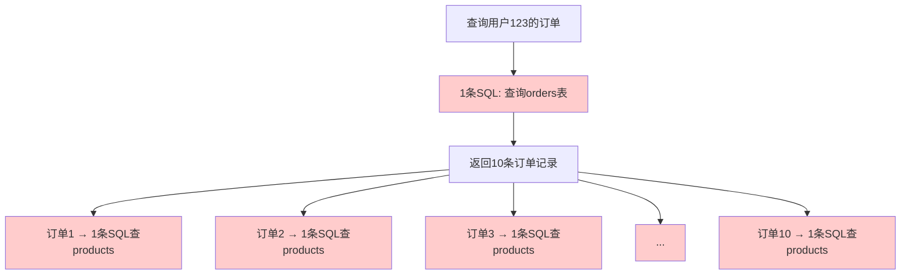

# N+1 查询问题

## 一、什么是N+1查询问题？

### 电商订单的例子

**需求**：查询用户的订单列表，并显示每个订单的商品信息。

```java
// 查询用户的所有订单
List<Order> orders = orderRepository.findByUserId(123);

// 遍历订单，查询每个订单的商品
for (Order order : orders) {
    List<Product> products = productRepository.findByOrderId(order.getId());
    order.setProducts(products);
}
```

**执行的SQL**：
```sql
-- 第1条SQL：查询订单（1次查询）
SELECT * FROM orders WHERE user_id = 123;
-- 返回10条订单

-- 第2-11条SQL：查询每个订单的商品（N次查询）
SELECT * FROM products WHERE order_id = 1;
SELECT * FROM products WHERE order_id = 2;
SELECT * FROM products WHERE order_id = 3;
...
SELECT * FROM products WHERE order_id = 10;
```

**总共执行**：1 + N = 1 + 10 = **11条SQL**

这就是**N+1查询问题**：
- 1次查询主表（orders）
- N次查询关联表（products），N是主表的记录数

### 问题示意图



### 为什么叫"N+1"？

```
主查询：1次
关联查询：N次（N = 主查询返回的记录数）
总计：N+1次
```

## 二、为什么是个问题？

### 性能影响

**场景对比**：查询100个用户，每个用户有10个订单

| 方式 | SQL执行次数 | 数据库往返次数 | 耗时估算 |
|-----|-----------|--------------|---------|
| **N+1查询** | 1 + 100×10 = 1001次 | 1001次 | 1001×10ms = 10秒 |
| **JOIN查询** | 1次 | 1次 | 50ms |

**性能差距：200倍！**

### 资源消耗

```
问题1：数据库连接占用
- 1001次查询需要保持数据库连接
- 高并发时连接池耗尽

问题2：网络开销
- 1001次网络往返
- 带宽占用大

问题3：数据库压力
- 1001次SQL执行
- CPU、内存、磁盘IO都承压
```

### 真实案例

```
某电商网站首页：
- 显示10个热门商品
- 每个商品显示评论数量

初始代码（N+1问题）：
1次查询商品 + 10次统计评论
→ 页面加载时间：3秒

优化后（JOIN查询）：
1次查询
→ 页面加载时间：0.2秒
```

## 三、N+1问题的常见场景

### 场景1：一对多关系

```java
// 用户 → 订单（一对多）
class User {
    Long id;
    String name;
    List<Order> orders;  // 关联的订单
}

// ❌ N+1问题
List<User> users = userRepository.findAll();  // 1次查询
for (User user : users) {
    List<Order> orders = orderRepository.findByUserId(user.getId());  // N次查询
    user.setOrders(orders);
}
```

### 场景2：多对一关系

```java
// 订单 → 用户（多对一）
class Order {
    Long id;
    Long userId;
    User user;  // 关联的用户
}

// ❌ N+1问题
List<Order> orders = orderRepository.findAll();  // 1次查询
for (Order order : orders) {
    User user = userRepository.findById(order.getUserId());  // N次查询
    order.setUser(user);
}
```

### 场景3：多对多关系

```java
// 学生 → 课程（多对多）
class Student {
    Long id;
    String name;
    List<Course> courses;  // 关联的课程
}

// ❌ N+1问题
List<Student> students = studentRepository.findAll();  // 1次查询
for (Student student : students) {
    List<Course> courses = courseRepository.findByStudentId(student.getId());  // N次查询
    student.setCourses(courses);
}
```

### 场景4：嵌套N+1

```java
// 用户 → 订单 → 商品（嵌套）
List<User> users = userRepository.findAll();  // 1次查询

for (User user : users) {
    List<Order> orders = orderRepository.findByUserId(user.getId());  // N次查询
    
    for (Order order : orders) {
        List<Product> products = productRepository.findByOrderId(order.getId());  // N×M次查询
        order.setProducts(products);
    }
    
    user.setOrders(orders);
}
```

**总SQL数**：1 + N + N×M

如果有100个用户，每个用户10个订单：
- 1 + 100 + 100×10 = **1101条SQL**！

## 四、解决方案

### 方案1：JOIN查询（一次性查询）⭐ 推荐

**原理**：用JOIN把关联表的数据一次性查出来。

```sql
-- ✅ 一次查询
SELECT u.*, o.* 
FROM users u 
LEFT JOIN orders o ON u.id = o.user_id 
WHERE u.id IN (1, 2, 3);
```

**Java代码**：
```java
// 纯JDBC实现
String sql = "SELECT u.id as user_id, u.name, o.id as order_id, o.amount " +
             "FROM users u LEFT JOIN orders o ON u.id = o.user_id " +
             "WHERE u.id IN (?, ?, ?)";

// 执行查询，手动组装对象
Map<Long, User> userMap = new HashMap<>();
ResultSet rs = statement.executeQuery(sql);

while (rs.next()) {
    Long userId = rs.getLong("user_id");
    User user = userMap.computeIfAbsent(userId, id -> {
        User u = new User();
        u.setId(id);
        u.setName(rs.getString("name"));
        u.setOrders(new ArrayList<>());
        return u;
    });
    
    if (rs.getLong("order_id") != 0) {
        Order order = new Order();
        order.setId(rs.getLong("order_id"));
        order.setAmount(rs.getBigDecimal("amount"));
        user.getOrders().add(order);
    }
}
```

**优点**：
- 只有1次数据库查询
- 性能最好

**缺点**：
- JOIN数据量可能很大（笛卡尔积）
- 代码复杂（需要手动组装对象）

### 方案2：IN查询（两次查询）⭐ 推荐

**原理**：先查主表，再用IN一次性查关联表。

```sql
-- 第1次查询：查主表
SELECT * FROM users WHERE id IN (1, 2, 3);
-- 返回3个用户

-- 第2次查询：用IN一次性查关联表
SELECT * FROM orders WHERE user_id IN (1, 2, 3);
-- 返回所有这些用户的订单
```

**Java代码**：
```java
// 1. 查询用户
List<User> users = userRepository.findByIdIn(Arrays.asList(1L, 2L, 3L));

// 2. 收集所有用户ID
List<Long> userIds = users.stream()
    .map(User::getId)
    .collect(Collectors.toList());

// 3. 一次性查询所有订单
List<Order> orders = orderRepository.findByUserIdIn(userIds);

// 4. 手动组装关系
Map<Long, List<Order>> orderMap = orders.stream()
    .collect(Collectors.groupingBy(Order::getUserId));

for (User user : users) {
    user.setOrders(orderMap.getOrDefault(user.getId(), Collections.emptyList()));
}
```

**SQL执行**：
```sql
SELECT * FROM users WHERE id IN (1, 2, 3);
SELECT * FROM orders WHERE user_id IN (1, 2, 3);
```

**总共2次查询**（不管有多少用户）

**优点**：
- 查询次数固定（2次）
- 代码清晰
- 适合大多数场景

**缺点**：
- 需要手动组装关系
- IN子句有长度限制（通常1000个）

### 方案3：批量查询

**原理**：把N次查询分批执行，减少查询次数。

```java
// 假设有1000个用户，分10批查询，每批100个
int batchSize = 100;
List<User> allUsers = userRepository.findAll();

for (int i = 0; i < allUsers.size(); i += batchSize) {
    int end = Math.min(i + batchSize, allUsers.size());
    List<User> batch = allUsers.subList(i, end);
    
    List<Long> userIds = batch.stream()
        .map(User::getId)
        .collect(Collectors.toList());
    
    List<Order> orders = orderRepository.findByUserIdIn(userIds);
    
    // 组装关系
    Map<Long, List<Order>> orderMap = orders.stream()
        .collect(Collectors.groupingBy(Order::getUserId));
    
    for (User user : batch) {
        user.setOrders(orderMap.get(user.getId()));
    }
}
```

**查询次数**：1 + (1000 / 100) = **11次**

**优点**：
- 避免IN子句过长
- 内存占用可控

**缺点**：
- 查询次数仍然较多

### 方案4：缓存

**原理**：把关联数据缓存起来，减少查询。

```java
// 用户信息缓存
@Cacheable("users")
public User findById(Long id) {
    return userRepository.findById(id).orElse(null);
}

// 查询订单时，从缓存获取用户
List<Order> orders = orderRepository.findAll();
for (Order order : orders) {
    User user = userService.findById(order.getUserId());  // 从缓存获取
    order.setUser(user);
}
```

**优点**：
- 重复查询很快（命中缓存）
- 适合读多写少的场景

**缺点**：
- 缓存一致性问题
- 首次查询仍然慢

## 五、ORM框架中的N+1问题

### JPA/Hibernate的懒加载陷阱

**默认行为**：关联对象懒加载（LAZY）

```java
@Entity
class User {
    @Id
    private Long id;
    
    @OneToMany(mappedBy = "user", fetch = FetchType.LAZY)  // 默认懒加载
    private List<Order> orders;
}

// ❌ 触发N+1
List<User> users = userRepository.findAll();  // 1次查询
for (User user : users) {
    List<Order> orders = user.getOrders();  // 触发N次查询！
    System.out.println(orders.size());
}
```

**解决方案1：使用JOIN FETCH**

```java
// ✅ 一次性查询
@Query("SELECT u FROM User u LEFT JOIN FETCH u.orders WHERE u.id IN :ids")
List<User> findWithOrders(@Param("ids") List<Long> ids);
```

**解决方案2：使用@EntityGraph**

```java
@EntityGraph(attributePaths = {"orders"})  // 指定预加载的关联
List<User> findAll();
```

**解决方案3：使用DTO投影**

```java
// 只查询需要的字段，避免加载关联
@Query("SELECT new com.example.UserDTO(u.id, u.name) FROM User u")
List<UserDTO> findAllDTO();
```

### MyBatis的N+1问题

**问题示例**：

```xml
<!-- 查询用户 -->
<select id="findAll" resultMap="UserMap">
    SELECT * FROM users
</select>

<resultMap id="UserMap" type="User">
    <id property="id" column="id"/>
    <result property="name" column="name"/>
    
    <!-- ❌ 关联查询orders（触发N次） -->
    <collection property="orders" 
                select="findOrdersByUserId" 
                column="id"/>
</resultMap>

<select id="findOrdersByUserId" resultType="Order">
    SELECT * FROM orders WHERE user_id = #{userId}
</select>
```

**解决方案：使用嵌套结果映射**

```xml
<!-- ✅ 一次JOIN查询 -->
<select id="findAllWithOrders" resultMap="UserWithOrdersMap">
    SELECT u.*, o.id as order_id, o.amount 
    FROM users u 
    LEFT JOIN orders o ON u.id = o.user_id
</select>

<resultMap id="UserWithOrdersMap" type="User">
    <id property="id" column="id"/>
    <result property="name" column="name"/>
    
    <collection property="orders" ofType="Order">
        <id property="id" column="order_id"/>
        <result property="amount" column="amount"/>
    </collection>
</resultMap>
```

## 六、如何检测N+1问题

### 方法1：开启SQL日志

**Spring Boot配置**：
```yaml
spring:
  jpa:
    show-sql: true
    properties:
      hibernate:
        format_sql: true
        use_sql_comments: true
```

**观察日志**：
```
Hibernate: select * from users
Hibernate: select * from orders where user_id=?
Hibernate: select * from orders where user_id=?
Hibernate: select * from orders where user_id=?
...
```

如果看到大量相似的SQL，可能存在N+1问题。

### 方法2：使用监控工具

**工具**：
- **Hibernate Statistics**：统计查询次数
- **P6Spy**：记录所有SQL
- **JPA Query Counter**：计数查询

**示例：Hibernate Statistics**
```java
Statistics stats = sessionFactory.getStatistics();
stats.setStatisticsEnabled(true);

// 执行业务代码
userService.findAllWithOrders();

// 查看统计
System.out.println("Query count: " + stats.getQueryExecutionCount());
```

### 方法3：性能测试

```java
@Test
public void testNPlusOne() {
    long start = System.currentTimeMillis();
    
    List<User> users = userRepository.findAll();
    for (User user : users) {
        user.getOrders().size();  // 触发懒加载
    }
    
    long end = System.currentTimeMillis();
    System.out.println("Time: " + (end - start) + "ms");
    // 如果时间过长（>1秒），可能存在N+1问题
}
```

## 七、最佳实践

### 实践1：默认使用LAZY加载

```java
@OneToMany(fetch = FetchType.LAZY)  // ✅ 默认懒加载
private List<Order> orders;

// 需要时显式JOIN FETCH
@Query("SELECT u FROM User u JOIN FETCH u.orders WHERE u.id = :id")
User findWithOrders(@Param("id") Long id);
```

**原因**：EAGER加载会导致总是查询关联数据，即使不需要。

### 实践2：根据场景选择方案

```
场景1：关联数据少（<100条）
→ 使用JOIN查询

场景2：关联数据多（>1000条）
→ 使用IN查询（分批）

场景3：关联数据非常多（>10000条）
→ 考虑分页查询

场景4：频繁访问相同数据
→ 使用缓存
```

### 实践3：使用DTO避免过度查询

```java
// ❌ 查询整个实体（包含不需要的字段）
List<User> users = userRepository.findAll();

// ✅ 只查询需要的字段
@Query("SELECT new com.example.UserDTO(u.id, u.name) FROM User u")
List<UserDTO> findAllDTO();
```

### 实践4：建立性能监控

```java
// 记录慢查询
if (queryTime > 100) {  // 超过100ms
    log.warn("Slow query detected: {} ms, SQL: {}", queryTime, sql);
}

// 统计查询次数
if (queryCount > 10) {  // 单次请求超过10次查询
    log.warn("Possible N+1 problem: {} queries", queryCount);
}
```

## 八、小结

**核心要点**：

1. **N+1问题定义**：1次查主表 + N次查关联表

2. **危害**：
   - 性能差（几百倍差距）
   - 数据库压力大
   - 连接池耗尽

3. **常见场景**：
   - 一对多、多对一、多对多关系
   - ORM懒加载
   - 嵌套查询

4. **解决方案**：
   - JOIN查询（1次查询，性能最好）
   - IN查询（2次查询，代码清晰）
   - 批量查询（N/batch次）
   - 缓存（适合读多写少）

5. **检测方法**：
   - 开启SQL日志
   - 使用监控工具
   - 性能测试

6. **最佳实践**：
   - 默认LAZY加载
   - 显式JOIN FETCH
   - 使用DTO
   - 性能监控

**记忆口诀**：
- 主查一次关联N
- 性能影响要当心
- JOIN或IN解决它
- 日志监控不能停

---

**下一步**：运行 `demo/` 目录中的代码，实际体验N+1问题的性能差距！

💡 **提示**：N+1问题是ORM使用中最常见的性能陷阱，掌握它能让你的应用性能提升几十倍！
