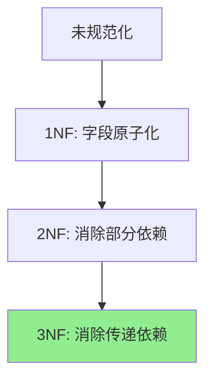
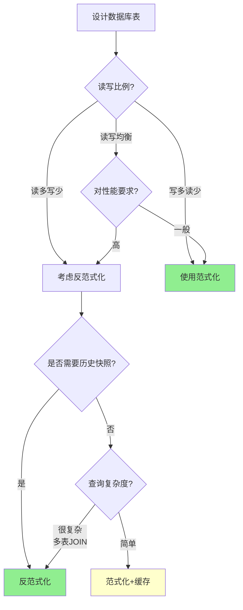

# 范式 vs 反范式

## 一、什么是范式？

### 图书馆的类比

想象你在管理一个图书馆的借阅记录：

**方案1：全部信息放在一起（未规范化）**
```
借阅记录表：
| 借阅ID | 书名 | 作者 | 出版社 | 读者姓名 | 读者电话 | 借阅日期 |
|-------|------|------|--------|---------|---------|---------|
| 1     | Java编程 | 张三 | 清华出版社 | 李四 | 138xxx | 2026-01-01 |
| 2     | Java编程 | 张三 | 清华出版社 | 王五 | 139xxx | 2026-01-02 |
```

**问题**：
- 《Java编程》的信息重复了2次
- 如果要修改作者名字，需要改多条记录
- 如果拼写错误，数据不一致

**方案2：分成多张表（规范化）**
```
图书表：
| 图书ID | 书名 | 作者 | 出版社 |
|-------|------|------|--------|
| 1     | Java编程 | 张三 | 清华出版社 |

读者表：
| 读者ID | 姓名 | 电话 |
|-------|------|------|
| 1     | 李四 | 138xxx |
| 2     | 王五 | 139xxx |

借阅记录表：
| 借阅ID | 图书ID | 读者ID | 借阅日期 |
|-------|--------|--------|---------|
| 1     | 1      | 1      | 2026-01-01 |
| 2     | 1      | 2      | 2026-01-02 |
```

**优点**：
- 图书信息只存一份
- 修改作者名字只需改一处
- 数据一致性好

这就是**范式化（Normalization）**的核心思想：减少数据冗余，提高数据一致性。

### 范式的定义

**范式（Normal Form）**：数据库设计的规范，用于减少数据冗余和维护数据完整性。

**常见范式**：
- 第一范式（1NF）：字段不可再分
- 第二范式（2NF）：消除部分依赖
- 第三范式（3NF）：消除传递依赖
- BC范式（BCNF）：更严格的3NF
- 第四范式（4NF）、第五范式（5NF）：较少使用

## 二、三大范式详解

### 第一范式（1NF）：字段不可再分

**定义**：每个字段都是原子的，不可再分。

**违反1NF的例子**：
```
❌ 用户表：
| 用户ID | 姓名 | 联系方式 |
|-------|------|---------|
| 1     | 张三 | 138xxx, zhangsan@example.com |
```

**问题**：联系方式字段包含多个值（手机+邮箱），不可原子。

**符合1NF**：
```
✅ 用户表：
| 用户ID | 姓名 | 手机 | 邮箱 |
|-------|------|------|------|
| 1     | 张三 | 138xxx | zhangsan@example.com |
```

**或者**：
```
✅ 用户表：
| 用户ID | 姓名 |
|-------|------|
| 1     | 张三 |

用户联系方式表：
| ID | 用户ID | 类型 | 联系方式 |
|----|-------|------|---------|
| 1  | 1     | 手机 | 138xxx |
| 2  | 1     | 邮箱 | zhangsan@example.com |
```

### 第二范式（2NF）：消除部分依赖

**前提**：已满足1NF。

**定义**：非主键字段必须完全依赖于主键，不能只依赖主键的一部分。

**违反2NF的例子**：
```
❌ 订单明细表（联合主键：订单ID + 商品ID）：
| 订单ID | 商品ID | 商品名称 | 商品价格 | 数量 | 订单日期 |
|-------|--------|---------|---------|-----|---------|
| 1     | 101    | 手机    | 2999    | 2   | 2026-01-01 |
| 1     | 102    | 耳机    | 199     | 1   | 2026-01-01 |
```

**问题**：
- 商品名称、商品价格只依赖商品ID（部分依赖）
- 订单日期只依赖订单ID（部分依赖）
- 违反了2NF

**符合2NF**：
```
✅ 商品表：
| 商品ID | 商品名称 | 商品价格 |
|-------|---------|---------|
| 101   | 手机    | 2999    |
| 102   | 耳机    | 199     |

订单表：
| 订单ID | 订单日期 |
|-------|---------|
| 1     | 2026-01-01 |

订单明细表：
| 订单ID | 商品ID | 数量 |
|-------|--------|-----|
| 1     | 101    | 2   |
| 1     | 102    | 1   |
```

### 第三范式（3NF）：消除传递依赖

**前提**：已满足2NF。

**定义**：非主键字段不能依赖于其他非主键字段（消除传递依赖）。

**违反3NF的例子**：
```
❌ 订单表：
| 订单ID | 用户ID | 用户姓名 | 用户电话 | 商品总额 |
|-------|--------|---------|---------|---------|
| 1     | 1      | 张三    | 138xxx  | 6197    |
```

**问题**：
- 用户姓名、用户电话依赖于用户ID
- 用户ID又依赖于订单ID
- 形成传递依赖：订单ID → 用户ID → 用户姓名/电话

**符合3NF**：
```
✅ 用户表：
| 用户ID | 用户姓名 | 用户电话 |
|-------|---------|---------|
| 1     | 张三    | 138xxx  |

订单表：
| 订单ID | 用户ID | 商品总额 |
|-------|--------|---------|
| 1     | 1      | 6197    |
```

### 范式总结



**记忆口诀**：
- 1NF：列不可分
- 2NF：完全依赖主键
- 3NF：非主键不互相依赖

## 三、范式化的优缺点

### 优点

**1. 减少数据冗余**
```
未规范化：用户信息在每个订单中重复
✅ 规范化：用户信息只存一份
→ 节省存储空间
```

**2. 提高数据一致性**
```
未规范化：修改用户电话需要改多条订单记录
✅ 规范化：只需修改用户表中的一条记录
→ 避免数据不一致
```

**3. 易于维护**
```
✅ 每张表职责单一
✅ 修改影响范围小
✅ 数据完整性约束清晰
```

### 缺点

**1. 查询性能下降**
```
需求：查询订单及用户信息

范式化：需要JOIN多张表
SELECT o.*, u.name, u.phone 
FROM orders o 
JOIN users u ON o.user_id = u.id 
WHERE o.id = 1;

→ JOIN操作有性能开销
```

**2. 查询复杂**
```
查询订单的完整信息可能需要JOIN 5-6张表
→ SQL语句复杂
→ 维护成本高
```

**3. 应用层复杂**
```
✅ 需要组装数据
✅ 可能出现N+1查询问题
```

## 四、什么是反范式？

### 反范式的定义

**反范式化（Denormalization）**：有意引入冗余，用空间换时间，提高查询性能。

### 反范式化的例子

**场景**：电商订单系统

**范式化设计**：
```
订单表：
| 订单ID | 用户ID | 创建时间 |

用户表：
| 用户ID | 姓名 | 电话 | 地址 |

查询订单需要JOIN：
SELECT o.*, u.name, u.phone, u.address 
FROM orders o 
JOIN users u ON o.user_id = u.id;
```

**反范式化设计**：
```
订单表：
| 订单ID | 用户ID | 用户姓名 | 用户电话 | 用户地址 | 创建时间 |

查询订单：
SELECT * FROM orders WHERE id = 1;
→ 无需JOIN，查询更快！
```

**代价**：
- 用户信息冗余（每个订单都存一份）
- 用户修改电话后，历史订单中的电话不会更新

**但这是合理的**：
- 订单是历史快照（当时的用户信息）
- 查询频率远高于修改
- 性能提升明显

### 反范式化的常见场景

#### 场景1：统计字段

**范式化**：
```
用户表：
| 用户ID | 姓名 |

订单表：
| 订单ID | 用户ID | 金额 |

查询用户的订单总额：
SELECT u.*, SUM(o.amount) as total_amount
FROM users u
LEFT JOIN orders o ON u.id = o.user_id
GROUP BY u.id;
→ 每次查询都要计算
```

**反范式化**：
```
用户表：
| 用户ID | 姓名 | 订单总额 |

查询用户的订单总额：
SELECT * FROM users WHERE id = 1;
→ 直接读取，无需计算

维护：创建订单时更新用户表的订单总额
UPDATE users SET total_amount = total_amount + 100 WHERE id = 1;
```

#### 场景2：快照数据

**场景**：订单商品信息

**反范式化**：
```
订单明细表：
| 明细ID | 订单ID | 商品ID | 商品名称 | 商品价格 | 数量 |

→ 商品名称、价格冗余存储（快照）

原因：
- 商品信息可能变化（改名、调价）
- 订单要保留下单时的信息
```

#### 场景3：热点数据

**场景**：文章阅读量

**反范式化**：
```
文章表：
| 文章ID | 标题 | 内容 | 阅读量 |

→ 阅读量直接存储，不用COUNT

更新：
UPDATE articles SET view_count = view_count + 1 WHERE id = 1;

→ 高并发下可能需要异步更新或使用Redis缓存
```

## 五、范式 vs 反范式对比

| 维度 | 范式化 | 反范式化 |
|-----|-------|---------|
| **数据冗余** | 少 | 多 |
| **存储空间** | 小 | 大 |
| **查询性能** | 慢（需要JOIN） | 快（无需JOIN） |
| **写入性能** | 快 | 慢（需要更新多处） |
| **数据一致性** | 容易保证 | 需要额外维护 |
| **查询复杂度** | 高 | 低 |
| **适用场景** | 写多读少 | 读多写少 |

### 性能对比示例

**场景**：查询订单及用户信息（100万条订单）

| 方式 | SQL | 耗时 |
|-----|-----|------|
| **范式化** | `SELECT ... FROM orders JOIN users ...` | 500ms |
| **反范式化** | `SELECT * FROM orders ...` | 10ms |

**性能提升：50倍**

## 六、如何选择？

### 决策树



### 实践建议

#### 建议1：默认使用范式化

```
原因：
✅ 数据一致性好
✅ 易于维护
✅ 符合数据库设计原则

在遇到性能问题时，再考虑反范式化
```

#### 建议2：读多写少场景用反范式化

```
典型场景：
- 订单系统（历史订单很少修改）
- 文章系统（阅读量远大于发布量）
- 统计报表（查询频繁，更新定时）
```

#### 建议3：混合使用

```
核心表：范式化（如用户表、商品表）
业务表：反范式化（如订单表、统计表）
```

#### 建议4：用缓存代替反范式化

```
场景：统计数据

方案1：反范式化（存储统计字段）
→ 需要维护数据一致性

方案2：缓存（Redis）
→ 计算后缓存，定期刷新
→ 不影响数据库设计

推荐：优先考虑缓存
```

## 七、实战案例

### 案例1：电商订单系统

**需求**：
- 用户下单后，订单要保留当时的商品信息
- 商品信息可能变化（改名、调价）
- 查询订单要显示完整信息

**设计**：

**商品表（范式化）**：
```sql
CREATE TABLE products (
    id BIGINT PRIMARY KEY,
    name VARCHAR(200),
    price DECIMAL(10,2),
    stock INT
);
```

**订单明细表（反范式化）**：
```sql
CREATE TABLE order_items (
    id BIGINT PRIMARY KEY,
    order_id BIGINT,
    product_id BIGINT,
    product_name VARCHAR(200),    -- 冗余：商品名称快照
    product_price DECIMAL(10,2),  -- 冗余：商品价格快照
    quantity INT
);
```

**理由**：
- 订单是历史快照，需要保留下单时的信息
- 即使商品改名/调价，历史订单不受影响
- 查询订单无需JOIN商品表

### 案例2：社交媒体点赞数

**需求**：
- 显示文章的点赞数
- 点赞数查询频繁（每次浏览都要显示）
- 点赞数变化频繁（用户随时点赞）

**方案对比**：

**方案1：范式化**
```sql
文章表：
CREATE TABLE posts (
    id BIGINT PRIMARY KEY,
    title VARCHAR(200),
    content TEXT
);

点赞表：
CREATE TABLE likes (
    id BIGINT PRIMARY KEY,
    post_id BIGINT,
    user_id BIGINT
);

查询点赞数：
SELECT p.*, COUNT(l.id) as like_count
FROM posts p
LEFT JOIN likes l ON p.id = l.post_id
WHERE p.id = 1
GROUP BY p.id;
→ 每次查询都要COUNT，慢
```

**方案2：反范式化**
```sql
文章表：
CREATE TABLE posts (
    id BIGINT PRIMARY KEY,
    title VARCHAR(200),
    content TEXT,
    like_count INT DEFAULT 0  -- 冗余字段
);

查询点赞数：
SELECT * FROM posts WHERE id = 1;
→ 直接读取，快

维护：点赞时更新
UPDATE posts SET like_count = like_count + 1 WHERE id = 1;
```

**方案3：缓存（推荐）**
```java
// 点赞数缓存在Redis
String key = "post:1:like_count";
Long count = redis.get(key);
if (count == null) {
    count = likeRepository.countByPostId(1);
    redis.set(key, count, 3600);  // 缓存1小时
}
```

**推荐方案3**：
- 不改变数据库设计
- 查询速度快（Redis）
- 数据一致性好（定期刷新）

### 案例3：用户订单统计

**需求**：
- 显示用户的订单总数、订单总额
- 用户中心页面频繁查询
- 订单创建后很少修改

**方案**：

**范式化**：
```sql
用户表：
CREATE TABLE users (
    id BIGINT PRIMARY KEY,
    name VARCHAR(100)
);

订单表：
CREATE TABLE orders (
    id BIGINT PRIMARY KEY,
    user_id BIGINT,
    amount DECIMAL(10,2)
);

查询统计：
SELECT u.*, COUNT(o.id) as order_count, SUM(o.amount) as total_amount
FROM users u
LEFT JOIN orders o ON u.id = o.user_id
WHERE u.id = 1
GROUP BY u.id;
→ 每次都要计算，慢
```

**反范式化**：
```sql
用户表：
CREATE TABLE users (
    id BIGINT PRIMARY KEY,
    name VARCHAR(100),
    order_count INT DEFAULT 0,        -- 冗余：订单总数
    total_amount DECIMAL(10,2) DEFAULT 0  -- 冗余：订单总额
);

查询统计：
SELECT * FROM users WHERE id = 1;
→ 直接读取

维护：创建订单时更新
UPDATE users 
SET order_count = order_count + 1,
    total_amount = total_amount + 100
WHERE id = 1;
```

**权衡**：
- 查询性能：提升100倍
- 写入性能：略微下降（多一次UPDATE）
- 数据一致性：需要在事务中维护

## 八、小结

**核心要点**：

1. **范式化**：
   - 减少冗余、提高一致性
   - 适合写多读少、数据频繁变化

2. **反范式化**：
   - 增加冗余、提高查询性能
   - 适合读多写少、历史快照数据

3. **三大范式**：
   - 1NF：字段原子化
   - 2NF：消除部分依赖
   - 3NF：消除传递依赖

4. **选择建议**：
   - 默认使用范式化
   - 性能瓶颈时考虑反范式化
   - 优先考虑缓存方案
   - 核心表范式化，业务表可反范式化

5. **常见反范式化场景**：
   - 历史快照（订单商品信息）
   - 统计字段（点赞数、订单总额）
   - 热点数据（阅读量、浏览量）

**记忆口诀**：
- 范式减冗余，一致性好
- 反范式增冗余，查询更快
- 读多写少用反范式
- 写多读少用范式化

---

**下一步**：运行 `demo/` 目录中的代码，对比范式化和反范式化的性能差异！

💡 **提示**：范式化是基础，反范式化是优化。先保证正确性，再考虑性能。
