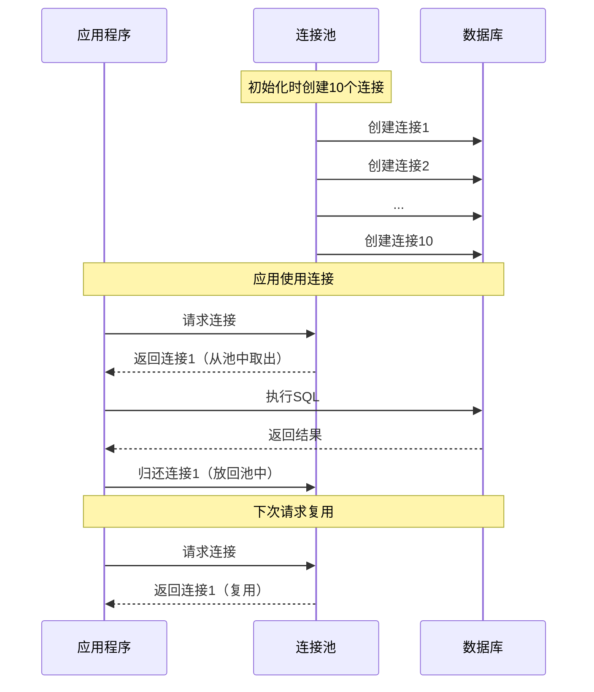

# 数据库连接池管理

## 一、什么是数据库连接池？

### 餐厅的类比

想象你去餐厅吃饭：

**没有连接池（每次创建新连接）**：
```
场景：每个顾客来了，餐厅都要临时搭建一张桌子

顾客A来了 → 搭建桌子（耗时1分钟）→ 吃饭 → 拆除桌子
顾客B来了 → 搭建桌子（耗时1分钟）→ 吃饭 → 拆除桌子
...

问题：
- 搭建桌子很慢（建立数据库连接耗时）
- 浪费资源（不断搭建和拆除）
- 效率低下
```

**有连接池（复用连接）**：
```
场景：餐厅准备好10张桌子

顾客A来了 → 直接坐到空桌子 → 吃饭 → 离开（桌子留给下一个顾客）
顾客B来了 → 直接坐到空桌子 → 吃饭 → 离开
...

优点：
- 无需等待（桌子已准备好）
- 资源复用（桌子重复使用）
- 效率高
```

### 连接池的定义

**数据库连接池（Connection Pool）**：预先创建一定数量的数据库连接，放在"池"中，需要时取出，用完后放回，实现连接的复用。

### 为什么需要连接池？

#### 问题1：连接创建很慢

```
创建一个数据库连接的步骤：
1. TCP三次握手（网络开销）
2. 数据库身份验证
3. 初始化会话参数
4. 分配资源

耗时：50-200ms

如果每次查询都创建新连接：
100个并发请求 × 100ms = 10秒！
```

#### 问题2：连接数有限

```
数据库服务器的最大连接数有限：
- MySQL默认：151个
- PostgreSQL默认：100个

如果不复用连接：
- 高并发时连接数耗尽
- 新请求被拒绝
- 服务不可用
```

#### 问题3：资源浪费

```
每个连接占用资源：
- 内存：1-5MB
- 文件描述符
- 线程/进程

1000个连接 = 5GB内存
→ 资源浪费严重
```

### 连接池的工作原理



## 二、连接池的核心参数

### 参数1：最小连接数（minIdle）

**定义**：连接池中始终保持的最小连接数。

```
minIdle = 10

含义：
- 启动时创建10个连接
- 即使空闲，也保持10个连接
- 确保有连接可用，无需临时创建
```

**设置建议**：
```
低流量应用：minIdle = 5-10
高流量应用：minIdle = 20-50

原则：根据平时流量设置
```

### 参数2：最大连接数（maxTotal）

**定义**：连接池允许的最大连接数。

```
maxTotal = 50

含义：
- 连接池最多创建50个连接
- 超过50个，新请求需要等待
- 防止连接数无限增长
```

**设置建议**：
```
计算公式：
maxTotal = (核心线程数 × 2) + 备用连接数

示例：
- 应用服务器：8核
- 核心线程数：8 × 2 = 16
- maxTotal = 16 × 2 + 10 = 42

注意：不要超过数据库最大连接数
```

### 参数3：最大等待时间（maxWaitMillis）

**定义**：获取连接的最大等待时间。

```
maxWaitMillis = 3000（3秒）

含义：
- 请求连接时，如果池中无可用连接
- 最多等待3秒
- 超时则抛出异常
```

**设置建议**：
```
快速失败：maxWaitMillis = 1000-3000
允许等待：maxWaitMillis = 5000-10000

原则：根据业务容忍度设置
```

### 参数4：连接最大空闲时间（maxIdleTime）

**定义**：连接在池中空闲的最大时间，超过则关闭。

```
maxIdleTime = 600000（10分钟）

含义：
- 连接空闲10分钟后关闭
- 避免占用过多资源
- 适应流量变化
```

### 参数5：连接最大生命周期（maxLifetime）

**定义**：连接从创建到销毁的最大时间。

```
maxLifetime = 1800000（30分钟）

含义：
- 连接使用30分钟后强制关闭
- 避免长时间连接导致的问题
- 定期刷新连接
```

**为什么需要**：
- MySQL有wait_timeout（默认8小时），超时会断开
- 防止连接泄漏
- 应对数据库重启

### 参数对比表

| 参数 | 默认值 | 推荐值 | 说明 |
|-----|-------|-------|------|
| **minIdle** | 10 | 10-50 | 最小连接数 |
| **maxTotal** | 50 | 20-100 | 最大连接数 |
| **maxWaitMillis** | 3000 | 1000-5000 | 获取连接超时时间 |
| **maxIdleTime** | 600000 | 300000-600000 | 空闲连接超时（5-10分钟） |
| **maxLifetime** | 1800000 | 1800000 | 连接最大生命周期（30分钟） |

## 三、常见连接池实现

### 实现1：HikariCP（推荐）⭐

**特点**：
- 性能最好（号称最快）
- Spring Boot 2.x 默认
- 轻量级
- 优化做得好

**配置示例**：
```yaml
spring:
  datasource:
    type: com.zaxxer.hikari.HikariDataSource
    hikari:
      minimum-idle: 10           # 最小空闲连接
      maximum-pool-size: 50      # 最大连接数
      connection-timeout: 3000   # 获取连接超时（3秒）
      idle-timeout: 600000       # 空闲连接超时（10分钟）
      max-lifetime: 1800000      # 连接最大生命周期（30分钟）
      connection-test-query: SELECT 1  # 连接测试查询
```

**性能对比**：
```
HikariCP：1000次获取连接耗时 10ms
Druid：1000次获取连接耗时 15ms
DBCP2：1000次获取连接耗时 25ms
```

### 实现2：Druid

**特点**：
- 阿里开源
- 功能丰富（监控、SQL防火墙）
- 性能较好
- 适合国内项目

**配置示例**：
```yaml
spring:
  datasource:
    type: com.alibaba.druid.pool.DruidDataSource
    druid:
      initial-size: 10          # 初始连接数
      min-idle: 10              # 最小空闲连接
      max-active: 50            # 最大活跃连接
      max-wait: 3000            # 获取连接超时
      
      # 连接有效性检测
      test-while-idle: true
      test-on-borrow: false
      test-on-return: false
      
      # 监控统计
      stat-view-servlet:
        enabled: true
        url-pattern: /druid/*
        login-username: admin
        login-password: admin
```

**优点**：
- 内置监控界面（访问 /druid 可查看）
- SQL防火墙（防止SQL注入）
- 慢查询日志

### 实现3：Apache Commons DBCP2

**特点**：
- Apache基金会维护
- 成熟稳定
- 性能一般

**配置示例**：
```java
BasicDataSource dataSource = new BasicDataSource();
dataSource.setUrl("jdbc:mysql://localhost:3306/test");
dataSource.setUsername("root");
dataSource.setPassword("password");

dataSource.setInitialSize(10);
dataSource.setMaxTotal(50);
dataSource.setMaxIdle(20);
dataSource.setMinIdle(10);
dataSource.setMaxWaitMillis(3000);
```

### 连接池对比

| 连接池 | 性能 | 功能 | 推荐度 | 适用场景 |
|-------|-----|-----|-------|---------|
| **HikariCP** | ⭐⭐⭐⭐⭐ | ⭐⭐⭐ | ⭐⭐⭐⭐⭐ | 大部分场景 |
| **Druid** | ⭐⭐⭐⭐ | ⭐⭐⭐⭐⭐ | ⭐⭐⭐⭐ | 需要监控、国内项目 |
| **DBCP2** | ⭐⭐⭐ | ⭐⭐⭐ | ⭐⭐⭐ | 老项目 |

**推荐**：优先选择HikariCP

## 四、连接池常见问题

### 问题1：连接泄漏

**现象**：
```
应用运行一段时间后：
- 获取连接超时
- 连接池耗尽
- 应用无法访问数据库
```

**原因**：
```java
// ❌ 连接没有关闭
Connection conn = dataSource.getConnection();
Statement stmt = conn.createStatement();
ResultSet rs = stmt.executeQuery("SELECT * FROM users");
// 忘记关闭，连接泄漏！
```

**解决方案**：
```java
// ✅ 使用try-with-resources自动关闭
try (Connection conn = dataSource.getConnection();
     Statement stmt = conn.createStatement();
     ResultSet rs = stmt.executeQuery("SELECT * FROM users")) {
    
    while (rs.next()) {
        // 处理结果
    }
}  // 自动关闭，归还连接到池
```

### 问题2：连接超时

**现象**：
```
java.sql.SQLException: Timeout: Pool empty. Unable to fetch a connection in 3 seconds
```

**原因**：
1. maxTotal设置过小（连接不够用）
2. 慢查询阻塞连接（连接被长时间占用）
3. 连接泄漏（连接没有归还）

**解决方案**：
```
1. 增大maxTotal
2. 优化慢查询（加索引、优化SQL）
3. 检查连接泄漏
4. 增加maxWaitMillis（允许等待更久）
```

### 问题3：数据库连接断开

**现象**：
```
com.mysql.jdbc.exceptions.jdbc4.CommunicationsException: 
The last packet successfully received from the server was X milliseconds ago
```

**原因**：
- MySQL的wait_timeout（默认8小时）
- 连接空闲太久被数据库断开
- 但连接池不知道，仍然使用该连接

**解决方案**：
```yaml
# HikariCP配置
spring:
  datasource:
    hikari:
      max-lifetime: 1800000       # 30分钟（小于MySQL的wait_timeout）
      connection-test-query: SELECT 1  # 使用前测试连接
      
      # 或使用JDBC4的isValid方法（更快）
      # connection-test-query不配置，会自动使用isValid
```

### 问题4：连接池参数设置不当

**场景1：minIdle太大**
```
minIdle = 100，但平时只有10个并发

问题：
- 浪费90个连接
- 占用数据库资源
- 占用应用内存

解决：minIdle = 15-20即可
```

**场景2：maxTotal太小**
```
maxTotal = 10，但高峰期有100个并发

问题：
- 大量请求等待
- 获取连接超时
- 性能下降

解决：maxTotal = 50-100
```

**场景3：maxWaitMillis太长**
```
maxWaitMillis = 60000（60秒）

问题：
- 请求等待太久
- 用户体验差
- 可能导致级联超时

解决：maxWaitMillis = 3000（3秒）
```

## 五、连接池最佳实践

### 实践1：合理设置参数

```yaml
# 推荐配置（HikariCP）
spring:
  datasource:
    hikari:
      # 核心参数
      minimum-idle: 10              # 最小空闲连接
      maximum-pool-size: 50         # 最大连接数
      
      # 超时参数
      connection-timeout: 3000      # 获取连接超时（3秒）
      idle-timeout: 600000          # 空闲连接超时（10分钟）
      max-lifetime: 1800000         # 连接最大生命周期（30分钟）
      
      # 连接测试
      connection-test-query: SELECT 1
      
      # 连接池名称（便于监控）
      pool-name: MyHikariCP
```

### 实践2：监控连接池状态

```java
// HikariCP监控
@Component
public class DataSourceMonitor {
    
    @Autowired
    private HikariDataSource dataSource;
    
    @Scheduled(fixedRate = 60000)  // 每分钟检查
    public void monitor() {
        HikariPoolMXBean poolMXBean = dataSource.getHikariPoolMXBean();
        
        log.info("连接池状态：");
        log.info("  总连接数：{}", poolMXBean.getTotalConnections());
        log.info("  活跃连接数：{}", poolMXBean.getActiveConnections());
        log.info("  空闲连接数：{}", poolMXBean.getIdleConnections());
        log.info("  等待连接的线程数：{}", poolMXBean.getThreadsAwaitingConnection());
        
        // 告警：连接数接近上限
        if (poolMXBean.getActiveConnections() > 40) {  // maxTotal=50
            log.warn("连接池接近上限，活跃连接：{}", poolMXBean.getActiveConnections());
        }
    }
}
```

### 实践3：优雅关闭

```java
@PreDestroy
public void shutdown() {
    if (dataSource != null && !dataSource.isClosed()) {
        log.info("关闭数据源连接池...");
        dataSource.close();
        log.info("数据源连接池已关闭");
    }
}
```

### 实践4：压测调优

```
步骤：
1. 设置初始参数（minIdle=10, maxTotal=50）
2. 压测（JMeter、wrk）
3. 观察指标：
   - 响应时间
   - 吞吐量
   - 连接池使用率
   - 数据库CPU/内存
4. 调整参数
5. 重复压测

目标：
- 响应时间 < 100ms
- 连接池使用率 < 80%
- 数据库资源 < 70%
```

## 六、小结

**核心要点**：

1. **连接池作用**：
   - 复用连接，避免频繁创建
   - 提高性能（100倍提升）
   - 控制连接数，避免资源耗尽

2. **核心参数**：
   - minIdle：最小连接数（10-50）
   - maxTotal：最大连接数（20-100）
   - maxWaitMillis：获取连接超时（1-5秒）
   - maxLifetime：连接最大生命周期（30分钟）

3. **连接池选择**：
   - 推荐HikariCP（性能最好）
   - Druid适合需要监控的场景

4. **常见问题**：
   - 连接泄漏：使用try-with-resources
   - 连接超时：增大maxTotal、优化慢查询
   - 连接断开：设置maxLifetime < wait_timeout

5. **最佳实践**：
   - 合理设置参数
   - 监控连接池状态
   - 压测调优
   - 优雅关闭

**记忆口诀**：
- 连接池复用，性能提百倍
- 参数要合理，监控不能停
- 泄漏要避免，关闭要优雅

---

**下一步**：配置HikariCP，监控连接池状态，压测调优！

💡 **提示**：连接池配置是数据库性能优化的基础，参数设置不当会严重影响性能。
