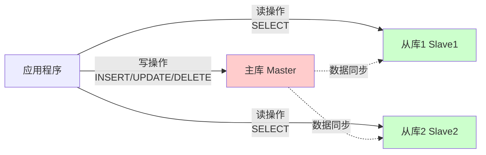
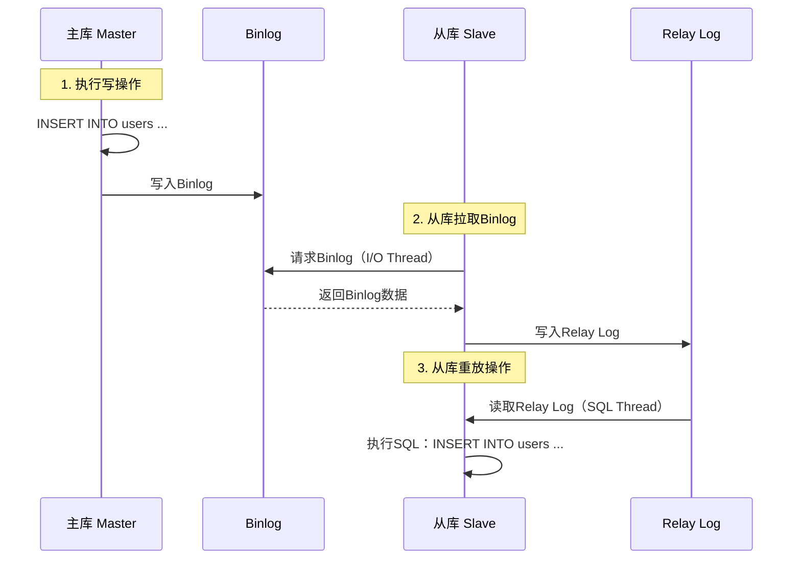

# 主从复制

## 一、什么是主从复制？

### 图书馆的类比

想象一个图书馆系统：

**单个图书馆（单机数据库）**：
```
场景：只有一个图书馆

问题：
- 人太多，借书要排队（并发压力大）
- 图书馆闭馆，无法借书（单点故障）
- 火灾后所有书都烧了（数据丢失）
```

**主图书馆 + 分馆（主从复制）**：
```
场景：1个主馆 + 2个分馆

主馆：
- 负责采购新书（写操作）
- 新书信息同步到分馆

分馆：
- 提供借阅服务（读操作）
- 分流读者压力

优点：
✅ 分流读者（提高并发）
✅ 主馆关闭，分馆仍可借书（高可用）
✅ 多个备份（数据安全）
```

### 主从复制的定义

**主从复制（Master-Slave Replication）**：一个主数据库（Master）负责写操作，多个从数据库（Slave）复制主库数据，负责读操作。



### 为什么需要主从复制？

#### 原因1：读写分离，提高性能

```
场景：电商网站

读操作（查询商品、订单）：95%
写操作（下单、支付）：5%

单机：
- 读写都在一台服务器
- 高并发时性能瓶颈

主从复制：
- 写操作：1台主库
- 读操作：3台从库分担
→ 读性能提升3倍！
```

#### 原因2：高可用（容灾）

```
单机：
主库宕机 → 系统不可用

主从复制：
主库宕机 → 从库可以切换为主库
→ 系统仍然可用
```

#### 原因3：数据备份

```
单机：
硬盘损坏 → 数据丢失

主从复制：
- 主库数据实时同步到从库
- 从库相当于实时备份
→ 数据安全
```

## 二、主从复制的工作原理

### MySQL主从复制原理



### 三个关键组件

#### 1. Binlog（二进制日志）

**定义**：主库记录所有数据变更的日志。

```
主库操作：
INSERT INTO users (name) VALUES ('zhangsan');
UPDATE users SET age = 20 WHERE id = 1;
DELETE FROM users WHERE id = 2;

→ 全部记录到Binlog
```

**Binlog格式**：
```
1. Statement（语句级）：
   记录SQL语句本身
   优点：日志量小
   缺点：可能导致主从不一致（如NOW()函数）

2. Row（行级）：推荐
   记录每行数据的变化
   优点：数据一致性好
   缺点：日志量大

3. Mixed（混合）：
   结合上述两种
```

#### 2. Relay Log（中继日志）

**定义**：从库保存从主库拉取的Binlog的本地副本。

```
流程：
主库Binlog → 网络传输 → 从库Relay Log → 从库执行
```

#### 3. 复制线程

**I/O Thread（I/O线程）**：
- 从库连接主库
- 拉取Binlog
- 写入Relay Log

**SQL Thread（SQL线程）**：
- 读取Relay Log
- 重放SQL语句
- 更新从库数据

### 复制过程详解

```
步骤1：主库执行写操作
主库：INSERT INTO users (name) VALUES ('zhangsan');
→ 写入Binlog

步骤2：从库I/O线程拉取Binlog
从库I/O线程：连接主库，请求Binlog
主库：发送Binlog事件
从库I/O线程：写入Relay Log

步骤3：从库SQL线程执行
从库SQL线程：读取Relay Log
从库：执行 INSERT INTO users (name) VALUES ('zhangsan');
→ 从库数据与主库同步
```

## 三、主从复制的配置

### MySQL主从复制配置步骤

#### 步骤1：主库配置

**编辑主库配置文件**（my.cnf）：
```ini
[mysqld]
# 服务器唯一ID
server-id = 1

# 开启Binlog
log-bin = mysql-bin

# Binlog格式（推荐ROW）
binlog-format = ROW

# 需要同步的数据库（可选）
binlog-do-db = mydb

# 不需要同步的数据库（可选）
binlog-ignore-db = mysql
binlog-ignore-db = information_schema
```

**创建复制用户**：
```sql
-- 创建专门用于复制的用户
CREATE USER 'repl'@'%' IDENTIFIED BY 'password';

-- 授予复制权限
GRANT REPLICATION SLAVE ON *.* TO 'repl'@'%';

-- 刷新权限
FLUSH PRIVILEGES;
```

**查看主库状态**：
```sql
SHOW MASTER STATUS;

-- 输出：
+------------------+----------+--------------+------------------+
| File             | Position | Binlog_Do_DB | Binlog_Ignore_DB |
+------------------+----------+--------------+------------------+
| mysql-bin.000001 |      154 | mydb         | mysql            |
+------------------+----------+--------------+------------------+

→ 记住 File 和 Position，从库配置需要
```

#### 步骤2：从库配置

**编辑从库配置文件**（my.cnf）：
```ini
[mysqld]
# 服务器唯一ID（不能与主库相同）
server-id = 2

# 开启Binlog（如果从库也要作为其他从库的主库）
log-bin = mysql-bin

# 中继日志
relay-log = mysql-relay-bin

# 只读模式（防止从库被写入）
read-only = 1
```

**配置主库信息**：
```sql
-- 指定主库信息
CHANGE MASTER TO
  MASTER_HOST='192.168.1.100',      -- 主库IP
  MASTER_USER='repl',                -- 复制用户
  MASTER_PASSWORD='password',        -- 复制用户密码
  MASTER_LOG_FILE='mysql-bin.000001',-- 主库Binlog文件
  MASTER_LOG_POS=154;                -- 主库Binlog位置

-- 启动从库复制
START SLAVE;

-- 查看从库状态
SHOW SLAVE STATUS\G

-- 关键字段：
-- Slave_IO_Running: Yes   （I/O线程正常）
-- Slave_SQL_Running: Yes  （SQL线程正常）
-- Seconds_Behind_Master: 0 （延迟秒数，0表示实时）
```

#### 步骤3：验证复制

**主库插入数据**：
```sql
-- 主库
INSERT INTO users (name) VALUES ('test');
```

**从库查询数据**：
```sql
-- 从库
SELECT * FROM users;
→ 应该能看到刚插入的数据
```

## 四、主从复制的模式

### 模式1：一主一从

```
主库 ──→ 从库

优点：简单
缺点：从库压力大（所有读操作）
```

### 模式2：一主多从（推荐）

```
       ┌→ 从库1
主库 ──┼→ 从库2
       └→ 从库3

优点：读操作分散，性能好
缺点：主库压力大（需要同步多个从库）
```

### 模式3：级联复制

```
主库 ──→ 从库1 ──→ 从库2

优点：减轻主库同步压力
缺点：延迟增大（多级同步）
```

### 模式4：双主复制（主主复制）

```
主库1 ←→ 主库2

优点：两个库都可写
缺点：
- 可能冲突（同时写同一数据）
- 配置复杂
```

## 五、主从复制的延迟问题

### 什么是主从延迟？

```
主库：10:00:00 插入数据
从库：10:00:03 数据才同步完成

延迟：3秒
```

**查看延迟**：
```sql
SHOW SLAVE STATUS\G

Seconds_Behind_Master: 3  -- 延迟3秒
```

### 延迟的原因

#### 原因1：从库性能差

```
主库：8核16G
从库：2核4G

→ 从库执行慢，跟不上主库
```

**解决方案**：
- 从库使用相同配置
- 或使用SSD硬盘

#### 原因2：主库写入压力大

```
主库：每秒10000次写入
从库：单线程执行，跟不上

→ 延迟越来越大
```

**解决方案**：
- MySQL 5.7+：并行复制
```ini
# 开启并行复制（多线程执行）
slave-parallel-type = LOGICAL_CLOCK
slave-parallel-workers = 4  # 4个线程
```

#### 原因3：大事务

```
主库：执行一个大事务（插入100万条数据）
从库：必须等这个大事务执行完

→ 延迟突增
```

**解决方案**：
- 拆分大事务
- 批量操作改为小批次

#### 原因4：网络延迟

```
主库：北京
从库：上海

→ 网络传输慢
```

**解决方案**：
- 从库部署在同一机房
- 使用专线

### 延迟的影响

```
场景：用户下单

1. 主库：INSERT INTO orders (user_id) VALUES (1);
2. 应用：查询订单（读从库）
3. 从库：还没同步到数据
4. 用户：看不到订单！

→ 用户体验差
```

### 解决延迟的策略

#### 策略1：强制读主库

```java
// 写操作后，立即读取，强制读主库
orderService.createOrder(order);  // 写主库
Order created = orderService.getOrder(order.getId());  // 读主库（不读从库）
```

#### 策略2：延迟读取

```java
// 写操作后，等待1秒再读
orderService.create Order(order);
Thread.sleep(1000);  // 等待同步
Order created = orderService.getOrder(order.getId());  // 读从库
```

#### 策略3：标记路由

```java
// 写操作后，短时间内强制读主库
@Transactional
public void createOrder(Order order) {
    orderRepository.save(order);  // 写主库
    
    // 标记：未来5秒内读主库
    DataSourceContext.markReadMaster(5000);
}

// 读取时判断
public Order getOrder(Long id) {
    if (DataSourceContext.shouldReadMaster()) {
        return masterRepository.findById(id);  // 读主库
    } else {
        return slaveRepository.findById(id);  // 读从库
    }
}
```

#### 策略4：半同步复制

```ini
# 主库配置
[mysqld]
plugin-load = "rpl_semi_sync_master=semisync_master.so"
rpl_semi_sync_master_enabled = 1
rpl_semi_sync_master_timeout = 1000  # 1秒超时

# 从库配置
plugin-load = "rpl_semi_sync_slave=semisync_slave.so"
rpl_semi_sync_slave_enabled = 1
```

**半同步复制**：
- 主库等待至少一个从库确认收到Binlog
- 才返回给客户端
- 确保数据至少在一个从库上

## 六、主从复制的高可用

### 主库宕机怎么办？

**问题**：
```
主库宕机 → 无法写入 → 系统不可用
```

**解决方案：主从切换**

#### 手动切换

```
1. 确认主库真的宕机（不是网络问题）
2. 选择一个从库作为新主库
3. 在新主库上：
   STOP SLAVE;
   RESET MASTER;
4. 其他从库指向新主库
5. 应用程序切换到新主库
```

#### 自动切换（MHA、Orchestrator）

**MHA（Master High Availability）**：
- 监控主库健康
- 自动选举新主库
- 自动切换
- 10-30秒完成切换

**配置示例**：
```ini
# MHA配置
[server default]
# 管理节点
manager_workdir=/var/log/mha
manager_log=/var/log/mha/manager.log

# 复制用户
repl_user=repl
repl_password=password

[server1]
hostname=192.168.1.100
candidate_master=1  # 候选主库

[server2]
hostname=192.168.1.101

[server3]
hostname=192.168.1.102
```

## 七、小结

**核心要点**：

1. **主从复制作用**：
   - 读写分离，提高性能
   - 高可用（主库宕机可切换）
   - 数据备份

2. **复制原理**：
   - 主库：写入Binlog
   - 从库I/O线程：拉取Binlog写入Relay Log
   - 从库SQL线程：执行Relay Log

3. **配置步骤**：
   - 主库：开启Binlog，创建复制用户
   - 从库：配置主库信息，启动复制

4. **复制模式**：
   - 一主多从（推荐）
   - 级联复制（减轻主库压力）

5. **延迟问题**：
   - 原因：从库性能差、写入压力大、大事务
   - 解决：并行复制、强制读主库、半同步复制

6. **高可用**：
   - 手动切换
   - 自动切换（MHA、Orchestrator）

**记忆口诀**：
- 主库负责写，从库负责读
- Binlog记变更，从库来重放
- 延迟要注意，切换保可用

---

**下一步**：配置MySQL主从复制，测试数据同步！

💡 **提示**：主从复制是高可用和高性能的基础，掌握它是数据库架构师的必备技能。
