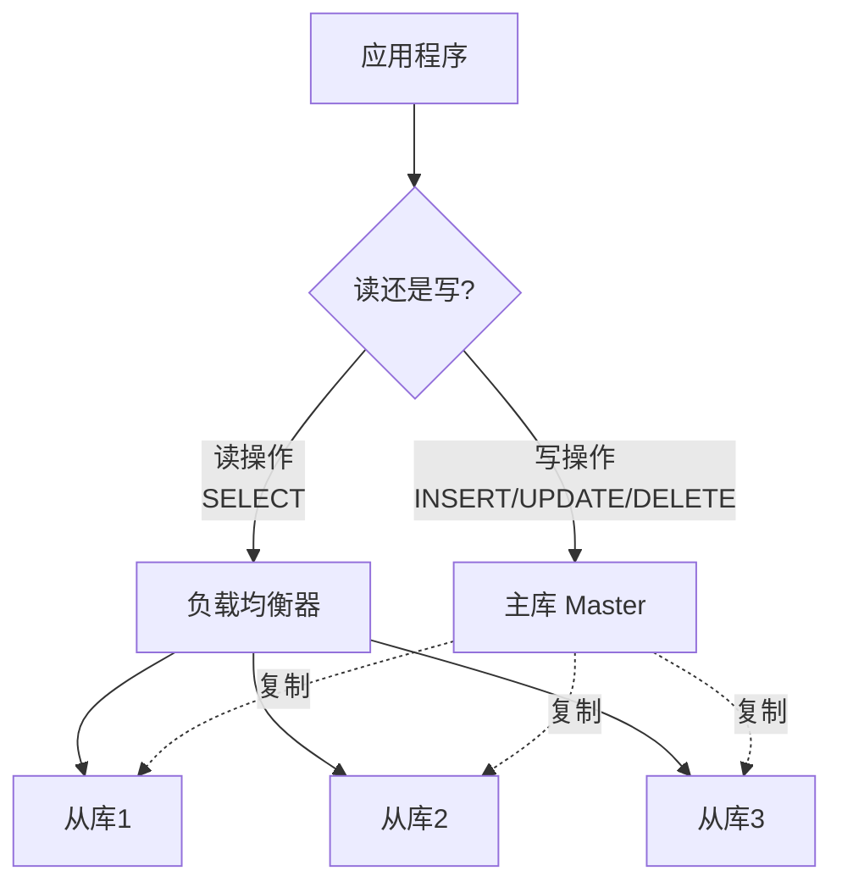

# 读写分离

## 一、什么是读写分离？

### 定义

**读写分离（Read-Write Splitting）**：基于主从复制，应用程序将写操作路由到主库，读操作路由到从库。



### 为什么需要读写分离？

**场景**：电商网站

```
读操作（查询）：95%
- 浏览商品
- 查看订单
- 搜索

写操作（修改）：5%
- 下单
- 支付
- 修改资料

单库：
- 读写都在一台服务器
- 高并发时性能瓶颈

读写分离：
- 写：1台主库（5%压力）
- 读：3台从库分担（95%压力 ÷ 3）
→ 性能提升3-5倍
```

## 二、读写分离的实现方式

### 方式1：应用层实现

**原理**：应用代码判断SQL类型，路由到不同数据源。

```java
// 数据源配置
@Configuration
public class DataSourceConfig {
    
    @Bean
    public DataSource masterDataSource() {
        // 主库配置
        return DataSourceBuilder.create()
            .url("jdbc:mysql://master:3306/db")
            .build();
    }
    
    @Bean
    public DataSource slave1DataSource() {
        // 从库1配置
        return DataSourceBuilder.create()
            .url("jdbc:mysql://slave1:3306/db")
            .build();
    }
    
    @Bean
    public DataSource slave2DataSource() {
        // 从库2配置
        return DataSourceBuilder.create()
            .url("jdbc:mysql://slave2:3306/db")
            .build();
    }
    
    @Bean
    public DataSource routingDataSource() {
        Map<Object, Object> targetDataSources = new HashMap<>();
        targetDataSources.put("master", masterDataSource());
        targetDataSources.put("slave1", slave1DataSource());
        targetDataSources.put("slave2", slave2DataSource());
        
        DynamicDataSource dataSource = new DynamicDataSource();
        dataSource.setTargetDataSources(targetDataSources);
        dataSource.setDefaultTargetDataSource(masterDataSource());
        return dataSource;
    }
}

// 动态数据源
public class DynamicDataSource extends AbstractRoutingDataSource {
    @Override
    protected Object determineCurrentLookupKey() {
        return DataSourceContext.getDataSourceType();
    }
}

// 数据源上下文
public class DataSourceContext {
    private static final ThreadLocal<String> context = new ThreadLocal<>();
    
    public static void setMaster() {
        context.set("master");
    }
    
    public static void setSlave() {
        // 随机选择从库（简单负载均衡）
        context.set(Math.random() < 0.5 ? "slave1" : "slave2");
    }
    
    public static String getDataSourceType() {
        return context.get();
    }
    
    public static void clear() {
        context.remove();
    }
}

// 使用示例
@Service
public class UserService {
    
    @Transactional
    public void createUser(User user) {
        DataSourceContext.setMaster();  // 写操作，使用主库
        userRepository.save(user);
        DataSourceContext.clear();
    }
    
    public User getUser(Long id) {
        DataSourceContext.setSlave();   // 读操作，使用从库
        User user = userRepository.findById(id);
        DataSourceContext.clear();
        return user;
    }
}
```

**优点**：
- 灵活控制
- 可自定义负载均衡策略

**缺点**：
- 代码侵入性强
- 需要手动管理

### 方式2：注解方式（推荐）

```java
// 自定义注解
@Target({ElementType.METHOD, ElementType.TYPE})
@Retention(RetentionPolicy.RUNTIME)
public @interface ReadOnly {
}

// AOP拦截
@Aspect
@Component
public class DataSourceAspect {
    
    @Around("@annotation(readOnly)")
    public Object around(ProceedingJoinPoint point, ReadOnly readOnly) throws Throwable {
        try {
            DataSourceContext.setSlave();
            return point.proceed();
        } finally {
            DataSourceContext.clear();
        }
    }
    
    @Around("@annotation(org.springframework.transaction.annotation.Transactional)")
    public Object aroundTransaction(ProceedingJoinPoint point) throws Throwable {
        try {
            DataSourceContext.setMaster();
            return point.proceed();
        } finally {
            DataSourceContext.clear();
        }
    }
}

// 使用示例
@Service
public class UserService {
    
    @Transactional
    public void createUser(User user) {
        // 自动路由到主库
        userRepository.save(user);
    }
    
    @ReadOnly
    public User getUser(Long id) {
        // 自动路由到从库
        return userRepository.findById(id);
    }
}
```

### 方式3：中间件实现

**MySQL Proxy、ProxySQL、MyCat等**

```
应用 → 中间件 → 数据库

中间件自动判断SQL类型：
- SELECT → 从库
- INSERT/UPDATE/DELETE → 主库
```

**ProxySQL配置示例**：
```sql
-- 添加主库
INSERT INTO mysql_servers (hostgroup_id, hostname, port) 
VALUES (10, 'master', 3306);

-- 添加从库
INSERT INTO mysql_servers (hostgroup_id, hostname, port) 
VALUES (20, 'slave1', 3306);
INSERT INTO mysql_servers (hostgroup_id, hostname, port) 
VALUES (20, 'slave2', 3306);

-- 路由规则
INSERT INTO mysql_query_rules (active, match_pattern, destination_hostgroup) 
VALUES (1, '^SELECT.*FOR UPDATE$', 10);  -- SELECT FOR UPDATE走主库
INSERT INTO mysql_query_rules (active, match_pattern, destination_hostgroup) 
VALUES (1, '^SELECT', 20);  -- 其他SELECT走从库

-- 加载配置
LOAD MYSQL SERVERS TO RUNTIME;
LOAD MYSQL QUERY RULES TO RUNTIME;
```

**优点**：
- 对应用透明（无需修改代码）
- 统一管理

**缺点**：
- 多一层代理（性能开销）
- 增加复杂度

## 三、读写分离的关键问题

### 问题1：主从延迟

**场景**：
```
1. 用户下单 → 写入主库
2. 立即查询订单 → 读从库
3. 从库还没同步 → 查不到订单
4. 用户：订单丢了？

→ 数据不一致
```

**解决方案**：

**方案1：强制读主库**
```java
@Transactional
public void createOrder(Order order) {
    orderRepository.save(order);  // 写主库
    // 后续读操作也走主库
}

@Transactional(readOnly = true)
public Order getOrder(Long id) {
    // @Transactional中的读操作走主库
    return orderRepository.findById(id);
}
```

**方案2：标记短期读主库**
```java
public void createOrder(Order order) {
    orderRepository.save(order);
    // 标记：未来5秒内读主库
    DataSourceContext.markReadMaster(5000);
}
```

**方案3：半同步复制**（见主从复制章节）

### 问题2：事务处理

**场景**：
```java
@Transactional
public void transfer(Long from, Long to, BigDecimal amount) {
    accountRepository.deduct(from, amount);  // 扣款
    accountRepository.add(to, amount);       // 加款
}
```

**问题**：事务中的所有操作必须在同一个库

**解决方案**：
```java
// 事务强制使用主库
@Transactional
public void transfer(Long from, Long to, BigDecimal amount) {
    DataSourceContext.setMaster();  // 强制主库
    accountRepository.deduct(from, amount);
    accountRepository.add(to, amount);
}
```

### 问题3：负载均衡

**简单轮询**：
```java
private AtomicInteger counter = new AtomicInteger(0);
private List<String> slaves = Arrays.asList("slave1", "slave2", "slave3");

public String selectSlave() {
    int index = counter.getAndIncrement() % slaves.size();
    return slaves.get(index);
}
```

**权重负载均衡**：
```java
// slave1: 权重3, slave2: 权重2, slave3: 权重1
Map<String, Integer> weights = Map.of(
    "slave1", 3,
    "slave2", 2,
    "slave3", 1
);
```

## 四、小结

**核心要点**：

1. **读写分离定义**：写主库，读从库

2. **实现方式**：
   - 应用层（灵活但代码侵入）
   - 注解方式（推荐）
   - 中间件（对应用透明）

3. **关键问题**：
   - 主从延迟：强制读主库、标记、半同步
   - 事务处理：事务内强制主库
   - 负载均衡：轮询、权重

4. **适用场景**：
   - 读多写少（>80%读操作）
   - 对延迟容忍度高

**记忆口诀**：
- 写走主，读走从
- 延迟要注意，事务要统一

---

💡 **提示**：读写分离是提升数据库性能的重要手段，但需要处理好主从延迟问题。
