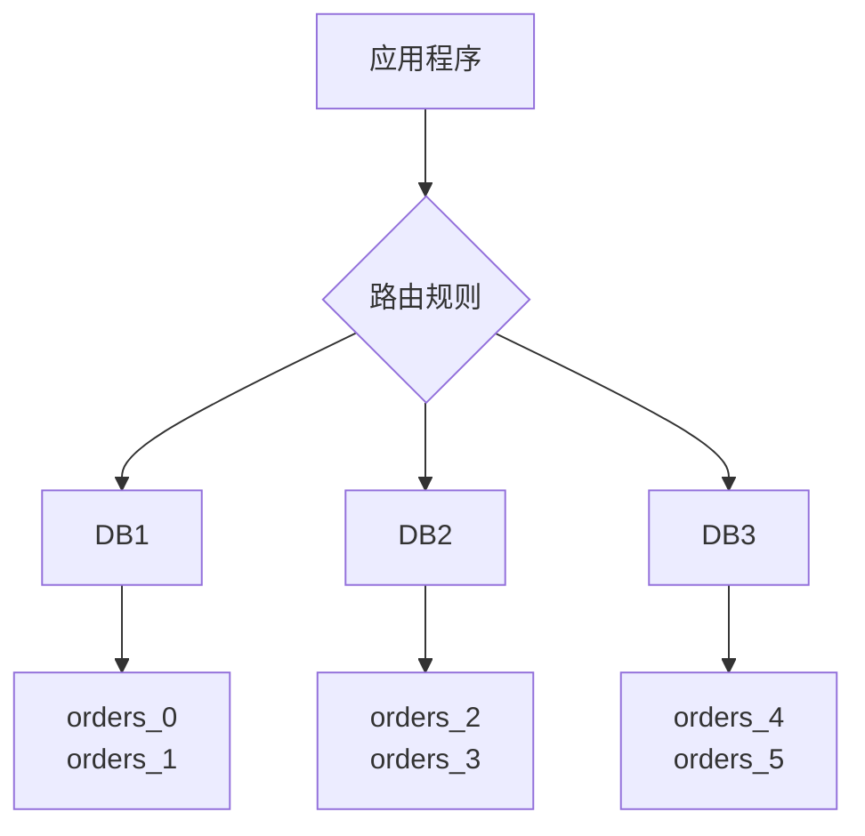

# 分库分表

## 一、什么是分库分表？

### 外卖订单的类比

**场景**：一个外卖平台，订单量暴增

**单库单表（数据量小时）**：
```
orders表：1000万条订单
→ 查询慢、写入慢、索引大
```

**分库分表后**：
```
数据库1：
- orders_0：250万
- orders_1：250万

数据库2：
- orders_2：250万
- orders_3：250万

→ 每个表只有250万，查询快！
```

### 定义

**分库（Sharding）**：将数据分散到多个数据库。
**分表（Table Partitioning）**：将一张大表拆分成多张小表。



### 为什么需要分库分表？

#### 问题1：单表数据量过大

```
表数据：5000万行
→ 查询慢（即使有索引）
→ 索引文件大（几GB）
→ B+树层级深（磁盘IO多）

建议：单表 < 1000万行
```

#### 问题2：并发压力大

```
单库：1000 QPS就到瓶颈
分4个库：4000 QPS
```

#### 问题3：磁盘IO瓶颈

```
单库单表：所有读写在一个硬盘
分库分表：分散到多个硬盘
→ IO吞吐量提升
```

## 二、分库分表的策略

### 策略1：垂直拆分

**垂直分库**：按业务模块拆分

```
单库：
users, orders, products, payments

↓

用户库：users
订单库：orders
商品库：products
支付库：payments
```

**垂直分表**：按字段拆分

```
用户表（大字段很多）：
users: id, name, email, phone, address, avatar, intro, ...

↓

users_base: id, name, email, phone
users_detail: id, address, avatar, intro
```

**优点**：简单，业务清晰
**缺点**：单表数据量大时仍然慢

### 策略2：水平拆分（重点）

**水平分库分表**：按数据行拆分

```
订单表：1000万条

↓

orders_0: 500万（user_id % 2 = 0）
orders_1: 500万（user_id % 2 = 1）
```

**分片键（Sharding Key）**：用于决定数据分到哪个库/表的字段。

常见分片键：
- 用户ID（user_id）
- 订单ID（order_id）
- 时间（created_at）

## 三、分片算法

### 算法1：取模（Mod）

**规则**：`hash(分片键) % 分片数量`

```java
int shardIndex = userId % 4;  // 分4个库

userId=1  → 1 % 4 = 1 → DB1
userId=2  → 2 % 4 = 2 → DB2
userId=3  → 3 % 4 = 3 → DB3
userId=4  → 4 % 4 = 0 → DB0
userId=5  → 5 % 4 = 1 → DB1
```

**优点**：
- 简单
- 数据分布均匀

**缺点**：
- 扩容困难（4个库扩到8个库，需要迁移大量数据）

### 算法2：范围（Range）

**规则**：按值范围分片

```
userId <= 1000万   → DB0
1000万 < userId <= 2000万 → DB1
2000万 < userId <= 3000万 → DB2
userId > 3000万    → DB3
```

**优点**：
- 扩容简单（新增一个范围即可）
- 范围查询快

**缺点**：
- 数据可能不均匀（新用户多，老用户少）
- 热点问题（新用户都在DB3）

### 算法3：一致性哈希

**规则**：使用一致性哈希环

```
优点：
- 扩容时只需迁移部分数据
- 数据分布较均匀

缺点：
- 实现复杂
```

### 算法4：按时间分片

**规则**：按时间范围分片

```
2024年订单 → orders_2024
2025年订单 → orders_2025
2026年订单 → orders_2026

或按月：
2026-01订单 → orders_202601
2026-02订单 → orders_202602
```

**优点**：
- 适合日志、历史数据
- 可定期归档

**缺点**：
- 数据可能不均匀
- 跨时间查询复杂

## 四、分库分表的问题

### 问题1：跨库JOIN

**场景**：
```sql
-- 单库时
SELECT o.*, u.name 
FROM orders o 
JOIN users u ON o.user_id = u.id;

-- 分库后
orders在DB1，users在DB2
→ 无法JOIN！
```

**解决方案**：

**方案1：应用层组装**
```java
// 1. 查询订单
List<Order> orders = orderRepository.findAll();

// 2. 收集用户ID
Set<Long> userIds = orders.stream()
    .map(Order::getUserId)
    .collect(Collectors.toSet());

// 3. 批量查询用户
List<User> users = userRepository.findByIdIn(userIds);

// 4. 组装数据
Map<Long, User> userMap = users.stream()
    .collect(Collectors.toMap(User::getId, u -> u));
orders.forEach(o -> o.setUser(userMap.get(o.getUserId())));
```

**方案2：数据冗余**
```
订单表增加冗余字段：
orders: id, user_id, user_name, amount
→ 查询时不需要JOIN users表
```

### 问题2：分布式事务

**场景**：
```
转账：
1. DB1：user1余额-100
2. DB2：user2余额+100

如果第1步成功，第2步失败？
→ 数据不一致
```

**解决方案**：

**方案1：避免跨库事务**（设计时避免）

**方案2：最终一致性**（消息队列）
```
1. DB1：扣款100
2. 发送消息到MQ
3. 消费消息，DB2加款100
4. 如果失败，重试
```

**方案3：分布式事务（TCC、Seata）**
```
复杂且性能差，尽量避免
```

### 问题3：分页查询

**场景**：
```sql
-- 单库
SELECT * FROM orders ORDER BY created_at DESC LIMIT 0, 10;

-- 分库后
需要从每个库查询，再合并排序
```

**解决方案**：
```java
// 1. 从每个分片查询前10条
List<Order> shard0 = queryFrom(DB0, "LIMIT 0, 10");
List<Order> shard1 = queryFrom(DB1, "LIMIT 0, 10");
List<Order> shard2 = queryFrom(DB2, "LIMIT 0, 10");
List<Order> shard3 = queryFrom(DB3, "LIMIT 0, 10");

// 2. 合并
List<Order> all = new ArrayList<>();
all.addAll(shard0);
all.addAll(shard1);
all.addAll(shard2);
all.addAll(shard3);

// 3. 排序
all.sort(Comparator.comparing(Order::getCreatedAt).reversed());

// 4. 取前10条
return all.subList(0, 10);
```

### 问题4：全局唯一ID

**问题**：
```
分库后，自增ID会重复：
DB0: orders_0 → id=1, 2, 3
DB1: orders_1 → id=1, 2, 3
→ 冲突！
```

**解决方案**：

**方案1：UUID**
```java
String id = UUID.randomUUID().toString();
```
缺点：无序、占空间大

**方案2：雪花算法（Snowflake）推荐**
```
64位Long：
- 1位符号位
- 41位时间戳（毫秒）
- 10位机器ID
- 12位序列号

优点：
- 全局唯一
- 趋势递增（有序）
- 高性能
```

**方案3：数据库号段**
```
专门的ID生成服务：
每次分配一个号段（如1-1000）
用完再申请下一个号段
```

## 五、分库分表中间件

### 中间件1：ShardingSphere（推荐）

**特点**：
- Apache顶级项目
- 功能强大
- 支持分库分表、读写分离、分布式事务

**配置示例**：
```yaml
spring:
  shardingsphere:
    datasource:
      names: ds0,ds1
      ds0:
        url: jdbc:mysql://localhost:3306/db0
      ds1:
        url: jdbc:mysql://localhost:3306/db1
    
    rules:
      sharding:
        tables:
          orders:
            actual-data-nodes: ds$->{0..1}.orders_$->{0..1}
            table-strategy:
              standard:
                sharding-column: user_id
                sharding-algorithm-name: orders-inline
            database-strategy:
              standard:
                sharding-column: user_id
                sharding-algorithm-name: database-inline
        
        sharding-algorithms:
          database-inline:
            type: INLINE
            props:
              algorithm-expression: ds$->{user_id % 2}
          orders-inline:
            type: INLINE
            props:
              algorithm-expression: orders_$->{user_id % 2}
```

### 中间件2：MyCat

**特点**：
- 国产开源
- 对应用透明
- 支持多种数据库

## 六、小结

**核心要点**：

1. **分库分表定义**：
   - 垂直拆分：按业务/字段
   - 水平拆分：按数据行

2. **分片算法**：
   - 取模：简单，扩容难
   - 范围：扩容易，可能不均匀
   - 一致性哈希：扩容友好
   - 按时间：适合历史数据

3. **关键问题**：
   - 跨库JOIN：应用层组装
   - 分布式事务：避免或最终一致性
   - 分页查询：多分片合并
   - 全局ID：雪花算法

4. **何时分库分表**：
   - 单表 > 1000万行
   - 并发 > 1000 QPS
   - 磁盘IO瓶颈

**记忆口诀**：
- 数据量大要分表
- 并发高了要分库
- 分片键选好很重要
- 跨库问题要处理

---

💡 **提示**：分库分表是最后的手段，优先考虑读写分离、缓存、索引优化。
